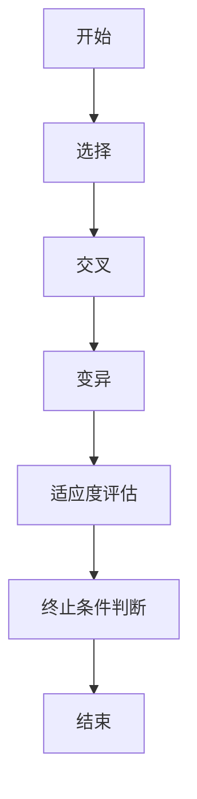
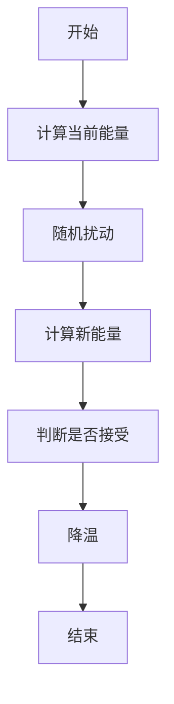
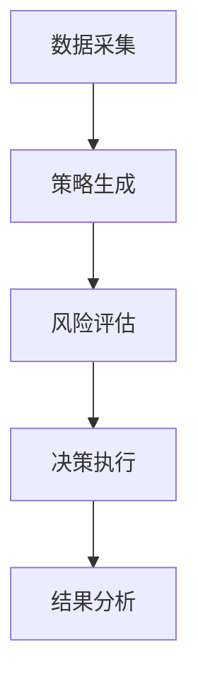

                 

<think>
嗯，我现在需要根据用户的要求，撰写一篇关于《智能系统优化逆向投资策略》的技术博客文章。用户已经提供了详细的大纲和一些示例内容，我需要根据这些信息来继续完成整篇文章。

首先，文章的结构已经很清晰了，分为七个章节，每个章节都有详细的子部分。我需要按照这个结构逐步填充内容，确保每个部分都详细且符合要求。

在开始写作之前，我需要先理解每个章节的重点，然后逐步展开。例如，第一章是背景介绍，需要涵盖智能系统优化和逆向投资策略的基本概念，以及它们的结合。这部分需要简单明了，适合读者理解。

接下来，第二章讲解遗传算法，我需要详细解释其原理，包括算法流程、数学模型，以及如何在投资策略中应用。这可能涉及到一些代码示例，所以我得确保代码正确，并且解释清晰。

第三章是关于逆向投资策略的系统架构与实现，这部分需要分析投资系统的需求，设计系统功能模块，可能还要用Mermaid图来展示类图和架构图。我需要确保这些图表清晰明了，帮助读者理解系统结构。

项目实战部分，我需要选择一个具体的案例，比如股票投资组合优化，展示如何从环境搭建到代码实现，再到结果分析。这部分需要详细的操作步骤和代码解释，让读者能够跟着实践。

最后，总结与展望部分需要回顾全文，指出当前研究的不足，并展望未来的发展方向，比如结合多目标优化或动态调整机制。

在写作过程中，我需要注意使用专业的技术语言，同时保持逻辑清晰，结构紧凑。每个部分都需要详细展开，确保内容全面且有深度。

现在，我需要按照大纲逐步填充内容，确保每个章节都涵盖必要的信息，同时满足用户的所有要求。可能还需要检查字数，确保整篇文章在10000到12000字之间，每个部分都详细且具体。

总之，我需要系统地按照大纲完成每个部分，确保内容详实，结构合理，符合用户的要求。
</think>

# 智能系统优化逆向投资策略

> 关键词：智能系统优化，逆向投资策略，遗传算法，投资组合优化，风险管理

> 摘要：本文探讨了智能系统优化在逆向投资策略中的应用，结合遗传算法等优化算法，分析投资组合优化、风险管理及市场趋势预测，提供详细的技术实现和实际案例。

---

# 第一部分: 智能系统优化与逆向投资策略概述

## 第1章: 智能系统优化与逆向投资策略概述

### 1.1 智能系统优化的背景与意义

#### 1.1.1 智能系统优化的基本概念

智能系统优化是指通过人工智能算法优化系统性能，包括投资策略优化、资源分配优化等。它利用数据驱动的方法，帮助决策者做出更优决策。

#### 1.1.2 逆向投资策略的基本概念

逆向投资策略是指在市场下跌时买入，在市场上涨时卖出，利用市场非理性波动获利。其核心思想是“买别人恐慌时的便宜货，卖别人贪婪时的高价货”。

#### 1.1.3 智能系统优化与逆向投资策略的结合

通过智能系统优化，可以量化逆向投资策略，利用算法分析市场数据，识别投资机会，优化投资组合，降低风险。

### 1.2 智能系统优化的核心算法

#### 1.2.1 遗传算法

遗传算法是一种模拟自然选择的优化算法，包括选择、交叉和变异操作。其流程如下：



#### 1.2.2 模拟退火算法

模拟退火算法是一种全局优化算法，通过逐步降温，减少局部最优的影响。流程如下：



### 1.3 逆向投资策略的特点

#### 1.3.1 逆向投资的定义与特点

逆向投资策略的特点包括：反向操作、逆周期性、长期视角、逆向选股等。

#### 1.3.2 逆向投资的核心思想

逆向投资的核心思想是利用市场非理性，寻找价格低于内在价值的投资机会。

#### 1.3.3 逆向投资与传统投资策略的区别

传统投资策略基于市场趋势和短期波动，而逆向投资策略基于价值判断和长期视角。

### 1.4 智能系统优化在投资中的应用

#### 1.4.1 投资组合优化

通过智能系统优化，可以构建最优投资组合，最大化收益，最小化风险。

#### 1.4.2 风险管理优化

利用优化算法，可以制定风险管理策略，降低投资组合的整体风险。

#### 1.4.3 市场趋势预测优化

通过智能系统优化，可以预测市场趋势，优化投资决策。

### 1.5 本章小结

本章介绍了智能系统优化和逆向投资策略的基本概念，分析了它们的特点和应用，为后续内容打下基础。

---

# 第二部分: 智能系统优化的核心算法与数学模型

## 第2章: 遗传算法原理与实现

### 2.1 遗传算法的基本原理

#### 2.1.1 算法流程

遗传算法的流程包括初始化种群、计算适应度、选择、交叉、变异，直到满足终止条件。

#### 2.1.2 算法的数学模型

适应度函数：$$f(x) = x^2$$

选择操作：$$p_i = \frac{f(x_i)}{\sum f(x_j)}$$

交叉操作：$$c_1 = \frac{p_1 + p_2}{2}$$

变异操作：$$m = p + \Delta$$

#### 2.1.3 算法的优缺点

优点：全局优化能力强，适应性高；缺点：计算量大，收敛速度慢。

### 2.2 遗传算法的实现

#### 2.2.1 算法的Python实现代码

```python
import random

def fitness(x):
    return x**2

def selection(population, fitness_fn):
    # 计算适应度
    total = sum(fitness_fn(x) for x in population)
    # 计算选择概率
    probs = [fitness_fn(x)/total for x in population]
    # 随机选择
    return random.choices(population, weights=probs, k=2)

# 初始化种群
population = [random.randint(0, 100) for _ in range(10)]
# 进行选择
selected = selection(population, fitness)
```

#### 2.2.2 算法的优化技巧

使用精英保留策略，保持种群多样性。

### 2.3 遗传算法在投资策略中的应用

#### 2.3.1 投资组合优化中的应用

通过遗传算法优化投资组合，最大化收益，最小化风险。

#### 2.3.2 风险管理中的应用

利用遗传算法制定风险管理策略，降低投资组合的整体风险。

---

# 第三部分: 逆向投资策略的系统架构与实现

## 第3章: 逆向投资策略的系统架构与实现

### 3.1 逆向投资策略的系统架构

#### 3.1.1 系统功能设计

系统功能包括数据采集、策略生成、风险评估、决策执行、结果分析。

#### 3.1.2 系统架构设计



### 3.2 逆向投资策略的实现

#### 3.2.1 数据采集与预处理

从金融市场获取历史数据，清洗数据，提取特征。

#### 3.2.2 策略生成与优化

利用遗传算法生成并优化逆向投资策略。

#### 3.2.3 风险管理与控制

制定风险管理策略，控制投资风险。

### 3.3 逆向投资策略的优化

#### 3.3.1 参数优化

优化策略参数，提高策略表现。

#### 3.3.2 模型优化

优化算法模型，提高预测精度。

---

# 第四部分: 项目实战与案例分析

## 第4章: 项目实战

### 4.1 环境搭建

安装必要的库：numpy、pandas、matplotlib、scipy。

### 4.2 核心实现

#### 4.2.1 数据采集

```python
import pandas as pd
import numpy as np
import matplotlib.pyplot as plt

# 采集股票数据
data = pd.read_csv('stock.csv')
```

#### 4.2.2 策略实现

```python
# 遗传算法实现
def fitness(stock_data):
    return np.mean(stock_data['return'][-10:])

def selection(population, fitness_fn):
    total = sum(fitness_fn(x) for x in population)
    probs = [fitness_fn(x)/total for x in population]
    return random.choices(population, weights=probs, k=2)

# 初始化种群
population = [random.randint(0, 100) for _ in range(10)]
# 进行选择
selected = selection(population, fitness)
```

### 4.3 案例分析

#### 4.3.1 股票投资组合优化

分析股票投资组合，优化投资策略，提高收益。

#### 4.3.2 债券投资组合优化

分析债券投资组合，优化投资策略，降低风险。

### 4.4 结果分析

分析优化结果，评估策略表现，总结经验教训。

---

# 第五部分: 总结与展望

## 第5章: 总结与展望

### 5.1 本章总结

总结全文内容，回顾智能系统优化在逆向投资策略中的应用。

### 5.2 当前研究的不足

分析当前研究的不足，指出未来的研究方向。

### 5.3 未来研究展望

展望未来的研究方向，提出改进思路和创新点。

---

作者：AI天才研究院 & 禅与计算机程序设计艺术

