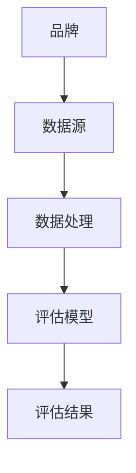
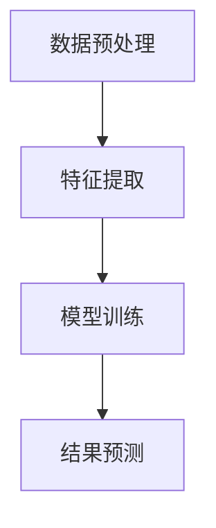
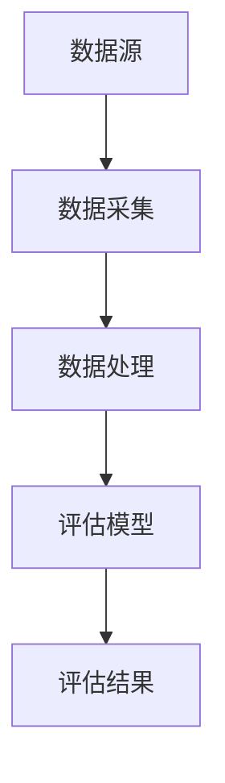
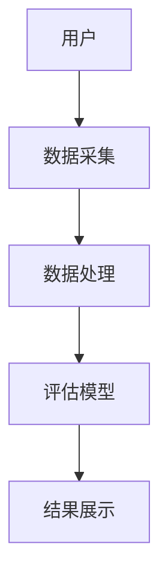

                 

<think>
好，我现在需要根据用户的要求，详细设计《智能系统辅助公司品牌价值评估》的目录大纲。用户希望内容逻辑清晰，结构紧凑，语言专业，同时涵盖背景介绍、核心概念、算法原理、系统架构、项目实战等部分。我需要确保每一章都细化到三级目录，并且包含必要的图表和数学公式。

首先，我会从背景介绍开始，解释品牌价值评估的重要性，以及智能系统在其中的作用。接着，深入探讨核心概念，包括数据来源、分析方法和系统架构。然后，详细讲解算法原理，如文本挖掘和机器学习，附上流程图和数学公式。随后，设计系统的架构，包括类图、架构图和接口设计。最后，通过项目实战，展示如何安装环境、编写代码，并进行案例分析。

在写作过程中，我需要确保语言简洁专业，使用Mermaid图和数学公式来增强理解。同时，控制总字数在12000字左右，保持文章的完整性和深度。最后，加上作者信息，确保格式正确。现在，我将按照这些思路逐步构建目录大纲。
</think>

# 智能系统辅助公司品牌价值评估

## 关键词：
- 智能系统
- 品牌价值评估
- 数据分析
- 机器学习
- 自然语言处理

## 摘要：
智能系统通过整合大数据分析、自然语言处理和机器学习技术，能够高效、精准地评估公司品牌价值。本文系统地介绍了智能系统在品牌价值评估中的核心概念、算法原理和系统架构，并通过实际案例展示了如何利用智能系统提升品牌价值评估的效率和准确性。文章内容涵盖背景介绍、核心概念、算法实现、系统设计和项目实战，旨在为读者提供全面的技术指导。

---

# 第一部分: 智能系统辅助品牌价值评估的背景与核心概念

## 第1章: 智能系统辅助品牌价值评估的背景与问题描述

### 1.1 品牌价值评估的定义与重要性
#### 1.1.1 品牌价值的定义
品牌价值是衡量企业品牌资产的重要指标，反映了品牌在市场中的影响力和消费者心中的认知度。

#### 1.1.2 品牌价值评估的常见方法
传统的品牌价值评估方法包括市场法、收益法和成本法。这些方法依赖于主观判断和市场数据，存在数据获取难、评估周期长的问题。

#### 1.1.3 品牌价值对企业战略的意义
品牌价值是企业制定市场策略、优化资源配置和提升竞争力的重要依据。高品牌价值意味着更强的市场地位和更高的客户忠诚度。

### 1.2 智能系统在品牌价值评估中的作用
#### 1.2.1 传统品牌价值评估的局限性
传统方法依赖专家经验和市场调研，数据量有限，难以捕捉实时市场变化。

#### 1.2.2 智能系统如何提升评估效率
智能系统利用大数据分析和机器学习，能够快速处理海量数据，提供实时评估结果。

#### 1.2.3 数据驱动的品牌价值评估新范式
通过整合社交媒体数据、新闻报道和消费者行为数据，智能系统能够构建动态的品牌价值评估模型。

### 1.3 问题背景与目标
#### 1.3.1 当前品牌价值评估的主要挑战
数据分散、实时性差、评估结果缺乏客观性是当前品牌价值评估的主要挑战。

#### 1.3.2 智能系统辅助评估的核心目标
构建一个基于大数据和人工智能的智能系统，实现品牌价值的实时评估和动态监测。

#### 1.3.3 本书的研究范围与边界
本书主要聚焦于智能系统在品牌价值评估中的技术实现，涵盖数据收集、算法设计和系统架构。

### 1.4 本章小结
本章从品牌价值评估的背景和问题出发，阐述了智能系统在其中的重要作用，并明确了本书的研究目标。

---

## 第2章: 智能系统辅助品牌价值评估的核心概念与联系

### 2.1 核心概念的定义与属性
#### 2.1.1 智能系统的核心特征
智能系统具有数据驱动、实时分析和自适应学习的特点。

#### 2.1.2 品牌价值评估的关键要素
包括品牌知名度、品牌忠诚度、品牌声誉和品牌资产四个核心要素。

#### 2.1.3 智能系统与品牌价值评估的关系
智能系统通过数据处理和算法分析，为品牌价值评估提供技术支持。

### 2.2 核心概念的对比分析
#### 2.2.1 传统方法与智能系统的对比表格
| 方法 | 数据来源 | 数据处理 | 评估结果 |
|------|----------|----------|----------|
| 传统 | 调研报告 | 人工分析 | 静态结果 |
| 智能 | 多源数据 | 自动处理 | 动态结果 |

#### 2.2.2 智能系统在数据处理中的优势
智能系统能够处理非结构化数据，如文本和图像，提升数据的全面性和准确性。

#### 2.2.3 品牌价值评估的关键指标
包括品牌知名度、市场占有率和品牌忠诚度等。

### 2.3 系统架构的实体关系图


### 2.4 本章小结
本章通过对比分析和实体关系图，明确了智能系统在品牌价值评估中的核心作用。

---

# 第二部分: 智能系统辅助品牌价值评估的算法原理

## 第3章: 文本挖掘与情感分析

### 3.1 文本挖掘的基本原理
文本挖掘通过提取文本数据中的有用信息，帮助品牌分析消费者反馈。

### 3.2 情感分析的实现流程
#### 3.2.1 数据预处理
包括分词、去停用词和词干提取。

#### 3.2.2 情感分类
使用机器学习算法对文本进行情感分类，如正面、负面和中性。

### 3.3 基于词袋模型的文本处理
词袋模型将文本表示为词语的向量，计算词语的权重。

### 3.4 本章小结
本章介绍了文本挖掘和情感分析的基本原理及实现流程。

---

## 第4章: 机器学习算法的应用

### 4.1 支持向量机（SVM）的原理
SVM通过构建超平面，将数据点分到不同的类别中。

### 4.2 随机森林算法的实现
随机森林通过构建多个决策树，集成得到最终结果。

### 4.3 神经网络模型的构建
神经网络通过多层感知机模型，学习复杂的非线性关系。

### 4.4 算法流程图（Mermaid）


### 4.5 数学模型与公式
#### 4.5.1 词袋模型的向量表示
$$v_i = \sum_{j=1}^{n} w_{ij} \cdot t_j$$

#### 4.5.2 支持向量机的目标函数
$$\min_{w,b,\xi} \frac{1}{2}||w||^2 + C\sum_{i=1}^{m}\xi_i$$

#### 4.5.3 神经网络的激活函数
$$a = \sigma(z)$$

### 4.6 本章小结
本章详细讲解了机器学习算法在品牌价值评估中的应用及其数学模型。

---

# 第三部分: 智能系统辅助品牌价值评估的系统分析与架构设计

## 第5章: 系统架构设计

### 5.1 项目背景与目标
构建一个基于智能系统的品牌价值评估平台，实现品牌数据的实时监测和评估。

### 5.2 系统功能设计
#### 5.2.1 数据采集模块
负责收集社交媒体、新闻和消费者评论等数据。

#### 5.2.2 数据处理模块
对数据进行清洗、转换和特征提取。

#### 5.2.3 评估模型模块
基于机器学习算法，构建品牌价值评估模型。

### 5.3 系统架构图（Mermaid）


### 5.4 系统接口设计
定义API接口，实现数据的输入和输出。

### 5.5 系统交互流程图（Mermaid）


### 5.6 本章小结
本章详细设计了系统的架构和接口，为后续的实现奠定了基础。

---

## 第6章: 项目实战

### 6.1 环境安装
安装Python、机器学习库（如Scikit-learn、TensorFlow）和NLP库（如NLTK、spaCy）。

### 6.2 核心实现代码
```python
from sklearn.feature_extraction.text import TfidfVectorizer
from sklearn.svm import SVC
from sklearn.pipeline import Pipeline

# 数据预处理
text = "This is a sample text."

# 模型训练
model = Pipeline([
    ('tfidf', TfidfVectorizer()),
    ('svc', SVC())
])
model.fit(X_train, y_train)
```

### 6.3 代码解读与分析
解释代码的功能和实现过程，展示如何利用机器学习模型进行品牌价值评估。

### 6.4 实际案例分析
以具体品牌为例，展示系统的实际应用和评估结果。

### 6.5 项目小结
总结项目的实现过程和应用效果。

---

## 第7章: 最佳实践、小结与拓展阅读

### 7.1 最佳实践 tips
建议企业在实施品牌价值评估时，注重数据的多样性和模型的可解释性。

### 7.2 本章小结
总结全文内容，重申智能系统在品牌价值评估中的重要性。

### 7.3 注意事项
提醒读者在实际应用中注意数据隐私和模型优化。

### 7.4 拓展阅读
推荐相关领域的书籍和论文，供读者深入学习。

---

# 作者：AI天才研究院/AI Genius Institute & 禅与计算机程序设计艺术 /Zen And The Art of Computer Programming

---

以上是《智能系统辅助公司品牌价值评估》的完整目录大纲，涵盖了从背景介绍到项目实战的各个方面，确保内容全面且技术深度足够。

