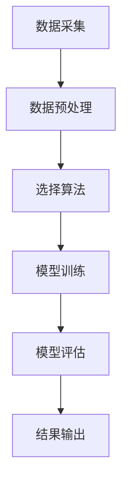
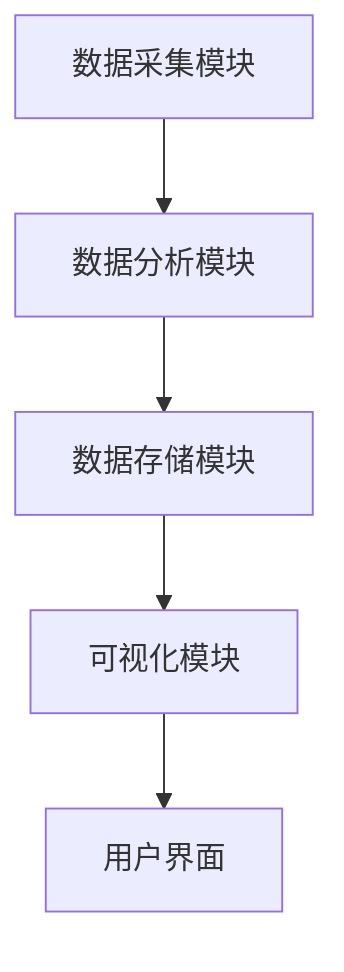
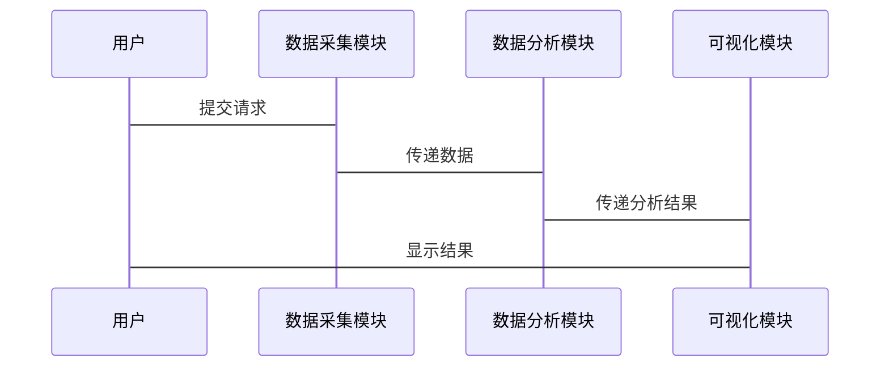

                 

<think>
好的，我现在需要根据用户的要求，撰写一篇名为《智能系统辅助公司护城河动态评估》的技术博客文章。用户提供了详细的目录结构和内容要求，我需要逐步分析并完成每个部分。

首先，我需要理解文章的核心主题：护城河动态评估，特别是如何利用智能系统来进行。护城河通常指的是公司的竞争优势，比如品牌、技术、市场占有率等，这些因素能保护公司免受竞争对手的侵蚀。动态评估意味着这些因素会随时间变化，需要持续监测和分析。

接下来，我按照用户提供的目录结构，逐步填充内容：

1. **背景介绍**：在第1章，我需要定义护城河，讨论其动态变化，以及智能系统在评估中的作用。这部分需要简洁明了，帮助读者理解为什么护城河动态评估重要。

2. **核心概念**：第2章要详细讲解护城河的核心要素，比如市场份额、利润率、竞争优势等。同时，还需要设计指标体系，比如财务指标、市场指标等，并说明智能系统如何应用这些数据。

3. **算法原理**：在第3章，我需要选择适合的机器学习算法，如分类、聚类、回归算法，并用mermaid绘制流程图，同时提供Python代码示例。这部分需要详细讲解，确保读者理解算法的应用和实现。

4. **数学模型与公式**：第4章要介绍市场份额和利润率的计算公式，使用latex格式，同时通过表格对比不同模型，帮助读者理解如何优化模型。

5. **系统架构设计**：第5章需要设计系统的功能模块，包括数据采集、分析、可视化等，并用mermaid绘制系统架构图和接口设计。这部分需要清晰的架构，确保系统的可扩展性和实用性。

6. **项目实战**：在第6章，我需要提供具体的项目案例，指导读者如何安装环境、编写代码，并进行实际分析。通过案例分析，帮助读者理解如何在实际中应用这些方法。

7. **总结与展望**：最后，总结全文，指出智能系统的优势和局限性，并展望未来的发展方向，如结合NLP技术等。

在整个写作过程中，我需要确保每个部分都详细且逻辑清晰，使用专业但易懂的语言。同时，要按照用户的格式要求，使用mermaid图表和latex公式，确保文章结构完整，内容丰富。

现在，我需要开始撰写每个部分，确保涵盖所有要求的内容，同时保持文章的连贯性和深度。在撰写过程中，可能会遇到需要进一步解释的概念或公式，我需要仔细思考并确保每个细节都准确无误。
</think>

# 智能系统辅助公司护城河动态评估

---

## 关键词：
- 智能系统
- 护城河
- 动态评估
- 机器学习
- 企业战略

---

## 摘要：
在当今竞争激烈的商业环境中，公司的护城河是维持竞争优势的关键。护城河包括品牌、技术、市场占有率等要素，这些要素会随着时间的变化而动态调整。传统的护城河评估方法往往静态且不够精准，难以捕捉市场的快速变化。智能系统通过整合机器学习、大数据分析和实时监控，能够动态评估公司的护城河，帮助企业及时调整战略，维护竞争优势。本文详细探讨了智能系统辅助护城河动态评估的核心概念、算法原理、系统架构设计以及实际案例，为企业的可持续发展提供新的视角和方法。

---

# 第1章 公司护城河与动态评估的背景

## 1.1 公司护城河的基本概念

### 1.1.1 什么是公司护城河
公司的护城河是指那些能够长期保护企业免受竞争对手侵蚀的结构性优势。这种优势可以来自多个方面，包括技术优势、品牌影响力、成本优势、客户忠诚度、网络效应等。护城河的存在使得竞争对手难以在短期内复制或超越企业的优势。

例如，苹果公司通过其强大的品牌影响力、生态系统和创新技术，形成了深厚的技术护城河，使其在智能手机市场中占据领先地位。

### 1.1.2 护城河的核心要素
护城河的核心要素包括：
- **技术优势**：企业的技术创新能力、专利储备等。
- **品牌影响力**：品牌的认知度和客户忠诚度。
- **成本优势**：生产成本的控制能力。
- **市场占有率**：在目标市场的主导地位。
- **客户粘性**：客户的依赖性和转换成本。

### 1.1.3 护城河的动态变化特征
护城河并非一成不变，它会随着市场环境、技术发展和竞争格局的变化而动态调整。例如，曾经的技术优势可能因为竞争对手的技术突破而削弱，或者市场需求的变化可能导致品牌影响力下降。因此，企业需要持续监测和评估其护城河的状态，以确保竞争优势的持续性。

---

## 1.2 动态评估的必要性

### 1.2.1 传统护城河评估的局限性
传统的护城河评估方法通常基于财务数据和静态分析，难以捕捉市场的动态变化。例如，单纯依赖财务指标（如利润率）无法全面反映企业的竞争优势，尤其是面对市场环境变化时，企业可能无法及时调整战略。

### 1.2.2 动态评估的意义
动态评估能够实时监测护城河的关键指标，帮助企业识别潜在风险和机会。通过动态评估，企业可以及时调整战略，优化资源配置，确保竞争优势的持续性。

### 1.2.3 智能系统在动态评估中的作用
智能系统通过整合大数据分析、机器学习和实时监控技术，能够高效、精准地评估护城河的状态。例如，利用自然语言处理技术分析市场反馈，利用机器学习模型预测市场趋势，帮助企业制定前瞻性的战略决策。

---

## 1.3 智能系统辅助评估的背景

### 1.3.1 智能技术的发展与应用
近年来，人工智能和大数据技术的快速发展为企业的动态评估提供了强大的工具。智能系统能够处理海量数据，提取有价值的信息，为企业决策提供支持。

### 1.3.2 企业数字化转型的趋势
随着企业数字化转型的推进，越来越多的企业开始依赖数据驱动的决策。智能系统辅助护城河动态评估成为企业战略的重要组成部分。

### 1.3.3 智能系统在企业管理中的价值
智能系统能够帮助企业实现护城河的动态监测、预警和优化，从而提升企业的竞争力和抗风险能力。例如，通过实时监测市场份额变化，企业可以及时调整市场策略，应对竞争压力。

---

## 1.4 本章小结
本章介绍了公司护城河的基本概念、动态变化特征以及动态评估的必要性。同时，强调了智能系统在护城河动态评估中的重要性。接下来的章节将深入探讨护城河动态评估的核心概念、算法原理和系统架构设计。

---

# 第2章 智能系统辅助护城河动态评估的核心概念

## 2.1 护城河动态评估的理论框架

### 2.1.1 护城河的核心要素与关系
护城河的动态评估需要综合考虑多个核心要素及其相互关系。例如，技术优势可能影响市场占有率，而市场占有率又会反过来影响品牌的影响力。通过构建理论框架，企业可以更好地理解护城河的动态变化。

### 2.1.2 护城河动态评估的指标体系
为了全面评估护城河的状态，需要设计一套科学的指标体系。常见的指标包括：
- **市场份额**：反映企业在市场中的地位。
- **利润率**：衡量企业的盈利能力。
- **研发投入**：体现企业的技术创新能力。
- **客户满意度**：反映客户对企业的认可程度。

### 2.1.3 护城河动态评估的步骤
1. **数据采集**：收集与护城河相关的数据。
2. **数据分析**：利用智能系统对数据进行处理和分析。
3. **评估与预警**：根据分析结果评估护城河的状态，并设置预警机制。
4. **优化与调整**：根据评估结果优化护城河要素，调整企业战略。

---

## 2.2 智能系统在护城河动态评估中的应用

### 2.2.1 数据采集与处理
智能系统可以通过多种渠道采集数据，例如：
- **社交媒体**：分析客户对企业的评价。
- **行业报告**：获取市场趋势和竞争信息。
- **企业内部数据**：整合财务数据和运营数据。

### 2.2.2 智能分析与预测
通过机器学习算法，智能系统可以对护城河的关键指标进行预测和分析。例如，利用时间序列分析预测未来市场份额的变化。

### 2.2.3 结果可视化与决策支持
智能系统可以通过数据可视化工具将评估结果呈现给企业决策者，帮助他们制定更加科学的战略。

---

## 2.3 核心概念与联系

### 2.3.1 护城河要素的属性特征对比表
| 要素         | 属性特征                         |
|--------------|----------------------------------|
| 技术优势     | 创新能力、专利储备               |
| 市场占有率     | 行业地位、客户覆盖范围           |
| 客户粘性       | 客户忠诚度、转换成本             |
| 品牌影响力     | 品牌认知度、品牌忠诚度           |

### 2.3.2 ER实体关系图


---

## 2.4 本章小结
本章详细介绍了护城河动态评估的核心概念和理论框架，探讨了智能系统在评估中的应用。接下来的章节将深入分析护城河动态评估的算法原理和系统架构设计。

---

# 第3章 智能系统辅助护城河动态评估的算法原理

## 3.1 机器学习模型简介

### 3.1.1 传统机器学习算法
传统机器学习算法包括：
- **决策树**：用于分类和回归分析。
- **支持向量机（SVM）**：用于分类和回归分析。
- **K-均值聚类**：用于数据聚类。

### 3.1.2 深度学习算法
深度学习算法包括：
- **神经网络**：用于复杂模式识别。
- **卷积神经网络（CNN）**：用于图像识别。
- **循环神经网络（RNN）**：用于序列数据处理。

### 3.1.3 时间序列分析
时间序列分析用于预测护城河关键指标的变化趋势。

---

## 3.2 护城河动态评估的算法选择

### 3.2.1 分类算法
分类算法可以用于判断护城河状态的类别，例如：
- **随机森林**：用于分类和回归。
- **逻辑回归**：用于二分类问题。

### 3.2.2 聚类算法
聚类算法可以用于将护城河要素进行分组，例如：
- **K-均值聚类**：用于市场占有率的分组分析。

### 3.2.3 回归算法
回归算法可以用于预测护城河关键指标的变化，例如：
- **线性回归**：用于简单预测。
- **岭回归**：用于高维数据的预测。

---

## 3.3 算法实现与流程图

### 3.3.1 算法流程图


### 3.3.2 算法实现代码
以下是一个简单的线性回归实现代码：
```python
import numpy as np
from sklearn.linear_model import LinearRegression

# 数据准备
X = np.array([[1], [2], [3], [4], [5]])
y = np.array([2, 4, 5, 4, 8])

# 模型训练
model = LinearRegression()
model.fit(X, y)

# 预测
print(model.predict([[6]]))
```

---

## 3.4 本章小结
本章介绍了护城河动态评估中常用的算法，包括传统机器学习算法和深度学习算法，并通过流程图和代码示例展示了算法的实现过程。接下来的章节将讨论护城河动态评估的数学模型与公式。

---

# 第4章 护城河动态评估的数学模型与公式

## 4.1 护城河评估的数学模型

### 4.1.1 市场份额模型
市场份额模型用于评估企业在市场中的地位，公式如下：
$$\text{市场份额} = \frac{\text{公司销售额}}{\text{行业总销售额}}$$

### 4.1.2 利润率模型
利润率模型用于评估企业的盈利能力，公式如下：
$$\text{利润率} = \frac{\text{净利润}}{\text{营业收入}} \times 100\%$$

### 4.1.3 竞争优势模型
竞争优势模型用于评估企业的综合竞争优势，公式如下：
$$\text{竞争优势} = \text{市场份额} \times \text{利润率}$$

---

## 4.2 评估指标的数学公式

### 4.2.1 市场占有率计算公式
$$\text{市场占有率} = \frac{\text{公司销售额}}{\text{行业总销售额}}$$

### 4.2.2 净利润率计算公式
$$\text{净利润率} = \frac{\text{净利润}}{\text{营业收入}} \times 100\%$$

---

## 4.3 模型的优化与调整

### 4.3.1 参数优化
通过调整模型参数（如学习率、正则化系数）来优化模型性能。

### 4.3.2 模型验证
通过交叉验证等方法验证模型的准确性和稳定性。

### 4.3.3 模型迭代
根据实际数据和业务需求，持续优化模型。

---

## 4.4 本章小结
本章介绍了护城河动态评估的数学模型与公式，包括市场份额模型、利润率模型和竞争优势模型。通过这些模型，企业可以更科学地评估其护城河状态。

---

# 第5章 智能系统辅助护城河动态评估的系统架构设计

## 5.1 系统功能设计

### 5.1.1 数据采集模块
数据采集模块负责采集与护城河相关的数据，包括：
- **市场份额数据**：来自行业报告和市场调研。
- **财务数据**：来自企业财务系统。
- **客户反馈数据**：来自客户调查和社交媒体。

### 5.1.2 数据分析模块
数据分析模块利用机器学习算法对数据进行分析和预测，例如：
- **市场份额预测**：利用时间序列分析预测未来市场份额。
- **竞争对手分析**：通过自然语言处理分析竞争对手的市场动态。

### 5.1.3 可视化模块
可视化模块将分析结果以图表形式呈现，方便企业决策者理解和决策。

---

## 5.2 系统架构设计

### 5.2.1 系统架构图


### 5.2.2 系统接口设计
系统接口设计包括：
- **数据接口**：与企业财务系统、市场系统等对接。
- **用户接口**：提供友好的用户界面，方便用户操作。

### 5.2.3 系统交互流程图


---

## 5.3 本章小结
本章详细介绍了护城河动态评估系统的功能设计和架构设计，展示了系统如何通过模块化设计实现高效的数据采集、分析和可视化。接下来的章节将通过实际案例进一步探讨系统的实战应用。

---

# 第6章 智能系统辅助护城河动态评估的项目实战

## 6.1 项目背景与目标

### 6.1.1 项目背景
某高科技公司希望利用智能系统动态评估其护城河，以应对日益激烈的市场竞争。

### 6.1.2 项目目标
- 实现护城河关键指标的动态监测。
- 提供竞争对手分析和市场趋势预测。
- 为公司战略调整提供数据支持。

---

## 6.2 系统核心实现

### 6.2.1 环境安装
需要安装以下工具和库：
- Python 3.8+
- Jupyter Notebook
- Pandas、NumPy、Scikit-learn、Matplotlib

### 6.2.2 核心代码实现
以下是市场份额预测的代码示例：
```python
import pandas as pd
import numpy as np
from sklearn.linear_model import LinearRegression
import matplotlib.pyplot as plt

# 数据准备
data = {
    '年份': [2018, 2019, 2020, 2021, 2022],
    '市场份额': [30, 35, 40, 45, 50]
}
df = pd.DataFrame(data)

# 数据可视化
plt.figure(figsize=(10, 6))
plt.plot(df['年份'], df['市场份额'], marker='o', linestyle='-', linewidth=2, label='市场份额')
plt.xlabel('年份')
plt.ylabel('市场份额')
plt.title('市场份额变化趋势')
plt.legend()
plt.show()

# 模型训练
model = LinearRegression()
model.fit(df[['年份']], df['市场份额'])

# 预测
print("预测的2023年市场份额为：", model.predict([[2023]])[0])
```

### 6.2.3 代码解读与分析
- 数据准备：读取市场份额数据，并将其转换为DataFrame格式。
- 数据可视化：绘制市场份额变化趋势图，直观展示市场份额的变化。
- 模型训练：利用线性回归模型对市场份额进行预测。
- 预测结果：输出2023年的市场份额预测值。

---

## 6.3 项目小结

### 6.3.1 项目成果
通过该项目，企业能够实时监测市场份额的变化，并预测未来的市场份额趋势，从而制定更加科学的市场策略。

### 6.3.2 经验总结
- 数据的质量和完整性对模型的准确性至关重要。
- 模型的选择需要根据实际业务需求和数据特点进行调整。
- 可视化是帮助决策者理解数据的重要工具。

---

## 6.4 本章小结
本章通过实际案例展示了智能系统在护城河动态评估中的应用，详细介绍了项目的背景、目标、核心实现以及经验总结。接下来的章节将总结全文，并展望未来的发展方向。

---

# 第7章 总结与展望

## 7.1 本章总结
智能系统通过整合大数据分析、机器学习和实时监控技术，能够高效、精准地评估公司的护城河状态。通过动态评估，企业可以及时调整战略，优化资源配置，确保竞争优势的持续性。

## 7.2 未来展望
随着人工智能和大数据技术的不断发展，护城河动态评估将更加智能化和自动化。未来的研究方向包括：
- 结合自然语言处理技术，分析非结构化数据。
- 利用强化学习优化护城河要素。
- 开发更加个性化的护城河评估系统，满足不同行业的需求。

---

## 作者：AI天才研究院 & 禅与计算机程序设计艺术

---

通过本文的详细讲解，我们希望能够为企业的护城河动态评估提供新的思路和方法，帮助企业在全球化的竞争中保持领先地位。

