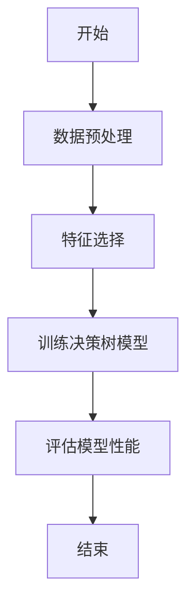
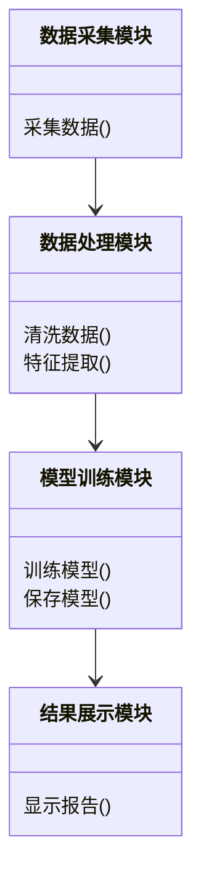
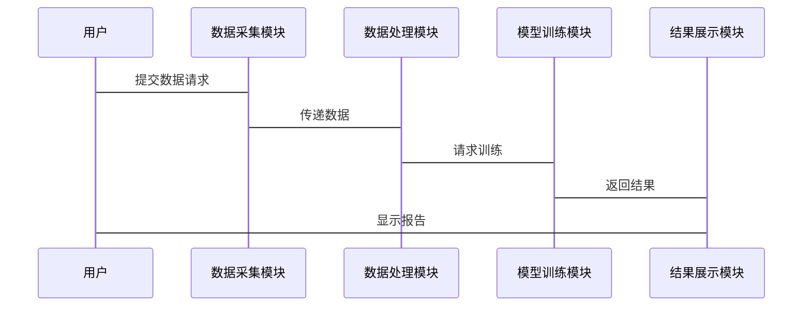

                 


# 智能系统辅助公司治理评估

> 关键词：智能系统、公司治理、评估方法、数据分析、机器学习

> 摘要：本文探讨了智能系统在公司治理评估中的应用，分析了其核心概念、算法原理、系统架构，并通过实际案例展示了如何利用智能系统优化公司治理评估流程。文章内容涵盖背景介绍、核心概念、算法原理、系统架构、项目实战和最佳实践等部分，旨在为读者提供全面的技术见解。

---

## 目录

1. **背景介绍**
   - 1.1 智能系统与公司治理评估的定义
   - 1.2 传统治理评估的局限性
   - 1.3 智能技术的应用优势

2. **核心概念与联系**
   - 2.1 智能系统的核心原理
   - 2.2 公司治理评估的关键要素
   - 2.3 智能系统与治理评估的关联

3. **算法原理与实现**
   - 3.1 数据分析与机器学习算法
   - 3.2 算法流程图与代码实现
   - 3.3 数学模型与公式推导

4. **系统架构设计**
   - 4.1 系统功能模块
   - 4.2 架构设计与类图
   - 4.3 系统接口与交互流程

5. **项目实战与案例分析**
   - 5.1 项目环境配置
   - 5.2 核心代码实现
   - 5.3 实际案例分析

6. **最佳实践与总结**
   - 6.1 项目经验总结
   - 6.2 注意事项与建议
   - 6.3 拓展阅读与资源推荐

---

## 第1章 背景介绍

### 1.1 智能系统与公司治理评估的定义

智能系统是指利用人工智能、大数据和机器学习等技术构建的自动化决策支持系统。公司治理评估是对公司治理结构、效率和合规性进行评价的过程。传统评估方法依赖人工分析，耗时且效率低下。

### 1.2 传统治理评估的局限性

传统方法主要依赖人工审查和经验判断，存在以下问题：
1. **主观性**：评估结果受主观因素影响较大。
2. **效率低**：数据处理耗时，难以快速响应。
3. **不一致性**：不同评估者可能得出不同结论。

### 1.3 智能技术的应用优势

智能系统通过数据分析、模式识别和自动化处理，显著提高了评估的客观性和效率。具体优势包括：
1. **自动化处理**：快速分析大量数据，减少人工干预。
2. **高准确性**：利用机器学习模型提高评估结果的准确性。
3. **实时监控**：实现对公司治理问题的实时预警和处理。

---

## 第2章 核心概念与联系

### 2.1 智能系统的核心原理

智能系统基于数据驱动的方法，通过以下步骤实现治理评估：
1. 数据采集：收集公司治理相关的数据。
2. 数据预处理：清洗和标准化数据。
3. 模型训练：使用机器学习算法构建评估模型。
4. 结果分析：生成评估报告并提出改进建议。

### 2.2 公司治理评估的关键要素

公司治理评估的核心要素包括：
- **治理结构**：公司组织架构的合理性。
- **治理效率**：决策流程的效率和效果。
- **合规性**：遵守相关法律法规的情况。
- **透明度**：信息披露的充分性和及时性。

### 2.3 智能系统与治理评估的关联

智能系统通过数据分析和机器学习算法，帮助识别治理问题、预测潜在风险，并提供优化建议。例如，使用自然语言处理技术分析公司年报，识别潜在的治理风险。

---

## 第3章 算法原理与实现

### 3.1 数据分析与机器学习算法

常用算法包括：
- **决策树**：用于分类和预测。
- **随机森林**：提高模型的准确性和鲁棒性。
- **支持向量机（SVM）**：适用于分类问题。

### 3.2 算法流程图与代码实现

以下是决策树算法的流程图（Mermaid）：



Python代码示例：

```python
from sklearn.tree import DecisionTreeClassifier
from sklearn.model_selection import train_test_split
from sklearn.metrics import accuracy_score

# 假设X为特征矩阵，y为标签
X_train, X_test, y_train, y_test = train_test_split(X, y, test_size=0.3)

# 训练决策树模型
model = DecisionTreeClassifier()
model.fit(X_train, y_train)

# 预测并评估准确率
y_pred = model.predict(X_test)
print("准确率:", accuracy_score(y_test, y_pred))
```

### 3.3 数学模型与公式推导

决策树的分裂指标使用基尼指数：

$$
Gini(p) = p_1 + p_2
$$

其中，\( p_1 \) 和 \( p_2 \) 是数据分割后的概率。

---

## 第4章 系统架构设计

### 4.1 系统功能模块

系统主要模块包括：
- 数据采集模块
- 数据处理模块
- 模型训练模块
- 结果展示模块

### 4.2 架构设计与类图

系统架构图（Mermaid）：



### 4.3 系统接口与交互流程

系统交互流程图（Mermaid）：



---

## 第5章 项目实战与案例分析

### 5.1 项目环境配置

- **工具**：Python 3.8、Jupyter Notebook、scikit-learn
- **数据集**：公司治理相关数据集

### 5.2 核心代码实现

以下是模型训练的核心代码：

```python
import pandas as pd
from sklearn.ensemble import RandomForestClassifier
from sklearn.metrics import classification_report

# 加载数据集
data = pd.read_csv('governance_data.csv')

# 分割特征与标签
X = data.drop('label', axis=1)
y = data['label']

# 分割训练集和测试集
X_train, X_test, y_train, y_test = train_test_split(X, y, test_size=0.3)

# 初始化随机森林模型
model = RandomForestClassifier(n_estimators=100, random_state=42)
model.fit(X_train, y_train)

# 预测与评估
y_pred = model.predict(X_test)
print(classification_report(y_test, y_pred))
```

### 5.3 实际案例分析

以金融行业为例，分析公司治理风险。通过模型识别潜在的财务造假行为，帮助企业及时采取措施，降低风险。

---

## 第6章 最佳实践与总结

### 6.1 项目经验总结

- **数据质量**：高质量的数据是模型准确性的基础。
- **模型选择**：根据具体问题选择合适的算法。
- **结果解释**：确保评估结果可解释，便于实际应用。

### 6.2 注意事项与建议

- 数据隐私保护
- 模型的可解释性
- 持续优化模型性能

### 6.3 拓展阅读与资源推荐

- 推荐书籍：《Python机器学习实战》
- 在线课程：Coursera上的《机器学习基础》

---

## 作者

作者：AI天才研究院/AI Genius Institute & 禅与计算机程序设计艺术 /Zen And The Art of Computer Programming

---

**结语**：智能系统辅助公司治理评估不仅提高了评估效率，还为企业提供了更精准的决策支持。通过本文的介绍，希望读者能够深入了解其技术实现和实际应用，为企业治理带来积极影响。

