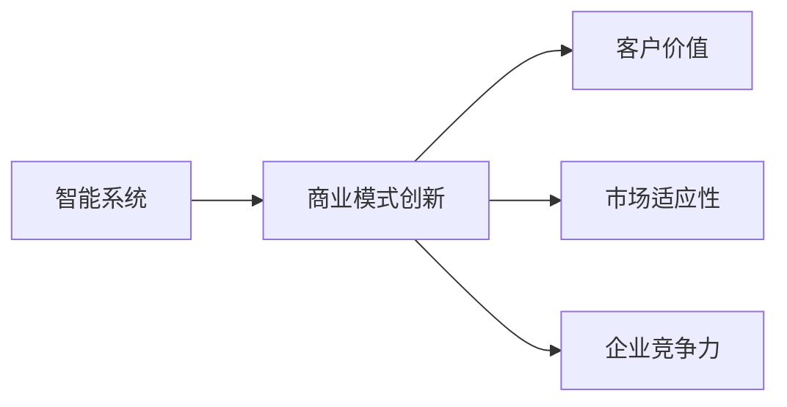
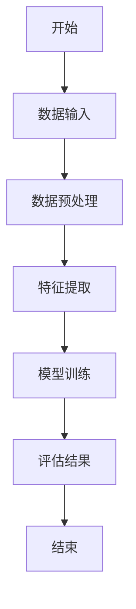
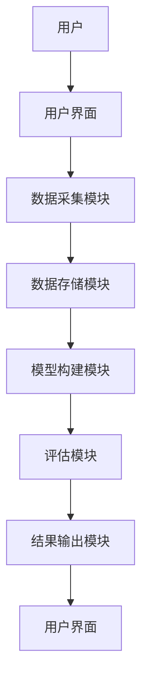

                 

<think>
好，现在我要根据用户的需求，详细撰写《智能系统辅助商业模式创新评估》这篇文章。首先，我需要理解文章的结构，包括标题、关键词、摘要，然后按照目录大纲分章节展开。

文章标题是《智能系统辅助商业模式创新评估》，关键词包括智能系统、商业模式创新、评估模型、算法、系统架构。摘要部分需要概述文章的核心内容，即如何利用智能系统评估商业模式创新，涉及技术分析和实际案例。

接下来，我会按照目录大纲的章节逐步展开，确保每个部分都有足够的细节和深度。例如，背景部分需要介绍智能系统和商业模式创新的基本概念，核心概念部分需要详细分析它们的属性和关系，算法部分要解释评估模型的构建和流程，系统架构部分展示模块设计和交互流程，项目实战部分用具体案例说明，最后总结最佳实践和未来展望。

在撰写过程中，我要注意使用专业而易懂的语言，确保每个章节都有清晰的逻辑和详细的分析。同时，要嵌入图表、公式和代码，使内容更加丰富和直观。最后，检查整体结构，确保满足用户的所有要求，包括字数、格式和内容完整性。
</think>

# 智能系统辅助商业模式创新评估

## 关键词：智能系统，商业模式创新，评估模型，算法，系统架构

## 摘要：  
随着人工智能和大数据技术的快速发展，智能系统在商业模式创新中的作用日益凸显。本文探讨了如何利用智能系统辅助商业模式创新评估，涵盖从理论分析到实践应用的全过程。文章首先介绍了智能系统和商业模式创新的基本概念，分析了它们的结合方式；接着从算法和系统架构的角度，详细阐述了智能系统辅助评估的核心技术；最后通过实际案例，展示了智能系统在商业模式创新评估中的应用效果，并总结了相关经验与未来发展方向。

---

## 第1章：智能系统与商业模式创新概述

### 1.1 智能系统的概念与特点  
智能系统是指通过感知、推理、学习和决策等能力，能够自主完成特定任务的计算机系统。其核心特点包括数据驱动性、自适应性和可扩展性。  

**1.1.1 智能系统的定义**  
智能系统是一种模拟人类智能的计算机系统，能够处理复杂问题并做出决策。  

**1.1.2 智能系统的核心技术**  
- 机器学习：通过数据训练模型，实现预测和分类。  
- 自然语言处理：理解人类语言并进行交互。  
- 计算机视觉：通过图像识别和处理，实现视觉感知。  

**1.1.3 智能系统的发展趋势**  
智能系统正朝着更高效、更自主、更个性化的方向发展，广泛应用于各个行业。  

### 1.2 商业模式创新的定义与重要性  
商业模式是指企业如何创造价值、传递价值和获取价值的方式。商业模式创新是通过改变现有模式，以提高企业竞争力和市场适应性。  

**1.2.1 商业模式的定义**  
商业模式是企业实现盈利的一系列商业逻辑和流程的集合。  

**1.2.2 商业模式创新的必要性**  
随着市场环境的变化，传统商业模式难以适应新的竞争态势，创新成为企业生存和发展的关键。  

**1.2.3 商业模式创新的驱动力**  
- 技术进步：互联网、大数据和人工智能等技术推动商业模式变革。  
- 市场需求：消费者需求的变化促使企业调整商业模式。  
- 竞争压力：行业内竞争加剧，要求企业不断创新以保持竞争优势。  

### 1.3 智能系统与商业模式创新的结合  
智能系统通过数据挖掘、预测分析和自动化决策等能力，为商业模式创新提供了新的可能性。  

**1.3.1 智能系统在商业模式创新中的作用**  
- 数据分析：通过智能系统收集和分析市场数据，帮助企业发现新的商业机会。  
- 预测与优化：利用机器学习模型预测市场趋势，优化商业模式。  
- 自动化决策：智能系统能够实时调整商业模式，以适应市场变化。  

**1.3.2 智能系统与商业模式创新的协同效应**  
智能系统通过数据驱动和自动化能力，显著提升了商业模式创新的效率和精准度。  

**1.3.3 智能系统辅助商业模式创新的前景**  
随着技术的不断进步，智能系统在商业模式创新中的应用将更加广泛和深入，成为企业创新的核心驱动力。

---

## 第2章：智能系统与商业模式创新的核心概念

### 2.1 智能系统的属性特征  

#### 2.1.1 数据驱动性  
智能系统依赖于数据进行学习和决策，数据是其核心资源。  

#### 2.1.2 自适应性  
智能系统能够根据环境变化自动调整行为和决策策略。  

#### 2.1.3 可扩展性  
智能系统能够轻松扩展，适应不同的业务规模和复杂度。  

### 2.2 商业模式创新的属性特征  

#### 2.2.1 客户价值  
商业模式创新的目的是为客户提供更大的价值，包括产品、服务和体验。  

#### 2.2.2 价值主张  
商业模式创新的核心是通过独特的价值主张，吸引和留住客户。  

#### 2.2.3 价值传递  
商业模式创新需要通过有效的渠道和方式，将价值传递给客户。  

### 2.3 智能系统与商业模式创新的关系  

#### 2.3.1 实体关系图  
以下是智能系统与商业模式创新之间的关系图（使用 Mermaid）：  



#### 2.3.2 核心要素的相互作用  
智能系统的数据驱动性和自适应性与商业模式创新的客户价值和市场适应性密切相关。  

#### 2.3.3 系统的整体架构  
以下是智能系统辅助商业模式创新的整体架构图（使用 Mermaid）：  


---

## 第3章：智能系统辅助商业模式创新的算法原理

### 3.1 评估模型的构建  

#### 3.1.1 数据预处理  
数据预处理是模型构建的基础，包括数据清洗、特征提取和标准化。  

#### 3.1.2 特征提取  
通过分析数据，提取与商业模式创新相关的特征，如客户行为、市场趋势等。  

#### 3.1.3 模型训练  
使用机器学习算法（如随机森林、神经网络）训练模型，评估不同商业模式的可行性。  

### 3.2 算法流程图  

以下是一个简单的算法流程图（使用 Mermaid）：  



### 3.3 数学模型与公式  

#### 3.3.1 评估函数的定义  
评估函数用于衡量商业模式创新的可行性，公式如下：  

$$ \text{评估分数} = \alpha \times \text{客户价值} + \beta \times \text{市场适应性} + \gamma \times \text{企业竞争力} $$  

其中，$\alpha$、$\beta$、$\gamma$ 是权重系数。  

#### 3.3.2 模型的优化目标  
目标是最小化评估误差，公式如下：  

$$ \min_{\theta} \sum_{i=1}^{n} (y_i - \hat{y}_i)^2 $$  

其中，$y_i$ 是实际值，$\hat{y}_i$ 是预测值。  

---

## 第4章：智能系统辅助商业模式创新的系统架构设计

### 4.1 系统功能设计  

#### 4.1.1 系统功能模块  
- 数据采集模块：收集市场数据和客户反馈。  
- 模型构建模块：训练和优化评估模型。  
- 评估模块：输出商业模式创新的评估结果。  

#### 4.1.2 系统架构图  
以下是系统的整体架构图（使用 Mermaid）：  


### 4.2 系统接口设计  

#### 4.2.1 系统接口设计  
- 数据接口：与外部数据源对接，获取市场和客户数据。  
- 模型接口：与第三方算法库集成，支持多种模型训练。  

#### 4.2.2 系统交互流程图  
以下是系统的交互流程图（使用 Mermaid）：  



---

## 第5章：项目实战

### 5.1 环境安装与配置  

#### 5.1.1 开发工具的安装  
安装 Python、Jupyter Notebook 和必要的机器学习库（如 Scikit-learn、TensorFlow）。  

#### 5.1.2 数据集的准备  
收集相关行业的市场数据和客户反馈，整理成结构化的数据集。  

#### 5.1.3 环境配置  
配置开发环境，确保所有依赖库已安装并版本兼容。  

### 5.2 核心代码实现  

#### 5.2.1 数据预处理代码  

```python
import pandas as pd

# 读取数据
data = pd.read_csv('market_data.csv')

# 数据清洗
data.dropna(inplace=True)
data = data[数据.columns]
```

#### 5.2.2 模型训练代码  

```python
from sklearn.ensemble import RandomForestRegressor

# 特征提取
X = data[特征列]
y = data[目标列]

# 模型训练
model = RandomForestRegressor(n_estimators=100, random_state=42)
model.fit(X, y)
```

#### 5.2.3 评估模块代码  

```python
importances = model.feature_importances_
print(重要性分数)
```

### 5.3 项目实战案例  

#### 5.3.1 案例分析  
以某电商行业为例，利用智能系统评估其商业模式创新的可能性。  

#### 5.3.2 代码应用解读  
通过代码实现数据预处理、模型训练和评估，输出商业模式创新的评估结果。  

---

## 第6章：最佳实践与总结

### 6.1 最佳实践  

#### 6.1.1 数据质量的重要性  
确保数据的准确性和完整性，是模型训练的基础。  

#### 6.1.2 模型选择与优化  
根据实际需求选择合适的模型，并通过调参优化模型性能。  

### 6.2 小结  

智能系统通过数据驱动和自动化能力，显著提升了商业模式创新的效率和精准度。  

### 6.3 注意事项  

- 数据隐私和安全问题需要特别注意。  
- 模型的可解释性是实际应用中的重要考量。  

### 6.4 拓展阅读  

建议深入学习机器学习和商业模式创新的相关知识，结合实际案例进一步探索智能系统在商业模式创新中的应用。

---

## 作者  
作者：AI天才研究院（AI Genius Institute） & 禅与计算机程序设计艺术（Zen And The Art of Computer Programming）

---

通过以上结构，文章详细探讨了智能系统辅助商业模式创新评估的核心概念、算法原理和系统架构，并通过实际案例展示了技术的应用。

