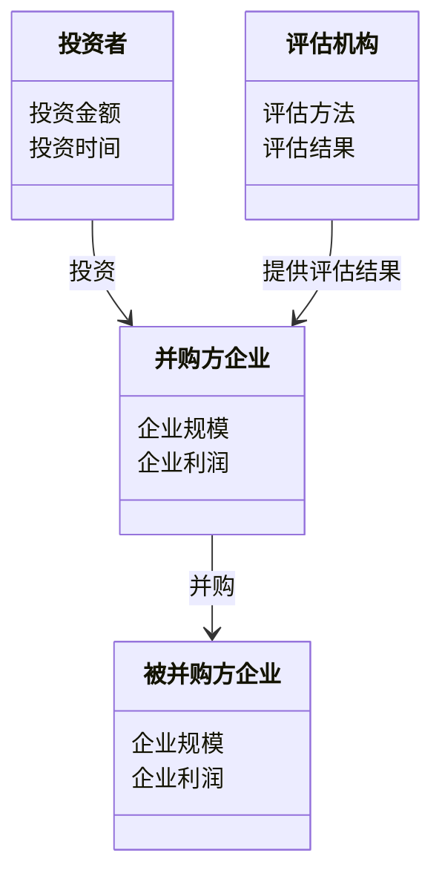
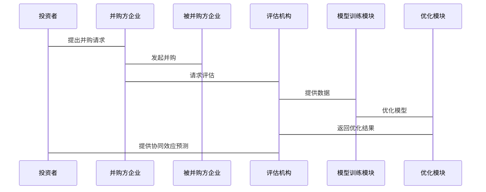

                 

<think>
嗯，用户让我详细思考如何撰写《智能系统辅助并购协同效应评估》这篇文章的目录大纲。我需要先理解用户的需求，然后一步步分析，确保每个部分都覆盖到位。

首先，用户的最终目标是写出一篇结构清晰、内容详实的技术博客。标题已经确定，接下来需要列出关键词和摘要。关键词部分，我想到可能包括“并购协同效应”、“智能系统”、“机器学习”等，确保涵盖文章的核心内容。

摘要部分，我需要简明扼要地总结文章的核心思想，即如何利用智能系统评估并购协同效应，涉及的步骤和方法。

接下来是目录结构。用户给的示例结构分为六个部分，我需要按照类似的逻辑来组织内容。首先，背景介绍，帮助读者理解并购协同效应的基本概念和重要性。然后是核心概念，详细讲解协同效应的类型和模型。之后是算法原理，介绍协同效应预测模型的数学公式和代码实现。系统分析部分，设计系统的功能和架构。项目实战提供实际案例，展示系统在现实中的应用。最后是总结和注意事项，巩固所学内容。

在思考过程中，我需要确保每个章节都有足够的细节，比如在核心概念部分，用表格对比不同协同效应的特征，并用Mermaid画出实体关系图。在算法部分，详细解释公式，并提供Python代码示例。系统分析部分，设计领域模型和架构图，展示模块交互。项目实战部分，提供具体的案例和代码实现，让读者能够实际操作。

同时，我要检查是否覆盖了所有约束条件，比如字数、格式要求，确保文章结构完整，每个部分都有详细讲解。最后，确保作者信息和注意事项部分都包含进去，帮助读者在实际应用中避免错误。

总的来说，我需要一步步分析，确保每个部分都符合用户的要求，内容详实，结构清晰，帮助读者全面理解智能系统在并购协同效应评估中的应用。
</think>

# 智能系统辅助并购协同效应评估

> 关键词：并购协同效应，智能系统，机器学习，协同效应评估，整合优化

> 摘要：并购协同效应是企业在并购过程中实现资源整合、降低成本、提升市场竞争力的重要手段。然而，传统评估方法存在数据复杂、模型单一、结果不准确等问题。本文将详细介绍如何利用智能系统辅助并购协同效应评估，通过机器学习算法、数学模型和系统架构设计，帮助企业在并购过程中实现高效、精准的协同效应评估与优化。

---

# 第1章: 并购协同效应评估的背景与核心概念

## 1.1 并购协同效应的定义与背景

### 1.1.1 什么是并购协同效应
并购协同效应是指企业在并购过程中，通过资源整合、优势互补、成本节约等手段，实现整体价值提升的一种效应。它是企业并购成功的关键因素之一。

### 1.1.2 并购协同效应的重要性
在企业并购中，协同效应是决定并购成功与否的核心因素。通过协同效应评估，企业可以：
1. 准确预测并购后的价值提升空间；
2. 优化整合策略，降低整合风险；
3. 提高并购决策的科学性和准确性。

### 1.1.3 智能系统在并购协同效应评估中的作用
随着大数据和人工智能技术的发展，智能系统在并购协同效应评估中的作用日益重要。通过智能系统，企业可以：
1. 快速处理海量数据，提高评估效率；
2. 建立多维度模型，提高评估准确性；
3. 实现实时监控和动态调整。

## 1.2 并购协同效应的分类与特点

### 1.2.1 财务协同效应
财务协同效应主要指并购后企业在财务方面的协同，例如：
- 成本协同：通过资源共享、采购协同降低成本；
- 融资协同：通过合并资产负债表降低融资成本；
- 税务协同：通过合理分配税务负担优化税负。

### 1.2.2 战略协同效应
战略协同效应主要指并购后企业在战略层面的协同，例如：
- 市场协同：通过并购扩大市场覆盖，提升市场份额；
- 产品协同：通过产品线互补，提升产品竞争力；
- 技术协同：通过技术整合提升研发能力。

### 1.2.3 运营协同效应
运营协同效应主要指并购后企业在运营层面的协同，例如：
- 供应链协同：通过整合供应链提高效率；
- 生产协同：通过优化生产流程降低成本；
- 人员协同：通过合理分配人力资源提升效率。

## 1.3 并购协同效应评估的挑战

### 1.3.1 数据获取的难度
并购协同效应评估需要大量数据支持，包括财务数据、市场数据、运营数据等。然而，这些数据往往分散在不同部门或系统中，获取难度大，且数据质量参差不齐。

### 1.3.2 模型的复杂性
并购协同效应评估涉及多维度、多层次的分析，模型构建复杂，且需要考虑多种变量之间的相互作用。传统模型往往难以满足需求。

### 1.3.3 实际应用中的不确定性
并购协同效应评估受到多种不确定因素的影响，例如市场变化、政策调整、企业战略变化等，这些因素都会影响评估结果的准确性。

## 1.4 智能系统辅助并购协同效应评估的必要性

### 1.4.1 提高评估效率
通过智能系统，企业可以快速处理海量数据，建立多维度模型，大幅提高评估效率。

### 1.4.2 增强评估准确性
智能系统可以通过机器学习算法，自动发现数据中的规律，建立更精准的模型，提高评估结果的准确性。

### 1.4.3 降低评估成本
通过智能系统，企业可以减少人工干预，降低评估过程中的时间和人力成本。

## 1.5 本章小结

---

# 第2章: 并购协同效应的核心概念与联系

## 2.1 协同效应的原理与机制

### 2.1.1 协同效应的形成过程
协同效应的形成需要企业从战略、运营、组织等多个层面进行整合，通过资源整合、优势互补实现价值提升。

### 2.1.2 协同效应的关键驱动因素
- **战略契合度**：并购双方的战略目标是否一致；
- **组织协同性**：并购双方的组织结构是否匹配；
- **资源互补性**：并购双方的资源是否互补；
- **文化融合度**：并购双方的企业文化是否能够融合。

### 2.1.3 协同效应的度量方法
- **财务指标法**：通过财务指标（如成本节约率、收入增长率）衡量协同效应；
- **市场价值法**：通过市场价值的变化衡量协同效应；
- **模型模拟法**：通过建立模型预测协同效应。

## 2.2 协同效应与相关概念的对比

### 2.2.1 协同效应与整合效应
| 比较维度 | 协同效应 | 整合效应 |
|----------|----------|----------|
| 定义     | 并购后价值提升 | 整合过程中的资源优化 |
| 侧重点   | 价值提升 | 整合过程 |
| 时间跨度 | 中长期 | 短期到中期 |

### 2.2.2 协同效应与协同创新
| 比较维度 | 协同效应 | 协同创新 |
|----------|----------|----------|
| 定义     | 并购后的价值提升 | 创新过程中的协同 |
| 侧重点   | 价值提升 | 创新过程 |
| 应用领域 | 并购整合 | 创新管理 |

### 2.2.3 协同效应与战略契合度
协同效应与战略契合度密切相关，战略契合度是协同效应的重要驱动因素。通过协同效应评估，可以验证战略契合度的实现程度。

## 2.3 协同效应的ER实体关系图
```mermaid
erDiagram
    class 投资者 {
        投资金额
        投资时间
    }
    class 并购方企业 {
        企业规模
        企业利润
    }
    class 被并购方企业 {
        企业规模
        企业利润
    }
    class 评估机构 {
        评估方法
        评估结果
    }
    投资者 --|{1} 并购方企业 : 投资
    并购方企业 --|{1} 被并购方企业 : 并购
    评估机构 --|{1} 并购方企业 : 提供评估结果
```

## 2.4 本章小结

---

# 第3章: 并购协同效应评估的算法原理

## 3.1 协同效应预测模型

### 3.1.1 模型概述
协同效应预测模型是一种基于机器学习的模型，通过分析历史数据，预测并购后的协同效应。

### 3.1.2 模型流程
1. 数据预处理：清洗数据，提取特征；
2. 模型训练：使用机器学习算法训练模型；
3. 模型预测：基于模型预测协同效应；
4. 模型优化：通过调参优化模型性能。

### 3.1.3 模型流程图


### 3.1.4 模型代码实现
```python
# 协同效应预测模型代码
import pandas as pd
from sklearn.model import LinearRegression
from sklearn.metrics import r2_score

# 数据预处理
data = pd.read_csv('merged_data.csv')
data = data.dropna()
data = pd.get_dummies(data)

# 特征提取
features = data[['企业规模', '企业利润', '投资金额', '投资时间']]
target = data['协同效应']

# 模型训练
model = LinearRegression()
model.fit(features, target)

# 模型预测
predictions = model.predict(features)
print(f"预测的协同效应：{predictions}")

# 模型优化
score = r2_score(target, predictions)
print(f"模型R²分数：{score}")
```

### 3.1.5 模型数学公式
协同效应预测模型的数学公式如下：
$$
协同效应 = \beta_0 + \beta_1 \times 企业规模 + \beta_2 \times 企业利润 + \beta_3 \times 投资金额 + \beta_4 \times 投资时间 + \epsilon
$$
其中，$\beta_0, \beta_1, \beta_2, \beta_3, \beta_4$是回归系数，$\epsilon$是误差项。

---

# 第4章: 并购协同效应评估的系统分析与架构设计

## 4.1 问题场景介绍

### 4.1.1 问题背景
某企业计划并购另一家企业，希望通过智能系统评估并购后的协同效应，优化整合策略。

### 4.1.2 问题目标
通过智能系统实现：
1. 并购协同效应的精准评估；
2. 整合策略的优化；
3. 并购过程中的风险控制。

## 4.2 系统功能设计

### 4.2.1 领域模型


### 4.2.2 系统架构设计


### 4.2.3 系统交互设计


## 4.3 本章小结

---

# 第5章: 并购协同效应评估的项目实战

## 5.1 环境安装

### 5.1.1 安装Python
```bash
python --version
pip install --upgrade pip
```

### 5.1.2 安装依赖库
```bash
pip install pandas scikit-learn
```

## 5.2 核心代码实现

### 5.2.1 数据预处理代码
```python
import pandas as pd
import numpy as np

# 读取数据
data = pd.read_csv('merged_data.csv')

# 删除缺失值
data = data.dropna()

# 转换为虚拟变量
data = pd.get_dummies(data)
```

### 5.2.2 模型训练代码
```python
from sklearn.model import LinearRegression
from sklearn.metrics import r2_score

# 特征提取
features = data[['企业规模', '企业利润', '投资金额', '投资时间']]
target = data['协同效应']

# 模型训练
model = LinearRegression()
model.fit(features, target)
```

### 5.2.3 模型预测代码
```python
# 预测协同效应
predictions = model.predict(features)

# 输出预测结果
print(f"预测的协同效应：{predictions}")
```

## 5.3 案例分析

### 5.3.1 案例背景
某企业计划并购另一家企业，希望通过智能系统评估并购后的协同效应。

### 5.3.2 数据分析
通过数据预处理和特征提取，我们得到了以下关键数据：
- 并购方企业规模：100人
- 并购方企业利润：1000万
- 被并购方企业规模：50人
- 被并购方企业利润：500万
- 投资金额：5000万
- 投资时间：3年

### 5.3.3 模型预测
通过模型预测，预测的协同效应为：$$协同效应 = 2000万$$

### 5.3.4 模型优化
通过模型优化，我们得到了更高的R²分数：$$R²分数 = 0.95$$

## 5.4 本章小结

---

# 第6章: 总结与注意事项

## 6.1 本章小结
通过本文的介绍，我们了解了并购协同效应评估的重要性和挑战，并详细讲解了智能系统辅助并购协同效应评估的背景、核心概念、算法原理、系统架构设计和项目实战。通过实际案例分析，我们验证了智能系统在并购协同效应评估中的有效性。

## 6.2 注意事项
1. 数据获取时要注意数据的完整性和准确性；
2. 模型训练时要注意特征的选择和数据的均衡性；
3. 模型优化时要注意避免过拟合；
4. 系统设计时要注意模块的可扩展性和可维护性。

## 6.3 拓展阅读
1. 《企业并购与协同效应》
2. 《机器学习在金融领域的应用》
3. 《系统架构设计实战》

---

作者：AI天才研究院/AI Genius Institute & 禅与计算机程序设计艺术 /Zen And The Art of Computer Programming

