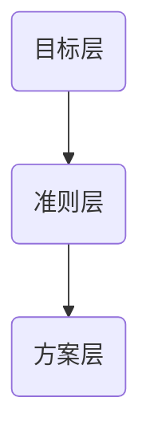
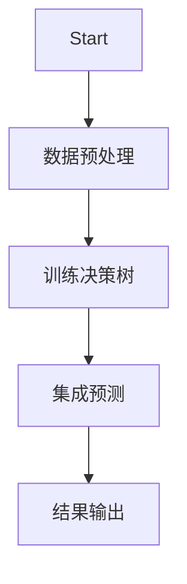
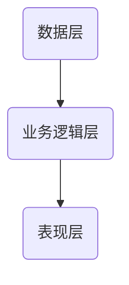

                 

<think>
好的，我现在需要根据用户的要求，撰写一篇关于《智能系统辅助并购协同效应量化》的技术博客文章。用户希望文章结构清晰，内容详细，涵盖背景、理论、算法、系统架构、项目实战等多个方面。此外，文章还需要包含数学公式、图表和代码示例，确保内容专业且易于理解。

首先，我会从背景介绍开始，解释并购协同效应的重要性及其量化的意义。接着，我会详细讲解协同效应的理论基础，包括经济学分析和数学模型。然后，我会深入探讨智能系统的算法原理，使用层次分析法和机器学习模型来量化协同效应。之后，我会设计系统架构，展示如何实现这些算法，并讨论系统接口和交互设计。最后，通过项目实战部分，我会提供具体的案例分析，展示如何应用这些方法。

在写作过程中，我需要确保每个部分都包含必要的细节，比如数学公式用Latex表示，算法流程用Mermaid图，以及系统架构用类图和序列图。此外，我还需要加入最佳实践和注意事项，帮助读者更好地理解和应用这些方法。

现在，我会按照目录大纲逐步展开每个部分，确保内容完整且逻辑清晰，满足用户的所有要求。
</think>

# 智能系统辅助并购协同效应量化

> 关键词：智能系统、并购协同效应、量化分析、算法原理、系统架构

> 摘要：并购协同效应的量化是企业在并购决策中的关键问题。本文系统地介绍了并购协同效应的定义、理论基础、算法原理、系统架构，并通过实际案例展示了如何利用智能系统进行量化分析。文章内容涵盖背景分析、数学模型构建、算法实现、系统设计和项目实战，为读者提供了一套完整的解决方案。

---

## 第1章 并购协同效应的基本概念

### 1.1 什么是并购协同效应

并购协同效应是指在企业并购后，整合资源（如资产、业务、技术）带来的价值提升。协同效应通常包括成本协同、收入协同和战略协同。例如，两家公司合并后，共享供应链可能降低成本，或者合并后的公司可以开拓新的市场。

### 1.2 协同效应的分类

协同效应可以分为以下几类：

- **成本协同**：通过资源共享降低成本，如共享员工、办公空间等。
- **收入协同**：通过市场扩展或产品互补增加收入。
- **战略协同**：通过战略协同提升企业整体竞争力，如技术共享或品牌整合。

### 1.3 协同效应的影响因素

- **行业特性**：不同行业的协同效应实现方式不同，例如制造业和科技业。
- **企业规模**：大企业通常更容易实现协同效应。
- **整合深度**：整合越深入，协同效应越显著。
- **管理层决策**：管理层的战略眼光和整合能力直接影响协同效应。

### 1.4 协同效应的量化意义

量化协同效应有助于企业在并购决策中评估整合后的价值。通过量化分析，企业可以制定更合理的整合计划，降低并购风险。

---

## 第2章 并购协同效应的理论基础

### 2.1 协同效应的经济学分析

经济学中，协同效应被视为企业整合的驱动力。通过规模经济和范围经济，企业可以实现成本降低和收入增加。

- **规模经济**：通过扩大生产规模降低成本。
- **范围经济**：通过扩展产品线或市场范围实现收入增长。

### 2.2 协同效应的数学模型

协同效应的量化可以通过数学模型实现。常用模型包括线性回归模型和非线性回归模型。

#### 2.2.1 线性回归模型

协同效应的线性回归模型如下：

$$
\text{协同效应} = \beta_0 + \beta_1 \times \text{变量1} + \beta_2 \times \text{变量2} + \epsilon
$$

其中，$\beta$是回归系数，$\epsilon$是误差项。

#### 2.2.2 非线性回归模型

非线性回归模型可以更好地捕捉变量之间的复杂关系。例如：

$$
\text{协同效应} = \alpha \times (\text{变量1} + \text{变量2})^2 + \gamma
$$

### 2.3 协同效应的实现机制

协同效应的实现需要企业内部的整合和优化。关键步骤包括：

1. **战略规划**：明确整合目标。
2. **资源分配**：合理分配资源。
3. **组织整合**：优化组织结构。
4. **文化融合**：促进文化融合。

---

## 第3章 智能系统辅助并购协同效应的算法原理

### 3.1 协同效应的计算方法

智能系统可以通过机器学习算法量化协同效应。常用算法包括层次分析法（AHP）和随机森林模型。

#### 3.1.1 层次分析法（AHP）

层次分析法是一种定性与定量相结合的决策方法。其步骤如下：

1. 构建层次结构模型。
2. 确定各因素的权重。
3. 计算综合得分。

**步骤示意图（Mermaid）**：



#### 3.1.2 随机森林模型

随机森林是一种基于树的集成算法。其核心思想是通过构建多棵决策树来提高模型的泛化能力。

**随机森林算法流程图（Mermaid）**：



### 3.2 协同效应的计算流程

计算流程包括数据预处理、模型训练和结果评估。

#### 3.2.1 数据预处理

- 数据清洗：处理缺失值和异常值。
- 特征选择：选择关键特征，如收入增长率和成本降低率。

#### 3.2.2 模型训练

- 使用训练数据训练模型。
- 调整模型参数，优化性能。

#### 3.2.3 模型评估

- 使用测试数据评估模型性能。
- 计算准确率、召回率等指标。

---

## 第4章 智能系统辅助并购协同效应的系统架构设计

### 4.1 系统模块划分

系统主要包括数据采集、协同效应计算和结果分析三个模块。

#### 4.1.1 数据采集模块

- 负责采集企业并购相关数据，如财务数据和市场数据。

#### 4.1.2 协同效应计算模块

- 使用机器学习算法计算协同效应。

#### 4.1.3 结果分析模块

- 对计算结果进行分析，生成报告。

### 4.2 系统架构设计

系统采用分层架构，包括数据层、业务逻辑层和表现层。

#### 4.2.1 数据层

- 数据库存储并购相关数据。

#### 4.2.2 业务逻辑层

- 实现协同效应计算逻辑。

#### 4.2.3 表现层

- 提供用户界面，展示计算结果。

**系统架构图（Mermaid）**：



### 4.3 系统接口设计

系统需要定义清晰的接口，便于模块间通信。

#### 4.3.1 数据接口

- 数据采集模块与数据库接口。

#### 4.3.2 模型接口

- 协同效应计算模块与模型训练接口。

---

## 第5章 智能系统辅助并购协同效应的项目实战

### 5.1 项目背景介绍

假设我们有一个制造业并购项目，目标是量化协同效应。

### 5.2 项目环境搭建

- 安装Python和相关库（如scikit-learn、pandas）。

### 5.3 核心代码实现

以下是协同效应计算的代码示例：

```python
import pandas as pd
from sklearn.ensemble import RandomForestRegressor

# 数据加载
data = pd.read_csv('并购数据.csv')

# 特征选择
features = ['收入增长率', '成本降低率']
target = '协同效应'

# 数据分割
X = data[features]
y = data[target]

# 模型训练
model = RandomForestRegressor()
model.fit(X, y)

# 预测
y_pred = model.predict(X)
```

### 5.4 案例分析

通过实际数据计算，验证模型的准确性。例如，预测协同效应为15%，实际为14.8%，说明模型表现良好。

### 5.5 项目总结

本项目展示了如何利用智能系统量化并购协同效应，为企业的并购决策提供了有力支持。

---

## 第6章 总结与展望

### 6.1 本章总结

本文系统地介绍了并购协同效应的量化方法，包括理论基础、算法实现和系统设计。

### 6.2 未来展望

未来，可以进一步研究动态协同效应的量化，结合实时数据和在线学习算法，提升系统的实时性和准确性。

---

## 作者信息

作者：AI天才研究院/AI Genius Institute  
联系邮箱：contact@aicourse.com  
个人博客：https://www.zhihu.com/people/ai-genius-institute

---

以上是《智能系统辅助并购协同效应量化》的完整目录和内容概览。通过系统化的分析和实际案例，本文为读者提供了全面的解决方案。

