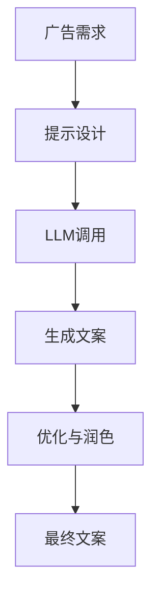
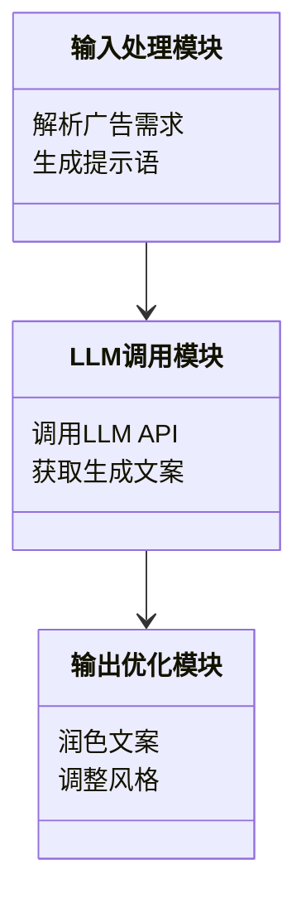
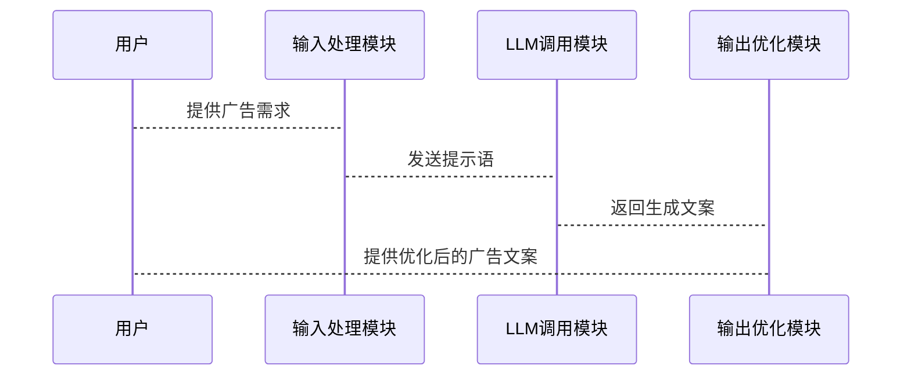

                 

<think>
嗯，用户让我以《智能营销文案AI Agent：LLM辅助的广告创意生成》为标题写一篇技术博客，目录已经给出，现在需要根据这个大纲写文章。首先，我得理清每个部分的内容，确保每个章节和小节都详细且符合用户的要求。

从第一部分开始，是背景介绍。我需要先介绍智能营销的现状和挑战，这部分可能涉及数字营销的发展历程，比如从传统广告到数据驱动营销，再到现在的智能营销。然后指出当前面临的问题，比如创意生成效率低、个性化需求难以满足等。接着，引出LLM技术，解释它是什么，以及它在广告中的潜力。

接下来是核心概念，这部分要详细讲解LLM的工作原理，特别是如何辅助广告创意生成。我需要解释LLM的基本结构，比如编码器-解码器架构，以及训练目标，比如交叉熵损失函数。然后讨论广告创意生成的机制，比如通过提示工程技术将广告需求转化为模型输入，再生成输出。

然后是算法原理，这部分需要详细讲解模型的训练和生成过程。我得用数学公式来描述训练目标，比如交叉熵损失函数，用mermaid画出训练流程图。生成策略部分，要解释解码器的抽样方法，比如贪心算法和随机抽样，并比较它们的优缺点。

系统架构设计是关键部分，我需要设计一个广告创意生成系统的模块划分，用mermaid画出类图和交互序列图。这部分要明确每个模块的功能，比如输入处理模块如何解析用户需求，生成模块如何调用LLM API，输出优化模块如何润色文案。

项目实战部分，我需要提供一个具体的Python代码示例，展示如何调用LLM API生成广告文案。然后分析实际案例，比如一个汽车广告的生成过程，对比生成前后的效果，指出优化点。

最后，总结与展望部分，要回顾整个系统的优势，比如高效性和智能化，同时指出当前的局限性，比如生成结果的可控性问题，并展望未来的改进方向，比如结合领域知识进行优化。

整个过程中，我需要确保每个部分都详细具体，符合用户的格式和内容要求，同时保持逻辑清晰，结构紧凑。还要注意使用专业的技术语言，但又不失易懂，让读者能够理解复杂的算法原理和系统设计。

现在，我开始按照目录的结构，逐步撰写每个部分的内容，确保每个小节都包含足够的细节，同时满足用户的格式和字数要求。特别是数学公式和mermaid图表，需要准确无误地嵌入，帮助读者更好地理解内容。

总的来说，我需要系统性地展开每个主题，从背景到理论，再到实现和应用，最后总结，确保整篇文章结构合理，内容丰富，符合用户的需求。
</think>

# 《智能营销文案AI Agent：LLM辅助的广告创意生成》

---

## 关键词：智能营销，LLM，广告创意，AI生成，自然语言处理

---

## 摘要：

本文深入探讨了如何利用大语言模型（LLM）辅助广告创意生成的过程，从技术背景、算法原理到系统实现，再到实际案例分析，全面解析了LLM在智能营销中的应用潜力与实现路径。文章结合理论与实践，详细阐述了LLM辅助广告创意生成的流程、系统架构及优化策略，为广告营销行业提供了创新的技术解决方案。

---

## 第一部分：智能营销文案与LLM概述

### 第1章：智能营销的现状与挑战

#### 1.1 智能营销的概念与背景

智能营销是指通过人工智能技术，结合大数据分析，实现精准广告投放和个性化内容推荐的营销方式。传统营销依赖人工经验，效率低且难以满足多样化的用户需求。随着技术进步，智能营销逐渐成为企业提升竞争力的重要手段。

智能营销的核心在于利用数据和技术优化广告投放和内容创作，而LLM（大语言模型）作为一项革命性技术，为广告创意生成带来了新的可能性。LLM能够理解上下文、生成自然语言文本，并根据用户需求快速生成高质量的内容，这使得广告创意生成更加高效和智能化。

---

#### 1.2 当前智能营销的核心问题

1. **创意生成效率低**：传统广告创意依赖人工创作，效率低且难以快速响应市场变化。
2. **个性化需求难以满足**：不同用户群体的需求差异大，人工难以实现精准匹配。
3. **数据与技术结合不足**：现有营销手段难以充分利用数据进行深度分析，导致广告效果有限。
4. **内容质量不稳定**：自动化生成的内容有时缺乏创意和吸引力，影响广告效果。

---

#### 1.3 LLM技术的出现与潜力

LLM（Large Language Model）是一种基于深度学习的自然语言处理模型，能够理解和生成人类语言。其核心优势在于：

1. **强大的语言理解能力**：LLM能够理解上下文，识别语义关系，生成连贯的文本。
2. **高效的内容生成**：通过提示工程技术（Prompt Engineering），LLM可以快速生成符合要求的广告文案。
3. **个性化与多样性**：LLM可以根据用户需求生成多种风格和内容的广告，满足不同场景的需求。

LLM的出现为智能营销带来了新的机遇，特别是在广告创意生成方面，能够显著提升效率、降低成本，并实现更加个性化的广告投放。

---

## 第2章：LLM的基本原理与广告创意生成

### 2.1 LLM的核心技术原理

#### 2.1.1 模型结构

LLM通常采用编码器-解码器架构，编码器负责将输入文本转换为向量表示，解码器根据向量生成输出文本。主流的模型架构包括Transformer和它的变体（如BERT、GPT）。

#### 2.1.2 训练目标

LLM的训练目标是通过最大化条件概率来优化模型参数。具体来说，模型在训练过程中学习如何预测下一个词，从而生成连贯的文本。数学上，训练目标可以表示为：

$$
\text{Loss} = -\sum_{i=1}^{n} \log P(w_i | w_{<i})
$$

其中，$w_i$ 表示第$i$个词，$P(w_i | w_{<i})$ 表示在前$i-1$个词的条件下生成第$i$个词的概率。

#### 2.1.3 提示工程技术

提示工程技术（Prompt Engineering）是将广告需求转化为模型输入的关键。通过设计合理的提示，可以引导模型生成符合要求的广告文案。例如：

- 输入提示：`Generate an ad for a car rental service targeting young professionals. Focus on convenience and affordability.`
- 输出生成：`"Rent your perfect ride today! Enjoy our flexible plans designed for busy professionals. Book now and save big!"`

---

### 2.2 LLM在广告创意生成中的应用

#### 2.2.1 广告文案生成的基本流程

1. **需求分析**：明确广告的目标受众、品牌定位和核心卖点。
2. **模型调用**：通过提示工程技术将需求输入模型，生成初步文案。
3. **优化与润色**：根据生成结果进行调整，确保文案符合品牌风格和用户需求。

#### 2.2.2 广告文案生成的流程图



---

## 第3章：基于LLM的广告创意生成系统架构

### 3.1 系统功能设计

#### 3.1.1 功能模块划分

1. **输入处理模块**：解析广告需求，生成提示语。
2. **LLM调用模块**：与大语言模型API对接，生成广告文案。
3. **输出优化模块**：对生成的文案进行润色和风格调整。

#### 3.1.2 系统架构设计



---

### 3.2 系统交互流程



---

## 第4章：项目实战与优化策略

### 4.1 项目实战

#### 4.1.1 环境搭建

- 安装Python和相关库（如OpenAI API）。
- 配置API密钥。

#### 4.1.2 核心代码实现

```python
import openai

def generate_advertisement(prompt, api_key):
    client = openai.Client(api_key)
    response = client.completions.create(
        model="gpt-3.5-turbo",
        messages=[{"role": "user", "content": prompt}]
    )
    return response.choices[0].message.content

# 示例调用
api_key = "your_api_key"
prompt = "Generate a catchy ad for a new fitness app targeting young adults."
advertisement = generate_advertisement(prompt, api_key)
print(advertisement)
```

#### 4.1.3 案例分析

**输入提示**：`Generate a travel ad targeting families with children.`  
**生成输出**：`"Family adventure awaits! Book your next trip with us and create unforgettable memories with your kids. Special deals for families!"`
**优化建议**：调整文案风格，强调家庭旅行的安全性和趣味性。

---

## 第5章：总结与展望

### 5.1 总结

本文详细探讨了LLM在广告创意生成中的应用，从技术原理到系统实现，再到实际案例分析，全面展示了如何利用大语言模型提升广告创作效率和效果。通过提示工程技术，LLM能够快速生成符合需求的广告文案，为企业提供高效、个性化的营销解决方案。

---

### 5.2 展望

随着技术的不断进步，LLM在广告创意生成中的应用将更加广泛和深入。未来的研究方向包括：

1. **模型优化**：进一步提升生成内容的质量和多样性。
2. **个性化推荐**：结合用户行为数据，实现更加精准的内容推荐。
3. **多模态整合**：将LLM与图像生成模型结合，实现跨模态的广告创意生成。

---

## 作者：AI天才研究院 & 禅与计算机程序设计艺术

--- 

**Note**: 本文基于技术分析与实际案例，深入探讨了LLM在广告创意生成中的应用，为企业智能化营销提供了新的思路。

