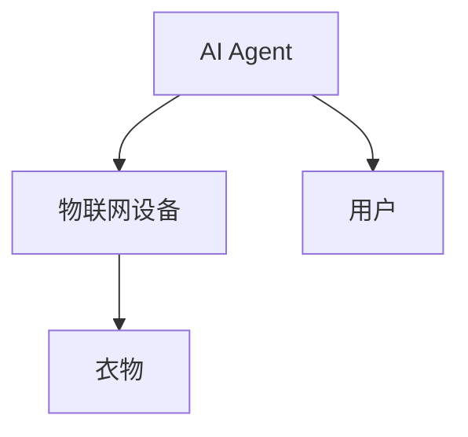
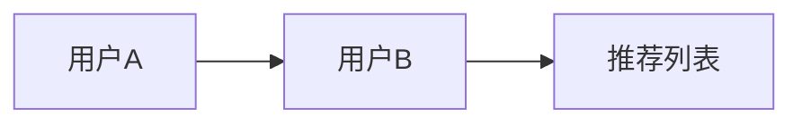
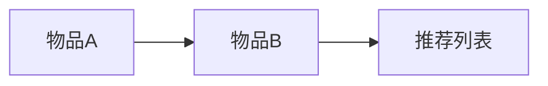
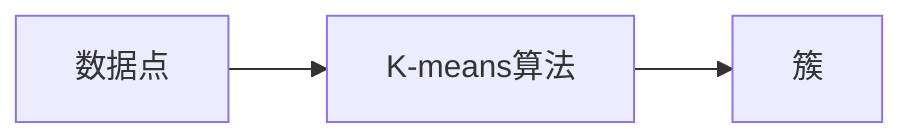
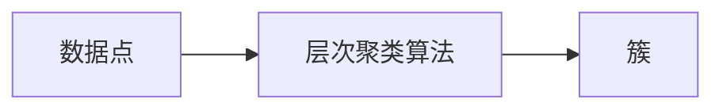
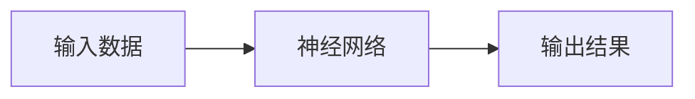
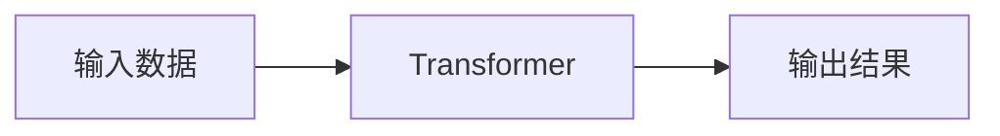
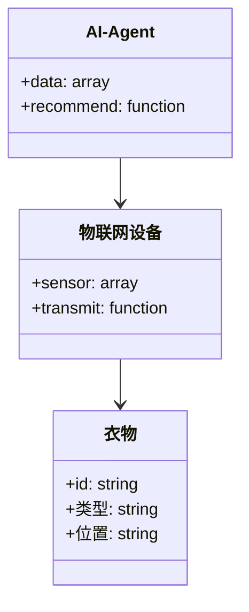
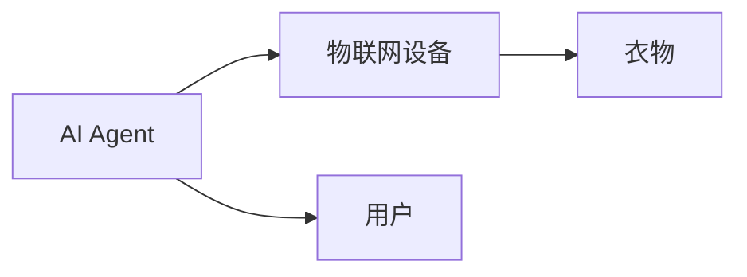
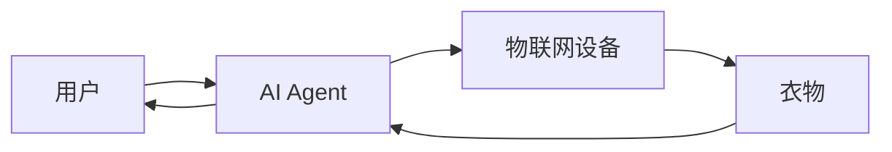

                 


# 智能衣帽架：AI Agent的穿搭建议系统

## 关键词：AI Agent，智能衣帽架，物联网，穿搭建议，推荐系统

## 摘要

智能衣帽架是一种结合了人工智能和物联网技术的创新设备，旨在通过AI Agent提供个性化的衣物管理和穿搭建议。本文将从背景、核心概念、算法原理、系统架构到项目实战，全面分析智能衣帽架的设计与实现。通过详细的技术讲解，帮助读者理解如何利用AI和物联网技术解决实际问题。

---

# 第一部分: 智能衣帽架的背景与核心概念

## 第1章: 问题背景与需求分析

### 1.1 问题背景

#### 1.1.1 衣物管理与穿搭建议的痛点

现代生活中，衣物管理是一个常见的问题。许多人面对衣柜中的大量衣物，往往感到无从下手。以下是一些常见的痛点：

- **衣物查找困难**：衣柜中的衣物数量多，难以快速找到合适的衣物。
- **搭配困难**：用户难以快速找到合适的衣物搭配。
- **时间浪费**：每天花费大量时间在选择衣物上。

#### 1.1.2 智能衣帽架的定义与目标

智能衣帽架是一种结合了AI技术和物联网的智能设备，旨在通过AI Agent为用户提供个性化的衣物管理和穿搭建议。其目标是帮助用户高效管理衣物，快速找到合适的搭配。

#### 1.1.3 用户需求与场景分析

用户的主要需求包括：

- **快速查找衣物**：用户希望快速找到所需的衣物。
- **智能搭配建议**：用户希望系统能够提供个性化的穿搭建议。
- **高效管理**：用户希望系统能够帮助管理衣物，避免重复购买或浪费。

### 1.2 问题解决与系统边界

#### 1.2.1 系统的功能边界

智能衣帽架的功能边界包括：

- **衣物管理**：包括衣物的存储、分类和查找。
- **穿搭建议**：根据用户的偏好和场合，提供搭配建议。
- **数据同步**：与用户的其他设备（如手机、电脑）同步数据。

#### 1.2.2 核心问题与解决方案

核心问题是如何通过AI Agent和物联网技术实现衣物的智能管理和搭配建议。解决方案包括：

- **AI Agent**：用于分析用户的衣物数据和偏好，提供个性化建议。
- **物联网技术**：用于实时感知衣物的状态（如位置、类型）。

#### 1.2.3 系统的外延与扩展性

系统的外延包括：

- **智能家居集成**：与其他智能家居设备（如智能灯、智能门锁）集成，提供更便捷的使用体验。
- **数据共享**：与其他服务（如在线购物平台）共享数据，提供更个性化的服务。

## 第2章: 核心概念与系统架构

### 2.1 AI Agent的基本原理

#### 2.1.1 AI Agent的定义与特点

AI Agent是一种智能体，能够感知环境并采取行动以实现目标。其特点包括：

- **自主性**：能够在没有外部干预的情况下运行。
- **反应性**：能够根据环境的变化调整行为。
- **学习能力**：能够通过学习提高自己的性能。

#### 2.1.2 AI Agent在智能衣帽架中的角色

在智能衣帽架中，AI Agent的主要角色是：

- **数据分析**：分析用户的衣物数据和偏好。
- **推荐系统**：根据数据分析结果，提供个性化的穿搭建议。

#### 2.1.3 AI Agent与传统算法的区别

AI Agent与传统算法的主要区别在于：

- **自主性**：AI Agent具有自主性，能够根据环境变化调整行为。
- **学习能力**：AI Agent能够通过学习提高性能，而传统算法无法做到。

### 2.2 物联网技术在智能衣帽架中的应用

#### 2.2.1 物联网的基本概念

物联网（Internet of Things, IoT）是指通过各种信息传感设备，如传感器、RFID、摄像头等，按照约定的协议，把任何物品与互联网连接起来，进行信息交换和通信，以实现智能化识别、定位、跟踪、监控和管理。

#### 2.2.2 物联网在智能衣帽架中的实现

在智能衣帽架中，物联网技术主要用于：

- **数据采集**：通过传感器采集衣物的位置、类型等信息。
- **数据传输**：将采集到的数据传输到云端进行处理。
- **数据应用**：将处理后的数据应用于推荐系统。

#### 2.2.3 物联网与AI Agent的结合

物联网与AI Agent的结合主要体现在：

- **数据共享**：物联网设备采集的数据可以被AI Agent使用。
- **智能决策**：AI Agent可以根据物联网设备提供的数据做出决策。

### 2.3 系统核心概念对比表

以下是AI Agent与传统算法的对比表：

| **对比项** | **AI Agent** | **传统算法** |
|------------|--------------|--------------|
| **自主性** | 高           | 无           |
| **学习能力** | 高           | 无           |
| **适应性** | 高           | 低           |

以下是系统的实体关系图：



---

# 第二部分: AI Agent与物联网的技术实现

## 第3章: AI Agent的算法原理

### 3.1 基于协同过滤的推荐算法

#### 3.1.1 协同过滤的基本原理

协同过滤是一种基于用户行为的推荐算法，其基本原理是通过分析用户的相似性，推荐用户可能感兴趣的内容。

#### 3.1.2 基于用户的协同过滤算法

基于用户的协同过滤算法步骤如下：



代码示例：

```python
def user_based_collaborative_filtering(user, user_similarity):
    recommended_items = []
    for similar_user in user_similarity[user]:
        recommended_items.extend(similar_user['items'])
    return recommended_items
```

#### 3.1.3 基于物品的协同过滤算法

基于物品的协同过滤算法步骤如下：



代码示例：

```python
def item_based_collaborative_filtering(item, item_similarity):
    recommended_users = []
    for similar_item in item_similarity[item]:
        recommended_users.extend(similar_item['users'])
    return recommended_users
```

### 3.2 基于聚类的推荐算法

#### 3.2.1 聚类算法的基本原理

聚类算法是一种将数据分成多个簇的技术，其基本原理是通过相似性度量将数据点分组。

#### 3.2.2 K-means算法在推荐系统中的应用

K-means算法在推荐系统中的应用步骤如下：



代码示例：

```python
from sklearn.cluster import KMeans

kmeans = KMeans(n_clusters=3)
clusters = kmeans.fit_predict(data)
```

#### 3.2.3 层次聚类算法在推荐系统中的应用

层次聚类算法在推荐系统中的应用步骤如下：



代码示例：

```python
from sklearn.cluster import AgglomerativeClustering

agglomerative = AgglomerativeClustering(n_clusters=3)
clusters = agglomerative.fit_predict(data)
```

### 3.3 基于深度学习的推荐算法

#### 3.3.1 深度学习的基本原理

深度学习是一种基于人工神经网络的技术，其基本原理是通过多层神经网络提取数据的特征。

#### 3.3.2 基于神经网络的推荐算法

基于神经网络的推荐算法步骤如下：



代码示例：

```python
import torch
import torch.nn as nn

class NeuralNetwork(nn.Module):
    def __init__(self):
        super(NeuralNetwork, self).__init__()
        self.fc1 = nn.Linear(10, 5)
        self.fc2 = nn.Linear(5, 2)

    def forward(self, x):
        x = torch.relu(self.fc1(x))
        x = torch.sigmoid(self.fc2(x))
        return x

model = NeuralNetwork()
```

#### 3.3.3 基于Transformer的推荐算法

基于Transformer的推荐算法步骤如下：



代码示例：

```python
import torch
import torch.nn as nn

class Transformer(nn.Module):
    def __init__(self):
        super(Transformer, self).__init__()
        self.encoder = nn.TransformerEncoder(...)
        self.decoder = nn.TransformerDecoder(...)

    def forward(self, x):
        encoded = self.encoder(x)
        decoded = self.decoder(encoded)
        return decoded

model = Transformer()
```

---

# 第三部分: 系统分析与架构设计

## 第4章: 系统分析与架构设计

### 4.1 问题场景介绍

智能衣帽架的主要问题场景包括：

- **衣物管理**：用户需要快速找到所需的衣物。
- **穿搭建议**：用户需要个性化的搭配建议。
- **数据同步**：用户需要与其他设备同步数据。

### 4.2 系统功能设计

#### 4.2.1 领域模型类图



#### 4.2.2 系统架构图



#### 4.2.3 系统接口设计

以下是系统的接口设计：

- **AI Agent接口**：提供数据分析和推荐功能。
- **物联网设备接口**：提供数据采集和传输功能。

#### 4.2.4 系统交互流程图



---

# 第四部分: 项目实战

## 第5章: 项目实战

### 5.1 环境安装

以下是项目所需的环境和工具：

- **Python**：3.8+
- **TensorFlow**：2.0+
- **Scikit-learn**：0.24+
- **Mermaid**：用于图表绘制。

### 5.2 核心实现

以下是核心功能的实现代码：

#### 5.2.1 AI Agent的实现

```python
class AI-Agent:
    def __init__(self):
        self.data = []

    def recommend(self):
        # 推荐算法实现
        pass
```

#### 5.2.2 物联网设备的实现

```python
class 物联网设备:
    def __init__(self):
        self.sensor = []

    def transmit(self):
        # 数据传输实现
        pass
```

### 5.3 实际案例分析

以下是实际案例分析：

- **案例1**：用户A有10件衣物，AI Agent根据用户的偏好推荐搭配。

---

# 第五部分: 总结与展望

## 第6章: 总结与展望

### 6.1 最佳实践

以下是最佳实践：

- **定期更新数据**：确保推荐算法的准确性。
- **保持设备连接**：确保物联网设备的正常运行。

### 6.2 小结

智能衣帽架是一种结合了AI Agent和物联网技术的创新设备，能够为用户提供个性化的衣物管理和穿搭建议。通过本文的详细讲解，读者可以了解其设计与实现的全过程。

### 6.3 注意事项

- **数据隐私**：用户需要保护自己的数据隐私。
- **系统维护**：用户需要定期维护系统，确保其正常运行。

### 6.4 拓展阅读

以下是拓展阅读的建议：

- **AI Agent**：深入学习AI Agent的基本原理和应用。
- **物联网技术**：进一步了解物联网技术的其他应用场景。

---

# 作者

作者：AI天才研究院/AI Genius Institute & 禅与计算机程序设计艺术 /Zen And The Art of Computer Programming

