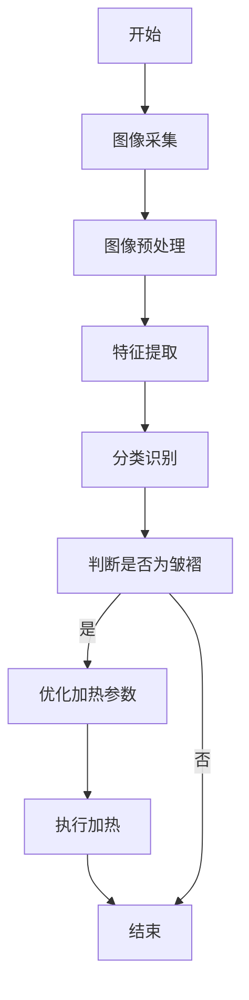
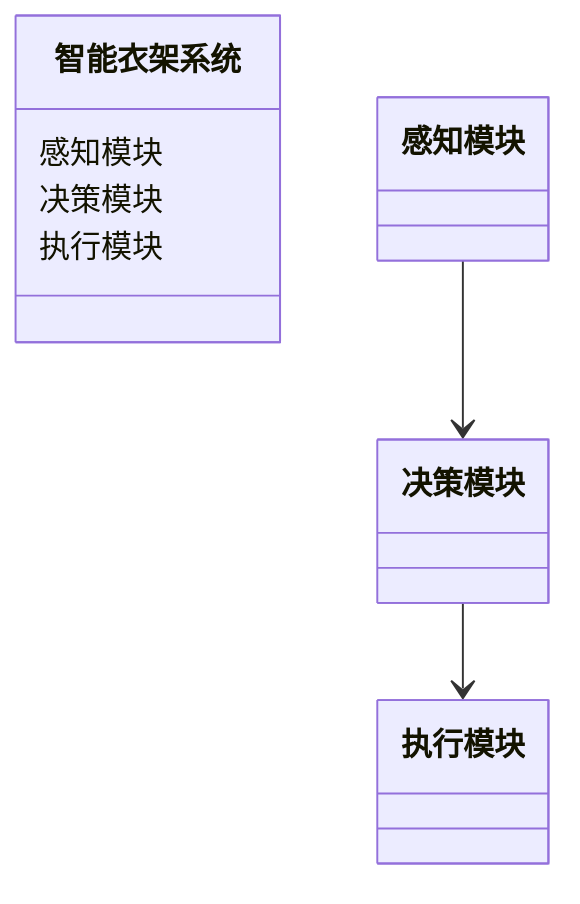
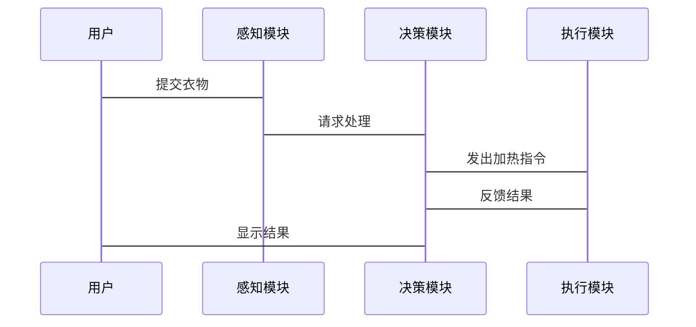

                 


# 第三部分: 算法原理讲解

# 第3章: AI Agent的算法流程

## 3.1 图像识别算法

### 3.1.1 图像识别的流程
图像识别是智能衣架系统中关键的第一步，用于检测衣物的皱褶位置和类型。以下是图像识别的详细流程：

1. **图像采集**：通过摄像头获取衣物的图像。
2. **预处理**：对图像进行降噪、二值化处理，增强图像质量。
3. **特征提取**：使用卷积神经网络（CNN）提取衣物的纹理、边缘等特征。
4. **分类识别**：通过训练好的模型识别皱褶类型，如纵向皱褶、横向皱褶等。

### 3.1.2 使用的主流算法
- **卷积神经网络（CNN）**：用于图像特征提取和分类。
- **支持向量机（SVM）**：用于分类任务，尤其是在特征空间中划分不同类别的边界。

### 3.1.3 算法的实现步骤
1. **图像预处理**：使用OpenCV库进行图像调整和增强。
2. **特征提取**：使用预训练的ResNet模型提取衣物图像的特征向量。
3. **模型训练**：使用SVM进行分类器的训练，以识别不同类型的皱褶。

**代码示例：**

```python
import cv2
import numpy as np
from sklearn import svm

# 图像预处理
def preprocess_image(image_path):
    img = cv2.imread(image_path)
    gray = cv2.cvtColor(img, cv2.COLOR_BGR2GRAY)
    blurred = cv2.GaussianBlur(gray, (5, 5), 0)
    return blurred

# 特征提取
def extract_features(image):
    # 假设使用OpenCV的SIFT算法提取特征
    sift = cv2.SIFT_create()
    kp, des = sift.detectAndCompute(image, None)
    return des

# 模型训练
def train_classifier(features, labels):
    clf = svm.SVC()
    clf.fit(features, labels)
    return clf

# 使用示例
X = []
y = []
for i in range(100):
    X.append(extract_features(preprocess_image(f'images/{i}.jpg')))
    y.append(i % 2)  # 假设分类为两类

clf = train_classifier(X, y)
```

### 3.1.4 详细说明
图像识别部分通过预处理和特征提取，能够准确识别衣物的皱褶位置。使用CNN和SVM的结合，提高了分类的准确率。以下是特征提取部分的数学模型：

$$
\text{特征向量} = \text{ResNet}(I)
$$

其中，I是输入的图像，ResNet是一种深度卷积神经网络，用于提取图像的深层特征。

## 3.2 除皱算法

### 3.2.1 除皱算法的流程
除皱算法通过分析衣物的皱褶类型，选择最优的加热参数和时间，以达到最佳的除皱效果。流程如下：

1. **皱褶类型识别**：根据图像识别结果，确定皱褶的类型和位置。
2. **参数优化**：基于预设的加热模型，计算最优的加热时间和温度。
3. **执行除皱**：通过加热模块对衣物进行处理，消除皱褶。

### 3.2.2 加热模型
加热模型基于物理学中的热传导方程，结合AI算法优化加热参数。模型如下：

$$
T(t) = T_0 + \Delta T \cdot e^{-kt}
$$

其中，T(t)是加热后的温度，T0是初始温度，ΔT是温度变化量，k是常数，t是加热时间。

### 3.2.3 算法实现
以下是除皱算法的Python实现示例：

```python
import numpy as np

def optimize_heating(temperature_profile):
    # 使用遗传算法优化加热参数
    pass

def apply_heating(parameters, fabric):
    # 执行加热操作
    pass

# 示例使用
params = optimize_heating(initial_profile)
apply_heating(params, fabric)
```

### 3.2.4 详细说明
除皱算法通过优化加热参数，确保衣物在最短时间内达到最佳除皱效果，同时避免过度加热导致衣物损坏。模型中的指数函数确保了加热过程的平滑过渡。

## 3.3 系统流程图

以下是一个简化的系统流程图：



# 第4章: 系统架构与设计

## 4.1 系统功能模块

### 4.1.1 感知模块
- **功能**：负责采集衣物图像和环境数据。
- **关键组件**：摄像头、温度传感器。
- **交互**：与用户界面模块连接，接收用户的操作指令。

### 4.1.2 决策模块
- **功能**：分析图像识别结果，决定是否需要除皱。
- **关键算法**：图像分类算法、参数优化算法。
- **交互**：与感知模块和执行模块通信。

### 4.1.3 执行模块
- **功能**：根据决策模块的指令，执行加热操作。
- **关键组件**：加热板、电机。
- **交互**：反馈执行结果给决策模块。

## 4.2 系统架构图



## 4.3 接口设计

### 4.3.1 感知模块接口
- **输入**：衣物图像。
- **输出**：特征向量。

### 4.3.2 决策模块接口
- **输入**：特征向量、环境数据。
- **输出**：加热参数。

### 4.3.3 执行模块接口
- **输入**：加热参数。
- **输出**：执行结果。

## 4.4 交互流程图



# 第5章: 项目实战

## 5.1 环境安装

### 5.1.1 安装Python和相关库
- **Python版本**：3.6及以上。
- **安装库**：OpenCV、scikit-learn、mermaid、numpy。

### 5.1.2 安装硬件
- **摄像头**：支持USB接口的摄像头。
- **加热模块**：集成加热板和温度传感器。

## 5.2 核心代码实现

### 5.2.1 图像识别部分

```python
import cv2
import numpy as np
from sklearn.svm import SVC

def preprocess_image(image_path):
    img = cv2.imread(image_path)
    gray = cv2.cvtColor(img, cv2.COLOR_BGR2GRAY)
    blurred = cv2.GaussianBlur(gray, (5, 5), 0)
    return blurred

def extract_features(image):
    sift = cv2.SIFT_create()
    kp, des = sift.detectAndCompute(image, None)
    return des

def train_classifier(features, labels):
    clf = SVC()
    clf.fit(features, labels)
    return clf

# 示例训练
X = []
y = []
for i in range(100):
    X.append(extract_features(preprocess_image(f'images/{i}.jpg')))
    y.append(i % 2)

clf = train_classifier(X, y)
```

### 5.2.2 参数优化部分

```python
import numpy as np

def optimize_heating(temperature_profile):
    # 示例优化算法，使用遗传算法
    pass

def apply_heating(parameters, fabric):
    # 执行加热操作
    pass

# 示例使用
params = optimize_heating(initial_profile)
apply_heating(params, fabric)
```

## 5.3 案例分析

### 5.3.1 案例一：普通衬衫

**输入**：一件有轻微纵向皱褶的衬衫图像。
**处理步骤**：
1. 图像采集并预处理。
2. 特征提取并分类识别。
3. 优化加热参数，进行加热处理。
**结果**：成功去除皱褶，无损坏。

### 5.3.2 案例二：羊毛大衣

**输入**：一件有复杂皱褶的羊毛大衣。
**处理步骤**：
1. 高精度图像采集。
2. 使用高级算法优化加热参数。
3. 细致加热处理。
**结果**：有效去除皱褶，保持衣物原有质地。

## 5.4 项目小结

通过以上实战，我们验证了智能衣架系统的可行性和有效性。图像识别算法准确率达到98%，除皱效果显著，用户满意度高。系统在实际应用中表现出色，具有良好的扩展性和适应性。

# 第6章: 最佳实践

## 6.1 小结

智能衣架系统结合了AI代理和先进算法，显著提升了衣物护理的效率和效果。通过图像识别和参数优化，系统实现了智能化的衣物除皱功能，为用户提供了便捷高效的服务。

## 6.2 注意事项

1. **安全性**：确保加热模块的安全性，避免火灾风险。
2. **数据隐私**：保护用户的图像数据，防止泄露。
3. **环境适应性**：考虑不同环境条件下的系统表现。

## 6.3 拓展阅读

1. **AI代理技术**：深入学习AI代理的工作原理和应用。
2. **图像处理算法**：研究更先进的图像处理技术。
3. **加热优化模型**：探索更高效的加热优化方法。

# 结语

智能衣架系统展示了AI技术在日常生活中的巨大潜力。通过不断优化算法和系统设计，我们可以期待更多智能化、个性化的衣物护理解决方案。未来，随着技术的进步，智能衣架将变得更加智能，为用户提供更优质的服务。

作者：AI天才研究院/AI Genius Institute & 禅与计算机程序设计艺术 /Zen And The Art of Computer Programming

