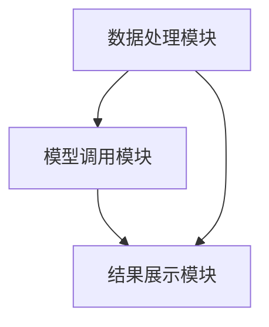

                 


# 智能财务分析 AI Agent：LLM 在企业财务管理中的应用

---

## 关键词  
智能财务分析，LLM，企业财务管理，人工智能，自然语言处理，财务预测，决策支持

---

## 摘要  
随着人工智能技术的飞速发展，大型语言模型（LLM）在企业财务管理中的应用逐渐成为现实。本文将深入探讨LLM在财务分析中的潜力与挑战，分析其在财务数据处理、报告生成、预测与决策支持等环节的应用场景，并结合实际案例，展示如何通过LLM构建智能财务分析系统。文章将从技术原理、系统架构到项目实战，全面解析LLM在财务管理中的创新应用，为企业财务管理的数字化转型提供新的思路和解决方案。

---

# 第一部分：智能财务分析的背景与意义

## 第1章：智能财务分析的背景与意义

### 1.1 财务管理的数字化转型

#### 1.1.1 传统财务管理的局限性
- 依赖人工处理，效率低且易出错。
- 数据分散，难以快速提取和分析。
- 报告生成耗时，且缺乏智能化支持。

#### 1.1.2 数字化转型的必要性
- 提高财务数据处理效率。
- 实现财务数据的深度分析与预测。
- 优化财务决策流程，降低风险。

#### 1.1.3 智能财务分析的核心价值
- 自动化处理财务数据。
- 智能生成财务报告。
- 提供精准的财务预测与决策支持。

### 1.2 LLM的基本概念与技术特点

#### 1.2.1 大型语言模型的定义
- LLM（Large Language Model）是一种基于深度学习的自然语言处理模型，能够理解和生成人类语言。
- 通过大量数据训练，模型可以捕捉语言的上下文关系，实现文本生成、翻译、问答等多种任务。

#### 1.2.2 LLM的核心技术特点
| 特性 | 描述 |
|------|------|
| 大规模参数 | 模型参数量通常在数十亿级别，能够捕捉复杂的语言模式。 |
| 自监督学习 | 通过预测下一个词来训练模型，无需大量标注数据。 |
| 可扩展性 | 支持多种任务，如文本生成、分类、摘要等。 |

#### 1.2.3 LLM与传统NLP的区别
| 对比维度 | LLM | 传统NLP |
|----------|------|----------|
| 模型复杂度 | 高 | 较低 |
| 任务支持 | 多任务 | 单任务 |
| 数据需求 | 较少 | 较多 |

### 1.3 LLM在财务管理中的应用价值

#### 1.3.1 提高财务分析效率
- 快速处理大量财务数据，减少人工干预。
- 实现自动化报告生成，节省时间。

#### 1.3.2 优化财务决策流程
- 提供实时数据支持，加快决策速度。
- 基于历史数据和预测模型，优化决策方案。

#### 1.3.3 降低财务风险
- 通过异常检测发现潜在问题。
- 提供多维度分析，降低决策风险。

---

## 第2章：LLM在企业财务管理中的核心应用

### 2.1 财务数据的智能化处理

#### 2.1.1 数据清洗与预处理
- 使用LLM对财务数据进行清洗，识别并纠正错误或不一致的数据。
- 示例：自动识别无效数据，如“NaN”或“NULL”，并将其标记为需要进一步处理的字段。

#### 2.1.2 数据结构化与分析
- 将非结构化数据（如财务报告文本）转化为结构化数据。
- 示例：从公司财报中提取收入、利润等关键指标，并生成可视化图表。

#### 2.1.3 数据可视化与报告生成
- 通过LLM生成财务报告的摘要和图表。
- 示例：根据季度财务数据，自动生成季度报告，并用图表展示收入趋势。

### 2.2 财务报告的自动生成

#### 2.2.1 报告模板的设计与优化
- 定义报告模板，包括固定格式和可变内容。
- 示例：设计年度财务报告模板，包括资产负债表、利润表和现金流量表。

#### 2.2.2 自然语言处理在报告生成中的应用
- 使用LLM根据财务数据生成自然语言报告。
- 示例：从财务数据库中提取数据，生成季度财务分析报告，内容包括收入增长、成本变化等。

#### 2.2.3 报告的可读性与准确性
- 优化生成报告的语言，确保报告易于理解。
- 示例：通过反馈机制不断优化报告生成算法，提高准确性和可读性。

### 2.3 财务预测与决策支持

#### 2.3.1 财务预测模型的构建
- 使用LLM结合时间序列数据，构建财务预测模型。
- 示例：根据过去三年的收入数据，预测未来一年的收入趋势。

#### 2.3.2 LLM在财务预测中的优势
- 处理复杂数据关系，发现潜在趋势。
- 示例：通过分析历史数据，预测销售额和成本的变化趋势。

#### 2.3.3 预测结果的验证与优化
- 使用真实数据验证预测结果，优化模型参数。
- 示例：根据实际收入数据，调整预测模型的参数，提高预测精度。

---

## 第3章：LLM在财务管理中的算法原理

### 3.1 LLM的训练与推理过程

#### 3.1.1 监督学习与无监督学习
- 监督学习：模型在有标注数据的情况下进行训练。
- 无监督学习：模型在无标注数据的情况下进行自我学习。

#### 3.1.2 模型的训练流程
1. 数据预处理：清洗数据，去除噪声。
2. 模型初始化：定义模型参数和超参数。
3. 模型训练：通过反向传播优化参数。
4. 模型评估：使用验证集评估模型性能。
5. 模型推理：使用训练好的模型生成输出。

#### 3.1.3 模型的推理机制
- 输入：财务数据或查询。
- 输出：生成的文本或预测结果。

### 3.2 LLM的数学模型与公式

#### 3.2.1 概率分布与损失函数
- 概率分布：模型预测下一个词的概率分布。
- 损失函数：交叉熵损失函数，用于衡量预测概率与真实概率的差异。

#### 3.2.2 注意力机制与解码器
- 注意力机制：计算输入序列中每个词的重要性，生成注意力权重。
- 解码器：根据注意力权重生成输出序列。

#### 3.2.3 模型的训练目标函数
$$ \text{目标函数} = -\sum_{i=1}^{n} \log P(y_i | y_{<i}) $$

### 3.3 LLM在财务管理中的优化算法

#### 3.3.1 参数优化方法
- 使用随机梯度下降（SGD）或Adam优化器优化模型参数。

#### 3.3.2 模型调优策略
- 调整学习率、批次大小等超参数。
- 使用早停法防止过拟合。

#### 3.3.3 财务场景下的算法改进
- 针对财务数据特点，优化模型的训练策略。

---

## 第4章：LLM在财务管理中的系统架构设计

### 4.1 系统架构概述

#### 4.1.1 系统模块划分
- 数据处理模块：负责数据的清洗、结构化和预处理。
- 模型调用模块：负责调用LLM进行文本生成或预测。
- 结果展示模块：负责生成报告或预测结果的可视化展示。

#### 4.1.2 模块之间的关系
- 数据处理模块向模型调用模块提供结构化数据。
- 模型调用模块将生成的文本或预测结果传递给结果展示模块。

#### 4.1.3 系统的输入输出流程
1. 输入：原始财务数据或用户查询。
2. 输出：结构化数据或生成的财务报告。

### 4.2 系统功能设计

#### 4.2.1 数据处理模块
- 数据清洗：识别并纠正错误数据。
- 数据结构化：将非结构化数据转化为结构化数据。

#### 4.2.2 模型调用模块
- 文本生成：根据财务数据生成报告或摘要。
- 预测：基于历史数据预测未来的财务指标。

#### 4.2.3 结果展示模块
- 可视化：生成图表展示财务数据。
- 报告生成：根据预测结果生成财务报告。

### 4.3 系统架构图



---

## 第5章：LLM在财务管理中的项目实战

### 5.1 项目背景与目标

#### 5.1.1 项目需求分析
- 简化财务数据处理流程。
- 提高财务报告生成效率。
- 实现财务预测与决策支持。

#### 5.1.2 项目目标设定
- 开发一个基于LLM的企业财务分析系统。
- 实现财务数据的智能化处理、报告生成和预测功能。

#### 5.1.3 项目实施计划
1. 环境搭建：安装必要的工具和库。
2. 数据收集：获取财务数据。
3. 模型训练：训练LLM模型。
4. 系统开发：开发各个模块。
5. 测试与优化：测试系统并优化性能。

### 5.2 环境搭建与代码实现

#### 5.2.1 环境搭建
- 安装Python、TensorFlow、PyTorch等工具。
- 安装LLM框架，如Hugging Face的Transformers库。

#### 5.2.2 数据收集与预处理
```python
import pandas as pd

# 读取财务数据
data = pd.read_csv('financial_data.csv')

# 数据清洗
data.dropna(inplace=True)
data['date'] = pd.to_datetime(data['date'])
```

#### 5.2.3 模型训练与调用
```python
from transformers import AutoTokenizer, AutoModelForCausalLM

# 加载预训练模型
tokenizer = AutoTokenizer.from_pretrained('gpt2')
model = AutoModelForCausalLM.from_pretrained('gpt2')

# 定义生成函数
def generate_report(prompt):
    inputs = tokenizer.encode(prompt, return_tensors='pt')
    outputs = model.generate(inputs, max_length=500)
    report = tokenizer.decode(outputs[0], skip_special_tokens=True)
    return report
```

#### 5.2.4 系统功能实现
```python
# 数据处理模块
def process_data(data):
    # 数据清洗
    data.dropna(inplace=True)
    # 数据结构化
    processed_data = data[['date', 'revenue', 'profit']]
    return processed_data

# 模型调用模块
def generate_summary(data):
    prompt = f"Generate a summary of the financial data: {data.to_string()}"
    return generate_report(prompt)
```

---

## 第6章：总结与展望

### 6.1 本章小结
- 本文深入探讨了LLM在企业财务管理中的应用，从技术原理到系统架构，再到项目实战，全面解析了LLM在财务管理中的潜力。
- 通过实际案例展示了LLM在财务数据处理、报告生成和预测中的具体应用。

### 6.2 未来展望
- **技术优化**：进一步优化模型的训练策略，提高预测精度和生成质量。
- **场景扩展**：探索LLM在更多财务场景中的应用，如税务筹划、资本预算等。
- **工具集成**：将LLM集成到现有的财务管理系统中，实现更高效的财务管理。

---

## 附录

### 附录A：相关工具与库
- Python：编程语言。
- Transformers：Hugging Face的LLM库。
- Pandas：数据处理库。
- Matplotlib：数据可视化库。

### 附录B：数据集示例
```python
# 示例数据集
import pandas as pd

data = {
    'date': ['2023-01-31', '2023-02-28', '2023-03-31'],
    'revenue': [100000, 120000, 115000],
    'profit': [20000, 25000, 30000]
}
df = pd.DataFrame(data)
```

### 附录C：参考文献
1. Vaswani, A., et al. "Attention Is All You Need." arXiv, 2017.
2. Radford, A., et al. "Language Models Are Few-Shot Learners." arXiv, 2019.
3. Brown, T., et al. "Language Models with 175B Parameters." arXiv, 2020.

---

## 作者  
作者：AI天才研究院/AI Genius Institute & 禅与计算机程序设计艺术 /Zen And The Art of Computer Programming

