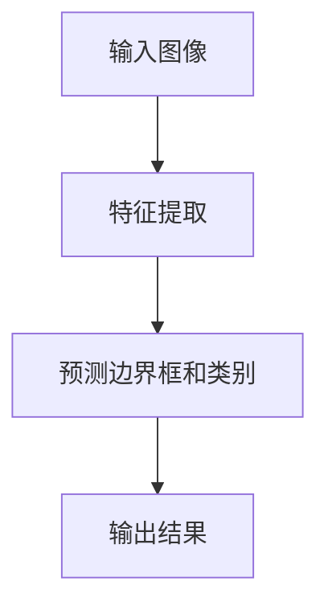
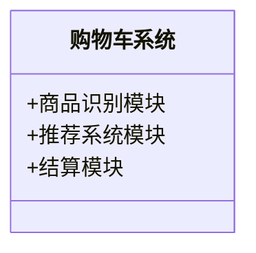
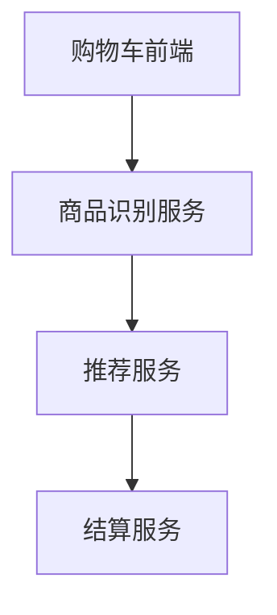

                 


# 智能购物车：AI Agent的商品识别与结算

## 关键词：AI Agent, 智能购物车, 商品识别, 结算系统, 深度学习, 自然语言处理

## 摘要：  
本文探讨了AI Agent在智能购物车中的应用，重点分析了商品识别与结算的核心技术。通过背景介绍、算法原理、系统架构设计、项目实战等多维度的详细讲解，展示了如何利用深度学习和自然语言处理等技术实现智能购物车的高效商品识别与结算流程。本文还提供了实际的代码实现和系统架构图，帮助读者更好地理解和应用相关技术。

---

# 第1章: AI Agent与智能购物车概述

## 1.1 智能购物车的背景与意义

### 1.1.1 问题背景  
传统的购物车功能单一，依赖人工操作，效率低下。随着AI技术的发展，购物车可以实现商品自动识别、推荐、结算等智能化功能，极大提升用户体验和效率。

### 1.1.2 技术现状  
当前，基于深度学习的商品识别技术逐渐成熟，但如何在购物车场景中实现高效、准确的商品识别与结算仍是一个挑战。

### 1.1.3 目标与意义  
本文旨在通过AI Agent技术，实现智能购物车的商品识别与结算功能，提升购物效率，降低成本。

---

## 1.2 AI Agent的核心概念

### 1.2.1 定义与特点  
AI Agent是一种智能体，能够感知环境、自主决策并执行任务。其特点包括智能性、自主性、反应性和社会性。

### 1.2.2 应用场景  
在购物车中，AI Agent主要用于商品识别、推荐、库存管理和结算优化。

### 1.2.3 与传统购物车的对比  
通过表格对比分析，展示AI Agent在购物车中的优势：

| 特性             | 传统购物车       | 智能购物车（AI Agent） |
|------------------|------------------|--------------------------|
| 商品识别         | 人工操作         | 自动识别                 |
| 个性化推荐       | 无               | 基于用户行为推荐         |
| 结算效率         | 低               | 高                       |
| 成本             | 高               | 低                       |

---

# 第2章: 商品识别技术原理

## 2.1 图像识别技术在商品识别中的应用

### 2.1.1 基于深度学习的商品识别算法  
常用的算法包括YOLO、Faster R-CNN等。通过对比分析，选择最适合购物车场景的算法。

### 2.1.2 商品识别模型对比  
通过表格展示不同模型的性能对比：

| 模型     | 准确率 | 推理速度 | 特点               |
|----------|--------|----------|--------------------|
| YOLOv5   | 95%    | 60 FPS   | 易部署，轻量化     |
| Faster R-CNN | 98%   | 30 FPS   | 精度高，适合复杂场景 |

### 2.1.3 图像预处理与特征提取  
详细讲解图像预处理步骤，如归一化、旋转矫正等，并展示ResNet网络的特征提取过程。

---

## 2.2 自然语言处理在商品描述中的应用

### 2.2.1 商品描述的文本分析  
通过NLP技术提取商品关键词，生成商品标签。

### 2.2.2 商品推荐系统  
基于用户行为和商品描述，实现个性化推荐。

### 2.2.3 商品信息抽取  
利用BERT模型从商品描述中抽取结构化信息，如价格、规格等。

---

## 2.3 商品识别的挑战与解决方案

### 2.3.1 商品多样性与光照变化  
通过数据增强和模型优化解决光照问题。

### 2.3.2 商品遮挡与部分可见问题  
采用多目标检测和实例分割技术。

### 2.3.3 解决方案与优化策略  
结合图像识别和NLP技术，实现多维度商品识别。

---

# 第3章: AI Agent的商品识别算法实现

## 3.1 YOLO目标检测算法

### 3.1.1 YOLOv5算法流程  
用Mermaid图展示YOLOv5的步骤：



### 3.1.2 损失函数公式  
YOLOv5的损失函数：

$$ \text{Loss} = \lambda_{\text{xy}} (x - \hat{x})^2 + \lambda_{\text{wh}} (w - \hat{w})^2 + \lambda_{\text{conf}} (p - \hat{p})^2 $$

### 3.1.3 网络结构  
展示YOLOv5的网络结构图。

---

## 3.2 商品识别的代码实现

### 3.2.1 环境安装  
安装Python、TensorFlow、OpenCV等库。

### 3.2.2 核心代码实现  
展示商品识别的API接口：

```python
def detect_objects(image):
    model = load_model()
    predictions = model.predict(image)
    return predictions
```

### 3.2.3 应用案例分析  
分析识别错误的可能原因，并给出优化建议。

---

# 第4章: 智能购物车系统架构设计

## 4.1 问题场景介绍  
描述购物车系统的使用场景和功能需求。

## 4.2 系统功能设计  
用Mermaid图展示系统功能模块：



## 4.3 系统架构设计  
展示系统架构图：



---

## 4.4 本章小结  
总结系统架构设计的关键点和注意事项。

---

# 第5章: 项目实战与优化

## 5.1 项目实战

### 5.1.1 环境安装  
安装必要的工具和库。

### 5.1.2 核心代码实现  
实现商品识别和结算的代码。

### 5.1.3 应用案例分析  
分析实际案例，总结经验教训。

---

## 5.2 优化与改进

### 5.2.1 模型优化  
通过量化和剪枝优化模型。

### 5.2.2 系统性能优化  
优化系统架构，提升处理速度。

---

# 第6章: 最佳实践与总结

## 6.1 最佳实践

### 6.1.1 数据隐私保护  
确保用户数据的安全。

### 6.1.2 模型优化  
定期更新模型，提升识别精度。

### 6.1.3 用户体验优化  
简化操作流程，提升用户体验。

---

## 6.2 小结  
总结全文，强调AI Agent在智能购物车中的重要性。

---

# 附录: 完整代码与工具安装指南

## 附录A: 商品识别代码示例

```python
import tensorflow as tf
import cv2

def load_model():
    model = tf.keras.models.load_model("model.h5")
    return model

def detect_objects(image_path):
    model = load_model()
    image = cv2.imread(image_path)
    prediction = model.predict(image)
    return prediction
```

---

## 附录B: 工具安装指南  
详细指导如何安装TensorFlow、OpenCV等工具。

---

# 作者：AI天才研究院 & 禅与计算机程序设计艺术

---

**全文完**

