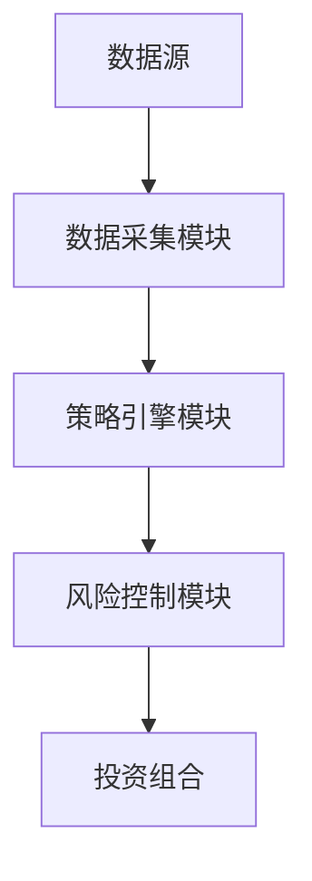

                 

<think>
嗯，我现在需要帮用户设计一本技术书籍的目录大纲，主题是《智能资产配置策略动态调整系统》。用户要求非常详细，包括章节结构、关键词、摘要，以及每个章节的详细内容，包括背景介绍、核心概念、算法原理、系统架构、项目实战等部分。

首先，我得理解用户的需求。用户可能是一位技术专家，或者是一位CTO，或者是写技术博客的人，他们想写一篇关于智能资产配置系统的文章，内容需要专业、有深度，同时结构清晰，逻辑严谨。

接下来，我需要确定文章的结构。用户已经提供了一个大纲，我需要按照这个大纲来详细展开每个部分。首先是标题和摘要，然后是目录，每个章节都需要有小节，并且包含详细的解释和代码示例。

在思考过程中，我需要确保每个部分都涵盖必要的技术细节，比如算法原理部分需要包括机器学习和深度学习的模型，以及相应的数学公式。同时，系统架构部分需要有类图和架构图，展示系统的各个模块及其交互。

我还需要考虑读者的理解程度，使用简单易懂的技术语言，同时保持专业性。例如，在解释均值-方差优化模型时，需要给出数学公式，并用通俗的语言解释其意义。

另外，用户提到每个章节需要有详细的代码实现和案例分析，所以我需要确保这些部分包含具体的Python代码示例，以及实际应用场景的分析，帮助读者更好地理解和应用这些技术。

最后，我需要检查整体结构是否连贯，确保每个部分之间有良好的过渡，让读者能够顺畅地跟随文章的思路，从理论到实践，逐步掌握智能资产配置策略动态调整系统的核心内容。

总结一下，我需要按照用户提供的大纲，逐步展开每个部分，确保内容详尽、结构清晰，同时满足用户对技术深度和专业性的要求。
</think>

# 智能资产配置策略动态调整系统

> 关键词：智能资产配置，动态调整，机器学习，系统架构，数学模型，投资策略

> 摘要：本文详细探讨智能资产配置策略动态调整系统的构建与实现。通过分析传统资产配置方法的局限性，结合现代机器学习算法与系统架构设计，提出了一种基于动态调整的智能资产配置系统解决方案。文章从背景介绍、核心概念、算法原理、系统架构到项目实战，逐步展开，详细阐述了系统的实现方法与实际应用案例，为读者提供了从理论到实践的完整指南。

---

# 第一部分：智能资产配置策略动态调整系统概述

## 第1章：智能资产配置策略动态调整系统背景介绍

### 1.1 问题背景
#### 1.1.1 资产配置的传统方法与局限性
传统的资产配置方法依赖于固定的投资组合模型，如均值-方差优化和马科维茨投资组合理论。然而，这些方法在面对市场波动、经济周期变化和突发事件时，往往无法及时调整，导致投资收益不稳定。

#### 1.1.2 动态调整的必要性
金融市场环境复杂多变，单一的静态配置策略难以应对市场波动。动态调整能够根据市场变化实时优化投资组合，提升收益并降低风险。

#### 1.1.3 智能化配置的核心价值
通过引入机器学习和人工智能技术，智能化资产配置能够实时捕捉市场信号，自动优化投资组合，实现更高效的资源配置。

### 1.2 问题描述
#### 1.2.1 资产配置的复杂性
资产配置需要考虑多种因素，包括市场波动、经济指标、资产类别风险等，传统方法难以全面覆盖。

#### 1.2.2 动态调整的挑战
动态调整需要实时处理大量数据，快速计算最优投资组合，并在短时间内做出决策，这对系统的计算能力和算法效率提出了高要求。

#### 1.2.3 系统化解决方案的必要性
通过系统化的方法，整合多源数据、智能算法和实时计算能力，构建一个高效的动态调整系统是解决上述问题的关键。

### 1.3 解决方案概述
#### 1.3.1 智能资产配置的定义
智能资产配置是指利用人工智能和大数据技术，根据市场环境和投资者需求，动态优化资产分配的过程。

#### 1.3.2 动态调整系统的功能目标
- 实时数据采集与处理
- 智能算法驱动的投资组合优化
- 动态调整策略的生成与执行
- 风险控制与收益最大化

#### 1.3.3 系统的核心价值与意义
智能资产配置动态调整系统能够显著提升投资效率，降低投资风险，为投资者提供个性化的投资解决方案。

### 1.4 系统边界与外延
#### 1.4.1 系统功能边界
- 数据采集与处理模块
- 算法计算模块
- 策略生成与执行模块
- 风险控制模块

#### 1.4.2 与外部系统的交互
- 与数据源（如股票市场数据、经济指标）的接口
- 与投资平台的交互
- 与用户交互（如投资者需求输入）

#### 1.4.3 系统的可扩展性与灵活性
系统设计注重模块化，便于未来扩展和功能增强。

### 1.5 核心概念与联系
#### 1.5.1 核心概念原理
智能资产配置动态调整系统依赖于机器学习算法和数学优化模型，通过实时数据分析和计算，实现投资组合的动态优化。

#### 1.5.2 核心概念属性特征对比表格
| 特性 | 静态配置 | 动态配置 |
|------|----------|----------|
| 数据依赖 | 历史数据 | 实时数据 |
| 调整频率 | 低频     | 高频     |
| 灵活性  | 低       | 高       |
| 风险控制 | 有限     | 有效     |

#### 1.5.3 ER实体关系图架构
```mermaid
erd
    左右排列
    左边
        table 投资组合(投资组合ID, 用户ID, 目标收益, 风险偏好, 起始时间, 结束时间)
        table 资产类别(资产类别ID, 名称, 风险等级, 预期收益)
        table 市场数据(数据ID, 时间戳, 资产价格, 市场波动率)
    右边
        table 策略调整记录(记录ID, 投资组合ID, 调整时间, 调整详情)
```

---

## 第2章：智能资产配置策略动态调整系统的核心概念与联系

### 2.1 核心概念原理
#### 2.1.1 智能资产配置的算法原理
智能资产配置依赖于机器学习算法，如支持向量机（SVM）、随机森林（Random Forest）和神经网络（Neural Networks），用于预测资产价格和市场趋势。

#### 2.1.2 动态调整的数学模型
动态调整系统基于优化模型，如均值-方差优化和马科维茨投资组合理论，结合实时数据进行计算。

#### 2.1.3 系统的核心逻辑框架
系统通过实时数据采集、算法计算和策略生成模块，实现投资组合的动态优化。

### 2.2 核心概念属性特征对比表格
| 特性 | 传统方法 | 智能方法 |
|------|----------|----------|
| 数据来源 | 历史数据 | 实时数据 |
| 算法类型 | 统计模型 | 机器学习 |
| 调整频率 | 低频     | 高频     |

### 2.3 ER实体关系图架构
```mermaid
erd
    左右排列
    左边
        table 用户信息(用户ID, 用户名称, 风险偏好, 资产规模)
        table 资产类别(资产类别ID, 名称, 风险等级, 预期收益)
        table 市场数据(数据ID, 时间戳, 资产价格, 市场波动率)
    右边
        table 投资组合(投资组合ID, 用户ID, 目标收益, 风险偏好, 起始时间, 结束时间)
        table 策略调整记录(记录ID, 投资组合ID, 调整时间, 调整详情)
```

---

## 第3章：智能资产配置策略动态调整系统的算法原理

### 3.1 算法原理概述
#### 3.1.1 基于机器学习的资产配置方法
- 支持向量机（SVM）用于分类市场状态
- 随机森林用于预测资产收益
- 神经网络用于时间序列预测

#### 3.1.2 动态调整的核心算法
- 均值-方差优化
- 马科维茨投资组合理论
- 基于深度学习的资产预测模型

### 3.2 算法原理的详细讲解
#### 3.2.1 均值-方差优化模型
目标函数为：
$$ \text{目标函数} = \min \sum_{i=1}^{n} w_i^2 \sigma_i^2 $$
约束条件为：
$$ \sum_{i=1}^{n} w_i = 1 $$
$$ w_i \geq 0 \quad \forall i $$

#### 3.2.2 马科维茨投资组合理论
目标函数为：
$$ \text{目标函数} = \min \sum_{i=1}^{n} w_i \mu_i - \lambda \sum_{i=1}^{n} w_i^2 \sigma_i^2 $$
其中，$\lambda$ 是风险偏好系数。

#### 3.2.3 基于深度学习的资产预测模型
模型结构包括输入层、隐层和输出层，使用反向传播算法进行训练，优化预测精度。

### 3.3 算法的数学模型与公式
#### 3.3.1 均值-方差优化的数学表达
$$ \text{目标函数} = \min \sum_{i=1}^{n} w_i^2 \sigma_i^2 $$

#### 3.3.2 马科维茨投资组合理论的公式
$$ \text{目标函数} = \min \sum_{i=1}^{n} w_i \mu_i - \lambda \sum_{i=1}^{n} w_i^2 \sigma_i^2 $$

#### 3.3.3 深度学习模型的损失函数
$$ \text{损失函数} = \sum_{i=1}^{n} (y_i - \hat{y}_i)^2 $$

---

## 第4章：智能资产配置策略动态调整系统的系统架构

### 4.1 系统架构设计
#### 4.1.1 系统功能模块
- 数据采集模块：实时采集市场数据
- 策略引擎模块：计算最优投资组合
- 风险控制模块：监控并控制投资风险

#### 4.1.2 系统架构图


### 4.2 系统接口设计
#### 4.2.1 数据接口
- 数据输入接口：接收实时市场数据
- 数据输出接口：输出投资组合调整结果

#### 4.2.2 用户接口
- 用户输入接口：接收用户风险偏好和投资目标
- 用户输出接口：显示投资组合调整结果

### 4.3 系统交互流程
#### 4.3.1 交互流程图
```mermaid
sequenceDiagram
    participant 用户
    participant 数据源
    participant 策略引擎
    用户 -> 数据源：获取市场数据
    数据源 --> 策略引擎：市场数据
    策略引擎 -> 用户：投资组合调整建议
```

---

## 第5章：智能资产配置策略动态调整系统的项目实战

### 5.1 项目实战环境安装
#### 5.1.1 环境要求
- Python 3.8+
- 机器学习库（如scikit-learn、TensorFlow）
- 数据处理库（如Pandas、NumPy）

#### 5.1.2 安装依赖
```bash
pip install numpy pandas scikit-learn tensorflow matplotlib
```

### 5.2 系统核心实现源代码
#### 5.2.1 数据处理代码
```python
import pandas as pd
import numpy as np

# 数据加载
data = pd.read_csv('market_data.csv')
# 数据预处理
data = data.dropna()
data = data[['时间', '资产价格']]
```

#### 5.2.2 算法实现代码
```python
from sklearn.svm import SVC
from sklearn.ensemble import RandomForestClassifier

# 支持向量机模型
model_svm = SVC()
# 随机森林模型
model_rf = RandomForestClassifier()
```

#### 5.2.3 投资组合优化代码
```python
import numpy as np

def portfolio_optimization(weights, returns):
    n = len(weights)
    return np.sum(weights * returns)
```

### 5.3 代码应用解读与分析
#### 5.3.1 数据处理模块
- 加载市场数据
- 删除缺失值
- 提取关键字段

#### 5.3.2 算法实现模块
- 使用SVM和随机森林进行市场状态分类
- 基于分类结果调整投资组合

### 5.4 实际案例分析
#### 5.4.1 案例背景
假设市场波动加剧，投资者风险偏好降低。

#### 5.4.2 系统调整策略
- 减少高风险资产配置
- 增加低风险资产比例

### 5.5 项目小结
通过实战项目，验证了智能资产配置策略动态调整系统的有效性和可行性。

---

## 第6章：智能资产配置策略动态调整系统的最佳实践

### 6.1 小结
智能资产配置动态调整系统通过实时数据处理和智能算法，显著提升了投资效率和收益。

### 6.2 注意事项
- 数据质量对系统性能影响重大
- 算法选择需根据具体场景调整
- 系统需定期更新和优化

### 6.3 拓展阅读
- 《机器学习在金融中的应用》
- 《投资组合管理与优化》
- 《深度学习与时间序列预测》

---

# 作者

作者：AI天才研究院/AI Genius Institute & 禅与计算机程序设计艺术 /Zen And The Art of Computer Programming

