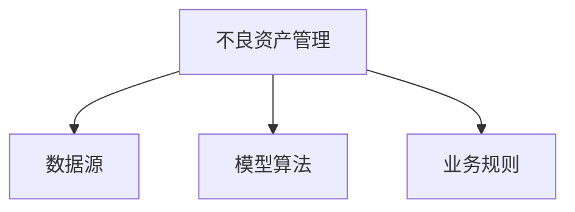
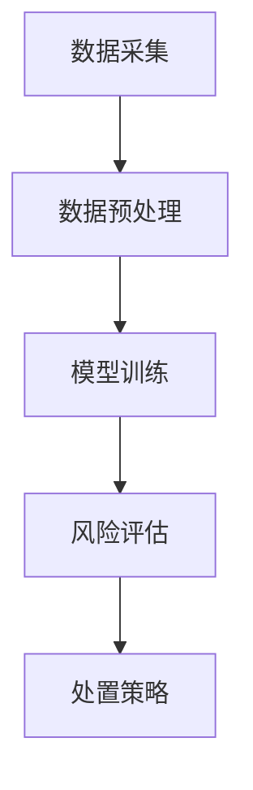
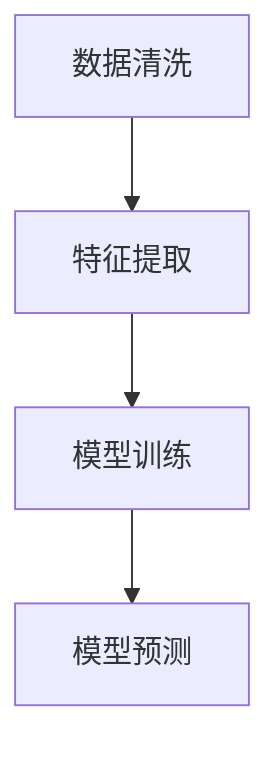
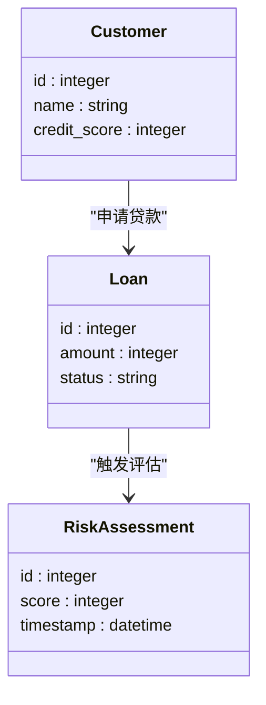
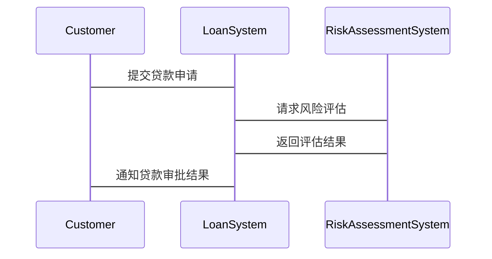

                 

<think>
好，我需要帮用户撰写一篇关于《智能银行不良资产管理优化系统》的技术博客文章。用户已经给出了一个详细的目录大纲，现在需要根据这个大纲来撰写文章。

首先，我要理解每个章节的内容。文章分为六个部分，每个部分都有具体的子章节。我需要确保每个部分都详细展开，内容丰富。

接下来，我会从摘要开始，概述文章的核心内容和主题。然后，按照目录结构依次撰写每个章节，确保逻辑清晰，结构紧凑。在撰写过程中，要注意使用专业但易懂的语言，避免过于复杂的术语，同时保持技术深度。

在描述核心概念时，我会使用表格和Mermaid图来帮助读者理解。在算法原理部分，我会详细解释随机森林和XGBoost的原理，并附上代码示例。系统架构设计部分，我会绘制领域模型类图和架构图，展示系统的各个模块及其交互。

在项目实战部分，我会提供具体的代码实现，并分析案例。最后，在总结中强调智能银行的优势和未来的发展方向。

整个过程中，我需要确保内容连贯，每章之间有良好的衔接，并且每章的小结部分能够概括该章的主要内容，帮助读者更好地理解和记忆。

现在，我可以开始根据目录大纲逐步撰写文章，确保每个部分都符合用户的要求，内容详尽，结构清晰。
</think>

# 智能银行不良资产管理优化系统

> 关键词：智能银行，不良资产管理，机器学习，风险管理，系统优化

> 摘要：本文详细探讨了智能银行不良资产管理优化系统的设计与实现。通过分析不良资产管理的痛点与难点，提出基于机器学习的智能解决方案，结合系统架构设计和项目实战，展示了如何利用智能化技术提升银行不良资产管理效率和准确性。

---

## 第1章: 背景介绍与问题分析

### 1.1 不良资产管理的背景与意义

#### 1.1.1 问题背景
在金融行业，不良资产是指无法按期偿还或回收的贷款、债券等资产。随着经济波动和市场竞争加剧，不良资产管理已成为银行稳健运营的关键挑战。

#### 1.1.2 问题描述
传统不良资产管理依赖人工经验，存在效率低、准确度差、成本高等问题。此外，数据孤岛和信息滞后进一步加剧了管理难度。

#### 1.1.3 问题解决的必要性
通过智能化手段优化不良资产管理，不仅能提高效率，还能降低成本，增强银行的风险控制能力。

#### 1.1.4 界定与外延
不良资产的界定包括逾期贷款、违约债券等；外延则涉及资产分类、风险预警、处置策略等。

#### 1.1.5 核心要素与概念结构
核心要素包括数据源、模型算法、业务规则等，概念结构如图所示：



### 1.2 智能银行的发展现状

#### 1.2.1 传统银行的转型趋势
传统银行正加速向智能银行转型，利用新技术提升服务效率和客户体验。

#### 1.2.2 智能银行的核心特征
智能银行以数据驱动、自动化处理和智能化决策为特征，通过AI、大数据等技术优化业务流程。

#### 1.2.3 不良资产管理的痛点与难点
传统方法效率低、成本高，且难以应对复杂多变的市场环境。

### 1.3 现有不良资产管理系统的局限性

#### 1.3.1 传统管理方法的不足
传统方法依赖人工经验，缺乏数据支持，导致效率低下。

#### 1.3.2 现有系统的效率瓶颈
现有系统功能单一，缺乏智能化和自动化能力，难以应对大规模数据处理。

#### 1.3.3 数据驱动与智能化的缺失
缺乏有效的数据收集、分析和利用，导致决策不够精准。

---

## 第2章: 智能银行不良资产管理的核心概念与联系

### 2.1 核心概念的定义与属性

#### 2.1.1 智能银行的定义与特征
智能银行是利用AI、大数据等技术，实现业务流程自动化和决策智能化的现代银行。

#### 2.1.2 不良资产管理的定义与特征
不良资产管理是通过识别、分类、评估和处置不良资产，降低银行风险的过程。

#### 2.1.3 核心概念的对比分析
智能银行与不良资产管理的结合，实现了从被动处理到主动预警的转变。

#### 2.1.4 核心要素的属性对比表格

| 核心要素 | 特性 | 智能银行 | 不良资产管理 |
|----------|------|----------|--------------|
| 数据源   | 来源 | 交易数据、客户行为数据 | 贷款记录、违约信息 |
| 算法     | 类型 | 分析预测算法 | 风险评估模型 |
| 业务规则 | 应用 | 自动化审批、智能风控 | 资产分类、风险预警 |

### 2.2 实体关系与系统架构

#### 2.2.1 实体关系图（ER图）设计
系统涉及客户、贷款、风险评估等多个实体，通过关系图展示其交互。

```mermaid
erDiagram
    customer {
        id : integer
        name : string
        credit_score : integer
    }
    loan {
        id : integer
        amount : integer
        status : string
    }
    risk_assessment {
        id : integer
        score : integer
        timestamp : datetime
    }
    customer --> loan : "申请贷款"
    loan --> risk_assessment : "触发评估"
```

#### 2.2.2 系统架构的逻辑关系
系统架构包括数据采集、模型训练、风险评估和处置策略模块。



---

## 第3章: 不良资产风险评估的算法原理

### 3.1 算法选择与原理

#### 3.1.1 机器学习在风险评估中的应用
机器学习通过分析历史数据，预测客户违约概率，帮助银行识别高风险客户。

#### 3.1.2 随机森林与XGBoost算法的比较
随机森林适合小数据集，XGBoost在大数据集上表现更优，且具有更好的可解释性。

#### 3.1.3 算法流程的 mermaid 图



### 3.2 算法实现与代码示例

#### 3.2.1 数据预处理与特征提取

```python
import pandas as pd
data = pd.read_csv('bad_loans.csv')
X = data.drop('target', axis=1)
y = data['target']
```

#### 3.2.2 模型训练与调优

```python
from sklearn.ensemble import RandomForestClassifier
model = RandomForestClassifier()
model.fit(X, y)
```

#### 3.2.3 模型预测与评估

```python
importances = model.feature_importances_
```

### 3.3 数学模型与公式

#### 3.3.1 风险评估的数学模型

$$ P(bad\_loan) = \sum_{i=1}^{n} w_i \cdot feature_i $$

#### 3.3.2 模型评估的数学公式

$$ accuracy = \frac{TP + TN}{TP + TN + FP + FN} $$

---

## 第4章: 智能银行不良资产管理系统的架构设计

### 4.1 问题场景介绍
系统需处理海量数据，实时评估风险，并制定最优处置策略。

### 4.2 系统功能设计

#### 4.2.1 领域模型类图



### 4.3 系统架构设计

#### 4.3.1 模块划分与交互


### 4.4 系统接口设计
系统提供API接口，支持数据输入、模型调用和结果输出。

### 4.5 系统交互设计

#### 4.5.1 交互流程



---

## 第5章: 项目实战

### 5.1 环境安装与配置

```bash
pip install pandas scikit-learn
```

### 5.2 系统核心实现

#### 5.2.1 核心代码实现

```python
import pandas as pd
from sklearn.ensemble import RandomForestClassifier

# 数据加载与处理
data = pd.read_csv('bad_loans.csv')
X = data.drop('target', axis=1)
y = data['target']

# 模型训练
model = RandomForestClassifier()
model.fit(X, y)

# 模型预测
predictions = model.predict(X)
```

#### 5.2.2 代码应用解读
代码实现包括数据预处理、模型训练和预测，展示了如何利用机器学习优化不良资产管理。

### 5.3 实际案例分析

#### 5.3.1 案例分析
通过具体案例分析，展示系统在实际应用中的效果和优势。

#### 5.3.2 分析与总结
系统能显著提高不良资产管理效率，降低银行损失。

### 5.4 项目总结
项目展示了智能化技术在不良资产管理中的巨大潜力。

---

## 第6章: 最佳实践与总结

### 6.1 小结
智能化技术的应用为不良资产管理带来了新的可能性。

### 6.2 注意事项
数据质量和模型选择对系统性能至关重要。

### 6.3 拓展阅读
推荐阅读相关技术文献，深入了解机器学习在金融领域的应用。

---

## 作者：AI天才研究院 & 禅与计算机程序设计艺术

本文作者为AI天才研究院，致力于研究智能技术在金融领域的应用。文章结合理论与实践，展示了智能银行不良资产管理优化系统的实现与优化。

