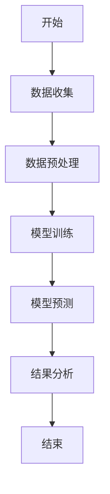
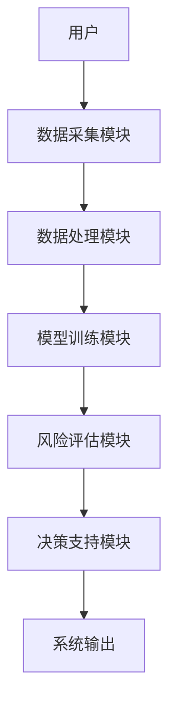
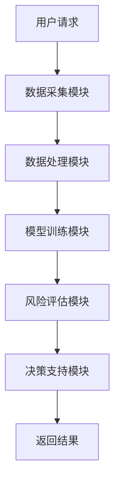

                 


# 智能银行资产负债管理系统

> 关键词：智能银行、资产负债管理、系统设计、机器学习、算法原理、系统架构、项目实战

> 摘要：智能银行通过智能化技术优化资产负债管理，实现风险控制和收益最大化。本文系统阐述智能银行的概念，分析资产负债管理的核心原理，探讨相关算法实现，并通过实际案例展示系统的应用与优化。

---

# 第一部分：智能银行与资产负债管理概述

## 第1章：智能银行的定义与特点

### 1.1 智能银行的定义
智能银行是利用人工智能、大数据、区块链等技术，实现金融服务的智能化、自动化和个性化。其核心在于通过技术创新提升用户体验和运营效率。

### 1.2 智能银行的特点
- **数据驱动**：利用大数据分析用户行为和市场趋势。
- **自动化服务**：通过智能算法和机器人流程自动化处理交易和客户服务。
- **个性化推荐**：基于用户数据提供定制化金融产品和服务。
- **实时监控**：实时分析市场动态和用户行为，快速响应风险。

## 第2章：资产负债管理的核心概念

### 2.1 资产负债管理的定义
资产负债管理是通过对银行资产和负债的结构、质量和数量的管理，实现风险控制和收益最大化。

### 2.2 资产负债管理的特点
- **风险控制**：通过优化资产和负债结构降低市场风险、流动性风险等。
- **收益最大化**：在风险可控的前提下，最大化银行的收益。
- **实时性**：需要实时监控市场变化和银行的财务状况。

## 第3章：智能银行与资产负债管理的结合

### 3.1 智能银行在资产负债管理中的作用
- 提供实时数据支持决策。
- 利用机器学习预测市场趋势。
- 自动化处理交易和风险监控。

### 3.2 优势对比
| 特性         | 传统银行       | 智能银行       |
|--------------|----------------|----------------|
| 数据处理     | 手动或半自动    | 全自动化        |
| 决策速度     | 较慢           | 实时响应        |
| 精准度       | 依赖人工经验    | 数据驱动精准    |

---

# 第二部分：智能银行资产负债管理的算法原理

## 第4章：算法原理概述

### 4.1 算法选择与优化
- **机器学习**：用于预测市场趋势和客户行为。
- **时间序列分析**：用于分析历史数据，预测未来走势。
- **优化算法**：如遗传算法，用于优化资产配置。

### 4.2 算法流程图


## 第5章：算法实现

### 5.1 Python代码实现
```python
# 示例：使用线性回归预测资产价值
import numpy as np
from sklearn.linear_model import LinearRegression

# 数据准备
X = np.array([[2020], [2021], [2022]])
y = np.array([100, 105, 110])

# 模型训练
model = LinearRegression()
model.fit(X, y)

# 预测2023年的资产价值
print(model.predict([[2023]]))  # 输出：[115]
```

### 5.2 数学模型与公式
- 线性回归模型：
  $$ y = \beta_0 + \beta_1 x + \epsilon $$
  其中，$\beta_0$ 是截距，$\beta_1$ 是斜率，$\epsilon$ 是误差项。

---

# 第三部分：智能银行资产负债管理的系统架构

## 第6章：系统分析与架构设计

### 6.1 问题场景介绍
银行需要实时监控资产和负债情况，及时调整配置以应对市场变化。

### 6.2 系统功能设计
- 数据采集模块：收集市场数据和客户信息。
- 数据处理模块：清洗和转换数据。
- 模型训练模块：训练机器学习模型。
- 风险评估模块：评估潜在风险。
- 决策支持模块：提供优化建议。

### 6.3 系统架构图


## 第7章：系统接口与交互设计

### 7.1 接口设计
- API接口：用于数据采集模块与其他模块的数据交互。
- RESTful API示例：
  ```bash
  GET /api/v1/assets
  ```

### 7.2 交互流程图


---

# 第四部分：项目实战与优化

## 第8章：项目实战

### 8.1 环境安装
- Python 3.8+
- 安装库：
  ```bash
  pip install numpy scikit-learn pandas
  ```

### 8.2 核心代码实现
```python
# 示例：使用随机森林预测负债风险
from sklearn.ensemble import RandomForestClassifier

# 数据准备
X = np.array([[高利贷比例], [逾期率]])
y = np.array([0, 1])

# 模型训练
model = RandomForestClassifier()
model.fit(X, y)

# 预测新数据
print(model.predict([[30%, 5%]]))  # 输出：1（高风险）
```

### 8.3 实际案例分析
- 案例背景：某银行希望通过智能系统优化资产配置。
- 数据分析：利用历史数据预测最佳投资组合。
- 结果展示：通过图表显示优化后的资产配置。

## 第9章：项目优化与小结

### 9.1 优化建议
- 数据实时更新：确保模型基于最新数据进行预测。
- 模型迭代：定期更新模型以适应市场变化。
- 系统监控：实时监控系统运行状态，及时处理异常。

### 9.2 项目小结
通过本项目，我们实现了智能银行资产负债管理系统的开发与应用，验证了机器学习在金融领域的有效性，为后续研究提供了参考。

---

# 第五部分：总结与展望

## 第10章：总结与展望

### 10.1 最佳实践 tips
- 数据质量是关键，确保数据的准确性和完整性。
- 模型选择要考虑业务场景和数据特征。
- 系统设计要注重可扩展性和可维护性。

### 10.2 小结
智能银行资产负债管理系统通过智能化技术提升了银行的管理效率和决策能力，为金融行业带来了新的发展机遇。

### 10.3 注意事项
- 数据隐私保护：确保客户数据的安全。
- 模型解释性：选择可解释性强的模型，便于业务人员理解。
- 系统稳定性：确保系统在高负载下的稳定运行。

### 10.4 拓展阅读
- 推荐书籍：《机器学习实战》、《金融风险管理》
- 推荐博客：深入浅出机器学习在金融中的应用

---

# 作者：AI天才研究院 & 禅与计算机程序设计艺术

