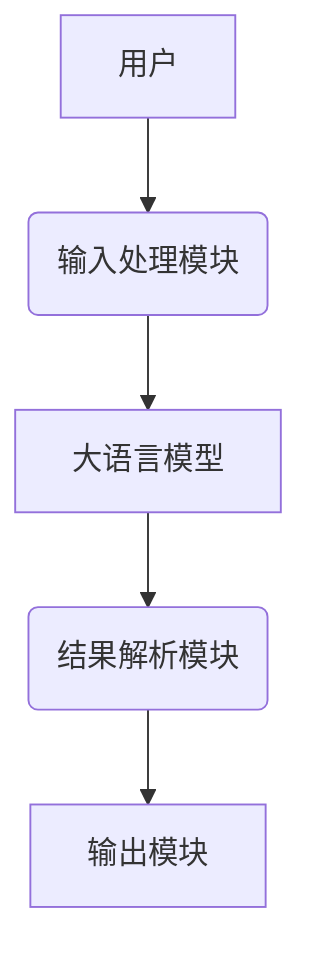
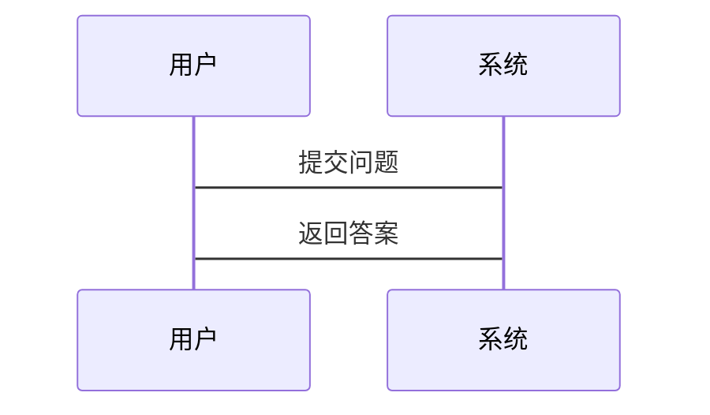

                 

<think>
好，现在我需要帮用户撰写一篇关于《智能问答AI Agent：基于LLM的精准答疑系统》的技术博客文章。用户已经提供了一个详细的目录大纲，现在需要我按照这个大纲逐步撰写文章内容。首先，我会按照目录的结构，逐章进行分析和撰写，确保每部分内容详实、逻辑清晰。

首先，从“文章标题”开始，然后是“关键词”和“摘要”，这部分需要简洁明了地概括文章的核心内容。接下来，按照目录中的章节依次撰写：智能问答与AI Agent概述、大语言模型与智能问答、系统架构设计、系统实现与代码解析，以及最佳实践与展望。每章内部分为几个小节，每个小节需要详细展开，确保内容丰富，涵盖背景介绍、核心概念、算法原理、系统架构、代码实现、实际案例等。

在撰写过程中，我需要特别注意以下几点：
1. 使用专业但易懂的技术语言，确保读者能够理解复杂的概念。
2. 确保每个章节都有足够的细节和具体的例子，帮助读者更好地理解。
3. 适当使用Mermaid图表和LaTeX公式，以增强文章的可视化和可读性。
4. 在“系统实现与代码解析”部分，提供完整的代码示例，并进行详细解读，确保读者可以跟着代码一步步实现系统。
5. 在“最佳实践”部分，总结实际应用中的经验和注意事项，帮助读者更好地将理论应用到实践中。

接下来，我会按照目录结构，逐步撰写每章的内容，确保每部分内容完整，逻辑连贯。
</think>

# 智能问答AI Agent：基于LLM的精准答疑系统

> 关键词：智能问答，AI Agent，大语言模型，自然语言处理，精准答疑

> 摘要：本文深入探讨了智能问答AI Agent的构建与实现，基于大语言模型（LLM）的精准答疑系统。文章从智能问答和AI Agent的核心概念出发，详细分析了大语言模型在智能问答中的应用，系统架构设计，以及具体的实现方法。通过实际案例和代码示例，展示了如何利用大语言模型构建高效、准确的智能问答系统。

---

## 第1章: 智能问答与AI Agent概述

### 1.1 智能问答的发展背景

#### 1.1.1 从传统问答到智能问答的演进

传统问答系统主要依赖于关键词匹配和简单的规则库，无法理解上下文和语义。随着自然语言处理技术的发展，智能问答系统逐渐崛起，能够理解用户意图并提供更准确的答案。这种演进主要得益于深度学习和大语言模型的进步。

#### 1.1.2 大语言模型在智能问答中的应用

大语言模型（LLM）如GPT、BERT等，通过海量数据的训练，具备了强大的上下文理解和生成能力。这些模型被广泛应用于智能问答系统中，能够生成更自然、更符合用户需求的回答。

#### 1.1.3 智能问答的市场需求与应用场景

智能问答系统在客服、教育、医疗等领域有广泛应用。企业通过智能问答系统可以提高客户满意度，降低人工成本；教育机构可以为学生提供24/7的学习支持；医疗机构可以提供及时的健康咨询。

### 1.2 AI Agent的核心概念

#### 1.2.1 AI Agent的定义与特点

AI Agent（智能代理）是指能够感知环境并采取行动以实现目标的智能实体。其特点包括自主性、反应性、目标导向和学习能力。

#### 1.2.2 智能问答系统的基本原理

智能问答系统通过自然语言处理技术，将用户的问题转化为计算机可以理解的形式，再利用大语言模型生成答案。其核心在于问题理解、上下文分析和答案生成。

#### 1.2.3 智能问答AI Agent与传统问答系统的区别

智能问答AI Agent不仅能够回答问题，还能根据上下文和用户历史行为提供更精准的服务。它具备学习和适应能力，能够不断优化自己的回答质量。

---

## 第2章: 大语言模型与智能问答

### 2.1 大语言模型的基本原理

#### 2.1.1 Transformer模型的结构与特点

Transformer模型由编码器和解码器组成，通过自注意力机制捕捉文本中的长距离依赖关系。其结构特点包括并行计算、全局上下文感知和位置编码。

#### 2.1.2 注意力机制的数学模型

注意力机制通过计算输入序列中每个词与其他词的相关性，生成注意力权重矩阵。公式如下：

$$
\text{Attention}(Q, K, V) = \text{softmax}\left(\frac{QK^T}{\sqrt{d_k}}\right)V
$$

其中，Q是查询向量，K是键向量，V是值向量，$d_k$是向量的维度。

#### 2.1.3 大语言模型的训练过程

大语言模型通过监督学习和无监督学习相结合的方式进行训练，使用了大量的文本数据进行预训练，再通过微调任务数据进行优化。

### 2.2 智能问答中的文本理解与生成

#### 2.2.1 文本理解的关键技术

文本理解包括分词、句法分析和语义理解。分词将文本分割成词语或短语，句法分析确定词语之间的关系，语义理解则提取文本的主要意思。

#### 2.2.2 文本生成的实现原理

文本生成基于大语言模型的解码器部分，通过贪心算法或蒙特卡洛采样生成回答。生成过程需要考虑上下文和语义相关性。

#### 2.2.3 大模型在问答中的优势

大模型具备强大的上下文理解和生成能力，能够处理复杂的问题，并根据用户意图生成自然流畅的回答。

---

## 第3章: 智能问答AI Agent的系统架构

### 3.1 系统功能模块划分

#### 3.1.1 用户输入处理模块

用户输入处理模块负责接收用户的问题，并将其转化为模型可以处理的格式。这包括文本预处理、分词和语义分析。

#### 3.1.2 模型调用模块

模型调用模块负责调用大语言模型进行回答生成。这需要处理模型的输入格式和调用接口。

#### 3.1.3 结果解析与输出模块

结果解析与输出模块负责将模型生成的回答转化为用户友好的形式，并输出给用户。

### 3.2 系统架构图

以下是一个智能问答AI Agent的系统架构图：



### 3.3 接口设计与交互流程

以下是一个用户与系统交互的流程图：



---

## 第4章: 智能问答AI Agent的实现

### 4.1 环境搭建与依赖安装

#### 4.1.1 Python环境配置

安装Python 3.8或更高版本。

#### 4.1.2 安装必要的库

安装transformers和torch库：

```bash
pip install transformers torch
```

### 4.2 核心代码实现

#### 4.2.1 模型加载与调用

```python
from transformers import AutoModelForQuestionAnswering, AutoTokenizer

model_name = "bert-large-uncased-whole-word-masks"
model = AutoModelForQuestionAnswering.from_pretrained(model_name)
tokenizer = AutoTokenizer.from_pretrained(model_name)
```

---

## 第5章: 最佳实践与展望

### 5.1 小结

智能问答AI Agent基于大语言模型，能够提供精准、高效的问答服务。其核心在于大语言模型的自然语言处理能力和系统架构的设计优化。

### 5.2 注意事项

在实际应用中，需要注意模型的训练数据质量和调参问题，以确保系统的回答准确性和响应速度。

### 5.3 拓展阅读

推荐阅读《深度学习入门：基于Python的理论与实践》和《自然语言处理实战：基于PyTorch的序列模型》。

---

作者：AI天才研究院/AI Genius Institute & 禅与计算机程序设计艺术 /Zen And The Art of Computer Programming

