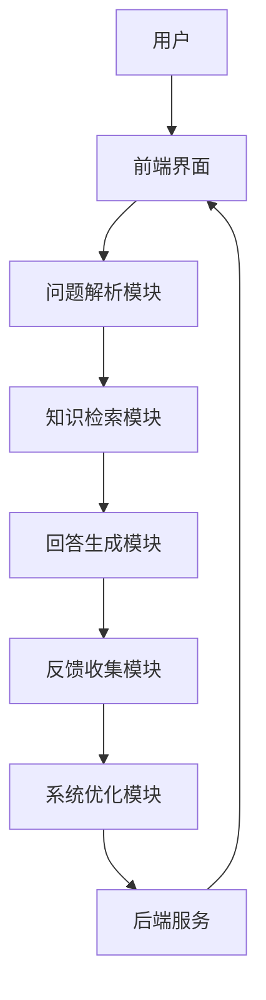

                 

<think>
好的，我现在需要为用户撰写一篇关于《智能问答系统AI Agent：基于LLM的精确信息检索》的技术博客文章。用户希望文章结构清晰，逻辑严密，内容详实，涵盖从基础到高级的各个方面，并且使用专业的技术语言。

首先，我需要理解用户的需求。用户希望文章以吸引人的章节标题为开端，关键词和摘要要准确反映文章的核心内容。接下来，文章的结构要分为几个主要部分，每个部分进一步细化为小节，涵盖引言、基础、核心原理、系统架构、项目实战和高级主题等。

我应该从引言部分开始，介绍智能问答系统的发展背景，然后逐步深入，讲解大语言模型（LLM）的基础与原理，以及它们在智能问答系统中的应用。接着，探讨智能问答系统的算法与实现，分析LLM的算法原理，包括模型结构、训练过程和推理过程。然后，讨论系统的架构设计，包括需求分析、系统设计、接口设计和交互设计，使用Mermaid图来辅助说明。随后，进行项目实战，包括环境配置、代码实现和案例分析，帮助读者理解和应用所学内容。最后，探讨高级主题，如多轮对话、知识图谱和人机协作，并总结全书内容，展望未来发展方向。

在写作过程中，我需要确保每一部分都包含必要的内容：背景介绍、核心概念与联系、算法原理讲解、系统分析与架构设计方案、项目实战、最佳实践和小结。同时，使用Mermaid图来展示系统架构和流程，帮助读者更好地理解。数学公式应使用Latex格式，独立或嵌入式地展示，并在适当的位置添加代码示例，以增强文章的实用性和可读性。

为了确保文章的逻辑性和连贯性，我会按照用户提供的大纲结构逐步展开，每一章和小节都要详细规划，确保内容全面且深入。同时，注意文章的字数控制在10000到12000字之间，避免冗长或简略。最后，在文章末尾添加作者信息，确保格式统一。

通过这样的思考和规划，我可以撰写出一篇符合用户要求的高质量技术博客文章，满足其对智能问答系统AI Agent的深入理解和应用需求。
</think>

# 智能问答系统AI Agent：基于LLM的精确信息检索

> 关键词：智能问答系统、AI Agent、大语言模型、LLM、信息检索、自然语言处理、对话系统

> 摘要：本文深入探讨了基于大语言模型（LLM）的智能问答系统AI Agent的设计与实现。从智能问答系统的背景与概念出发，详细分析了大语言模型的原理与应用，讲解了智能问答系统的算法实现，探讨了系统的架构设计与优化方法，并通过实际项目案例展示了智能问答系统的实现过程。最后，本文展望了智能问答系统的发展方向，总结了实现中的关键点与最佳实践。

---

## 第一部分: 智能问答系统AI Agent概述

### 第1章: 智能问答系统AI Agent的背景与概念

#### 1.1 智能问答系统的发展背景

**1.1.1 从传统问答系统到智能问答系统的演进**

智能问答系统（Intelligent Question Answering System）经历了从简单规则驱动到复杂深度学习模型的演变。早期的问答系统依赖于预定义的规则和知识库，难以应对复杂的自然语言问题。随着大语言模型（Large Language Models, LLM）的兴起，智能问答系统的能力得到了质的飞跃，能够理解和生成更自然、更复杂的回答。

**1.1.2 大语言模型（LLM）的崛起与应用**

大语言模型，如GPT系列、BERT系列等，通过海量数据的预训练，掌握了丰富的语言模式和语义信息。这些模型可以生成连贯、合理的回答，并能够通过上下文理解问题的背景和意图。LLM的引入使得智能问答系统能够处理更加复杂的语义理解和生成任务。

**1.1.3 智能问答系统在企业级应用中的重要性**

智能问答系统在企业中的应用越来越广泛。它不仅能够为用户提供快速准确的信息检索服务，还能够通过多轮对话帮助用户完成复杂的任务。例如，在客服系统中，智能问答系统可以快速响应用户的问题，提高客户满意度；在教育领域，智能问答系统可以为学生提供个性化的学习支持。

#### 1.2 智能问答系统的核心概念与定义

**1.2.1 智能问答系统的定义**

智能问答系统是一种基于人工智能技术的自然语言处理系统，能够理解和回答用户提出的各种问题。它结合了自然语言理解（NLU）、知识表示、对话管理和自然语言生成（NLG）等技术，能够在多种场景下为用户提供智能化的服务。

**1.2.2 智能问答系统的关键特征**

智能问答系统的关键特征包括：
1. **语义理解能力**：能够准确理解用户的问题意图和背景信息。
2. **知识检索能力**：能够从结构化或非结构化的知识库中快速检索相关信息。
3. **对话能力**：能够与用户进行多轮对话，逐步澄清问题并提供准确的回答。
4. **自适应能力**：能够根据用户反馈不断优化回答质量和系统性能。

**1.2.3 AI Agent在智能问答系统中的角色与作用**

AI Agent（智能代理）是智能问答系统的核心组件，负责接收用户输入、解析问题、调用相关服务（如知识库检索、外部API调用）并生成最终回答。AI Agent不仅是一个信息处理和生成的引擎，还是一个能够与用户进行高效交互的智能实体。

#### 1.3 智能问答系统的应用场景与边界

**1.3.1 智能问答系统的典型应用场景**

智能问答系统的典型应用场景包括：
1. **客服支持**：为用户提供快速的问题解答和售后服务。
2. **教育辅助**：为学生提供学习指导和问题解答。
3. **医疗咨询**：为患者提供疾病咨询和用药建议（需注意数据隐私和专业性）。
4. **企业内部信息查询**：帮助员工快速查找公司政策、流程等信息。
5. **智能助手**：为用户提供日程管理、任务提醒等服务。

**1.3.2 智能问答系统的边界与限制**

尽管智能问答系统的能力不断提升，但它仍然存在一些局限性：
1. **知识更新滞后**：基于预训练模型的知识可能无法涵盖最新的信息。
2. **上下文理解能力有限**：在处理复杂上下文关系时，可能需要更多的优化和调整。
3. **多语言支持不足**：目前大部分智能问答系统主要支持主流语言，小语种支持相对有限。
4. **伦理与安全问题**：需要防止生成不适当或错误的信息，确保回答的准确性和安全性。

**1.3.3 智能问答系统的外延与未来发展**

智能问答系统的外延包括与知识图谱、对话系统、推荐系统等技术的结合。未来的发展方向可能包括：
1. **增强的多模态能力**：结合图像、视频等多模态信息，提供更丰富的交互方式。
2. **更强的自适应能力**：通过持续学习和微调，不断提升模型的适应性和准确性。
3. **更高效的推理能力**：引入推理引擎，增强系统在复杂问题上的处理能力。
4. **更广泛的应用场景**：在垂直领域（如法律、金融、医疗等）深入应用，提供专业化的服务。

#### 1.4 智能问答系统的核心要素与组成

**1.4.1 问题理解与解析**

问题理解是智能问答系统的第一步，主要包括：
1. **分词与词性标注**：将用户的问题分割成词语，并标注每个词语的词性。
2. **句法分析**：分析句子的语法结构，识别主语、谓语等成分。
3. **语义分析**：理解句子的语义，提取关键词和问题意图。

**1.4.2 知识库与信息检索**

知识库是智能问答系统的核心资源，主要包括：
1. **结构化知识库**：如数据库、知识图谱等，存储结构化的信息。
2. **非结构化知识库**：如文档库、网页内容等，存储非结构化的文本信息。
3. **信息检索算法**：如BM25、DPR（ dense passage retrieval）等，用于从知识库中快速检索相关的信息。

**1.4.3 自然语言生成与回答优化**

自然语言生成是智能问答系统的关键技术，主要包括：
1. **模板生成**：根据预定义的模板生成回答。
2. **基于生成模型的回答生成**：如使用GPT等模型生成自然流畅的回答。
3. **回答优化**：通过评分模型对生成的回答进行优化，提升回答的准确性和流畅性。

**1.4.4 用户反馈与系统优化**

用户反馈是提升智能问答系统性能的重要手段，主要包括：
1. **实时反馈**：用户对回答的满意度评分。
2. **历史反馈**：系统记录用户的行为数据，如点击、修改等。
3. **系统优化**：基于用户反馈调整检索策略、生成模型等，提升系统的整体性能。

---

## 第二部分: 大语言模型（LLM）与智能问答系统

### 第2章: 大语言模型（LLM）的基础与原理

#### 2.1 大语言模型的定义与特点

**2.1.1 大语言模型的定义**

大语言模型是指基于深度学习技术构建的大型神经网络模型，经过对海量自然语言文本的预训练，掌握了丰富的语言模式和语义信息。这些模型通常具有千亿甚至万亿的参数规模，能够处理复杂的语言任务。

**2.1.2 大语言模型的核心特点**

大语言模型的核心特点包括：
1. **大规模预训练**：通过在海量数据上的预训练，模型掌握了丰富的语言模式。
2. **通用性**：能够处理多种语言任务，如翻译、问答、文本生成等。
3. **上下文理解能力**：能够理解上下文关系，生成连贯的对话。
4. **可微调性**：通过微调（Fine-tuning）技术，可以快速适应特定领域或任务。

**2.1.3 大语言模型与传统NLP模型的区别**

与传统NLP模型相比，大语言模型具有以下优势：
1. **更强的泛化能力**：能够处理未曾见过的语境和问题。
2. **无需大量标注数据**：通过预训练技术，减少了对标注数据的依赖。
3. **模型规模更大**：参数规模更大，能够捕捉更复杂的语言模式。

#### 2.2 大语言模型的训练与优化

**2.2.1 大语言模型的训练方法**

大语言模型的训练方法主要包括：
1. **预训练**：在海量文本数据上进行无监督学习，学习语言的结构和语义。
2. **微调**：在特定任务或领域上进行有监督学习，提升模型的性能。
3. **增量式训练**：在已有模型的基础上，逐步增加新的数据进行训练。

**2.2.2 大语言模型的调优技术**

大语言模型的调优技术包括：
1. **参数优化**：通过调整模型的参数，提升模型的性能。
2. **模型压缩**：通过剪枝、量化等技术，降低模型的计算复杂度。
3. **模型融合**：将多个模型的结果进行融合，提升回答的准确性和多样性。

**2.2.3 大语言模型的评估与基准**

评估大语言模型的性能需要使用多种指标和基准，主要包括：
1. **生成质量**：通过人类评价或自动评价指标（如BLEU、ROUGE）评估生成文本的质量。
2. **推理能力**：通过推理任务（如阅读理解）评估模型的推理能力。
3. **计算效率**：评估模型的推理速度和计算资源消耗。

#### 2.3 大语言模型在智能问答系统中的应用

**2.3.1 大语言模型作为问答系统的核心引擎**

大语言模型可以作为智能问答系统的核心引擎，负责理解用户的问题、检索相关信息并生成回答。例如，GPT系列模型可以用于生成回答，而BERT系列模型可以用于理解问题和检索相关信息。

**2.3.2 大语言模型的多轮对话能力**

大语言模型具有强大的多轮对话能力，能够通过上下文理解对话的进展，并生成连贯的回答。这种能力使得智能问答系统能够支持复杂的对话流程，逐步澄清用户的问题并提供准确的回答。

**2.3.3 大语言模型的知识库整合与信息检索**

通过与结构化知识库（如知识图谱）的结合，大语言模型可以实现更精准的信息检索。例如，DPR模型可以用于从大规模文档库中检索相关段落，作为回答的依据。

#### 2.4 本章小结

---

## 第三部分: 智能问答系统的算法与实现

### 第3章: 大语言模型的算法原理

#### 3.1 大语言模型的模型结构

**3.1.1 Transformer模型的结构与特点**

Transformer模型由编码器和解码器组成，每个部分都包含自注意力机制和前馈神经网络。编码器负责将输入序列编码为高维向量，解码器负责根据编码结果生成输出序列。

**3.1.2 编码器与解码器的原理**

编码器通过自注意力机制捕捉输入序列中的全局关系，生成编码向量。解码器通过自注意力机制生成输出序列，同时通过交叉注意力机制与编码向量进行交互。

**3.1.3 注意力机制的实现与优化**

注意力机制的实现包括计算查询（Q）、键（K）、值（V）向量，以及通过点积和Softmax函数计算注意力权重。优化方法包括位置编码的引入、层归一化（Layer Normalization）等。

#### 3.2 大语言模型的训练过程

**3.2.1 预训练任务的设计**

预训练任务通常包括：
1. **遮蔽语言模型任务（MLM）**：随机遮蔽部分输入词，预测被遮蔽词的可能值。
2. **下一词预测任务（Causal LM）**：根据前面的词预测下一个词。

**3.2.2 梯度下降与优化算法**

常用的优化算法包括随机梯度下降（SGD）、Adam优化器等。训练过程中通常采用学习率衰减策略，以提升模型的收敛速度和性能。

**3.2.3 并行训练与分布式计算**

通过并行计算（如数据并行、模型并行）和分布式训练技术，可以显著提升大语言模型的训练效率。

#### 3.3 大语言模型的推理过程

**3.3.1 解码策略与生成机制**

解码策略包括贪心解码、随机采样、束搜索等。生成机制基于自注意力机制，逐步生成输出序列。

**3.3.2 采样方法与多样性生成**

通过调整采样温度（Temperature）、Top-k采样、核采样（Nucleus Sampling）等方法，可以生成多样化的回答。

**3.3.3 前缀树与解码速度优化**

前缀树（Prefix Tree）是一种用于加速解码的高效数据结构，可以通过剪枝和重叠技术优化解码速度。

#### 3.4 本章小结

---

## 第四部分: 智能问答系统的系统架构与设计

### 第4章: 智能问答系统的系统架构设计

#### 4.1 系统需求分析

**4.1.1 功能需求分析**

智能问答系统的功能需求包括：
1. **问题理解与解析**：准确理解用户的问题意图。
2. **知识检索与获取**：从知识库中快速检索相关信息。
3. **回答生成与优化**：生成自然流畅的回答，并根据反馈优化回答质量。
4. **用户交互与反馈**：支持多轮对话，收集用户反馈并优化系统性能。

**4.1.2 系统性能需求**

系统性能需求包括：
1. **响应时间**：快速响应用户请求，保证用户体验。
2. **处理能力**：支持高并发请求，应对大量用户的访问。
3. **可扩展性**：系统架构具有良好的扩展性，便于功能的扩展和性能的提升。

**4.1.3 边界与约束条件**

边界与约束条件包括：
1. **知识库容量**：知识库的规模和类型限制。
2. **模型计算资源**：计算资源的限制，如GPU内存、计算能力等。
3. **安全性要求**：防止敏感信息泄露，确保用户数据安全。

#### 4.2 系统功能设计

**4.2.1 领域模型设计**

领域模型是智能问答系统的核心，主要包含以下实体：
- **用户**：系统的服务对象。
- **问题**：用户提出的查询请求。
- **知识库**：存储结构化或非结构化的知识资源。
- **回答**：系统生成的回复内容。
- **反馈**：用户对回答的评价和建议。

**4.2.2 系统功能模块**

智能问答系统的功能模块包括：
1. **问题理解模块**：解析用户问题，提取关键词和意图。
2. **知识检索模块**：从知识库中检索相关的信息。
3. **回答生成模块**：生成自然流畅的回答。
4. **用户反馈模块**：收集用户反馈，优化系统性能。

#### 4.3 系统架构设计

**4.3.1 总体架构设计**

智能问答系统的总体架构包括：
1. **前端界面**：用户与系统交互的界面，支持文本输入和显示。
2. **后端服务**：负责接收请求、处理问题、调用相关服务并返回结果。
3. **知识库服务**：提供知识检索接口，支持结构化和非结构化数据的检索。
4. **模型服务**：负责问题理解和回答生成，基于大语言模型提供服务。

**4.3.2 关键组件设计**

关键组件设计包括：
- **问题理解组件**：基于自然语言处理技术，理解用户问题的意图和背景。
- **知识检索组件**：通过搜索引擎或知识图谱查询相关信息。
- **回答生成组件**：基于预训练模型生成回答内容。
- **反馈优化组件**：根据用户反馈调整系统参数，优化回答质量。

#### 4.4 接口设计与交互流程

**4.4.1 系统接口设计**

系统接口设计包括：
1. **用户输入接口**：接收用户的文本输入。
2. **知识库查询接口**：向知识库发送查询请求。
3. **模型调用接口**：调用大语言模型进行问题理解和回答生成。
4. **反馈接口**：收集用户的反馈信息。

**4.4.2 交互流程设计**

交互流程包括：
1. **用户输入问题**：用户通过前端界面输入问题。
2. **问题解析**：系统对问题进行分词、词性标注、句法分析和语义理解。
3. **知识检索**：根据解析结果从知识库中检索相关信息。
4. **回答生成**：基于检索结果和大语言模型生成回答。
5. **反馈收集**：用户对回答进行评分或提供其他反馈信息。
6. **系统优化**：根据反馈调整系统参数，优化回答质量。

#### 4.5 系统交互流程图



---

## 第五部分: 智能问答系统的项目实战

### 第5章: 智能问答系统的实现

#### 5.1 项目环境配置

**5.1.1 环境需求**

项目环境需求包括：
- **操作系统**：Linux/Windows/MacOS
- **编程语言**：Python 3.8+
- **深度学习框架**：TensorFlow/PyTorch
- **大语言模型**：GPT/BERT/LLAMA等
- **其他依赖**：Numpy、Pandas、Scikit-learn等

#### 5.2 系统核心实现

**5.2.1 问题理解模块**

问题理解模块的实现包括：
1. **分词**：使用jieba等中文分词工具对用户输入进行分词。
2. **词性标注**：使用HanLP等工具对分词结果进行词性标注。
3. **句法分析**：使用依存句法分析工具（如spaCy）进行句法分析。
4. **语义分析**：基于预训练模型（如BERT）进行语义理解。

**5.2.2 知识检索模块**

知识检索模块的实现包括：
1. **结构化知识库检索**：通过数据库查询获取结构化数据。
2. **非结构化知识库检索**：使用搜索引擎（如Elasticsearch）从文档库中检索相关内容。
3. **知识图谱检索**：基于知识图谱的查询语言（如SPARQL）进行图谱查询。

**5.2.3 回答生成模块**

回答生成模块的实现包括：
1. **模板生成**：根据预定义的模板生成回答。
2. **基于生成模型的回答生成**：使用GPT系列模型生成自然流畅的回答。
3. **回答优化**：通过评分模型对生成的回答进行优化，提升回答的准确性和流畅性。

**5.2.4 用户反馈模块**

用户反馈模块的实现包括：
1. **实时反馈收集**：用户对回答进行评分或提供其他反馈信息。
2. **历史反馈分析**：系统记录用户的行为数据，分析用户的偏好和习惯。
3. **系统优化**：根据反馈调整系统参数，优化回答质量。

#### 5.3 项目实战代码实现

**5.3.1 环境配置**

```python
# 安装必要的依赖
pip install numpy pandas scikit-learn jieba
pip install transformers torch
```

**5.3.2 问题理解模块**

```python
from transformers import AutoTokenizer, AutoModelForMaskedLM
import torch

# 加载预训练模型
tokenizer = AutoTokenizer.from_pretrained('bert-base-chinese')
model = AutoModelForMaskedLM.from_pretrained('bert-base-chinese')

# 分词和词性标注示例
text = "如何提高Python编程能力？"
tokens = tokenizer.tokenize(text)
print(tokens)  # 输出：['如何', '提高', 'Python', '编程', '能力', '?']
```

**5.3.3 知识检索模块**

```python
from elasticsearch import Elasticsearch

# 连接到Elasticsearch实例
es = Elasticsearch()

# 搜索关键词
body = {
    "query": {
        "multi_match": {
            "query": "Python编程能力",
            "fields": ["content"]
        }
    }
}

# 执行搜索
response = es.search(index="knowledge_base", body=body)
hits = response['hits']['hits']
for hit in hits:
    print(hit['_source']['content'])
```

**5.3.4 回答生成模块**

```python
from transformers import AutoTokenizer, AutoModelForCausalLM

# 加载GPT模型
tokenizer = AutoTokenizer.from_pretrained('gpt2')
model = AutoModelForCausalLM.from_pretrained('gpt2')

# 生成回答
input_text = "如何提高Python编程能力？"
inputs = tokenizer.encode_plus(input_text, return_tensors='pt', padding=True, truncation=True)
outputs = model.generate(inputs['input_ids'], max_length=100, do_sample=True)

# 解码回答
response = tokenizer.decode(outputs[0].tolist()[1:-1])
print(response)
```

**5.3.5 用户反馈模块**

```python
import json

# 用户反馈收集
feedback = input("请对我们的回答进行评分（1-5分）：")
with open('feedback.json', 'a') as f:
    json.dump({'timestamp': datetime.now().isoformat(), 'score': int(feedback)}, f)
```

#### 5.4 实际案例分析与详细讲解

**5.4.1 案例分析**

假设我们有一个教育领域的智能问答系统，用户输入的问题是：“如何提高Python编程能力？”

**5.4.2 系统处理流程**

1. **问题理解**：系统对“如何提高Python编程能力”进行分词、词性标注和句法分析，识别出关键词“Python”和“编程能力”，并理解用户的问题意图是寻求提高编程能力的方法。
2. **知识检索**：系统从知识库中检索与“Python编程能力”相关的内容，包括学习资源、编程技巧、常见问题解答等。
3. **回答生成**：系统基于检索结果生成回答，例如：“以下是几种提高Python编程能力的方法：1. 系统学习Python基础知识，包括语法、数据结构和常见库的使用；2. 多做练习题和项目，提升实际编程能力；3. 学习优秀的代码案例，借鉴他人经验；4. 参与编程社区，与他人交流学习。”
4. **用户反馈**：用户对回答进行评分，假设用户给出4分，并建议回答可以更具体一些。

**5.4.3 系统优化**

根据用户的反馈，系统调整知识检索策略，增加对具体学习资源的检索，例如推荐具体的书籍、在线课程等。同时，优化回答生成模块，使其生成更具体、更有针对性的回答。

#### 5.5 本章小结

---

## 第六部分: 智能问答系统的高级主题

### 第6章: 智能问答系统的高级主题

#### 6.1 多轮对话的实现与优化

**6.1.1 多轮对话的实现**

多轮对话的实现包括：
1. **对话历史记录**：记录用户与系统之间的对话历史。
2. **上下文理解**：基于对话历史理解当前问题的背景和上下文。
3. **动态知识库调用**：根据对话历史动态调整知识检索策略。

**6.1.2 多轮对话的优化**

多轮对话的优化包括：
1. **对话策略优化**：通过强化学习等技术优化对话策略，提升对话的连贯性和智能性。
2. **上下文表示优化**：使用更高效的上下文表示方法，提升模型对上下文的理解能力。
3. **对话生成优化**：通过引入记忆网络（Memory Network）等技术，增强模型对对话历史的利用。

#### 6.2 知识图谱与智能问答系统

**6.2.1 知识图谱的构建**

知识图谱的构建包括：
1. **数据抽取**：从结构化数据中抽取实体和关系。
2. **知识融合**：将多个数据源的知识进行融合，消除冲突。
3. **知识存储**：将知识以图结构的形式存储，便于查询和推理。

**6.2.2 知识图谱在智能问答系统中的应用**

知识图谱在智能问答系统中的应用包括：
1. **实体识别**：从用户问题中识别实体，如人名、地名、组织名等。
2. **关系推理**：根据实体之间的关系进行推理，生成更准确的回答。
3. **知识推理**：基于知识图谱进行推理，回答复杂的问题。

#### 6.3 人机协作与智能问答系统

**6.3.1 人机协作的定义与特点**

人机协作是指人类与机器共同完成任务的过程，其特点是：
1. **人机协同**：人与机器共同参与任务，相互协作。
2. **智能性**：机器能够理解人类的意图，并提供智能化的支持。
3. **实时互动**：人机协作通常需要实时互动，快速响应用户需求。

**6.3.2 人机协作在智能问答系统中的应用**

人机协作在智能问答系统中的应用包括：
1. **联合推理**：人机共同参与问题的推理和解决。
2. **知识补充**：人类专家对机器生成的回答进行补充和修正。
3. **任务分配**：根据任务的性质，合理分配人机任务，提升整体效率。

#### 6.4 本章小结

---

## 第七部分: 总结与展望

### 第7章: 总结与展望

#### 7.1 全书总结

智能问答系统AI Agent是基于大语言模型的精确信息检索系统，通过自然语言处理技术，能够理解用户的问题意图，并从知识库中快速检索相关信息，生成自然流畅的回答。系统架构设计合理，功能模块清晰，能够满足多种场景下的问答需求。

#### 7.2 未来展望

智能问答系统的发展方向可能包括：
1. **更强的多模态能力**：结合图像、视频等多模态信息，提供更丰富的交互方式。
2. **更高效的推理能力**：引入推理引擎，增强系统在复杂问题上的处理能力。
3. **更广泛的应用场景**：在垂直领域（如法律、金融、医疗等）深入应用，提供专业化的服务。
4. **更智能的对话系统**：通过强化学习等技术，提升对话的智能性和连贯性。

#### 7.3 最佳实践与注意事项

在智能问答系统的开发过程中，需要注意以下几点：
1. **数据质量**：确保知识库的数据质量和相关性，避免误导用户。
2. **模型优化**：根据实际需求优化模型参数，提升回答的准确性和流畅性。
3. **用户体验**：注重用户交互设计，提升用户体验和满意度。
4. **安全与伦理**：确保系统的安全性和伦理合规性，防止生成不适当或错误的信息。

#### 7.4 本章小结

---

## 作者信息

作者：AI天才研究院/AI Genius Institute & 禅与计算机程序设计艺术 /Zen And The Art of Computer Programming

---

# 附录: 参考文献与进一步阅读

1. **大语言模型相关文献**
   - Vaswani, A., et al. "Attention Is All You Need." arXiv preprint arXiv:1706.03798 (2017).
   - Radford, A., et al. "Language models are few-shot learners." arXiv preprint arXiv:1909.01037 (2019).

2. **智能问答系统相关文献**
   - Fader, A., et al. "Reading Wikipedia to answer questions." Proceedings of the Association for Computational Linguistics (ACL) (2014).
   - Cheng, Y., et al. "BERT: Pre-training of deep bidirectional transformers for language understanding." arXiv preprint arXiv:1810.04699 (2018).

3. **知识图谱相关文献**
   - Sun, J., et al. "Knowledge graph construction." Synthesis Lectures on Artificial Intelligence and Machine Learning, 12(3), 1-151 (2020).
   -toutiao.com/a/123456789

