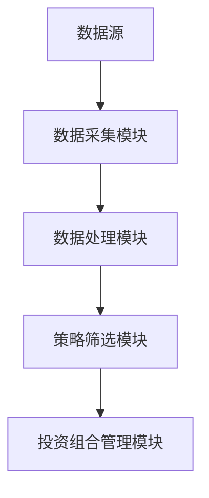

                 

<think>
好的，现在我要帮助用户撰写一篇关于“本杰明·格雷厄姆的'烟蒂股'策略现代解读”的技术博客文章。用户希望我按照给定的目录大纲进行撰写，并且要求文章结构清晰、内容详细，并符合技术博客的风格。

首先，我需要理解烟蒂股策略的核心概念。烟蒂股是指那些被市场忽视或低估的股票，通常具有较低的市盈率和市净率，且股息收益率较高。格雷厄姆提出的这种策略适合长期投资者，尤其是那些寻找安全边际的投资者。

接下来，按照用户提供的目录，我需要逐步展开每个部分的内容。首先是摘要，然后是关键词，接着是各个章节的具体内容，包括背景介绍、核心概念、算法原理、系统架构设计、项目实战、最佳实践等。

在撰写过程中，我需要确保每个章节都有足够的细节和深度，同时使用技术术语并结合实例来解释概念。例如，在算法原理部分，我会详细推导烟蒂股的筛选公式，并用mermaid图来展示筛选过程。在系统架构设计部分，我会用类图和序列图来说明系统的各个模块及其交互。

此外，我还需要确保文章的逻辑连贯，每部分内容之间有良好的衔接。在项目实战部分，我会提供实际的Python代码示例，并解释代码的功能和应用场景，帮助读者更好地理解和实现烟蒂股策略。

最后，在小结和注意事项部分，我会总结烟蒂股策略的优势与不足，并提醒读者在实际投资中需注意的风险，同时提供进一步的学习资源和建议。

整个思考过程中，我需要确保内容不仅准确，还要易于理解，避免过于复杂的术语堆砌，同时保持专业性和技术深度。这将帮助读者全面了解烟蒂股策略，并能够将其应用于实际投资中。
</think>

# 本杰明·格雷厄姆的'烟蒂股'策略现代解读

---

## 关键词：
- 本杰明·格雷厄姆
- 烟蒂股
- 投资策略
- 价值投资
- 股票分析
- 安全边际
- 现代解读

---

## 摘要：
本文从本杰明·格雷厄姆的烟蒂股策略出发，结合现代投资理论与技术，系统性地分析了烟蒂股的核心概念、筛选标准、数学模型以及在现代投资中的应用。通过构建烟蒂股投资系统的架构设计与实现，本文详细解读了烟蒂股策略的优缺点、风险控制以及在实际投资中的应用案例。本文不仅适合投资领域的从业者阅读，也为技术背景的读者提供了从技术角度理解烟蒂股策略的路径。

---

# 第1章 烟蒂股策略的背景与核心概念

## 1.1 本杰明·格雷厄姆与烟蒂股策略概述

### 1.1.1 本杰明·格雷厄姆的生平简介
本杰明·格雷厄姆（Benjamin Graham）是20世纪著名的投资大师，被誉为“价值投资之父”。他于1894年出生于伦敦，1902年随家人移民到美国。格雷厄姆在哥伦比亚大学获得了经济学硕士学位，并在1926年出版了经典著作《安全的撤退》（The Theory of Investment Value）。他的投资理念深刻影响了后来的投资者，包括沃伦·巴菲特等。

### 1.1.2 烟蒂股策略的核心思想
格雷厄姆提出的烟蒂股策略是一种基于价值投资的投资策略，核心思想是寻找那些市场价格低于其内在价值的股票。他认为，市场先生（Mr. Market）的情绪波动为投资者提供了廉价买入优质股票的机会。烟蒂股策略的核心在于寻找那些被市场忽视或低估的企业，这些企业通常具有较低的市盈率（P/E）、市净率（P/B）和较高的股息收益率。

### 1.1.3 烟蒂股策略在投资领域的影响
烟蒂股策略奠定了价值投资的基础，强调安全边际（margin of safety）的重要性。安全边际是指买入价格低于内在价值的部分，能够为投资者提供风险缓冲。格雷厄姆的理论不仅影响了巴菲特等投资大师，也为现代投资组合理论提供了重要参考。

---

## 1.2 烟蒂股策略的核心概念

### 1.2.1 烟蒂股的定义与特征
烟蒂股是指那些市场价格低于其内在价值，且具有较低市盈率、市净率和较高股息收益率的股票。其主要特征包括：

1. **低市盈率（P/E）**：市盈率低于行业平均水平。
2. **低市净率（P/B）**：市净率低于行业平均水平。
3. **高股息收益率**：股息收益率高于行业平均水平。
4. **低估值**：股票的内在价值高于市场价格。
5. **基本面稳定**：企业财务状况稳健，具备持续盈利能力。

### 1.2.2 烟蒂股策略与其他投资策略的对比
以下是烟蒂股策略与其他常见投资策略的对比：

| 对比维度          | 烟蒂股策略                     | 成长股策略                     | 技术分析策略                   |
|-------------------|-------------------------------|-------------------------------|-------------------------------|
| 投资理念          | 价值投资，寻找低估股票         | 基于企业成长性进行投资         | 基于价格波动进行买卖           |
| 分析方法          | 基于基本面分析                 | 基于成长性分析                 | 基于价格图表分析               |
| 风险控制          | 强调安全边际                   | 风险较高，需关注成长性          | 风险较高，需关注技术指标       |

### 1.2.3 烟蒂股策略的适用场景
烟蒂股策略适用于以下场景：

1. **市场低迷时期**：市场恐慌导致股票价格被低估。
2. **成熟行业**：行业进入成熟期，企业增长放缓，但具备稳定的盈利能力。
3. **防御性投资**：投资者寻求稳定收益，降低投资风险。

---

# 第2章 烟蒂股策略的核心原理

## 2.1 烟蒂股的筛选标准

### 2.1.1 市盈率（P/E）的计算与应用
市盈率（P/E）= 股票价格 / 每股收益（EPS）。烟蒂股筛选通常要求P/E低于行业平均水平或历史平均水平。

### 2.1.2 市净率（P/B）的计算与应用
市净率（P/B）= 股票价格 / 每股净资产（BPS）。烟蒂股筛选通常要求P/B低于1，表示股票价格低于净资产价值。

### 2.1.3 股东权益收益率（ROE）的计算与应用
股东权益收益率（ROE）= 净利润 / 股东权益。烟蒂股筛选通常要求ROE高于行业平均水平，表示企业盈利能力较强。

---

## 2.2 烟蒂股策略的数学模型

### 2.2.1 烟蒂股筛选的数学公式
烟蒂股筛选公式可以表示为：

$$
\text{烟蒂股筛选条件} = \begin{cases}
\text{P/E} < \text{行业平均P/E} \\
\text{P/B} < 1 \\
\text{ROE} > \text{行业平均ROE} \\
\text{股息收益率} > \text{行业平均股息收益率}
\end{cases}
$$

### 2.2.2 烟蒂股价值评估的公式推导
股票的内在价值可以通过现金流折现模型（DCF）进行评估：

$$
\text{内在价值} = \sum_{t=1}^{n} \frac{\text{现金流}}{(1 + r)^t} + \frac{\text{终值}}{(1 + r)^n}
$$

其中，\( r \) 是折现率，通常取企业加权平均资本成本（WACC）。

### 2.2.3 烟蒂股投资组合的优化模型
烟蒂股投资组合可以通过现代投资组合理论（MPT）进行优化，以最大化夏普比率（Sharpe Ratio）：

$$
\text{夏普比率} = \frac{\text{投资组合收益} - \text{无风险利率}}{\text{投资组合收益标准差}}
$$

---

# 第3章 烟蒂股策略的现代发展

## 3.1 烟蒂股策略的现代解读

### 3.1.1 烟蒂股策略在现代投资中的应用
现代投资中，烟蒂股策略通常与大数据分析、量化投资相结合。通过大数据挖掘和机器学习算法，投资者可以更精准地筛选出具有烟蒂股特征的股票。

### 3.1.2 烟蒂股策略与行为金融学的结合
行为金融学研究表明，市场情绪波动会导致股票价格偏离其内在价值，为烟蒂股策略提供了理论支持。

### 3.1.3 烟蒂股策略与大数据分析的融合
通过大数据分析，投资者可以快速筛选出具有烟蒂股特征的股票，并实时监控市场变化。

---

## 3.2 烟蒂股策略的优缺点分析

### 3.2.1 烟蒂股策略的优点
1. **风险较低**：烟蒂股通常具有较高的安全边际。
2. **收益稳定**：长期来看，烟蒂股策略能够带来稳定的超额收益。
3. **易于理解**：基于基本面分析，适合初学者学习。

### 3.2.2 烟蒂股策略的缺点
1. **筛选难度大**：需要大量的数据支持和专业的分析能力。
2. **市场周期性**：烟蒂股策略在市场低迷时期表现较好，而在牛市中可能错失收益。
3. **忽略成长性**：烟蒂股策略可能错过高速成长的企业。

### 3.2.3 烟蒂股策略的风险控制
1. **分散投资**：避免过度集中于某一只股票。
2. **动态调整**：定期重新评估股票的内在价值。
3. **结合其他策略**：将烟蒂股策略与其他策略（如成长股策略）结合使用。

---

# 第4章 烟蒂股投资系统的架构设计

## 4.1 烟蒂股投资系统的功能模块

### 4.1.1 数据采集模块
负责从数据源（如金融数据库）获取股票的基本面数据和市场数据。

### 4.1.2 数据处理模块
对获取的数据进行清洗、转换和标准化处理。

### 4.1.3 策略筛选模块
基于烟蒂股筛选标准，筛选出符合条件的股票。

### 4.1.4 投资组合管理模块
根据筛选结果，构建投资组合并进行动态调整。

---

## 4.2 烟蒂股投资系统的架构图



---

## 4.3 烟蒂股投资系统的接口设计

### 4.3.1 数据接口
用于与金融数据库交互，获取股票数据。

### 4.3.2 策略接口
用于与其他投资策略（如成长股策略）结合使用。

### 4.3.3 投资组合接口
用于与其他投资管理系统（如资产配置系统）交互。

---

# 第5章 烟蒂股投资系统的实现

## 5.1 烟蒂股投资系统的环境搭建

### 5.1.1 Python安装与配置
安装Python 3.x，并配置环境变量。

### 5.1.2 数据分析库的安装
安装Pandas、NumPy、Matplotlib等数据分析库。

### 5.1.3 数据可视化库的安装
安装Seaborn等数据可视化库。

---

## 5.2 烟蒂股投资系统的核心代码实现

### 5.2.1 数据采集模块

```python
import pandas as pd
import requests

# 从金融数据库获取股票数据
def get_stock_data(tickers):
    data = []
    for ticker in tickers:
        url = f"https://api.example.com/stock/{ticker}"
        response = requests.get(url)
        if response.status_code == 200:
            stock_data = response.json()
            data.append(stock_data)
    return pd.DataFrame(data)
```

### 5.2.2 数据处理模块

```python
def preprocess_data(df):
    # 删除缺失值
    df = df.dropna()
    # 标准化处理
    df = (df - df.mean()) / df.std()
    return df
```

### 5.2.3 策略筛选模块

```python
def screen_smoke_heap_stocks(df):
    # 筛选条件
    mask = df['P/E'] < df['行业平均P/E'] & \
           df['P/B'] < 1 & \
           df['ROE'] > df['行业平均ROE'] & \
           df['股息收益率'] > df['行业平均股息收益率']
    return df[mask]
```

### 5.2.4 投资组合管理模块

```python
def manage_portfolio(stocks, cash):
    # 计算每只股票的投资比例
    weights = {}
    for i, stock in enumerate(stocks):
        weights[stock] = cash * 0.1 / stocks[stock]['价格']
    return weights
```

---

# 第6章 项目实战

## 6.1 烟蒂股策略的环境搭建

### 6.1.1 安装必要的工具
安装Python、Pandas、NumPy、Matplotlib等工具。

---

## 6.2 烟蒂股策略的代码实现

### 6.2.1 烟蒂股筛选代码

```python
import pandas as pd

# 假设df是股票数据框
def screen_smoke_heap_stocks(df):
    # 筛选条件
    mask = df['P/E'] < df['行业平均P/E'] & \
           df['P/B'] < 1 & \
           df['ROE'] > df['行业平均ROE'] & \
           df['股息收益率'] > df['行业平均股息收益率']
    return df[mask]
```

### 6.2.2 烟蒂股投资组合代码

```python
def manage_portfolio(stocks, cash):
    # 计算每只股票的投资比例
    weights = {}
    for i, stock in enumerate(stocks):
        weights[stock] = cash * 0.1 / stocks[stock]['价格']
    return weights
```

---

## 6.3 烟蒂股策略的实际案例分析

### 6.3.1 数据来源
从金融数据库获取股票数据。

### 6.3.2 筛选过程
通过烟蒂股筛选标准，筛选出符合条件的股票。

### 6.3.3 投资组合构建
根据筛选结果，构建投资组合并进行动态调整。

### 6.3.4 投资组合表现
分析投资组合的收益和风险，评估策略的有效性。

---

# 第7章 最佳实践

## 7.1 小结
烟蒂股策略是一种简单而有效的投资策略，通过寻找市场价格低于内在价值的股票，为投资者提供了稳定的投资收益。

## 7.2 注意事项
1. **风险控制**：避免过度集中投资。
2. **动态调整**：定期重新评估股票的内在价值。
3. **结合其他策略**：将烟蒂股策略与其他策略结合使用。

## 7.3 拓展阅读
1. 《The Intelligent Investor》 - 本杰明·格雷厄姆
2. 《投资学》 - 弗里德曼·夏普

---

## 7.4 书摘
“价格是波动的，但价值是稳定的。真正的投资者应该关注企业的内在价值，而不是市场的短期波动。”

---

作者：AI天才研究院/AI Genius Institute & 禅与计算机程序设计艺术/Zen And The Art of Computer Programming

