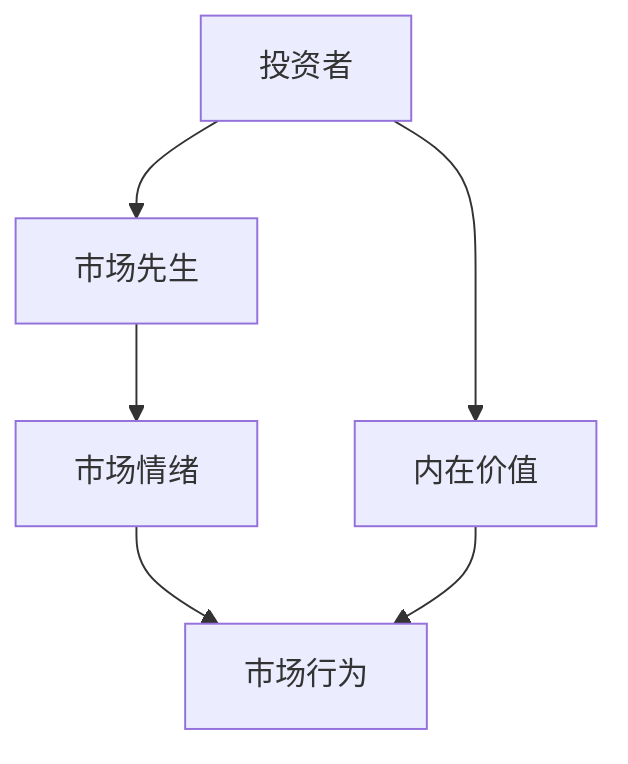
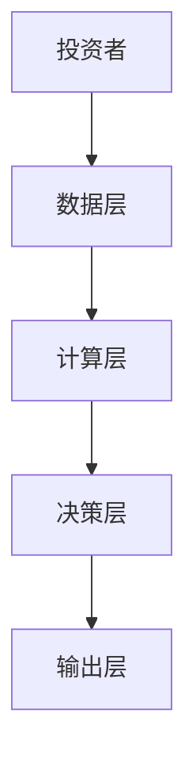

                 

<think>
好的，我现在需要根据用户的要求，撰写一篇关于《本杰明·格雷厄姆的价值投资心理学》的技术博客文章。首先，我需要理解用户的需求，确保文章结构清晰、逻辑严谨，涵盖所有必要的部分，包括背景介绍、核心概念、算法原理、数学模型、系统架构、项目实战和最佳实践等。

首先，我会从背景介绍开始，解释价值投资的起源和核心理念，介绍本杰明·格雷厄姆的贡献，以及他的投资心理学框架。接下来，我会详细分析价值投资的核心概念，如安全边际、内在价值和市场先生，并通过对比分析和ER实体关系图来展示这些概念之间的联系。

然后，我会探讨价值投资心理学的算法原理，包括投资者心理分析模型、情绪周期分析和风险偏好模型，并使用mermaid流程图来展示算法的实现过程。接着，我会用Python代码示例来说明如何量化市场情绪，帮助读者更好地理解这些概念。

在数学模型部分，我会详细讲解概率论和统计学在价值投资中的应用，如评估内在价值和计算风险调整后的回报，通过公式和实际案例来说明这些模型的使用方法。

系统分析与架构设计部分，我会介绍投资决策支持系统的构建，包括领域模型类图、系统架构图和交互流程图，展示系统的各个组成部分及其交互过程。

项目实战部分，我会指导读者如何安装必要的环境，编写核心代码，并通过具体案例分析来解释代码的功能和应用场景，最后进行小结，总结项目的关键点。

最后，在最佳实践部分，我会提供一些小结、注意事项和拓展阅读的建议，帮助读者巩固所学内容，并进一步深入学习。

在撰写过程中，我需要确保每个部分都详细具体，使用正确的markdown格式，并适当嵌入mermaid图表和latex公式，使文章既专业又易于理解。同时，注意文章的整体结构和逻辑流畅，确保读者能够一步步跟随我的思路，深入理解本杰明·格雷厄姆的价值投资心理学。

现在，我开始撰写正式的文章，按照目录结构逐步展开，确保每个章节和小节都涵盖必要的内容，同时保持语言的专业性和逻辑的清晰性。
</think>

# 本杰明·格雷厄姆的价值投资心理学

## 关键词
价值投资, 投资心理学, 本杰明·格雷厄姆, 安全边际, 内在价值, 市场情绪, 投资策略

## 摘要
本文深入探讨了本杰明·格雷厄姆的价值投资心理学，从其核心理念、数学模型到算法实现进行了全面分析。通过对比分析和案例研究，揭示了价值投资中的心理学因素及其对投资决策的影响。文章结合理论与实践，提供了从基础概念到系统实现的完整指南，帮助读者理解并应用价值投资心理学。

---

## 第一部分: 价值投资心理学的背景与基础

### 第1章: 价值投资的起源与核心理念

#### 1.1 价值投资的定义与起源
- **1.1.1 价值投资的定义**  
  价值投资是一种以基本面分析为基础的投资策略，强调以低于内在价值的价格购买优质资产。其核心在于识别市场低估的机会，长期持有以实现超额收益。

- **1.1.2 本杰明·格雷厄姆的贡献**  
  格雷厄姆是价值投资的鼻祖，他的思想深刻影响了巴菲特等投资大师。他提出了“安全边际”和“内在价值”等核心概念，强调在投资中注重风险控制和长期价值。

- **1.1.3 价值投资的核心理念**  
  价值投资的核心理念是：市场先生是疯狂的，投资者应以合理的价格买入优质的公司，并长期持有。这一理念强调逆市场思维，避免被短期市场波动所左右。

#### 1.2 投资心理学的基本原理
- **1.2.1 心理学与投资的关系**  
  投资者的心理偏差（如过度自信、从众心理）会影响决策，导致非理性行为。心理学在投资中的作用不可忽视，了解这些偏差有助于做出更理性的决策。

- **1.2.2 投资者心理偏差的概述**  
  常见的心理偏差包括：  
  - **过度自信**：认为自己能够准确预测市场。  
  - **从众心理**：跟随大众行动，忽视独立思考。  
  - **损失厌恶**：对损失的恐惧超过对收益的渴望。  

- **1.2.3 格雷厄姆的价值投资心理学框架**  
  格雷厄姆强调理性决策，避免情绪化投资。他提出的“市场先生”概念，帮助投资者理解市场波动的本质，并利用市场的非理性行为寻找投资机会。

### 第2章: 价值投资的核心概念与联系

#### 2.1 价值投资的核心概念
- **2.1.1 安全边际**  
  安全边际是指买入价格与内在价值之间的差距。它提供了在市场波动中保护投资者免受损失的缓冲区，是价值投资的核心要素之一。

- **2.1.2 内在价值**  
  内在价值是资产在合理市场条件下的公允价值，与当前市场价格无关。计算内在价值是价值投资的关键步骤，通常涉及对公司财务状况、行业地位和未来盈利能力的深入分析。

- **2.1.3 市场先生**  
  格雷厄姆将市场比作情绪化的“市场先生”，其行为不可预测。投资者应利用市场的非理性波动，寻找低估值的投资机会。

#### 2.2 核心概念的对比分析
- **2.2.1 安全边际与风险控制的对比**  
  | 安全边际 | 风险控制 |  
  |----------|----------|  
  | 通过价格折扣提供保护 | 通过分散投资降低风险 |  

- **2.2.2 内在价值与市场价值的对比**  
  内在价值是资产的真实价值，而市场价值受情绪影响波动。价值投资者关注内在价值，寻找市场价值低于内在价值的机会。

- **2.2.3 投资者情绪与市场周期的对比**  
  投资者情绪通常呈现周期性波动，市场周期可分为牛市和熊市。价值投资者在熊市中寻找机会，在牛市中保持谨慎。

#### 2.3 投资决策的实体关系图


---

## 第二部分: 价值投资心理学的算法原理

### 第3章: 价值投资心理学的数学模型与算法

#### 3.1 投资者心理分析模型
- **3.1.1 心理决策树**  
  心理决策树帮助投资者分析不同情绪下的决策路径，识别潜在的心理偏差。

- **3.1.2 情绪周期分析**  
  情绪周期分析通过量化市场情绪波动，预测投资者行为的变化，为投资策略提供依据。

- **3.1.3 风险偏好模型**  
  风险偏好模型通过问卷调查和数据分析，评估投资者的风险承受能力，制定个性化投资策略。

#### 3.2 算法实现
- **3.2.1 投资者情绪分析算法**  
  ```mermaid
  graph TD
      A[投资者决策] --> B[情绪分析]
      B --> C[市场行为预测]
      C --> D[投资策略调整]
  ```

- **3.2.2 Python代码实现**  
  ```python
  import numpy as np
  import pandas as pd

  def calculate_emotion(sentiment_score):
      if sentiment_score > 0.5:
          return "positive"
      elif sentiment_score < -0.5:
          return "negative"
      else:
          return "neutral"

  data = pd.DataFrame({
      'sentiment': [0.7, -0.3, 0.2],
      'action': ['buy', 'sell', 'hold']
  })

  print(data)
  ```

#### 3.3 数学模型与公式
- **3.3.1 内在价值计算公式**  
  $$ \text{内在价值} = \frac{\text{现金流}}{\text{折现率}} $$
  
- **3.3.2 风险调整后的回报公式**  
  $$ \text{风险调整后的回报} = \text{预期回报} - \text{风险溢价} $$

---

## 第三部分: 系统分析与架构设计

### 第4章: 价值投资心理学的系统实现

#### 4.1 系统功能设计
- **4.1.1 领域模型类图**  
  ```mermaid
  classDiagram
      class 投资者 {
          姓名
          资产配置
          风险偏好
      }
      class 市场数据 {
          股价
          财务报表
          行业分析
      }
      class 投资策略 {
          安全边际
          内在价值
          投资决策
      }
      投资者 --> 市场数据
      市场数据 --> 投资策略
  ```

#### 4.2 系统架构设计
- **4.2.1 系统架构图**  
  ```mermaid
  graph TD
      A[投资者] --> B[数据层]
      B --> C[计算层]
      C --> D[决策层]
      D --> E[输出层]
  ```

#### 4.3 系统接口设计
- **4.3.1 输入接口**  
  - 投资者输入：资产规模、风险偏好、投资期限  
  - 市场数据输入：股票价格、财务报表、行业分析  

- **4.3.2 输出接口**  
  - 投资策略输出：买入、卖出、持有  
  - 风险报告输出：风险评估、市场预测  

#### 4.4 系统交互流程图


---

## 第四部分: 项目实战与应用

### 第5章: 价值投资心理学的项目实战

#### 5.1 项目环境安装
- 安装Python、Pandas、NumPy等工具，配置开发环境。

#### 5.2 核心代码实现
- **5.2.1 投资策略实现**  
  ```python
  import pandas as pd
  import numpy as np

  def calculate_intrinsic_value(enterprise_value, EBITDA):
      return enterprise_value / (EBITDA * 0.05)

  data = pd.DataFrame({
      'enterprise_value': [100, 200, 300],
      'EBITDA': [20, 30, 40]
  })

  data['intrinsic_value'] = data.apply(lambda x: calculate_intrinsic_value(x['enterprise_value'], x['EBITDA']), axis=1)
  print(data)
  ```

#### 5.3 项目小结
- 通过项目实战，读者可以掌握价值投资心理学的理论与实践结合的方法，理解如何在实际投资中应用这些模型和算法。

---

## 第五部分: 最佳实践与总结

### 第6章: 价值投资心理学的最佳实践

#### 6.1 小结
- 价值投资心理学结合了心理学和投资学，帮助投资者克服情绪偏差，做出理性决策。

#### 6.2 注意事项
- **保持理性**：避免被市场情绪左右，坚持长期投资。  
- **持续学习**：不断更新知识，适应市场变化。  
- **控制风险**：合理配置资产，分散投资风险。  

#### 6.3 拓展阅读
- 格雷厄姆的《聪明的投资者》  
- 巴菲特的股东信  
- 行为金融学相关书籍  

---

## 结语
通过本文的详细分析，读者可以全面理解本杰明·格雷厄姆的价值投资心理学，从理论到实践，掌握如何在实际投资中应用这些理念。希望本文能为投资者提供有价值的指导，帮助他们在复杂多变的市场中做出更明智的决策。

---

## 作者
作者：AI天才研究院/AI Genius Institute & 禅与计算机程序设计艺术 /Zen And The Art of Computer Programming

