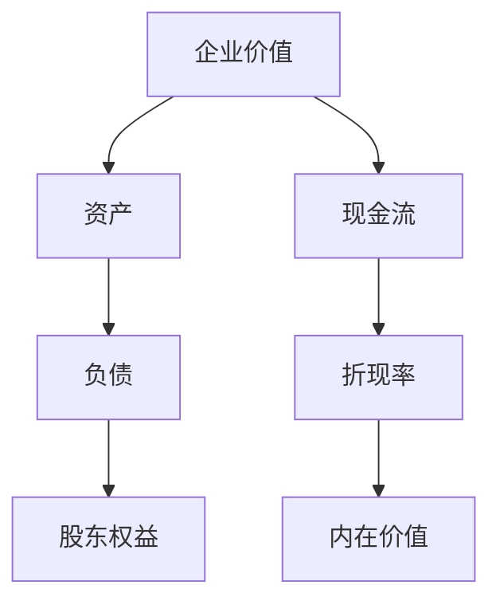
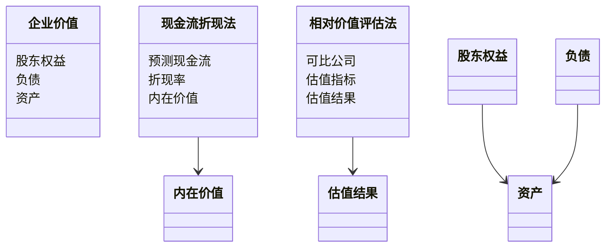
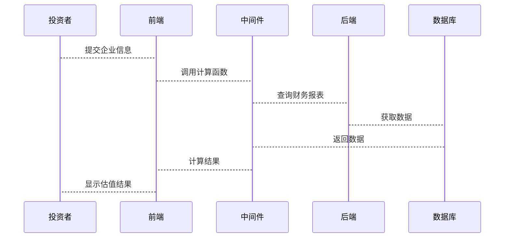

                 


# 本杰明·格雷厄姆的企业价值计算方法

## 关键词：企业价值计算，本杰明·格雷厄姆，价值投资，现金流折现法，相对价值评估法，安全边际

## 摘要：本杰明·格雷厄姆是价值投资的鼻祖，他的企业价值计算方法为投资者提供了评估公司内在价值的科学工具。本文详细讲解了格雷厄姆的企业价值计算方法，包括现金流折现法和相对价值评估法，并通过实际案例展示了如何应用这些方法进行投资决策。文章还分析了安全边际的概念及其在投资中的重要性，为读者提供了全面的理论和实践指导。

---

## 第1章：企业价值计算的背景与意义

### 1.1 价值投资的起源与发展

#### 1.1.1 价值投资的定义与核心理念
价值投资是一种投资策略，强调以低于内在价值的价格购买优质资产。其核心理念是通过深入分析企业的财务状况、行业地位和未来前景，寻找被市场低估的投资机会。

#### 1.1.2 本杰明·格雷厄姆的贡献与影响
本杰明·格雷厄姆是价值投资的奠基人，他提出的“安全边际”和“内在价值”概念对投资理论和实践产生了深远影响。他的著作《证券分析》和《聪明的投资者》是投资领域的经典之作。

#### 1.1.3 企业价值计算的现实意义
企业价值计算是价值投资的核心，它帮助投资者准确评估企业的内在价值，从而做出明智的投资决策。掌握这一方法，投资者可以避免被市场情绪左右，降低投资风险。

---

### 1.2 企业价值计算的基本概念

#### 1.2.1 企业价值的定义
企业价值（Enterprise Value, EV）是公司整体价值的度量，包括股权价值、债权价值和所有者权益。它是企业未来现金流的现值，反映了企业的真实价值。

#### 1.2.2 企业价值与股票价格的关系
股票价格是市场对企业的估值，但并不总是反映企业的真实价值。当股票价格低于企业价值时，投资机会出现。

#### 1.2.3 企业价值计算的核心要素
企业价值计算的核心要素包括：
1. **现金流**：企业未来产生的现金流。
2. **折现率**：用于将未来现金流折现到现值的利率。
3. **财务报表**：企业的收入、利润和资产负债情况。

---

### 1.3 本杰明·格雷厄姆的价值评估方法

#### 1.3.1 格雷厄姆的防御性投资策略
格雷厄姆主张防御性投资，即以低于内在价值的价格购买优质股票，以确保投资的安全性和稳定性。

#### 1.3.2 格雷厄姆的内在价值计算模型
格雷厄姆提出了内在价值计算公式：
$$ V = \frac{E}{r - g} $$
其中，\( V \) 是内在价值，\( E \) 是企业未来现金流的终值，\( r \) 是折现率，\( g \) 是现金流增长率。

#### 1.3.3 格雷厄姆的安全边际概念
安全边际是内在价值与市场价格之间的差距，用于缓冲市场波动和不确定性。格雷厄姆建议投资者以低于内在价值的价格购买股票，确保安全边际的存在。

---

## 第2章：企业价值计算的核心概念与联系

### 2.1 核心概念原理

#### 2.1.1 现金流折现法
现金流折现法（DCF模型）是计算企业价值的主要方法，它将未来现金流折现到现值，以确定企业的内在价值。

#### 2.1.2 股东权益与资产价值
股东权益是企业净资产的体现，资产价值则是企业资产的市场价值。两者共同影响企业的整体价值。

#### 2.1.3 财务报表分析与企业价值的关系
财务报表分析是企业价值计算的基础，通过分析资产负债表、利润表和现金流量表，可以准确评估企业的财务状况和未来盈利能力。

---

### 2.2 核心概念属性特征对比表格

| 概念         | 定义                                                                 |
|--------------|----------------------------------------------------------------------|
| 企业价值     | 企业整体的市场价值，包括股权、债权和所有者权益。               |
| 股票价格     | 市场对股票的估值，受市场情绪和流动性影响。                     |
| 内在价值     | 企业未来现金流的现值，反映企业的真实价值。                   |
| 安全边际     | 内在价值与市场价格的差距，用于降低投资风险。                 |

---

### 2.3 ER实体关系图（Mermaid流程图）



---

## 第3章：企业价值计算的算法原理

### 3.1 现金流折现法（DCF模型）

#### 3.1.1 现金流折现法的定义
现金流折现法是将未来现金流折现到现值，以确定企业的内在价值。其数学模型为：
$$ V = \frac{CF_1}{(1+r)^1} + \frac{CF_2}{(1+r)^2} + \dots + \frac{CF_n}{(1+r)^n} $$
其中，\( CF \) 是未来现金流，\( r \) 是折现率，\( n \) 是时间跨度。

#### 3.1.2 现金流折现法的步骤
1. **预测未来现金流**：基于企业的财务状况和行业前景，预测未来现金流。
2. **确定折现率**：选择合适的折现率，通常使用无风险利率和风险溢价之和。
3. **计算现值**：将未来现金流折现到现值，求和得到企业的内在价值。

#### 3.1.3 现金流折现法的优缺点
- **优点**：能够准确反映企业的未来现金流，计算出真实的内在价值。
- **缺点**：预测未来现金流存在不确定性，且折现率的选择影响结果。

---

### 3.2 相对价值评估法

#### 3.2.1 相对价值评估法的定义
相对价值评估法是通过比较同类公司的估值指标（如市盈率、市净率）来评估目标公司的价值。

#### 3.2.2 相对价值评估法的数学模型
$$ P/E = \frac{Price}{Earnings} $$
其中，\( P \) 是股价，\( E \) 是每股收益。

#### 3.2.3 相对价值评估法的步骤
1. **选择可比公司**：选取与目标公司相似的可比公司。
2. **计算估值指标**：如市盈率、市净率等。
3. **评估目标公司价值**：基于可比公司的平均估值指标，计算目标公司的估值。

#### 3.2.4 相对价值评估法的优缺点
- **优点**：简单易行，适用于快速评估。
- **缺点**：受市场波动影响较大，缺乏准确性。

---

### 3.3 格雷厄姆的保守主义估值法

#### 3.3.1 保守主义估值法的定义
保守主义估值法是一种以安全边际为核心的投资策略，强调以低于内在价值的价格购买股票。

#### 3.3.2 保守主义估值法的数学模型
$$ V = \frac{E}{r - g} $$
其中，\( V \) 是内在价值，\( E \) 是企业未来现金流的终值，\( r \) 是折现率，\( g \) 是现金流增长率。

---

## 第4章：系统分析与架构设计方案

### 4.1 问题场景介绍
假设我们是一家投资公司，希望通过计算企业价值来评估某家科技公司的投资价值。

### 4.2 系统功能设计（领域模型Mermaid类图）



---

### 4.3 系统架构设计（Mermaid架构图）

```mermaid
architectural
    前端 --> 投资者界面
    中间件 --> 数据处理逻辑
    后端 --> 数据库
    数据库 --> 财务报表
    数据库 --> 可比公司数据
```

---

### 4.4 系统交互设计（Mermaid序列图）



---

## 第5章：项目实战

### 5.1 环境安装
安装必要的工具和库，如Python、Pandas、NumPy等。

### 5.2 核心实现源代码

```python
import pandas as pd
import numpy as np

def calculate_intrinsic_value(cash_flows, discount_rate):
    return np.npv(discount_rate, cash_flows)

def calculate_relative_value(price, earnings):
    pe_ratio = price / earnings
    return pe_ratio

# 示例数据
cash_flows = [100, 150, 200, 250]
discount_rate = 0.10
price = 50
earnings = 10

iv = calculate_intrinsic_value(cash_flows, discount_rate)
rv = calculate_relative_value(price, earnings)

print(f"内在价值: {iv:.2f}")
print(f"市盈率: {rv:.2f}")
```

---

### 5.3 代码应用解读与分析
上述代码实现了现金流折现法和相对价值评估法的计算。通过输入现金流和折现率，计算出企业的内在价值；通过输入股价和每股收益，计算出市盈率。

---

### 5.4 实际案例分析
假设某公司未来三年的现金流分别为100万、150万和200万，折现率为10%。计算其内在价值：
$$ V = \frac{100}{1.1} + \frac{150}{1.21} + \frac{200}{1.331} \approx 247.8 \text{万元} $$

---

## 第6章：总结与展望

### 6.1 本章小结
本杰明·格雷厄姆的企业价值计算方法为投资者提供了科学的评估工具。通过现金流折现法和相对价值评估法，投资者可以准确评估企业的内在价值，并结合安全边际做出明智的投资决策。

### 6.2 展望
未来，随着人工智能和大数据技术的发展，企业价值计算将更加精准和高效。投资者可以通过算法和模型优化，进一步提升投资决策的准确性和效率。

---

## 作者：AI天才研究院 & 禅与计算机程序设计艺术

---

通过以上思考过程，我们可以系统地理解本杰明·格雷厄姆的企业价值计算方法，并将其应用于实际投资决策中。希望这篇文章能为投资者提供有价值的指导和启发。

