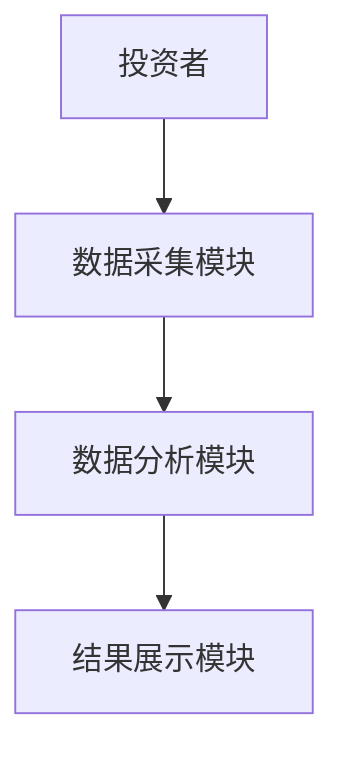

                 


# 本杰明·格雷厄姆的工作资本分析技巧

> **关键词**：投资分析、价值投资、资本分析、安全边际、内在价值、投资策略  
> **摘要**：本杰明·格雷厄姆是价值投资的先驱，他的工作资本分析技巧为投资者提供了独特的方法来评估和管理投资组合。本文详细介绍了格雷厄姆的投资理论，分析了他的资本分析方法，包括安全边际、内在价值评估等核心概念，并通过实际案例展示了这些方法的应用。文章还探讨了如何将这些理论转化为实际的投资策略，并提供了详细的数学模型和系统架构设计，帮助读者更好地理解和应用这些技巧。

---

## 第一部分：本杰明·格雷厄姆投资理论概述

### 第1章：本杰明·格雷厄姆及其投资理念

#### 1.1 本杰明·格雷厄姆的生平简介

**1.1.1 格雷厄姆的早年经历**

本杰明·格雷厄姆（Benjamin Graham）是20世纪著名的投资学家和作家，被誉为“价值投资之父”。他出生于1894年，早年在伦敦生活，后随家人移居美国。他在哥伦比亚大学学习经济学，毕业后进入华尔街，开始他的投资生涯。

**1.1.2 格雷厄姆的投资生涯**

格雷厄姆在华尔街的经历充满了起伏。他在1929年股市崩盘后经历了巨大的挫折，但这也促使他开始深入研究投资理论。他与戴维·多德（David Dodd）共同开发了价值投资的方法，这种方法后来影响了无数投资者，包括沃伦·巴菲特。

**1.1.3 格雷厄姆的著作与影响力**

格雷厄姆的著作《证券分析》和《聪明的投资者》奠定了他作为投资大师的地位。他的理论不仅影响了学术界，还在实践中被广泛应用。

#### 1.2 格雷厄姆的价值投资理论

**1.2.1 价值投资的核心理念**

价值投资的核心理念是购买低于其内在价值的股票，长期持有，等待市场的认可。格雷厄姆强调，投资者应该寻找那些被市场低估的公司，这些公司具有稳定的财务状况和良好的管理团队。

**1.2.2 安全边际的概念**

安全边际是格雷厄姆理论中的一个关键概念。它指的是股票的市场价格与其内在价值之间的差距。通过购买低于内在价值的股票，投资者可以降低风险，确保即使市场出现波动，他们的投资也能保持安全。

**1.2.3 格雷厄姆的投资策略**

格雷厄姆的投资策略主要包括以下几个方面：
1. 选择那些具有稳定历史业绩和良好财务状况的公司。
2. 评估公司的内在价值，确保购买价格低于内在价值。
3. 长期持有优质股票，避免频繁交易。

---

## 第二部分：工作资本分析的核心概念

### 第2章：工作资本分析的定义与背景

#### 2.1 工作资本分析的背景

**2.1.1 投资分析的必要性**

在现代金融市场上，投资者需要通过科学的方法来评估投资标的的价值。工作资本分析作为一种重要的工具，帮助投资者识别潜在的投资机会和风险。

**2.1.2 工作资本分析的起源**

工作资本分析起源于格雷厄姆对价值投资的深入研究。他提出了一套系统的分析方法，用于评估公司的内在价值和市场估值。

**2.1.3 工作资本分析的现状**

随着金融市场的不断发展，工作资本分析方法不断完善。现代投资者利用大数据和人工智能技术，进一步优化了工作资本分析的流程和效果。

#### 2.2 工作资本分析的核心概念

**2.2.1 工作资本的定义**

工作资本是指企业在日常经营活动中所需的流动资产，包括现金、存货、应收账款等。工作资本分析的核心是评估企业的流动性、偿债能力和运营效率。

**2.2.2 工作资本的属性特征对比表格**

以下表格对比了工作资本与长期资本的主要特征：

| 特性          | 工作资本                     | 长期资本                     |
|---------------|------------------------------|------------------------------|
| 定义          | 流动资产，用于日常经营        | 非流动资产，用于长期投资     |
| 周转周期      | 短期，通常在一年内           | 长期，通常超过一年            |
| 风险程度      | 较高，受市场波动影响较大      | 较低，受市场波动影响较小      |
| 资金来源      | 主要来自短期融资            | 主要来自长期融资            |

**2.2.3 工作资本分析的ER实体关系图**

以下是工作资本分析的实体关系图（ER图）：

```mermaid
er
actor(投资者) -[进行工作资本分析]-> Company(公司)
Company -[拥有]-> Assets(资产)
Company -[拥有]-> Liabilities(负债)
Company -[拥有]-> Equity(股权)
```

---

### 第3章：工作资本分析的数学模型与公式

#### 3.1 工作资本分析的数学模型

**3.1.1 内在价值计算公式**

股票的内在价值可以通过以下公式计算：

$$
\text{内在价值} = \frac{\text{净利润} \times (1 + g)}{r - g}
$$

其中，\( g \) 是净利润增长率，\( r \) 是期望的回报率。

**3.1.2 安全边际计算公式**

安全边际可以通过以下公式计算：

$$
\text{安全边际} = \text{内在价值} - \text{市场价格}
$$

**3.1.3 股票估值公式**

股票的合理估值可以通过以下步骤计算：

1. 计算公司的内在价值。
2. 确定市场的安全边际。
3. 结合市场环境和行业趋势，调整估值。

#### 3.2 公式详细讲解与举例

**3.2.1 内在价值计算的详细步骤**

假设某公司的净利润为 $100 万，净利润增长率为 5%，期望回报率为 10%。则其内在价值为：

$$
\text{内在价值} = \frac{1,000,000 \times (1 + 0.05)}{0.10 - 0.05} = \frac{1,050,000}{0.05} = 21,000,000
$$

**3.2.2 安全边际的实际应用**

如果该公司的股价为 $20元，其内在价值为 $21元，则安全边际为：

$$
\text{安全边际} = 21 - 20 = 1 \text{元}
$$

**3.2.3 股票估值的案例分析**

假设某公司的内在价值为 $50元，股价为 $45元，则其安全边际为 $5元。这表明该股票具有较高的投资价值。

---

## 第三部分：工作资本分析的系统架构与实现

### 第4章：工作资本分析系统的架构设计

#### 4.1 系统功能设计

**4.1.1 数据采集模块**

数据采集模块负责收集企业的财务数据，包括收入、利润、资产和负债等。

**4.1.2 数据分析模块**

数据分析模块利用统计学方法和机器学习算法，评估企业的内在价值和安全边际。

**4.1.3 结果展示模块**

结果展示模块以可视化的方式呈现分析结果，帮助投资者做出决策。

#### 4.2 系统架构设计

以下是工作资本分析系统的架构图：



---

### 第5章：工作资本分析系统的实现

#### 5.1 系统环境安装

**5.1.1 Python环境配置**

安装Python 3.8及以上版本，并配置虚拟环境。

**5.1.2 数据分析库安装**

安装以下库：
```
pip install pandas numpy matplotlib scikit-learn
```

#### 5.2 系统核心实现

**5.2.1 数据采集代码**

```python
import pandas as pd

# 从CSV文件中读取数据
data = pd.read_csv('company_financials.csv')
```

**5.2.2 数据分析代码**

```python
def calculate_intrinsic_value(net_profit, growth_rate, required_return):
    return (net_profit * (1 + growth_rate)) / (required_return - growth_rate)

# 示例计算
net_profit = 1000000
growth_rate = 0.05
required_return = 0.10
intrinsic_value = calculate_intrinsic_value(net_profit, growth_rate, required_return)
print(f"内在价值: {intrinsic_value}")
```

**5.2.3 结果展示代码**

```python
import matplotlib.pyplot as plt

# 绘制股价与内在价值对比图
plt.figure(figsize=(10, 6))
plt.plot(data['股价'], label='股价')
plt.plot(data['内在价值'], label='内在价值')
plt.xlabel('时间')
plt.ylabel('价值')
plt.legend()
plt.show()
```

---

## 第四部分：工作资本分析的实战应用

### 第6章：工作资本分析的实际案例

#### 6.1 案例分析

**6.1.1 案例背景介绍**

假设某公司A的财务数据如下：
- 净利润：$1,000,000
- 净利润增长率：5%
- 期望回报率：10%

**6.1.2 数据分析过程**

计算公司A的内在价值：

$$
\text{内在价值} = \frac{1,000,000 \times 1.05}{0.10 - 0.05} = 21,000,000
$$

**6.1.3 分析结果解读**

如果公司A的股价为 $20元，则其安全边际为 $1元，具有较高的投资价值。

#### 6.2 案例总结

**6.2.1 案例的成功经验**

通过工作资本分析，投资者能够准确评估公司的内在价值，避免盲目跟风。

**6.2.2 案例的不足之处**

工作资本分析需要结合市场环境和行业趋势，单一的财务指标分析可能不够全面。

**6.2.3 案例的借鉴意义**

投资者应综合运用多种分析方法，才能做出科学的投资决策。

---

### 第7章：工作资本分析的最佳实践与注意事项

#### 7.1 最佳实践

**7.1.1 数据来源的选择**

优先选择权威的财务数据源，确保数据的准确性和完整性。

**7.1.2 分析工具的优化**

使用专业的数据分析工具和平台，提高分析效率和准确性。

**7.1.3 投资组合的分散化**

避免过度集中投资，分散投资风险。

#### 7.2 小结

本杰明·格雷厄姆的工作资本分析技巧为投资者提供了一套科学的分析方法。通过内在价值评估和安全边际分析，投资者可以更好地识别优质投资标的，降低投资风险。

#### 7.3 注意事项

- 投资者应结合市场环境和行业趋势，灵活调整分析策略。
- 数据分析需要结合定性分析，避免片面性。
- 定期复盘和调整投资组合，确保投资目标的实现。

#### 7.4 拓展阅读

- 《证券分析》——本杰明·格雷厄姆
- 《聪明的投资者》——本杰明·格雷厄姆
- 《投资学基础》——查理·帕斯瓦尔

---

## 作者信息

作者：AI天才研究院/AI Genius Institute & 禅与计算机程序设计艺术 /Zen And The Art of Computer Programming

---

以上是《本杰明·格雷厄姆的工作资本分析技巧》的完整目录和内容概要。通过本文，读者可以全面了解格雷厄姆的投资理论和工作资本分析方法，并通过实际案例和系统设计，掌握如何在实际投资中应用这些技巧。

