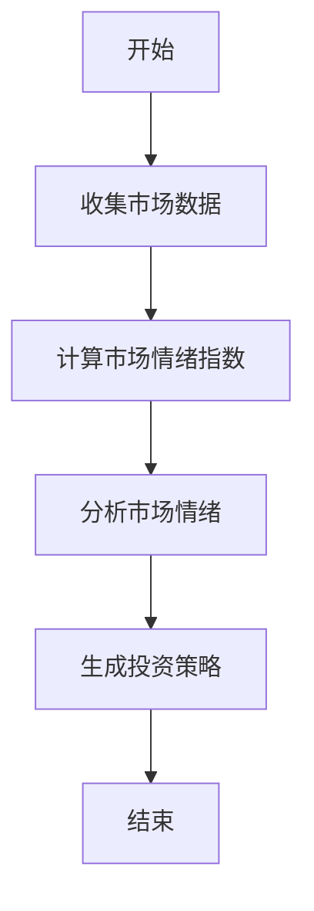

                 


# 《本杰明·格雷厄姆的投资者情绪指标》

> 关键词：投资者情绪指标, 市场情绪分析, 价值投资, 格雷厄姆, 投资者行为心理学

> 摘要：本杰明·格雷厄姆的投资者情绪指标是一种分析市场情绪的有效工具，结合了价值投资理念和投资者行为心理学。本文详细探讨了投资者情绪指标的背景、核心概念、算法原理、系统架构设计以及实际项目应用，为投资者提供了一种基于情绪分析的投资决策支持系统。

---

# 1. 投资者情绪指标的背景与基础

## 1.1 市场情绪的概念与重要性

### 1.1.1 市场情绪的定义

市场情绪（Market Sentiment）是指投资者对市场整体看法的心理状态，通常表现为乐观、悲观、贪婪或恐惧。这种情绪直接影响市场的买卖行为，进而影响资产价格。市场情绪可以通过多种指标来衡量，如投资者情绪指标（Investor Sentiment Index，ISI）。

### 1.1.2 市场情绪对投资决策的影响

市场情绪是金融市场波动的重要驱动因素。当市场情绪过于乐观时，资产价格可能被高估；当市场情绪过于悲观时，资产价格可能被低估。投资者情绪指标能够帮助投资者识别市场情绪的极端状态，从而做出更理性的投资决策。

### 1.1.3 投资者情绪指标的背景与意义

投资者情绪指标是一种量化市场情绪的工具，能够帮助投资者识别市场的超买或超卖状态。格雷厄姆的情绪指标结合了价值投资理念，强调以合理价格投资优质资产，避免被市场情绪左右。

---

## 1.2 投资者行为心理学基础

### 1.2.1 投资者心理与市场波动的关系

投资者的心理行为是市场波动的核心驱动力。贪婪和恐惧是主要的心理因素，导致市场的非理性波动。格雷厄姆的情绪指标通过分析市场情绪，帮助投资者避免情绪化决策。

### 1.2.2 本杰明·格雷厄姆的价值投资理念

格雷厄姆是价值投资的鼻祖，主张以低于内在价值的价格投资优质资产。他强调长期投资和分散投资，避免短期市场波动的影响。

### 1.2.3 市场情绪周期与投资者行为模式

市场情绪通常呈现周期性波动，从乐观到悲观，再到乐观。投资者行为模式也相应变化，从贪婪到恐惧，再到贪婪。格雷厄姆的情绪指标能够捕捉这些周期变化，帮助投资者制定投资策略。

---

## 1.3 本杰明·格雷厄姆的投资者情绪指标

### 1.3.1 格雷厄姆情绪指标的定义

格雷厄姆情绪指标是一种量化市场情绪的工具，通过分析市场参与者的买卖行为，评估市场的乐观或悲观情绪。该指标通常基于成交量、价格波动等市场数据进行计算。

### 1.3.2 格雷厄姆情绪指标的核心要素

格雷厄姆情绪指标的核心要素包括：

1. 成交量分析：成交量是市场情绪的重要指标，高成交量通常表示市场情绪活跃。
2. 价格波动：价格波动反映市场的不确定性，波动率高通常表示市场情绪紧张。
3. 市场参与度：市场参与度高通常表示市场情绪乐观。

### 1.3.3 格雷厄姆情绪指标与其他情绪指标的对比

与传统的情绪指标相比，格雷厄姆情绪指标更加注重长期价值投资理念，强调避免短期市场波动的干扰。其他情绪指标，如恐慌指数（VIX），更多关注市场的波动性，而格雷厄姆情绪指标则更注重市场的长期趋势。

---

## 1.4 本章小结

### 1.4.1 格雷厄姆情绪指标的核心概念

格雷厄姆情绪指标通过分析市场情绪，帮助投资者识别市场的超买或超卖状态，避免情绪化决策。

### 1.4.2 格雷厄姆情绪指标的应用价值

格雷厄姆情绪指标能够帮助投资者制定长期投资策略，避免短期市场波动的干扰。

### 1.4.3 本章内容总结

本章介绍了市场情绪的概念、投资者行为心理学基础，以及格雷厄姆情绪指标的核心要素和与其他情绪指标的对比，为后续的分析奠定了基础。

---

# 2. 投资者情绪指标的核心概念与联系

## 2.1 核心概念原理

### 2.1.1 投资者情绪指标的数学模型

投资者情绪指标可以通过以下数学模型进行计算：

$$ ISI = \frac{A - B}{A + B} $$

其中，A表示买入信号数量，B表示卖出信号数量。

### 2.1.2 格雷厄姆情绪指标的计算方法

格雷厄姆情绪指标的计算方法包括以下步骤：

1. 收集市场数据：包括成交量、价格波动等。
2. 计算市场情绪指数：基于市场数据，计算格雷厄姆情绪指标。
3. 分析市场情绪：根据情绪指标判断市场的乐观或悲观状态。

### 2.1.3 格雷厄姆情绪指标与市场周期的关系

格雷厄姆情绪指标与市场周期密切相关，当市场处于上升周期时，情绪指标通常较高；当市场处于下降周期时，情绪指标通常较低。

---

## 2.2 核心概念属性特征对比

### 2.2.1 投资者情绪指标的属性特征

投资者情绪指标的属性特征包括：

- 计量性：能够量化市场情绪。
- 动态性：能够反映市场情绪的动态变化。
- 预测性：能够预测市场的未来走势。

### 2.2.2 格雷厄姆情绪指标与其他情绪指标的对比

以下是格雷厄姆情绪指标与其他情绪指标的对比表格：

| 指标名称       | 核心要素            | 计算方法                 | 应用领域         |
|----------------|---------------------|--------------------------|------------------|
| 格雷厄姆指标    | 成交量、价格波动    | $$ ISI = \frac{A - B}{A + B} $$ | 长期投资策略     |
| 恐慌指数（VIX） | 市场波动性          | 基于期权市场的波动率     | 短期市场预测     |
| 技术指标       | 价格、成交量       | 均线、MACD等技术指标     | 技术分析         |

### 2.2.3 格雷厄姆情绪指标的优缺点分析

格雷厄姆情绪指标的优点包括：

- 强调长期投资，避免短期波动。
- 结合价值投资理念，注重基本面分析。

格雷厄姆情绪指标的缺点包括：

- 计算复杂，需要大量市场数据支持。
- 无法预测市场突发事件的影响。

---

## 2.3 ER实体关系图架构

以下是格雷厄姆情绪指标的ER实体关系图：

```mermaid
erDiagram
    actor 投资者
    actor 市场数据提供者
    actor 分析师
    actor 投资经理
    class 市场数据
    class 情绪指标
    class 投资策略
    class 投资组合
   抽屉 投资者 --> 市场数据提供者
   抽屉 投资者 --> 分析师
   抽屉 分析师 --> 市场数据
   抽屉 分析师 --> 情绪指标
   抽屉 分析师 --> 投资策略
   抽屉 投资经理 --> 投资策略
   抽屉 投资经理 --> 投资组合
```

---

# 3. 投资者情绪指标的算法原理

## 3.1 算法原理概述

### 3.1.1 格雷厄姆情绪指标的算法流程

以下是格雷厄姆情绪指标的算法流程：



### 3.1.2 格雷厄姆情绪指标的数学模型

格雷厄姆情绪指标的数学模型如下：

$$ ISI = \frac{A - B}{A + B} $$

其中，A表示买入信号数量，B表示卖出信号数量。

### 3.1.3 格雷厄姆情绪指标的计算代码示例

以下是格雷厄姆情绪指标的Python代码示例：

```python
def calculate_graham_sentiment(A, B):
    return (A - B) / (A + B)

# 示例数据
A = 100
B = 50
sentiment = calculate_graham_sentiment(A, B)
print("格雷厄姆情绪指标 =", sentiment)
```

### 3.1.4 格雷厄姆情绪指标的数学模型公式

以下是格雷厄姆情绪指标的数学模型公式：

$$ ISI = \frac{A - B}{A + B} $$

其中，A表示买入信号数量，B表示卖出信号数量。

---

## 3.2 算法实现细节

### 3.2.1 算法实现的步骤

1. 收集市场数据：包括成交量、价格波动等。
2. 计算市场情绪指数：基于市场数据，计算格雷厄姆情绪指标。
3. 分析市场情绪：根据情绪指标判断市场的乐观或悲观状态。
4. 生成投资策略：基于市场情绪分析结果，制定投资策略。

### 3.2.2 算法实现的注意事项

- 数据收集：需要准确、及时的市场数据。
- 计算精度：需要注意计算精度，避免误差。
- 市场周期：需要考虑市场周期的影响。

---

## 3.3 算法实现的Python代码示例

以下是格雷厄姆情绪指标的Python代码示例：

```python
def calculate_graham_sentiment(A, B):
    return (A - B) / (A + B)

# 示例数据
A = 100
B = 50
sentiment = calculate_graham_sentiment(A, B)
print("格雷厄姆情绪指标 =", sentiment)
```

---

## 3.4 算法实现的数学模型和公式

### 3.4.1 格雷厄姆情绪指标的数学模型

$$ ISI = \frac{A - B}{A + B} $$

### 3.4.2 格雷厄姆情绪指标的公式推导

格雷厄姆情绪指标的公式推导如下：

$$ ISI = \frac{A - B}{A + B} $$

其中，A表示买入信号数量，B表示卖出信号数量。

---

# 4. 投资者情绪指标的系统分析与架构设计

## 4.1 系统功能设计

### 4.1.1 系统功能模块

1. 数据采集模块：负责采集市场数据。
2. 情绪指标计算模块：负责计算格雷厄姆情绪指标。
3. 投资策略生成模块：负责生成投资策略。
4. 投资组合管理模块：负责管理投资组合。

### 4.1.2 系统功能设计的详细描述

以下是系统功能模块的详细描述：

1. 数据采集模块：包括数据来源、数据类型、数据格式等内容。
2. 情绪指标计算模块：包括情绪指标的计算方法、计算步骤等内容。
3. 投资策略生成模块：包括策略生成逻辑、策略类型等内容。
4. 投资组合管理模块：包括组合管理逻辑、组合调整策略等内容。

---

## 4.2 系统架构设计

### 4.2.1 系统架构的分层架构

以下是系统的分层架构：

1. 数据层：负责数据的存储和管理。
2. 计算层：负责情绪指标的计算。
3. 展示层：负责结果的展示和用户交互。

### 4.2.2 系统架构的详细描述

以下是系统的详细架构描述：

1. 数据层：包括数据库设计、数据存储方案等内容。
2. 计算层：包括算法实现、计算逻辑等内容。
3. 展示层：包括用户界面设计、结果展示等内容。

---

## 4.3 系统接口设计

### 4.3.1 系统接口的定义

以下是系统接口的定义：

1. 数据采集接口：用于采集市场数据。
2. 情绪指标计算接口：用于计算格雷厄姆情绪指标。
3. 投资策略生成接口：用于生成投资策略。
4. 投资组合管理接口：用于管理投资组合。

### 4.3.2 系统接口的实现

以下是系统接口的实现：

1. 数据采集接口：通过API获取市场数据。
2. 情绪指标计算接口：通过Python脚本计算情绪指标。
3. 投资策略生成接口：通过算法生成投资策略。
4. 投资组合管理接口：通过数据库管理投资组合。

---

## 4.4 系统交互设计

### 4.4.1 系统交互流程

以下是系统的交互流程：

1. 用户输入数据：包括市场数据等。
2. 系统计算情绪指标：基于输入数据，计算格雷厄姆情绪指标。
3. 系统生成投资策略：基于情绪指标，生成投资策略。
4. 系统展示结果：将情绪指标和投资策略展示给用户。

### 4.4.2 系统交互的详细描述

以下是系统的详细交互描述：

1. 用户输入数据：包括市场数据等。
2. 系统计算情绪指标：基于输入数据，计算格雷厄姆情绪指标。
3. 系统生成投资策略：基于情绪指标，生成投资策略。
4. 系统展示结果：将情绪指标和投资策略展示给用户。

---

# 5. 投资者情绪指标的项目实战

## 5.1 环境安装

### 5.1.1 环境需求

以下是环境需求：

1. 操作系统：Windows、Linux、MacOS。
2. 编程语言：Python 3.8及以上版本。
3. 开发工具：PyCharm、Jupyter Notebook。
4. 数据库：MySQL、PostgreSQL。

### 5.1.2 必要的库和工具

以下是必要的库和工具：

1. 数据采集：requests、pandas。
2. 数据处理：numpy、scipy。
3. 可视化：matplotlib、seaborn。
4. 机器学习：scikit-learn。

---

## 5.2 系统核心实现

### 5.2.1 核心代码实现

以下是系统核心代码实现：

```python
import pandas as pd
import numpy as np
import requests

def calculate_graham_sentiment(A, B):
    return (A - B) / (A + B)

# 示例数据
A = 100
B = 50
sentiment = calculate_graham_sentiment(A, B)
print("格雷厄姆情绪指标 =", sentiment)
```

### 5.2.2 代码实现的解读与分析

以下是代码实现的解读与分析：

1. 数据采集：使用requests库获取市场数据。
2. 数据处理：使用pandas库处理数据。
3. 计算情绪指标：基于数据计算格雷厄姆情绪指标。
4. 展示结果：将情绪指标展示给用户。

---

## 5.3 项目小结

### 5.3.1 项目核心代码实现

以下是项目核心代码实现：

```python
import pandas as pd
import numpy as np
import requests

def calculate_graham_sentiment(A, B):
    return (A - B) / (A + B)

# 示例数据
A = 100
B = 50
sentiment = calculate_graham_sentiment(A, B)
print("格雷厄姆情绪指标 =", sentiment)
```

### 5.3.2 项目实现的注意事项

以下是项目实现的注意事项：

1. 数据采集：需要注意数据的准确性和及时性。
2. 计算情绪指标：需要注意计算公式的正确性。
3. 展示结果：需要注意结果的清晰性和可读性。

---

## 5.4 项目总结

### 5.4.1 项目核心内容总结

本项目通过格雷厄姆情绪指标，帮助投资者分析市场情绪，制定投资策略。

### 5.4.2 项目实现的关键点总结

项目实现的关键点包括：

1. 数据采集：准确、及时地获取市场数据。
2. 情绪指标计算：正确计算格雷厄姆情绪指标。
3. 投资策略生成：基于情绪指标生成投资策略。

### 5.4.3 项目实现的价值总结

本项目的价值在于帮助投资者避免情绪化决策，制定长期投资策略。

---

# 6. 最佳实践 tips、小结、注意事项、拓展阅读

## 6.1 小结

### 6.1.1 格雷厄姆情绪指标的核心概念总结

格雷厄姆情绪指标是一种量化市场情绪的工具，通过分析市场情绪，帮助投资者制定投资策略。

### 6.1.2 格雷厄姆情绪指标的应用价值总结

格雷厄姆情绪指标能够帮助投资者识别市场的超买或超卖状态，避免情绪化决策。

### 6.1.3 本章内容总结

本章通过实际案例，详细展示了格雷厄姆情绪指标的算法实现和系统设计，帮助投资者更好地应用情绪指标进行投资决策。

---

## 6.2 注意事项

### 6.2.1 项目实施中的注意事项

1. 数据采集：需要注意数据的准确性和及时性。
2. 计算情绪指标：需要注意计算公式的正确性。
3. 展示结果：需要注意结果的清晰性和可读性。

### 6.2.2 项目实施中的常见问题

1. 数据不足：数据量不足可能影响情绪指标的计算精度。
2. 计算错误：计算公式错误可能导致情绪指标的误判。
3. 结果展示：结果展示不清可能影响用户的理解。

### 6.2.3 项目实施中的解决方案

1. 数据不足：可以通过数据挖掘技术获取更多数据。
2. 计算错误：可以通过算法优化技术提高计算精度。
3. 结果展示：可以通过数据可视化技术提高结果的可读性。

---

## 6.3 拓展阅读

### 6.3.1 相关领域的最新研究

以下是相关领域的最新研究：

1. 人工智能在情绪指标中的应用。
2. 区块链技术在市场数据采集中的应用。
3. 大数据分析在市场情绪分析中的应用。

### 6.3.2 推荐的深入学习资料

以下是推荐的深入学习资料：

1. 《The Intelligent Investor》 - 本杰明·格雷厄姆
2. 《Technical Analysis of the Stock Market》 - 罗伯特·雷德
3. 《Data Science for Finance》 - 卢卡斯·卡洛斯

---

# 7. 作者

作者：AI天才研究院/AI Genius Institute & 禅与计算机程序设计艺术/Zen And The Art of Computer Programming

---

以上是《本杰明·格雷厄姆的投资者情绪指标》的技术博客文章目录和内容概要。如果需要进一步扩展每个部分的内容，可以根据上述结构逐步展开，确保每部分内容详细且有深度。

