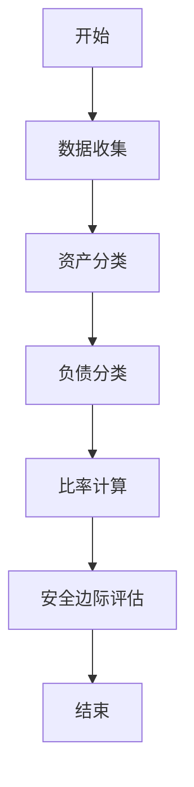

                 

<think>
好，我需要帮用户撰写一篇关于《本杰明·格雷厄姆的资产负债表分析方法》的技术博客文章，结构和内容要符合他们的具体要求。首先，我得仔细阅读用户的需求，理解他们的期望。

用户希望文章有吸引人的标题、关键词和摘要，然后按照目录结构展开。文章需要使用专业的技术语言，逻辑清晰，结构紧凑，内容要详细，包括背景、核心概念、算法、数学模型、系统架构、项目实战和注意事项等部分。用户还提供了详细的目录结构，我需要确保每部分内容都涵盖。

首先，我会从背景介绍开始，详细解释价值投资和本杰明·格雷厄姆的贡献，说明资产负债表分析的重要性。然后，进入核心概念部分，讲解资产负债表的结构，以及流动资产、流动负债等关键概念，并附上对比表和ER图。

接下来，是算法部分，我需要用mermaid流程图展示分析步骤，并编写Python代码示例。数学模型部分，我得用latex公式解释关键比率的计算方法，确保公式正确且清晰。

系统架构设计需要介绍如何构建一个分析系统，包括数据收集、处理和可视化的部分，使用mermaid类图和架构图来展示。项目实战部分，我会选择一个具体案例，详细分析整个过程，并附上代码示例。

最后，总结和注意事项部分，我会提醒读者在实际操作中需要注意的问题，以及进一步学习的建议。

整个过程中，我需要确保文章结构合理，内容详实，同时语言专业易懂。可能会遇到一些挑战，比如如何将复杂的财务分析方法转化为技术博客内容，但我会一步步来，确保每个部分都深入浅出地讲解清楚。

现在，我开始按照目录大纲逐步撰写每个部分，确保每一章都符合用户的要求，逻辑连贯，内容完整。
</think>

# 本杰明·格雷厄姆的资产负债表分析方法

> 关键词：价值投资，本杰明·格雷厄姆，资产负债表分析，安全边际，财务报表分析，投资策略

> 摘要：本文深入探讨了本杰明·格雷厄姆的资产负债表分析方法，从其核心概念、分析原理到实际应用，结合技术语言和案例分析，帮助读者掌握这一经典的财务分析方法。

---

## 第一部分：价值投资与资产负债表分析基础

### 第1章：价值投资与本杰明·格雷厄姆概述

#### 1.1 价值投资的起源与发展

价值投资是投资学中的一个重要流派，其核心理念是寻找市场价低于内在价值的股票进行投资。本杰明·格雷厄姆是这一学派的代表人物，他强调安全边际和对公司的深入分析，尤其是对资产负债表的关注。

**问题背景**：传统投资方法往往依赖市场预测和短期波动，但这种方法具有不确定性。格雷厄姆提出了一种基于公司基本面分析的投资策略，以降低风险并实现长期收益。

**问题描述**：格雷厄姆的分析方法强调对公司财务状况的全面了解，特别是资产负债表。他主张通过分析公司的资产和负债情况，评估其内在价值，从而做出投资决策。

**问题解决**：通过深入分析资产负债表，投资者可以识别公司的财务健康状况，评估其偿债能力和发展潜力，从而做出更明智的投资决策。

**边界与外延**：资产负债表分析不仅适用于股票投资，还可用于其他金融工具的评估。其外延包括对公司整体财务状况的分析，以及与行业和市场趋势的对比。

**概念结构与核心要素**：资产负债表分析的核心要素包括流动资产、非流动资产、流动负债、非流动负债、股东权益等。格雷厄姆强调对这些要素的详细分析，以评估公司的安全边际。

---

### 第2章：资产负债表的核心要素与结构

#### 2.1 资产负债表的基本结构

资产负债表由三部分组成：资产、负债和股东权益。资产反映公司拥有的资源，负债反映公司的债务，股东权益则表示公司归股东所有的部分。

**资产与负债的分类**：
- **流动资产**：可以在一年内变现的资产，如现金、应收账款、存货等。
- **非流动资产**：长期资产，如固定资产、无形资产等。
- **流动负债**：一年内需要偿还的债务，如应付账款、短期借款等。
- **非流动负债**：长期债务，如长期借款、债券等。

**资产与负债的对比**：流动资产与流动负债的对比可以计算出流动性比率，如流动比率（流动资产/流动负债）和速动比率（（流动资产-存货）/流动负债）。

**所有者权益**：反映公司净资产的价值，包括股本、资本公积、盈余公积等。

#### 2.2 格雷厄姆对资产与负债的分类

格雷厄姆将资产分为“稳健资产”和“风险资产”，并将负债分为“刚性负债”和“弹性负债”。稳健资产包括现金、短期投资等，风险资产包括应收账款和存货。刚性负债是必须偿还的债务，而弹性负债则可以根据公司状况调整。

**属性对比表**：

| 项目            | 稳健资产           | 风险资产           | 刚性负债           | 弹性负债           |
|-----------------|-------------------|-------------------|-------------------|-------------------|
| 定义            | 现金、短期投资等   | 应收账款、存货等   | 短期借款、应付账款 | 长期负债、债券等  |
| 风险程度        | 低                | 中高              | 高                | 中低             |
| 管理策略        | 保持充足          | 风险控制          | 必须偿还          | 可调整            |

**ER实体关系图**：

```mermaid
erd
actor 投资者 {
  [投资者]
}

actor 财务报表 {
  [公司]
}

actor 分析师 {
  [分析师]
}

公司 --> 资产负债表: 提供财务数据
投资者 --> 资产负债表: 获取信息
分析师 --> 资产负债表: 分析数据
```

---

### 第3章：格雷厄姆的资产分析方法

#### 3.1 格雷厄姆的资产分析原理

格雷厄姆强调对资产质量和数量的分析，尤其是流动资产和非流动资产的构成。他认为，流动资产是公司偿债能力的重要指标，而非流动资产则反映了公司的长期发展潜力。

**流动资产分析**：
- **现金**：公司持有的现金和现金等价物，是流动性最强的资产。
- **应收账款**：公司尚未收回的赊销款项，需关注其质量和回收周期。
- **存货**：公司持有的原材料、在制品和产成品，需评估其周转效率。

**非流动资产分析**：
- **固定资产**：如厂房、设备等，需评估其折旧情况和使用效率。
- **无形资产**：如专利、商标等，需关注其价值和使用寿命。

#### 3.2 负债分析与偿债能力评估

格雷厄姆认为，负债是公司财务健康的重要指标。他将负债分为刚性负债和弹性负债，并通过分析负债的结构和期限，评估公司的偿债压力。

**流动负债分析**：
- **短期借款**：公司为应对短期资金需求而获得的贷款。
- **应付账款**：公司尚未支付的采购款项。
- **其他应付款**：如应付工资、应付税金等。

**非流动负债分析**：
- **长期借款**：公司为固定资产投资等长期需求而获得的贷款。
- **债券发行**：公司通过发行债券筹集资金。

**偿债能力评估**：
- **流动比率**：流动资产 / 流动负债，反映公司短期偿债能力。
- **速动比率**：（流动资产 - 存货）/ 流动负债，进一步评估公司的流动性。

---

## 第二部分：算法原理与数学模型

### 第4章：格雷厄姆分析方法的算法原理

#### 4.1 算法流程

格雷厄姆的分析方法可以分解为以下几个步骤：

1. **数据收集**：获取公司的资产负债表数据。
2. **资产分类**：将资产分为流动资产和非流动资产，并进一步细分。
3. **负债分类**：将负债分为流动负债和非流动负债，并进一步细分。
4. **比率计算**：计算流动比率、速动比率等关键比率。
5. **安全边际评估**：根据比率和行业标准，评估公司的财务安全边际。

**流程图**：



#### 4.2 数学模型

**流动比率计算公式**：

$$\text{流动比率} = \frac{\text{流动资产}}{\text{流动负债}}$$

**速动比率计算公式**：

$$\text{速动比率} = \frac{\text{流动资产} - \text{存货}}{\text{流动负债}}$$

**安全边际计算公式**：

$$\text{安全边际} = \text{内在价值} - \text{市场价格}$$

---

### 第5章：系统分析与架构设计

#### 5.1 系统功能设计

**领域模型**：


**系统架构图**：


---

### 第6章：项目实战

#### 6.1 实战环境与数据准备

**环境安装**：
- 安装Python和Pandas库。
- 下载目标公司的资产负债表数据。

**代码实现**：

```python
import pandas as pd

# 加载资产负债表数据
df = pd.read_csv('balance_sheet.csv')

# 计算流动比率
current_assets = df['流动资产'].sum()
current_liabilities = df['流动负债'].sum()
current_ratio = current_assets / current_liabilities

# 计算速动比率
quick_assets = current_assets - df['存货'].sum()
quick_ratio = quick_assets / current_liabilities

print(f"流动比率: {current_ratio}")
print(f"速动比率: {quick_ratio}")
```

#### 6.2 案例分析

以某制造公司为例，分析其资产负债表数据，计算流动比率和速动比率，并评估其财务健康状况。

---

## 第三部分：总结与注意事项

### 第7章：总结与最佳实践

#### 7.1 总结

本杰明·格雷厄姆的资产负债表分析方法是一种经典的财务分析工具，通过深入分析资产和负债的构成，评估公司的财务健康状况和投资价值。这种方法不仅适用于股票投资，还可应用于其他金融工具的分析。

#### 7.2 小结

- **安全边际**：内在价值与市场价格的差额是投资安全边际的重要指标。
- **比率分析**：流动比率和速动比率是评估公司短期偿债能力的关键指标。
- **风险管理**：通过分散投资和持续监控，降低投资风险。

#### 7.3 注意事项

- **数据准确性**：确保资产负债表数据的准确性和完整性。
- **行业差异**：不同行业的资产和负债结构差异较大，需结合行业特点进行分析。
- **动态调整**：定期更新分析结果，适应市场变化。

---

## 作者

作者：AI天才研究院/AI Genius Institute & 禅与计算机程序设计艺术 /Zen And The Art of Computer Programming

