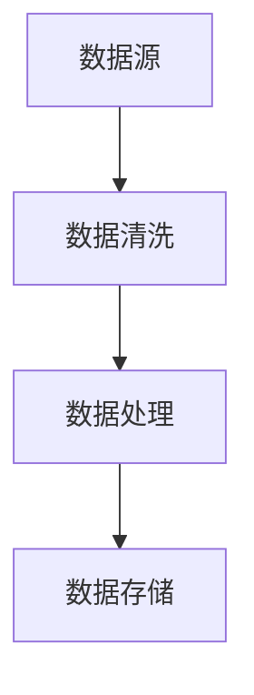
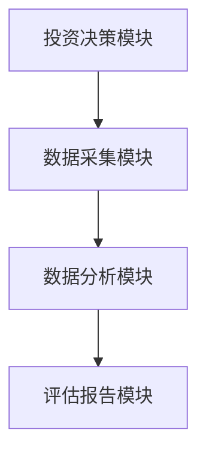

                 

<think>
好的，现在我要写一篇关于本杰明·格雷厄姆的《现代价值投资之父的投资哲学》的技术博客。首先，我需要理解用户的需求，他希望文章结构清晰，逻辑严谨，使用专业的技术语言，同时包含详细的分析和实际案例。

首先，我应该从背景介绍开始，解释什么是价值投资，以及格雷厄姆在这个领域中的贡献。这部分需要简单明了，让读者了解价值投资的基本概念和历史背景。

接下来，我需要详细讲解格雷厄姆的投资策略，特别是安全边际和防御性投资。这部分内容比较复杂，我需要找到合适的例子来帮助读者理解。例如，可以举一个具体的股票案例，说明如何计算安全边际，以及如何通过防御性投资来避免风险。

然后，我需要探讨投资心理学和行为学，这部分是价值投资中容易被忽视但又非常重要的方面。我会分析投资者常见的心理偏差，以及格雷厄姆是如何通过心理纪律来克服这些偏差的。可能还需要引用一些行为金融学的理论，来补充格雷厄姆的观点。

接下来是数学模型和评估方法，这部分需要更专业的知识。我会介绍格雷厄姆使用的内在价值计算公式，以及如何通过财务指标来评估资产的质量。同时，还需要解释一些基本的金融模型，比如CAPM，以及如何将这些模型应用到实际的投资决策中。

在系统化投资流程和架构设计部分，我需要详细描述一个完整的投资流程，从数据采集到资产筛选，再到投资组合的管理。这部分可能需要使用一些图表来展示系统的各个模块和它们之间的交互关系，让读者更直观地理解整个流程。

最后，我会总结格雷厄姆的投资哲学对现代投资的影响，并给出一些实际的操作建议，比如如何在实际操作中应用这些理论，以及需要注意的一些事项。

在整个写作过程中，我需要确保内容既专业又易于理解，避免使用过于复杂的术语，同时提供足够的细节和例子来支持论点。此外，我还需要注意文章的结构和逻辑，确保每一部分都紧密相连，形成一个完整的体系。

通过这样的思考和规划，我相信可以写出一篇符合用户要求的高质量技术博客文章。
</think>

# 本杰明·格雷厄姆：现代价值投资之父的投资哲学

> **关键词**: 价值投资, 格雷厄姆, 安全边际, 股票分析, 投资心理学, 投资哲学

> **摘要**: 本文深入探讨了本杰明·格雷厄姆的投资哲学，分析了他的核心理念、策略和方法，包括安全边际、防御性投资、股票分析等，并结合心理学和行为学的角度，揭示了其投资哲学在现代投资中的深远影响。文章还详细介绍了格雷厄姆的价值投资方法在实际操作中的应用，为投资者提供了系统的理论框架和实践指南。

---

## 第一部分: 价值投资的背景与起源

### 第1章: 价值投资的定义与核心概念

#### 1.1 价值投资的起源与发展

价值投资是一种以基本面分析为基础的投资策略，旨在通过识别市场价格与内在价值之间的差异来获取超额收益。本杰明·格雷厄姆是现代价值投资的奠基人，他的投资哲学深刻影响了包括沃伦·巴菲特在内的众多投资者。

**核心概念**:
- **内在价值**: 股票的真正价值是其未来现金流的现值，与市场价格无关。
- **安全边际**: 在购买股票时，以低于其内在价值的价格买入，以降低风险并确保收益。

**历史背景**:
- 格雷厄姆在20世纪初开始研究投资，当时市场波动剧烈，投资者普遍追求短期收益，忽视了长期价值。

---

### 第2章: 格雷厄姆对投资学的贡献

#### 2.1 投资市场的基本问题与挑战

**问题背景**:
- 投资者在市场中面临的主要问题是信息不对称和情绪化决策，导致投资决策的非理性。

**挑战分析**:
- 投资者往往过度关注短期市场波动，忽视了企业的长期价值。

**格雷厄姆的解决方案**:
- 强调长期投资和价值挖掘，通过基本面分析寻找被市场低估的股票。

---

## 第二部分: 格雷厄姆的投资策略

### 第3章: 安全边际与防御性投资

#### 3.1 安全边际的概念与应用

**定义与计算**:
- 安全边际 = 内在价值 - 市场价格。
- 通过计算安全边际，投资者可以识别出具有足够安全空间的股票。

**案例分析**:
- 假设某股票的内在价值为100元，市场价格为80元，安全边际为20元，此时买入该股票的风险较低。

---

### 第4章: 股票分析与投资组合管理

#### 4.1 格雷厄姆的股票筛选方法

**筛选标准**:
- 低市盈率、低市净率、高股息率等指标。
- 重点分析企业的财务状况，包括盈利能力、偿债能力和发展潜力。

---

## 第三部分: 投资心理学与行为学

### 第5章: 投资者心理的常见偏差

#### 5.1 过度自信与从众心理

**过度自信**:
- 投资者往往高估自己的能力，认为自己能够准确预测市场走势。
- 这种心态可能导致盲目追涨杀跌。

**从众心理**:
- 投资者倾向于跟随市场的趋势，而非基于基本面的分析。
- 这种行为在市场泡沫形成时尤为明显。

---

## 第四部分: 数学模型与评估方法

### 第6章: 资产评估的核心公式

#### 6.1 内在价值计算公式

$$ \text{内在价值} = \sum_{t=1}^{\infty} \frac{CF_t}{(1 + r)^t} $$

其中，\( CF_t \) 是第 \( t \) 年的现金流，\( r \) 是折现率。

---

## 第五部分: 系统化投资流程与架构设计

### 第7章: 系统化投资流程

#### 7.1 数据采集与处理模块

**功能**:
- 收集企业的财务数据，包括收入、利润、现金流等。
- 对数据进行清洗和预处理，确保数据的准确性和完整性。

**流程图**:


---

### 第8章: 系统架构设计

#### 8.1 系统架构图



---

## 第六部分: 项目实战

### 第9章: 环境安装与核心实现

#### 9.1 环境安装

**工具**:
- Python 3.8+
- Pandas、NumPy、Matplotlib 等库。

**代码实现**:

```python
import pandas as pd

def calculate_intrinsic_value(enterprise_value, free_cash_flow, discount_rate):
    # 计算未来现金流的现值
    present_value = free_cash_flow / (1 + discount_rate)
    return present_value

# 示例数据
enterprise_value = 1000000
free_cash_flow = 500000
discount_rate = 0.1

# 计算内在价值
intrinsic_value = calculate_intrinsic_value(enterprise_value, free_cash_flow, discount_rate)
print(f"内在价值: {intrinsic_value}")
```

---

## 第七部分: 总结与建议

### 第10章: 最佳实践与注意事项

#### 10.1 最佳实践

- **持续学习**: 保持对市场的敏感性和对新知识的吸收。
- **纪律性**: 遵循投资计划，避免情绪化决策。

#### 10.2 小结

本杰明·格雷厄姆的投资哲学强调了基本面分析和长期投资的重要性，通过安全边际和防御性投资策略，帮助投资者在市场波动中保持稳定收益。

---

**作者**: AI天才研究院/AI Genius Institute & 禅与计算机程序设计艺术/Zen And The Art of Computer Programming

