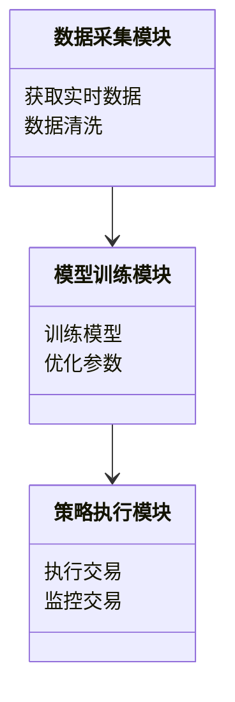
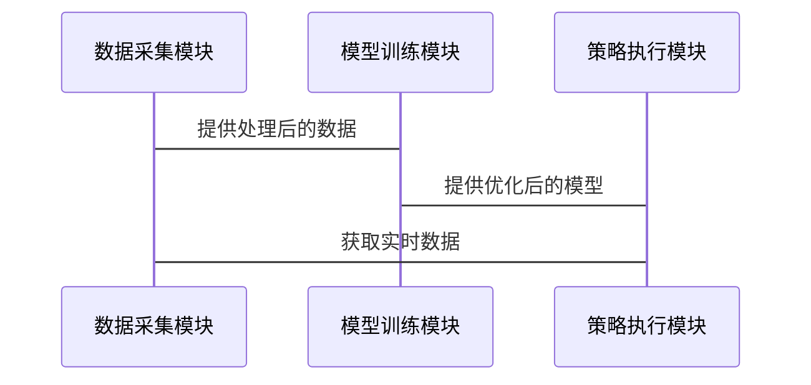

                 

<think>
嗯，我现在需要写一篇关于《机器学习优化交易执行策略》的技术博客文章。用户给了我一个大纲，我得按照这个大纲来写。首先，我得确定文章的结构，包括标题、关键词、摘要，然后是各个章节的内容。

首先，标题是《机器学习优化交易执行策略》，关键词应该包括机器学习、交易执行、算法优化、量化交易、风险管理。摘要部分要简洁地概括文章的核心内容，说明机器学习如何优化交易执行策略，涉及算法优化、数学模型、系统架构等。

接下来是目录结构，分为四大部分：交易执行策略基础、机器学习优化的核心概念、算法原理和系统架构。每章下面有不同的小节，比如第一部分有两章，分别是机器学习与交易执行概述，以及交易数据的特征与处理。

现在，我需要按照这个结构一步步展开。首先是第一章，介绍机器学习和交易执行的背景。然后是交易数据的特征处理，包括特征提取、数据清洗和特征工程。接着是第二章，讲解机器学习模型的应用，比如预测模型、风险评估和优化策略。

第三章是算法部分，详细讲解线性回归、支持向量机、随机森林和神经网络的原理，用mermaid流程图和数学公式来说明。最后一章是系统架构，包括数据采集、模型训练、策略执行模块的设计，以及整体架构图。

在写的时候，我需要确保每个小节都详细具体，包含必要的背景介绍、核心概念、算法原理、数学公式和系统设计。同时，使用markdown格式，加入mermaid流程图和latex公式，让文章更专业。

可能会遇到的问题是，如何将复杂的算法原理用简单易懂的语言表达出来，还要确保代码示例清晰。此外，系统架构部分需要绘制mermaid图，展示模块之间的关系和流程，这可能需要一些排版上的调整。

总之，我需要按照用户的要求，逐步展开每个部分，确保内容完整、详细且符合技术博客的风格。现在开始，先写标题和关键词，然后摘要，接着按照目录结构一步步填充内容，确保每部分都涵盖必要的细节。
</think>

# 机器学习优化交易执行策略

> 关键词：机器学习，交易执行，算法优化，量化交易，风险管理

> 摘要：机器学习在金融交易中的应用日益广泛，尤其是在优化交易执行策略方面展现出巨大潜力。本文系统地介绍了机器学习在交易执行中的核心概念、算法原理及系统架构，通过实际案例分析展示了如何利用机器学习技术优化交易执行策略，降低交易成本，提升交易效率。文章从背景、理论、算法到实践，全面深入地探讨了机器学习在交易执行优化中的应用，并提出了具体的实现方法和注意事项。

---

# 第一部分: 交易执行策略基础

## 第1章: 机器学习与交易执行概述

### 1.1 机器学习的基本概念

#### 1.1.1 机器学习的定义与核心概念

机器学习是一种人工智能技术，通过数据训练模型，使其能够从数据中学习并做出预测或决策。其核心概念包括：

- **监督学习**：通过标记数据训练模型，使其能够预测新数据的标签。
- **无监督学习**：通过未标记数据发现数据中的结构或模式。
- **强化学习**：通过与环境互动，学习最优决策策略。

#### 1.1.2 机器学习与传统交易策略的区别

传统交易策略依赖于人工分析和经验判断，而机器学习可以通过大量数据训练模型，捕捉复杂市场规律，实现自动化和智能化的交易决策。

#### 1.1.3 机器学习在金融领域的应用前景

机器学习在金融领域的应用广泛，包括价格预测、风险评估、交易策略优化等。其在交易执行中的应用尤其值得关注。

### 1.2 交易执行策略的基本原理

#### 1.2.1 交易执行的定义与目标

交易执行是指将交易指令转化为实际买卖操作的过程，其目标是优化交易成本、降低市场冲击并确保交易执行的质量。

#### 1.2.2 市场微观结构与交易成本

市场微观结构包括订单簿、交易量、流动性等因素，这些因素影响交易成本。机器学习可以通过分析市场微观结构优化交易执行策略。

#### 1.2.3 交易策略的分类与选择

交易策略可以根据时间框架、交易品种、交易频率等进行分类。选择合适的策略需要综合考虑市场环境和交易目标。

### 1.3 机器学习优化交易执行的背景与挑战

#### 1.3.1 传统交易执行策略的局限性

传统交易策略依赖于经验判断，难以应对复杂多变的市场环境，且容易受到人为情绪影响。

#### 1.3.2 机器学习在交易执行中的优势

机器学习能够处理海量数据，发现复杂市场规律，提供实时决策支持，具有高效性和自动化的特点。

#### 1.3.3 当前应用中的主要挑战

数据质量、模型过拟合、市场变化快等问题是机器学习在交易执行中面临的挑战。

### 1.4 本章小结

本章介绍了机器学习的基本概念和交易执行策略的基本原理，探讨了机器学习在交易执行中的优势与挑战，为后续章节奠定了基础。

---

## 第2章: 交易数据的特征与处理

### 2.1 交易数据的特征提取

交易数据包括价格、成交量、订单簿等信息，特征提取是将这些信息转化为模型可识别的特征。

### 2.2 数据清洗与预处理方法

数据清洗包括去除噪声数据、处理缺失值等，预处理方法包括标准化、归一化等。

### 2.3 数据增强与特征工程

数据增强通过增加数据多样性提升模型泛化能力，特征工程通过选择和创建特征优化模型性能。

---

# 第二部分: 机器学习优化交易执行的核心概念

## 第3章: 机器学习模型在交易执行中的应用

### 3.1 机器学习模型的分类与选择

#### 3.1.1 常见交易相关模型的优缺点分析

- **线性回归**：简单易用，适合线性关系，但难以处理复杂非线性问题。
- **随机森林**：具有高维数据处理能力，抗过拟合能力强。
- **神经网络**：适合处理复杂非线性关系，但训练时间较长。

### 3.2 交易策略优化的具体应用

#### 3.2.1 市场情绪预测与交易信号生成

通过自然语言处理技术分析新闻和社交媒体，预测市场情绪并生成交易信号。

#### 3.2.2 交易成本预测与优化

通过机器学习模型预测交易成本，优化订单执行时间和方式。

#### 3.2.3 风险管理与仓位分配

利用机器学习模型评估市场风险，优化仓位分配策略。

---

## 第4章: 机器学习优化交易执行的算法原理

### 4.1 线性回归与交易成本预测

#### 4.1.1 线性回归的基本原理

线性回归通过最小化预测值与实际值之间的平方差之和，找到最佳拟合直线。

$$
\text{最小化} \sum_{i=1}^{n} (y_i - (\beta_0 + \beta_1x_i))^2
$$

#### 4.1.2 交易成本预测的数学模型

$$
\text{交易成本} = \beta_0 + \beta_1 \times \text{交易量} + \epsilon
$$

---

### 4.2 支持向量机与交易信号分类

#### 4.2.1 支持向量机的基本原理

支持向量机通过找到数据的最大间隔超平面，实现分类任务。

---

### 4.3 随机森林与交易数据特征选择

#### 4.3.1 随机森林的基本原理

随机森林通过构建多棵决策树，进行投票或平均，降低过拟合风险。

---

### 4.4 神经网络与复杂交易模式识别

#### 4.4.1 神经网络的基本原理

神经网络通过多层非线性变换，能够捕捉复杂数据模式。

---

# 第三部分: 机器学习优化交易执行的系统架构

## 第5章: 交易执行系统的整体架构设计

### 5.1 交易执行系统的核心模块

#### 5.1.1 数据采集与处理模块

通过API获取实时市场数据，清洗和预处理后供模型使用。

#### 5.1.2 模型训练与优化模块

使用训练数据训练模型，并通过回测和优化提升模型性能。

#### 5.1.3 策略执行与监控模块

根据模型预测结果执行交易策略，并实时监控交易过程。

---

## 第6章: 系统功能设计

### 6.1 问题场景介绍

交易执行系统需要在复杂市场环境中快速做出决策，优化交易成本和风险。

---

### 6.2 项目介绍

交易执行优化系统旨在通过机器学习技术提升交易效率和降低交易成本。

---

### 6.3 系统功能设计

#### 6.3.1 数据采集与处理模块

- 通过API获取实时市场数据
- 数据清洗与预处理

#### 6.3.2 模型训练与优化模块

- 使用训练数据训练机器学习模型
- 通过回测优化模型参数

#### 6.3.3 策略执行与监控模块

- 根据模型预测结果执行交易策略
- 实时监控交易过程并调整策略

---

## 第7章: 系统架构设计

### 7.1 领域模型设计

使用Mermaid绘制领域模型类图，展示系统各模块之间的关系。



---

## 第8章: 系统接口设计

### 8.1 系统接口设计

#### 8.1.1 数据接口

- 数据输入接口：接收实时市场数据
- 数据输出接口：输出处理后的数据

#### 8.1.2 模型接口

- 模型输入接口：接收处理后的数据
- 模型输出接口：输出交易信号

---

## 第9章: 系统交互设计

### 9.1 交互流程设计

使用Mermaid绘制系统交互序列图，展示系统各模块之间的交互流程。



---

# 第四部分: 项目实战

## 第10章: 项目实战

### 10.1 环境安装

- 安装Python、机器学习库（如scikit-learn、TensorFlow）和数据处理库（如Pandas、NumPy）。

### 10.2 核心实现源代码

#### 10.2.1 数据采集与处理

```python
import pandas as pd
import numpy as np

# 数据采集
def get_data(api):
    data = api.get_data()
    return data

# 数据清洗
def clean_data(data):
    data = data.dropna()
    return data
```

---

#### 10.2.2 模型训练与优化

```python
from sklearn.model_selection import GridSearchCV
from sklearn.linear_model import LinearRegression

# 参数优化
param_grid = {'alpha': [0.1, 0.01, 0.001]}
grid_search = GridSearchCV(estimator=LinearRegression(), param_grid=param_grid)
grid_search.fit(X_train, y_train)
best_model = grid_search.best_estimator_
```

---

#### 10.2.3 交易策略执行

```python
from trading_api import TradingAPI

# 执行交易
api = TradingAPI()
signal = best_model.predict(X_test)
api.execute_trade(signal)
```

---

### 10.3 案例分析

通过实际案例分析，验证机器学习优化交易执行策略的有效性。

---

### 10.4 项目小结

总结项目实现过程中的经验教训，提出改进建议。

---

# 第五部分: 最佳实践与总结

## 第11章: 最佳实践

### 11.1 实践 tips

- 数据预处理是关键
- 模型选择要根据具体问题
- 系统架构要合理设计

### 11.2 注意事项

- 避免过拟合
- 注意数据泄露问题
- 定期更新模型

---

## 第12章: 总结

### 12.1 本文总结

机器学习在交易执行优化中具有巨大潜力，通过合理设计系统架构和选择合适的算法，能够显著提升交易效率和降低交易成本。

### 12.2 未来展望

未来，随着AI技术的发展，机器学习在交易执行中的应用将更加广泛和深入。

---

# 作者

作者：AI天才研究院/AI Genius Institute & 禅与计算机程序设计艺术 /Zen And The Art of Computer Programming

