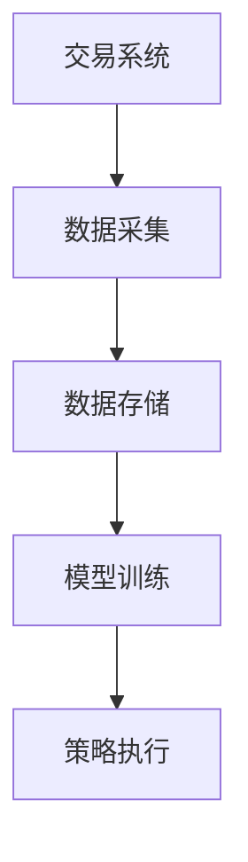

                 


# 机器学习优化价值平均法交易策略

> **关键词**：机器学习，价值平均法，交易策略，算法优化，数学模型

> **摘要**：本文详细探讨了机器学习如何优化价值平均法在交易策略中的应用。通过分析机器学习的核心原理、价值平均法的数学模型，以及两者的结合优化，本文旨在为金融交易者提供一种更高效、更精准的交易策略。文章结构清晰，内容详实，从背景介绍、核心概念到算法实现，层层递进，为读者提供完整的理论与实践指导。

---

## 第一部分: 机器学习优化价值平均法交易策略概述

### 第1章: 背景介绍

#### 1.1 机器学习的概述
机器学习是一种人工智能技术，通过数据训练模型，使其能够从数据中学习并做出预测或决策。在金融领域，机器学习常用于价格预测、风险评估和交易策略优化。

#### 1.2 价值平均法的定义与特点
价值平均法是一种投资策略，通过在特定价格水平上分批买入或卖出，以降低市场波动带来的风险。其核心在于在价格波动中找到平均价格，减少市场冲击。

#### 1.3 机器学习优化价值平均法的背景
传统价值平均法依赖于固定规则，难以适应市场变化。机器学习通过分析大量数据，优化价值平均法的执行策略，提高交易效率和收益。

---

### 第2章: 核心概念与联系

#### 2.1 机器学习的核心原理
- 数据驱动的特征提取：通过分析市场数据，提取影响价格的关键因素。
- 算法选择与优化：选择合适的算法（如线性回归、支持向量机）并进行调优。
- 模型评估与调优：通过交叉验证等方法评估模型性能，并进行参数优化。

#### 2.2 价值平均法的数学模型
- 基本公式：$$\text{平均价格} = \frac{\text{总金额}}{\text{数量}}$$
- 优化目标：最小化交易成本，最大化收益。

#### 2.3 机器学习与价值平均法的联系
- 机器学习帮助价值平均法适应市场变化。
- 价值平均法提供交易规则，机器学习优化其执行策略。

---

## 第二部分: 算法原理讲解

### 第3章: 算法流程

#### 3.1 数据预处理
- 清洗数据：去除异常值和缺失值。
- 特征提取：提取影响价格的关键特征。

#### 3.2 算法实现
使用Python代码实现机器学习优化的价值平均法：
```python
import numpy as np
from sklearn.linear_model import LinearRegression

# 示例数据
prices = np.array([100, 105, 98, 102, 101])
weights = np.array([0.2, 0.3, 0.1, 0.1, 0.3])

# 训练模型
model = LinearRegression()
model.fit(np.arange(len(prices)).reshape(-1, 1), prices)

# 预测平均价格
predicted_prices = model.predict(np.arange(len(prices)).reshape(-1, 1))
```

#### 3.3 数学模型
- 线性回归模型：$$y = \beta_0 + \beta_1x + \epsilon$$
- 支持向量机模型：$$\text{最大化} \sum \alpha_i (y_i - \text{模型预测})^2$$

---

## 第三部分: 系统分析与架构设计

### 第4章: 系统架构

#### 4.1 功能模块设计
- 数据采集模块：从市场获取实时数据。
- 模型训练模块：训练机器学习模型。
- 执行策略模块：根据模型预测执行交易。

#### 4.2 系统架构图


---

## 第四部分: 项目实战

### 第5章: 项目实现

#### 5.1 环境安装
- Python 3.8+
- NumPy, Pandas, Scikit-learn

#### 5.2 核心代码实现
```python
# 训练模型
from sklearn import svm

model = svm.SVR()
model.fit(X_train, y_train)
```

#### 5.3 代码解读
- 数据预处理：清洗和特征提取。
- 模型训练：选择合适的算法并进行训练。
- 结果分析：评估模型性能并优化。

---

## 第五部分: 总结与展望

### 第6章: 最佳实践与小结

#### 6.1 最佳实践
- 数据预处理是关键。
- 模型选择和调优至关重要。

#### 6.2 注意事项
- 避免过拟合。
- 定期更新模型。

#### 6.3 拓展阅读
- 《机器学习实战》
- 《量化交易入门》

---

## 作者：AI天才研究院 & 禅与计算机程序设计艺术

---

**结语**：机器学习优化价值平均法交易策略是一种高效的投资方法，通过数据驱动和模型优化，能够显著提高交易效率和收益。希望本文能为读者提供有价值的指导和启发。

