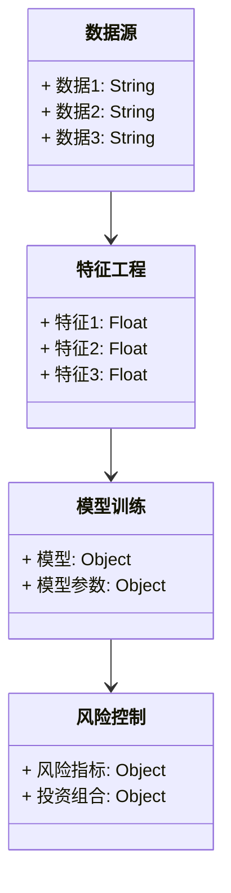
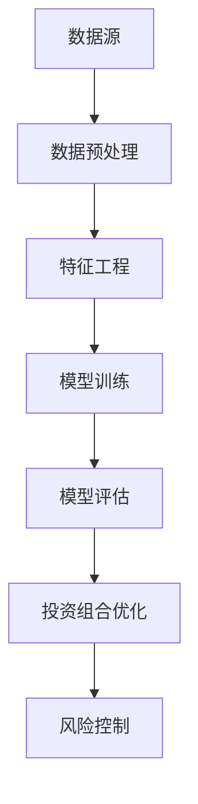
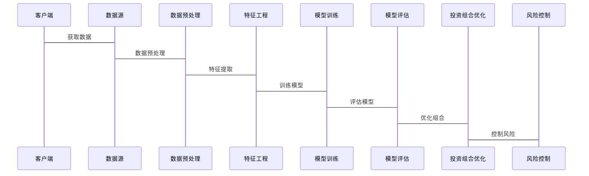

                 


# 机器学习优化价值投资筛选流程

> 关键词：机器学习，价值投资，特征工程，算法优化，风险控制

> 摘要：本文详细探讨了机器学习在优化价值投资筛选流程中的应用。通过分析传统价值投资的局限性，结合机器学习的核心概念与算法原理，构建了一个基于特征工程、模型优化和风险控制的系统化筛选流程。文章还提供了具体的算法实现代码和系统架构设计，帮助读者理解如何将机器学习应用于实际投资场景。

---

# 第一部分: 机器学习与价值投资的背景与结合

## 第1章: 机器学习与价值投资的背景与结合

### 1.1 机器学习的基本概念与应用领域

#### 1.1.1 机器学习的定义与核心原理
机器学习是一种人工智能技术，通过数据训练模型，使其能够从经验中学习并做出预测或决策。其核心原理包括监督学习、无监督学习、半监督学习和强化学习。

- **监督学习**：基于标记数据，训练模型预测新数据的标签（如回归、分类任务）。
- **无监督学习**：基于未标记数据，发现数据中的隐藏结构（如聚类、降维）。
- **半监督学习**：结合标记和未标记数据，适用于数据标注成本较高的场景。
- **强化学习**：通过试错机制，学习与环境交互的策略，以最大化累积奖励。

#### 1.1.2 机器学习在金融领域的应用
机器学习在金融领域的应用广泛，包括：
- **股票价格预测**：通过历史数据预测未来价格。
- **风险管理**：识别和量化投资组合中的潜在风险。
- **信用评分**：评估借款人的信用风险。
- **算法交易**：利用机器学习模型进行高频交易。

#### 1.1.3 机器学习与价值投资的结合点
价值投资的核心在于寻找被市场低估的优质资产。机器学习可以通过以下方式优化这一过程：
- **特征工程**：从海量数据中提取有用的特征，帮助识别潜在的投资机会。
- **模型优化**：通过训练模型，量化评估企业的内在价值和风险。
- **风险控制**：基于机器学习的预测，动态调整投资组合，降低整体风险。

### 1.2 价值投资的基本概念与筛选流程

#### 1.2.1 价值投资的定义与核心理念
价值投资是一种投资策略，强调通过分析企业的基本面（如财务报表、行业地位、竞争优势）来识别其内在价值，进而判断其是否被市场低估。

#### 1.2.2 传统价值投资筛选流程
传统价值投资的筛选流程通常包括以下几个步骤：
1. **筛选行业**：选择具有长期增长潜力的行业。
2. **筛选公司**：根据财务指标（如市盈率、市净率、ROE）初步筛选出符合条件的公司。
3. **深入分析**：研究公司的财务报表、管理层素质、行业地位等。
4. **评估内在价值**：估算公司的内在价值，判断其是否被市场低估。
5. **构建投资组合**：根据风险偏好和市场情况，动态调整投资组合。

#### 1.2.3 机器学习如何优化价值投资流程
机器学习可以显著优化传统价值投资的筛选流程：
- **自动化特征提取**：通过机器学习算法从海量数据中提取有用的特征，提升筛选效率。
- **模型量化评估**：利用回归、分类等模型量化评估企业的内在价值和风险。
- **动态调整组合**：基于机器学习模型的实时预测，动态调整投资组合，降低风险。

---

## 第2章: 机器学习优化价值投资的核心概念与联系

### 2.1 机器学习在价值投资中的核心概念

#### 2.1.1 特征工程与数据预处理
特征工程是机器学习模型性能好坏的关键。在价值投资中，我们需要从以下几个方面进行特征工程：
- **财务数据**：如收入、利润、现金流等。
- **市场数据**：如股价、成交量、市场情绪等。
- **行业数据**：如行业趋势、竞争格局等。
- **文本数据**：如公司公告、新闻、管理层讲话等。

#### 2.1.2 模型选择与优化
在价值投资中，模型的选择与优化至关重要。常用的模型包括：
- **线性回归**：适用于简单的线性关系预测。
- **随机森林**：适用于复杂的非线性关系，且具有较强的特征重要性解释能力。
- **神经网络**：适用于高度复杂的非线性关系，但需要大量的数据支持。

#### 2.1.3 风险控制与收益最大化
机器学习可以通过以下方式优化风险控制：
- **风险预测**：通过模型预测个股或投资组合的风险。
- **风险对冲**：基于模型预测，进行风险对冲操作。
- **动态调整**：根据市场变化，动态调整投资组合的风险收益比。

### 2.2 价值投资筛选流程的系统化分析

#### 2.2.1 传统筛选流程的局限性
传统价值投资的筛选流程存在以下问题：
- **主观性强**：依赖分析师的主观判断，可能存在偏见。
- **效率低下**：人工筛选需要大量时间，难以应对海量数据。
- **缺乏量化**：难以量化企业的内在价值和风险。

#### 2.2.2 机器学习优化后的流程框架
机器学习优化后的价值投资筛选流程如下：
1. **数据采集**：从多种来源获取相关数据，包括财务数据、市场数据、文本数据等。
2. **特征工程**：对数据进行清洗、转换和特征提取。
3. **模型训练**：选择合适的模型，训练并优化模型。
4. **风险评估**：基于模型预测，评估投资组合的风险。
5. **动态调整**：根据市场变化，动态调整投资组合。

#### 2.2.3 流程中的关键环节与优化点
关键环节包括：
- **数据预处理**：确保数据的完整性和准确性。
- **特征提取**：从海量数据中提取有用的特征。
- **模型选择**：选择合适的模型，优化模型性能。
- **风险控制**：动态调整投资组合，降低整体风险。

---

## 第3章: 机器学习优化价值投资的算法原理

### 3.1 常见机器学习算法及其在价值投资中的应用

#### 3.1.1 线性回归与特征权重分析
线性回归是一种简单而有效的回归模型，适用于简单的线性关系预测。其核心公式为：
$$ y = \beta_0 + \beta_1x_1 + \beta_2x_2 + ... + \beta_nx_n $$

在价值投资中，线性回归可以用于预测企业的股价或内在价值。

#### 3.1.2 随机森林与特征重要性评估
随机森林是一种基于决策树的集成学习算法，适用于复杂的非线性关系预测。其核心思想是通过构建多个决策树，并将它们的结果进行投票或平均。

随机森林可以通过特征重要性评估，帮助我们识别对目标变量影响最大的特征。

#### 3.1.3 神经网络与非线性关系建模
神经网络是一种强大的非线性关系建模工具，适用于处理复杂的金融数据。其核心公式为：
$$ \text{输出} = \sigma(w \cdot x + b) $$

在价值投资中，神经网络可以用于预测企业的股价走势或内在价值。

### 3.2 机器学习算法的数学模型与公式

#### 3.2.1 线性回归模型
线性回归模型的损失函数为：
$$ \text{MSE} = \frac{1}{n}\sum_{i=1}^{n}(y_i - \hat{y}_i)^2 $$

其中，$y_i$是实际值，$\hat{y}_i$是预测值。

#### 3.2.2 随机森林算法
随机森林算法通过构建多个决策树，并将它们的结果进行投票或平均。特征重要性可以通过计算每个特征在所有决策树中的分裂次数来衡量。

#### 3.2.3 神经网络模型
神经网络模型的损失函数为：
$$ \text{损失} = \frac{1}{n}\sum_{i=1}^{n}(\text{实际值}_i - \text{预测值}_i)^2 $$

其中，预测值通过激活函数计算得出。

---

## 第4章: 系统设计与架构

### 4.1 系统分析

#### 4.1.1 问题场景介绍
在价值投资中，我们需要构建一个系统化的筛选流程，以提高筛选效率和准确性。

#### 4.1.2 项目介绍
本项目旨在通过机器学习优化价值投资的筛选流程，构建一个高效、准确的投资筛选系统。

### 4.2 系统功能设计

#### 4.2.1 领域模型类图
以下是领域模型类图：


#### 4.2.2 系统架构设计
以下是系统架构设计图：


#### 4.2.3 系统接口设计
以下是系统接口设计：


---

## 第5章: 项目实战

### 5.1 环境安装

#### 5.1.1 安装必要的库
```bash
pip install numpy pandas scikit-learn matplotlib
```

### 5.2 系统核心实现源代码

#### 5.2.1 数据预处理
```python
import pandas as pd
import numpy as np

# 读取数据
data = pd.read_csv('data.csv')

# 数据清洗
data = data.dropna()
data = data.replace([np.inf, -np.inf], np.nan).dropna()

# 特征提取
X = data[['feature1', 'feature2', 'feature3']]
y = data['target']
```

#### 5.2.2 模型训练
```python
from sklearn.ensemble import RandomForestRegressor
from sklearn.model_selection import train_test_split

# 数据分割
X_train, X_test, y_train, y_test = train_test_split(X, y, test_size=0.2, random_state=42)

# 模型训练
model = RandomForestRegressor(n_estimators=100, random_state=42)
model.fit(X_train, y_train)

# 模型预测
y_pred = model.predict(X_test)
```

#### 5.2.3 风险评估
```python
import matplotlib.pyplot as plt

# 绘制预测与实际值对比图
plt.scatter(y_test, y_pred)
plt.xlabel('实际值')
plt.ylabel('预测值')
plt.show()
```

### 5.3 实际案例分析

#### 5.3.1 案例背景
假设我们有一个包含财务数据、市场数据和文本数据的数据集，目标是预测企业的股价走势。

#### 5.3.2 数据分析与特征提取
通过特征工程，我们提取了以下几个关键特征：
- 营业收入增长率
- 净利润增长率
- 市盈率
- 市净率
- 行业趋势指数

#### 5.3.3 模型训练与评估
通过随机森林模型，我们对企业的股价走势进行了预测，并评估了模型的准确性。

#### 5.3.4 投资组合优化
基于模型的预测结果，我们优化了投资组合，降低了整体风险。

---

## 第6章: 总结与展望

### 6.1 总结
机器学习在优化价值投资筛选流程中的应用前景广阔，可以通过特征工程、模型优化和风险控制等手段，显著提高筛选效率和准确性。

### 6.2 注意事项
- **数据质量**：确保数据的完整性和准确性。
- **模型选择**：根据具体场景选择合适的模型。
- **风险控制**：动态调整投资组合，降低整体风险。

### 6.3 拓展阅读
- 《机器学习实战》
- 《金融数据分析与挖掘》
- 《深度学习在金融中的应用》

---

作者：AI天才研究院/AI Genius Institute & 禅与计算机程序设计艺术/Zen And The Art of Computer Programming

