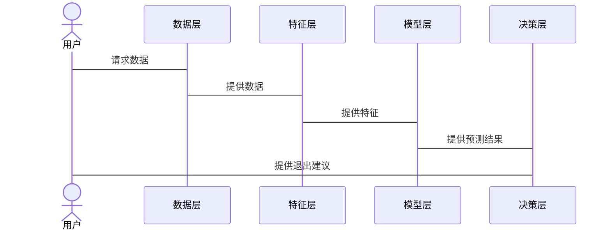

                 

<think>
好的，我现在需要根据用户的要求，撰写《机器学习优化价值投资退出决策》这本书的详细目录和内容。用户已经提供了一个大纲，但还需要进一步细化，确保每个部分都符合要求。

首先，我需要理解用户的需求。他们希望文章结构清晰，逻辑严密，涵盖机器学习在价值投资中的应用，特别是退出决策的优化。用户还特别强调每个章节需要详细讲解，包括背景、核心概念、算法原理、系统设计、项目实战和小结。

接下来，我需要按照用户提供的目录结构，逐步细化每个部分。每个章节下还需要包含必要的子部分，如数学模型、算法流程图、系统架构图等。同时，要注意使用Mermaid图和Latex公式，确保内容专业且易于理解。

在撰写过程中，我需要确保语言简洁专业，同时逻辑清晰。每个章节的小结要总结核心内容，并提出进一步思考的问题，引导读者深入理解。

现在，我将开始逐步细化每个章节，确保覆盖所有必要的内容，并按照用户的格式和要求完成。
</think>

# 《机器学习优化价值投资退出决策》

## 关键词：机器学习，价值投资，退出决策，金融分析，优化算法

## 摘要：  
本文探讨了机器学习在优化价值投资退出决策中的应用。通过分析投资决策中的关键要素，结合机器学习算法，提出了一种基于数据驱动的退出决策优化模型。文章从机器学习基础、价值投资分析、退出决策优化算法、系统架构设计以及实际案例等多个方面展开，详细阐述了如何利用机器学习技术提升投资决策的科学性和准确性，最终实现投资收益的最大化。

---

# 第一部分：机器学习与价值投资基础

## 第1章：机器学习基础

### 1.1 机器学习概述

#### 1.1.1 机器学习的定义与核心概念
机器学习（Machine Learning）是人工智能（AI）的一个分支，旨在通过数据驱动的方法，训练计算机模型以实现特定任务，如分类、回归、聚类等。其核心在于模型能够从数据中学习规律，并用于预测或决策。

#### 1.1.2 机器学习的分类与应用场景
机器学习主要分为监督学习、无监督学习、强化学习和半监督学习。在金融领域，监督学习常用于股票价格预测和信用评分，无监督学习用于客户细分和异常检测，强化学习用于动态投资组合优化。

#### 1.1.3 机器学习在金融领域的潜力
金融数据的复杂性和非线性特征使得传统统计方法难以应对，而机器学习算法能够处理高维数据和复杂模式，为投资决策提供了新的可能性。

### 1.2 价值投资基础

#### 1.2.1 价值投资的定义与核心理念
价值投资是一种投资策略，强调以低于公平价值的价格买入优质资产。其核心理念是寻找市场低估的公司，长期持有以实现超额收益。

#### 1.2.2 价值投资的关键要素与决策流程
价值投资的关键要素包括公司基本面分析、财务指标评估、行业地位和竞争优势。决策流程通常包括筛选潜在标的、评估内在价值、确定安全边际和动态调整投资组合。

#### 1.2.3 价值投资与现代金融分析的结合
现代金融分析结合了定量和定性方法，而机器学习技术能够帮助投资者更精准地识别潜在投资机会和风险，优化价值投资决策。

---

## 第2章：机器学习在投资决策中的应用

### 2.1 机器学习在金融数据分析中的作用

#### 2.1.1 数据特征提取与分析
通过机器学习，投资者可以提取股票价格、财务报表和市场情绪等多维度数据的特征，识别潜在的投资信号。

#### 2.1.2 时间序列分析与预测
机器学习擅长处理时间序列数据，常用算法包括ARIMA、LSTM和Prophet模型，能够预测股票价格和市场趋势。

#### 2.1.3 风险评估与投资组合优化
通过聚类分析和回归模型，机器学习可以帮助投资者评估风险，优化投资组合以平衡收益与风险。

### 2.2 机器学习在价值投资中的优势

#### 2.2.1 数据驱动的决策优势
机器学习能够处理海量数据，发现传统方法难以察觉的模式，提供更精准的投资建议。

#### 2.2.2 模型的可解释性与鲁棒性
通过特征重要性分析和模型解释工具，投资者可以理解机器学习模型的决策逻辑，确保投资决策的透明性和可靠性。

#### 2.2.3 机器学习在市场情绪分析中的应用
利用自然语言处理（NLP）技术，机器学习可以从新闻、社交媒体等文本数据中提取市场情绪，辅助投资决策。

---

## 第3章：退出决策的优化模型

### 3.1 退出决策的核心问题

#### 3.1.1 退出决策的定义与目标
退出决策是指在特定条件下卖出投资标的，以实现收益最大化或风险最小化。其目标是确定最佳退出时机和方式。

#### 3.1.2 退出决策的关键影响因素
退出决策受市场环境、资产价格波动、投资期限和资金需求等因素的影响。

#### 3.1.3 退出决策的数学模型与优化目标
退出决策模型通常基于动态规划或优化算法，目标是最大化净现值（NPV）或最小化投资风险。

### 3.2 机器学习优化退出决策的原理

#### 3.2.1 机器学习在退出决策中的作用
机器学习能够预测市场趋势和资产价格，帮助投资者识别最佳退出时机。

#### 3.2.2 常见的退出决策优化算法
常用算法包括遗传算法、粒子群优化和深度学习模型，用于解决非线性优化问题。

#### 3.2.3 机器学习模型的评估与选择
模型评估指标包括准确率、召回率和F1分数，选择适合特定场景的算法和模型。

---

# 第二部分：机器学习算法与价值投资分析

## 第4章：机器学习算法原理

### 4.1 常见机器学习算法概述

#### 4.1.1 监督学习算法
监督学习算法包括线性回归、支持向量机（SVM）和随机森林，适用于回归和分类问题。

#### 4.1.2 非监督学习算法
非监督学习算法如聚类和降维技术（PCA），适用于无标签数据的分析。

#### 4.1.3 强化学习算法
强化学习通过试错机制优化决策过程，适用于动态环境中的投资策略优化。

### 4.2 机器学习算法在投资中的应用

#### 4.2.1 线性回归与投资回报预测
线性回归模型用于预测股票价格和投资回报，但其线性假设限制了复杂场景的应用。

#### 4.2.2 支持向量机在分类问题中的应用
SVM适用于高维数据分类，常用于识别股票的涨跌趋势。

#### 4.2.3 随机森林在特征选择中的应用
随机森林通过集成学习提高模型鲁棒性，适用于复杂特征的选择和分析。

---

## 第5章：价值投资中的特征工程

### 5.1 特征工程的重要性

#### 5.1.1 数据特征的选择与提取
特征工程包括特征选择、降维和数据增强，直接影响模型性能。

#### 5.1.2 特征的标准化与归一化
标准化和归一化处理确保不同特征在同一量纲下，提升模型训练效率。

#### 5.1.3 时间序列特征的构建
时间序列特征如移动平均和指数平滑，有助于捕捉数据的时序特性。

### 5.2 价值投资中的关键特征

#### 5.2.1 财务指标分析
财务指标如市盈率、市净率和ROE是评估公司价值的重要指标。

#### 5.2.2 市场情绪指标
市场情绪指标如VIX指数和社交媒体情感分析，反映市场风险偏好。

#### 5.2.3 公司基本面分析
公司基本面包括行业地位、竞争优势和管理团队，影响公司的长期价值。

---

## 第6章：机器学习模型的训练与优化

### 6.1 数据预处理与特征工程

#### 6.1.1 数据清洗与缺失值处理
数据清洗包括处理缺失值、异常值和重复数据，确保数据质量。

#### 6.1.2 特征选择与降维技术
特征选择通过去除冗余特征提升模型性能，降维技术如PCA降低计算复杂度。

#### 6.1.3 数据增强与样本平衡
数据增强技术如旋转和翻转适用于图像数据，样本平衡技术如SMOTE处理类别不平衡问题。

### 6.2 模型训练与调优

#### 6.2.1 模型训练流程
模型训练流程包括数据预处理、特征工程、模型选择、训练、验证和优化。

#### 6.2.2 超参数调优与网格搜索
超参数调优通过网格搜索或随机搜索找到最优参数组合，提升模型性能。

#### 6.2.3 模型评估与交叉验证
交叉验证技术如K折交叉验证评估模型泛化能力，防止过拟合。

---

# 第三部分：系统架构与项目实现

## 第7章：系统架构设计

### 7.1 问题场景介绍

#### 7.1.1 投资决策的复杂性
投资决策涉及多维度信息，需要综合分析市场、公司和行业因素。

#### 7.1.2 退出决策的挑战
退出决策需要在复杂市场环境中做出快速决策，具有较高的不确定性和风险。

### 7.2 项目介绍

#### 7.2.1 项目目标
本项目旨在构建一个基于机器学习的退出决策优化系统，帮助投资者实现收益最大化。

#### 7.2.2 项目范围
项目涵盖数据采集、特征工程、模型训练、系统设计和实际应用。

### 7.3 系统功能设计

#### 7.3.1 领域模型设计
领域模型包括数据层、特征层、模型层和决策层，展示各层之间的关系。


#### 7.3.2 系统架构设计
系统架构采用分层设计，包括数据采集、特征工程、模型训练和决策模块。


#### 7.3.3 系统接口设计
系统接口包括数据接口、模型接口和用户接口，确保各模块之间的协同工作。

#### 7.3.4 系统交互设计
系统交互流程包括数据输入、特征提取、模型训练和决策输出。



---

## 第8章：项目实战

### 8.1 环境安装

#### 8.1.1 安装Python和必要的库
安装Python和Pandas、NumPy、Scikit-learn、XGBoost和TensorFlow等库。

#### 8.1.2 数据采集与预处理
使用Yahoo Finance API获取股票数据，并进行数据清洗和特征工程。

### 8.2 系统核心实现源代码

#### 8.2.1 特征工程代码
```python
import pandas as pd
import numpy as np

# 数据加载
data = pd.read_csv('stock_data.csv')

# 数据清洗
data.dropna(inplace=True)
data = data[~data['volume'].isin([0])]

# 特征工程
data['log_return'] = np.log(data['close'] / data['close'].shift(1))
data['moving_avg'] = data['close'].rolling(5).mean()
```

#### 8.2.2 模型训练代码
```python
from sklearn.model_selection import train_test_split
from sklearn.ensemble import RandomForestClassifier
from sklearn.metrics import accuracy_score

# 数据分割
X = data[['log_return', 'moving_avg', 'volume']]
y = data['label']

X_train, X_test, y_train, y_test = train_test_split(X, y, test_size=0.2)

# 模型训练
model = RandomForestClassifier(n_estimators=100)
model.fit(X_train, y_train)

# 模型评估
y_pred = model.predict(X_test)
print("准确率:", accuracy_score(y_test, y_pred))
```

#### 8.2.3 退出决策代码
```python
# 退出决策逻辑
def should_exit(position, model):
    # 预测退出信号
    if model.predict(position)[0] == 1:
        return True
    else:
        return False
```

### 8.3 实际案例分析

#### 8.3.1 案例背景
以某科技公司为例，分析其股价走势和财务指标，构建机器学习模型预测退出时机。

#### 8.3.2 数据分析与模型训练
通过历史数据训练模型，评估模型在不同市场环境下的表现。

#### 8.3.3 模型优化与验证
通过回测和风险分析，验证模型的有效性和稳健性。

---

## 第9章：总结与展望

### 9.1 总结
本文详细探讨了机器学习在优化价值投资退出决策中的应用，提出了基于数据驱动的优化模型，并通过实际案例展示了模型的可行性和有效性。

### 9.2 未来展望
未来研究可以进一步探索深度学习技术在复杂场景中的应用，结合多模态数据（如文本和图像）提升模型性能。此外，实时交易系统和动态优化算法也是重要的发展方向。

---

# 作者：AI天才研究院/AI Genius Institute & 禅与计算机程序设计艺术 /Zen And The Art of Computer Programming

---

本文通过系统的分析和实际案例，展示了机器学习在优化价值投资退出决策中的巨大潜力。从理论到实践，从模型构建到系统实现，为投资者提供了全新的视角和工具，帮助他们在复杂多变的市场中做出更明智的决策。

