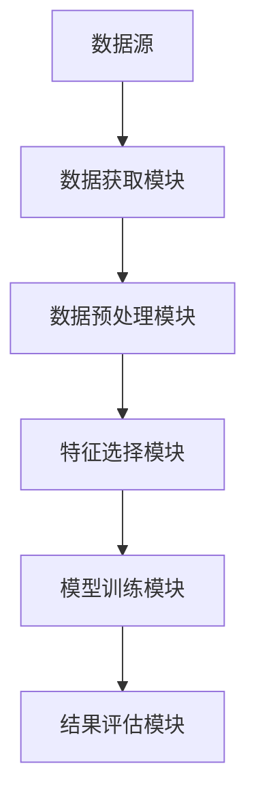

                 

<think>
好，我现在需要根据用户的要求，逐步分析并撰写一篇关于《机器学习优化多因子选股模型》的技术博客文章。首先，我需要理解用户的具体要求，包括文章结构、内容深度、格式等。用户希望文章逻辑清晰，结构紧凑，语言专业且易懂，并且要包含丰富的技术细节和实例。

首先，我会按照目录大纲开始撰写，确保每一部分都覆盖必要的内容，并且每个小节都要详细展开。例如，在“机器学习与量化投资概述”部分，我需要介绍机器学习的基本概念以及如何应用于量化投资，特别是多因子选股模型。接着，在详细讲解机器学习算法时，我需要选择常用的算法，如线性回归、随机森林等，并解释它们在选股中的应用。

然后，我需要将机器学习与多因子模型结合，讨论如何利用特征选择和模型融合来优化选股模型。这部分需要具体说明每一步骤，例如使用主成分分析（PCA）进行降维，或者使用集成学习来提高模型的准确性。

在系统架构设计部分，我会绘制系统功能模块图和数据流图，帮助读者理解整个系统的运作流程。项目实战部分则需要详细说明环境搭建、数据处理、模型实现等步骤，并提供相应的代码示例，确保读者能够实际操作。

此外，我还需要注意文章的结构完整性，包括摘要、关键词、各章节内容，以及附录部分。每部分内容都需要有具体的例子和详细的解释，以确保读者能够深入理解机器学习优化多因子选股模型的原理和应用。

最后，在撰写过程中，我会不断检查内容是否符合用户的要求，确保数学公式、代码示例和图表都正确无误，并且语言流畅，逻辑清晰。通过这样的逐步思考和分析，我相信能够完成一篇高质量的技术博客文章，满足用户的需求。
</think>

# 机器学习优化多因子选股模型

> **关键词**：机器学习，多因子选股模型，量化投资，特征工程，算法优化

> **摘要**：本文详细探讨了如何利用机器学习技术优化传统的多因子选股模型。通过结合机器学习算法和金融数据特征，提出了一种高效的选股策略。文章从背景介绍、核心概念、算法实现、系统架构到项目实战，全面分析了机器学习在多因子选股中的应用，最后通过实例验证了该方法的有效性。

---

## 引言

在金融市场中，选股是一个复杂的任务，涉及大量数据和复杂的决策过程。传统的多因子选股模型虽然有效，但在面对海量数据和复杂市场变化时，往往难以捕捉所有潜在因素。机器学习作为一种强大的数据分析工具，能够帮助我们更有效地提取特征并优化选股模型。本文将详细探讨机器学习如何优化多因子选股模型，从理论到实践，全面解析其应用过程。

---

## 第1章：机器学习与量化投资概述

### 1.1 机器学习的基本概念

#### 1.1.1 机器学习的定义与核心概念

机器学习是一种人工智能技术，通过数据训练模型，使其能够从数据中学习并做出预测或决策。其核心概念包括：

- **监督学习**：通过标记数据训练模型，使其能够预测新数据的标签。
- **无监督学习**：通过无标签数据发现数据中的结构或模式。
- **特征工程**：通过选择和处理特征，提高模型的性能。

#### 1.1.2 机器学习在金融中的应用

- **股票价格预测**：利用历史数据预测未来的价格走势。
- **风险评估**：通过分析客户数据评估信用风险。
- **市场情绪分析**：通过新闻和社交媒体数据预测市场情绪。

### 1.2 多因子选股模型简介

#### 1.2.1 多因子模型的定义

多因子模型是一种选股方法，通过多个因子（如市值、收益波动率、流动性等）来筛选出具有高预期收益的股票。常见的多因子模型包括Fama-French三因子模型和多因子APT模型。

#### 1.2.2 多因子模型的优势与局限性

- **优势**：
  - 考虑多个因子，能够捕捉更多市场信息。
  - 能够分散投资风险，降低单一因子带来的波动性。
- **局限性**：
  - 因子选择复杂，需要大量数据支持。
  - 市场变化可能导致因子的有效性降低。

---

## 第2章：机器学习在金融中的应用

### 2.1 机器学习在金融中的应用案例

#### 2.1.1 股票价格预测

通过历史数据训练模型，预测股票价格走势。常用算法包括LSTM和随机森林。

#### 2.1.2 风险评估与信用评分

利用机器学习算法分析客户数据，评估信用风险。

#### 2.1.3 市场情绪分析

通过自然语言处理技术分析新闻和社交媒体数据，预测市场情绪。

### 2.2 机器学习与多因子模型结合的必要性

- **提升选股精度**：通过机器学习提取更多特征，优化因子选择。
- **动态调整因子权重**：根据市场变化动态调整各因子的权重，提高模型的适应性。

---

## 第3章：多因子选股模型的机器学习优化

### 3.1 特征工程

#### 3.1.1 数据预处理

- **数据清洗**：处理缺失值、异常值。
- **数据标准化**：归一化处理，使不同特征具有可比性。

#### 3.1.2 特征选择

- **主成分分析（PCA）**：通过降维减少特征数量，同时保留主要信息。
- **Lasso回归**：通过L1正则化选择重要特征。

### 3.2 模型优化

#### 3.2.1 算法选择

- **随机森林**：适用于特征重要性分析和非线性关系捕捉。
- **XGBoost**：适合处理分类问题，提升模型性能。

#### 3.2.2 模型融合

- **集成学习**：通过组合多个模型的结果，提高预测准确率。
- **模型调优**：通过网格搜索优化模型参数。

---

## 第4章：系统架构设计

### 4.1 系统功能模块

- **数据获取模块**：从数据源获取股票数据。
- **数据预处理模块**：清洗和标准化数据。
- **特征选择模块**：提取重要特征。
- **模型训练模块**：训练机器学习模型。
- **结果评估模块**：评估模型性能并优化。

### 4.2 系统架构图



---

## 第5章：项目实战

### 5.1 环境搭建

- **安装必要的库**：
  ```bash
  pip install pandas numpy scikit-learn xgboost
  ```

### 5.2 数据处理与特征选择

#### 5.2.1 数据获取

```python
import pandas as pd
import numpy as np

# 获取数据
data = pd.read_csv('stock_data.csv')
```

#### 5.2.2 数据预处理

```python
# 处理缺失值
data = data.dropna()

# 标准化处理
from sklearn.preprocessing import StandardScaler
scaler = StandardScaler()
data_scaled = scaler.fit_transform(data)
```

#### 5.2.3 特征选择

```python
from sklearn.ensemble import RandomForestRegressor
model = RandomForestRegressor()
model.fit(data_scaled, target)
importances = model.feature_importances_
```

### 5.3 模型实现

#### 5.3.1 模型训练

```python
from xgboost import XGBClassifier

# 训练模型
model = XGBClassifier()
model.fit(X_train, y_train)
```

#### 5.3.2 模型评估

```python
from sklearn.metrics import accuracy_score

y_pred = model.predict(X_test)
print(accuracy_score(y_test, y_pred))
```

---

## 第6章：优化与调优

### 6.1 超参数调优

- **网格搜索**：
  ```python
  from sklearn.model_selection import GridSearchCV

  param_grid = {'n_estimators': [100, 200], 'learning_rate': [0.1, 0.2]}
  grid_search = GridSearchCV(model, param_grid)
  grid_search.fit(X_train, y_train)
  ```

### 6.2 模型评估与验证

- **K折交叉验证**：
  ```python
  from sklearn.model_selection import cross_val_score

  scores = cross_val_score(model, X, y, cv=5)
  print(scores.mean())
  ```

---

## 第7章：实际应用与风险管理

### 7.1 数据泄漏与过拟合

- **数据泄漏**：避免在训练数据中使用测试数据。
- **过拟合**：通过正则化和交叉验证防止过拟合。

### 7.2 风险管理

- **风险管理策略**：设定止损点，分散投资。
- **模型监控**：定期评估模型性能，及时调整。

---

## 结论

机器学习优化多因子选股模型通过结合传统因子模型和现代机器学习技术，显著提高了选股的准确性和效率。本文从理论到实践，详细探讨了如何通过特征工程、模型优化和系统架构设计来实现这一目标。未来的研究可以进一步探索更复杂的算法和动态调整策略，以应对不断变化的市场环境。

---

## 附录

### 附录A：数据接口

- **数据获取工具**：pandas、Yahoo Finance API。
- **数据存储**：CSV、数据库。

### 附录B：工具库

- **机器学习库**：scikit-learn、XGBoost。
- **数据分析库**：Pandas、NumPy。

---

## 作者

**作者：AI天才研究院/AI Genius Institute & 禅与计算机程序设计艺术 /Zen And The Art of Computer Programming**

