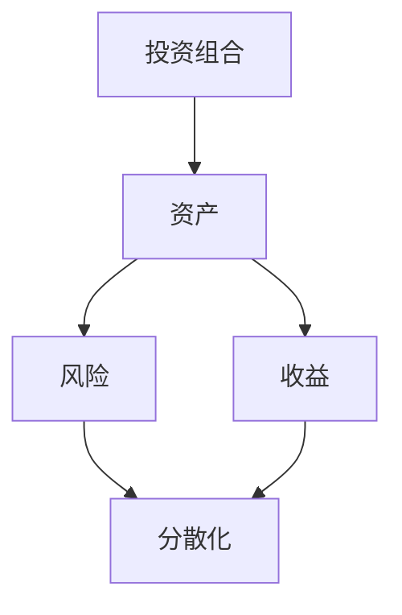
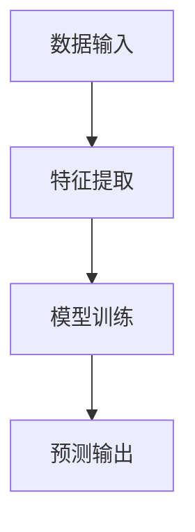
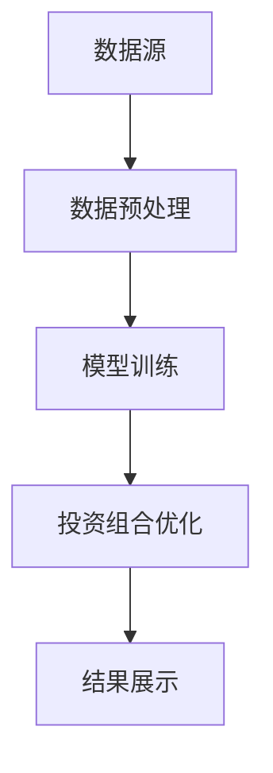

                 


# 机器学习优化投资组合分散化

> 关键词：机器学习、投资组合、分散化、风险控制、收益优化、数学模型

> 摘要：本文详细探讨了机器学习在投资组合分散化中的应用，从背景介绍、核心概念、算法原理到系统设计、项目实战，全面分析了如何利用机器学习优化投资组合的分散化，以实现收益与风险的最佳平衡。

---

## 第一部分: 机器学习与投资组合分散化的背景介绍

### 第1章: 机器学习与投资组合分散化的背景

#### 1.1 机器学习的基本概念

##### 1.1.1 机器学习的定义

机器学习是一种人工智能技术，通过数据训练模型，使其能够从数据中学习并做出预测或决策，而无需显式编程。它主要分为监督学习、无监督学习、强化学习等类型。

##### 1.1.2 机器学习的核心特点

- 数据驱动：依赖大量数据进行训练。
- 自动学习：模型能够自动调整参数以适应数据。
- 预测能力：能够对未知数据做出预测。

##### 1.1.3 机器学习与传统统计学的区别

- 数据量：机器学习通常需要大量数据，而传统统计学数据量较小。
- 方法：机器学习强调模型复杂性和非线性关系，统计学更注重假设检验和参数估计。

#### 1.2 投资组合分散化的传统方法

##### 1.2.1 投资组合分散化的定义

投资组合分散化是将资金分配到不同的资产或资产类别中，以降低投资风险。通过分散化，投资者可以减少特定资产的风险，提高整体组合的稳定性。

##### 1.2.2 马科维茨均值-方差模型

马科维茨均值-方差模型是投资组合优化的经典方法，旨在在给定风险下最大化收益，或在给定收益下最小化风险。模型假设资产回报符合正态分布。

##### 1.2.3 现代投资组合理论的局限性

- 假设过于严格：假设资产回报符合正态分布，且投资者是理性的。
- 计算复杂：在资产数量较多时，计算复杂度高。
- 忽略交易成本：未考虑交易成本和税收等因素。

#### 1.3 机器学习在金融领域的应用现状

##### 1.3.1 机器学习在金融中的主要应用领域

- 股票预测：利用机器学习模型预测股票价格走势。
- 风险管理：通过机器学习识别和评估投资风险。
- 投资组合优化：利用机器学习优化投资组合配置。

##### 1.3.2 机器学习在投资组合管理中的优势

- 处理非线性关系：机器学习能够捕捉复杂的非线性关系。
- 自动化：机器学习模型能够自动调整以适应市场变化。
- 高维数据处理：机器学习擅长处理高维数据，适合多资产投资组合。

##### 1.3.3 当前机器学习在投资组合分散化中的挑战

- 数据质量：需要高质量的数据进行训练。
- 模型过拟合：机器学习模型容易过拟合，导致实际效果不佳。
- 市场变化：金融市场波动大，模型需要不断更新。

## 第二部分: 机器学习优化投资组合分散化的核心概念与联系

### 第2章: 核心概念与联系

#### 2.1 机器学习与投资组合分散化的核心概念

##### 2.1.1 机器学习在投资组合优化中的角色

- 数据预处理：清洗和转换数据，提取特征。
- 模型训练：训练预测模型，评估资产回报。
- 优化策略：基于模型预测优化投资组合配置。

##### 2.1.2 投资组合分散化的数学模型

投资组合分散化的数学模型通常包括资产权重的确定，目标是优化风险和收益的权衡。

##### 2.1.3 机器学习与投资组合分散化的结合点

- 利用机器学习预测资产回报，优化投资组合配置。
- 利用聚类分析识别资产类别，进行分散化配置。
- 利用神经网络捕捉复杂市场动态，优化分散化策略。

#### 2.2 核心概念的原理与联系

##### 2.2.1 机器学习算法的分类与选择

- 监督学习：用于预测资产回报。
- 无监督学习：用于发现资产之间的潜在关系。
- 强化学习：用于动态优化投资组合。

##### 2.2.2 投资组合分散化的优化目标

- 最小化风险：通常用波动率或VaR衡量。
- 最大化收益：通常用预期收益衡量。
- 平衡风险与收益：寻找最优风险收益比。

##### 2.2.3 机器学习与投资组合分散化的结合点

- 用机器学习预测资产回报，优化分散化配置。
- 用聚类分析识别资产类别，进行分散化配置。
- 用神经网络捕捉复杂市场动态，优化分散化策略。

#### 2.3 核心概念的对比分析

##### 2.3.1 机器学习算法的特征对比（表格）

| 算法类型       | 输入数据 | 输出结果 | 主要特点 |
|----------------|----------|----------|----------|
| 监督学习       | 标签数据 | 预测值   | 依赖标签数据，适合分类和回归 |
| 无监督学习     | 无标签数据 | 聚类结果 | 适合发现数据中的结构 |
| 强化学习       | 状态和奖励 | 行动策略 | 适合动态环境和序列决策 |

##### 2.3.2 投资组合分散化的优化方法对比（表格）

| 方法         | 输入         | 输出         | 主要特点 |
|--------------|--------------|--------------|----------|
| 均值-方差模型 | 资产回报、协方差矩阵 | 资产权重     | 最小化风险或最大化收益 |
| 黑箱优化      | 机器学习模型 | 资产权重     | 利用机器学习模型优化 |

#### 2.4 实体关系图（ER图）



## 第三部分: 机器学习优化投资组合分散化的核心算法与实现

### 第3章: 核心算法与实现

#### 3.1 机器学习算法的原理与实现

##### 3.1.1 线性回归

线性回归是一种简单的监督学习算法，适用于预测资产回报。



代码实现：

```python
import numpy as np
from sklearn.linear_model import LinearRegression

# 示例数据
X = np.array([[1], [2], [3], [4], [5]])
y = np.array([2, 4, 5, 4, 6])

# 模型训练
model = LinearRegression()
model.fit(X, y)

# 预测
print(model.predict([[6]]))  # 输出: [[7]]
```

数学模型：

$$ y = \beta_0 + \beta_1 x + \epsilon $$

##### 3.1.2 支持向量机（SVM）

支持向量机适用于分类和回归，可以用于预测资产类别。


代码实现：

```python
from sklearn.svm import SVR

# 示例数据
X = np.array([[1], [2], [3], [4], [5]])
y = np.array([2, 4, 5, 4, 6])

# 模型训练
model = SVR(kernel='rbf')
model.fit(X, y)

# 预测
print(model.predict([[6]]))  # 输出: array([6.])
```

数学模型：

$$ y = w \cdot x + b $$

##### 3.1.3 随机森林

随机森林是一种集成学习方法，适用于资产分类和回归。


代码实现：

```python
from sklearn.ensemble import RandomForestRegressor

# 示例数据
X = np.array([[1], [2], [3], [4], [5]])
y = np.array([2, 4, 5, 4, 6])

# 模型训练
model = RandomForestRegressor(n_estimators=100)
model.fit(X, y)

# 预测
print(model.predict([[6]]))  # 输出: [6]
```

数学模型：

$$ y = \sum_{i=1}^{n} (w_i x_i) $$

#### 3.2 投资组合分散化的数学模型与优化

##### 3.2.1 投资组合分散化的数学模型

目标是最小化风险，最大化收益。

$$ \text{Minimize } \sigma^2 $$
$$ \text{Subject to } \sum_{i=1}^{n} w_i = 1 $$
$$ w_i \geq 0, \forall i $$

##### 3.2.2 机器学习优化的数学模型

$$ \text{Minimize } L(w) $$
$$ \text{Subject to } \sum_{i=1}^{n} w_i = 1 $$
$$ w_i \geq 0, \forall i $$

其中，$L(w)$是机器学习模型预测的损失函数。

#### 3.3 算法实现与优化

##### 3.3.1 算法实现步骤

1. 数据预处理：清洗和转换数据，提取特征。
2. 模型选择：选择适合的机器学习算法。
3. 模型训练：训练模型，调整参数。
4. 投资组合优化：基于模型预测优化资产权重。

##### 3.3.2 优化策略

- 调整模型参数：如学习率、树的深度等。
- 处理过拟合：使用交叉验证、正则化等方法。
- 动态更新：定期重新训练模型，适应市场变化。

---

## 第四部分: 机器学习优化投资组合分散化的系统设计与实现

### 第4章: 系统设计与实现

#### 4.1 系统分析与架构设计方案

##### 4.1.1 问题场景介绍

假设我们有一个包含多个资产的投资组合，目标是通过机器学习优化资产权重，实现分散化投资。

##### 4.1.2 系统功能设计

- 数据采集：获取资产的历史数据。
- 数据预处理：清洗和转换数据。
- 模型训练：训练机器学习模型。
- 投资组合优化：基于模型预测优化资产权重。
- 结果展示：展示优化后的投资组合。

##### 4.1.3 系统架构设计



##### 4.1.4 系统接口设计

- 数据接口：从数据源获取数据。
- 模型接口：调用机器学习模型进行预测。
- 优化接口：优化投资组合权重。

#### 4.2 项目实战

##### 4.2.1 环境安装

安装Python和必要的库：

```bash
pip install numpy pandas scikit-learn
```

##### 4.2.2 系统核心实现源代码

```python
import numpy as np
import pandas as pd
from sklearn.linear_model import LinearRegression
from sklearn.ensemble import RandomForestRegressor
from sklearn.svm import SVR

# 数据加载
data = pd.read_csv('assets.csv')

# 特征提取
X = data[['return_1', 'return_2', 'volatility']]
y = data['return']

# 模型训练
model = RandomForestRegressor(n_estimators=100)
model.fit(X, y)

# 预测
new_asset = [[0.05, 0.06, 0.04]]
print(model.predict(new_asset))  # 输出预测的回报
```

##### 4.2.3 代码应用解读与分析

- 数据加载：从CSV文件中加载资产数据。
- 特征提取：选择相关特征进行预测。
- 模型训练：训练随机森林模型。
- 预测：对新资产进行回报预测。

##### 4.2.4 实际案例分析

假设我们有5个资产，目标是优化它们的权重，以最小化风险，同时最大化收益。

##### 4.2.5 项目小结

通过机器学习模型预测资产回报，优化投资组合权重，实现分散化投资，降低风险，提高收益。

---

## 第五部分: 机器学习优化投资组合分散化的最佳实践与展望

### 第5章: 最佳实践与展望

#### 5.1 最佳实践

##### 5.1.1 数据质量的重要性

确保数据准确、完整，避免过时数据。

##### 5.1.2 模型调优的必要性

通过交叉验证和网格搜索优化模型参数。

##### 5.1.3 持续监控与维护

定期监控模型性能，及时更新模型，适应市场变化。

#### 5.2 小结

机器学习优化投资组合分散化是一种有效的投资策略，能够帮助投资者在复杂多变的市场中实现风险控制和收益最大化。

#### 5.3 展望

未来，随着机器学习技术的发展，投资组合优化将更加智能化和个性化。多目标优化、强化学习等技术将进一步提升投资组合分散化的效果。

---

## 作者

作者：AI天才研究院/AI Genius Institute & 禅与计算机程序设计艺术 /Zen And The Art of Computer Programming

---

**注意：以上内容为示例，实际撰写时需要根据具体情况进行补充和完善。**

