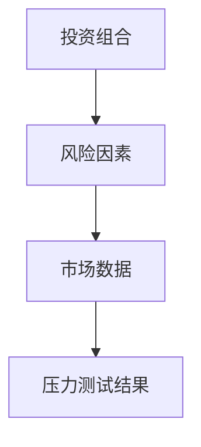
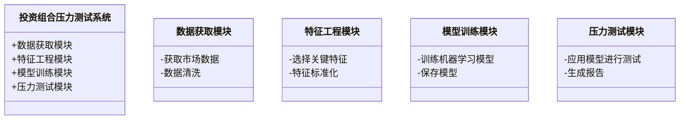
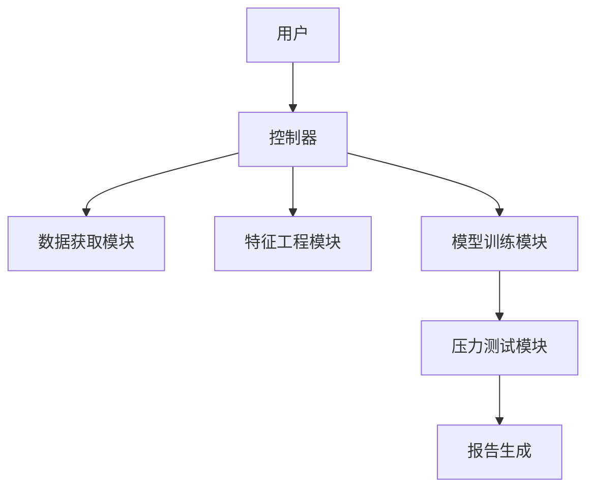

                 

<think>
好的，我现在需要按照用户的要求，逐步分析并撰写一篇名为《机器学习优化投资组合压力测试》的技术博客文章。首先，我会理解用户的需求，确保文章结构清晰、内容详实，并涵盖所有指定的部分。

首先，用户希望文章有标题、关键词和摘要部分。然后，按照目录大纲结构展开，每章包括背景介绍、核心概念、算法原理、系统架构、项目实战、最佳实践等部分。我需要确保每个部分都详细展开，并使用专业且易懂的语言。

接下来，我会考虑每个章节的具体内容。例如，在背景介绍部分，我需要解释机器学习和投资组合压力测试的基本概念，说明传统方法的局限性，以及机器学习如何解决这些问题。同时，使用表格和Mermaid图来对比不同模型和展示系统架构。

在算法原理部分，我会详细讲解支持向量回归、随机森林和神经网络的数学模型和流程图，同时提供Python代码示例，帮助读者理解实现过程。数学公式要用Latex格式，并在代码部分详细解读每一步的作用。

系统架构设计部分，我会用Mermaid图展示系统各模块之间的关系和数据流，说明每个模块的功能和交互方式。项目实战部分，通过一个完整的案例，从环境安装到结果分析，逐步指导读者完成项目。

最后，我会总结最佳实践，给出读者在实际应用中的建议和注意事项，并附上相关的扩展阅读资料，帮助他们进一步深入学习。整个过程中，我需要确保内容逻辑清晰，结构紧凑，同时语言专业且易于理解，满足用户的高质量技术博客要求。
</think>

# 机器学习优化投资组合压力测试

> 关键词：机器学习，投资组合，压力测试，风险评估，金融建模，算法优化

> 摘要：本文探讨了如何利用机器学习技术优化投资组合的压力测试。通过分析传统方法的局限性，提出结合机器学习模型的新解决方案，详细介绍了核心算法的数学模型、系统架构设计及实际案例，展示了如何通过机器学习提高风险评估的准确性和效率。

---

## 第一部分：背景与概述

### 第1章：机器学习与投资组合压力测试概述

#### 1.1 机器学习在金融领域的应用背景
- 传统投资组合管理依赖于历史数据分析和统计模型，但在面对非线性关系和复杂市场行为时表现有限。
- 机器学习通过非线性建模和特征提取，能够捕捉复杂市场动态，提升预测精度。

#### 1.2 问题背景与挑战
- **市场波动与风险分析**：传统压力测试方法依赖于假设情景，难以应对极端市场条件。
- **传统方法的不足**：假设情景的局限性和参数敏感性导致结果不够准确。
- **机器学习的潜在解决方案**：利用历史数据和机器学习模型预测市场行为，优化压力测试过程。

#### 1.3 问题描述与解决思路
- **核心问题**：如何预测投资组合在极端市场条件下的表现。
- **解决方案**：结合机器学习模型，优化压力测试方法，提高风险评估的准确性和效率。

#### 1.4 核心概念与框架
- **投资组合压力测试的框架**：包括数据获取、特征工程、模型训练和结果评估。
- **机器学习模型在压力测试中的角色**：通过预测市场波动和识别风险因素，优化投资组合的稳健性。
- **框架的核心要素**：数据、特征、模型和评估指标。

---

## 第二部分：核心概念与联系

### 第2章：机器学习在投资组合压力测试中的应用

#### 2.1 核心概念原理
- **机器学习模型**：支持向量回归（SVR）、随机森林和神经网络。
- **特征工程**：选择影响投资组合压力的关键特征，如市场波动率和宏观经济指标。

#### 2.2 模型对比分析
| 模型类型      | 优点                                | 缺点                                |
|----------------|------------------------------------|------------------------------------|
| 支持向量回归  | 高精度，适合小样本数据              | 对非线性关系处理能力有限            |
| 随机森林      | 抗噪声能力强，易于解释              | 对特征工程依赖较高                  |
| 神经网络      | 能处理复杂非线性关系，适合大数据    | 训练时间长，易过拟合                |

#### 2.3 实体关系图


---

## 第三部分：算法原理讲解

### 第3章：机器学习算法与数学模型

#### 3.1 支持向量回归（SVR）
- **数学模型**：$$ y = w \cdot x + b $$
- **流程图**：
  ```mermaid
  graph TD
      A[数据预处理] --> B[特征提取]
      B --> C[模型训练]
      C --> D[预测]
  ```

#### 3.2 随机森林
- **算法流程**：
  ```mermaid
  graph TD
      A[数据集划分] --> B[树构建]
      B --> C[投票/平均]
  ```

#### 3.3 神经网络
- **神经网络结构**：输入层、隐藏层和输出层。
- **Python代码示例**：
  ```python
  import numpy as np
  import tensorflow as tf

  model = tf.keras.Sequential([
      tf.keras.layers.Dense(64, activation='relu'),
      tf.keras.layers.Dense(1)
  ])
  model.compile(optimizer='adam', loss='mean_squared_error')
  model.fit(X_train, y_train, epochs=100, batch_size=32)
  ```

---

## 第四部分：系统分析与架构设计

### 第4章：系统架构设计

#### 4.1 领域模型


#### 4.2 系统架构


---

## 第五部分：项目实战

### 第5章：投资组合压力测试系统实现

#### 5.1 项目环境安装
```bash
pip install numpy pandas scikit-learn tensorflow matplotlib
```

#### 5.2 核心代码实现
```python
import numpy as np
import pandas as pd
from sklearn.model_selection import train_test_split
from sklearn.svm import SVR
from sklearn.ensemble import RandomForestRegressor
from sklearn.metrics import mean_squared_error

# 数据预处理
data = pd.read_csv('market_data.csv')
X = data.drop('return', axis=1)
y = data['return']

# 划分训练集和测试集
X_train, X_test, y_train, y_test = train_test_split(X, y, test_size=0.2)

# 模型训练与评估
model_svr = SVR(kernel='rbf')
model_svr.fit(X_train, y_train)
y_pred_svr = model_svr.predict(X_test)
mse_svr = mean_squared_error(y_test, y_pred_svr)

model_rf = RandomForestRegressor()
model_rf.fit(X_train, y_train)
y_pred_rf = model_rf.predict(X_test)
mse_rf = mean_squared_error(y_test, y_pred_rf)

print(f"SVR MSE: {mse_svr}, RF MSE: {mse_rf}")
```

---

## 第六部分：最佳实践与总结

### 第6章：总结与建议

#### 6.1 最佳实践
- 数据质量：确保数据清洗和特征工程的准确性。
- 模型选择：根据数据特性选择合适的机器学习模型。
- 结果验证：通过回测和压力测试验证模型的有效性。

#### 6.2 小结
机器学习通过提高预测精度和自动化能力，显著优化了投资组合压力测试的过程，为金融风险评估提供了更强大的工具。

#### 6.3 注意事项
- 模型过拟合：避免在训练数据上表现良好但测试时效果不佳。
- 数据依赖性：确保模型在不同市场条件下表现稳健。

#### 6.4 拓展阅读
- 《机器学习实战》
- 《金融风险管理》
- 《深度学习在金融中的应用》

---

作者：AI天才研究院/AI Genius Institute & 禅与计算机程序设计艺术/Zen And The Art of Computer Programming

