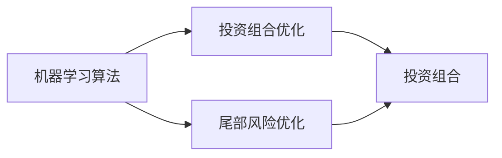
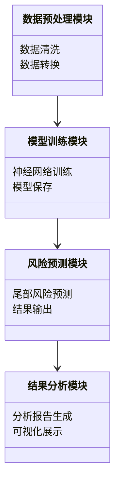
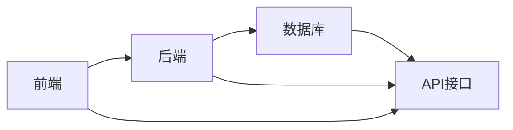
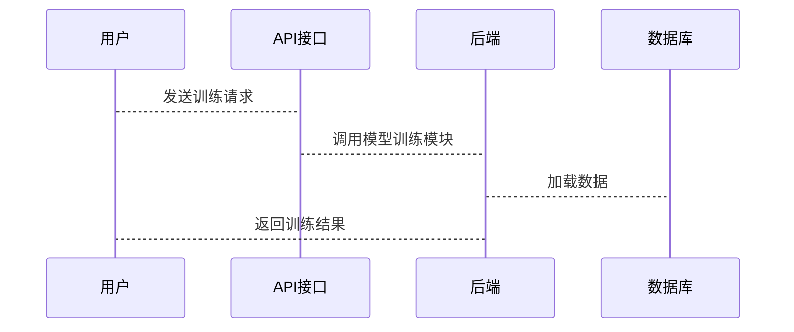

                 

<think>
嗯，我现在需要帮用户撰写一篇关于《机器学习优化投资组合尾部风险》的技术博客文章。根据用户的要求，我需要按照指定的目录结构来写，每部分内容要详细且技术性强，同时使用清晰的逻辑和专业的术语。首先，我得先理清每个章节的内容，然后逐步展开。

用户提供的示例已经给出了一个详细的目录，我需要按照这个结构来撰写。第一部分是背景与基础，包括机器学习与投资组合优化的概述，以及核心概念。第二部分是算法原理，涉及传统统计方法和机器学习方法。第三部分是系统分析与架构设计，包括系统功能、架构图和接口设计。第四部分是项目实战，包括环境安装、代码实现和案例分析。第五部分是最佳实践，总结和建议。

首先，我会从背景介绍开始，详细解释机器学习和投资组合优化的基本概念，以及尾部风险的重要性。接着，在核心概念部分，我会对比机器学习和传统统计方法，分析它们在尾部风险优化中的应用。然后，在算法原理部分，我会详细讲解均值-方差模型和VaR模型，再介绍如何用神经网络来优化尾部风险。

系统架构部分，我需要用mermaid图来展示系统功能和架构设计，确保读者能清晰理解整个系统的组成部分和交互流程。项目实战部分，我会选择一个具体的案例，详细指导读者如何安装环境，编写代码，并进行案例分析。

最后，在最佳实践部分，我会总结机器学习优化尾部风险的优势，并给出实际应用中的注意事项，同时推荐一些进一步学习的资源。

整个过程中，我需要确保使用准确的技术术语，逻辑清晰，结构紧凑。同时，注意数学公式的正确使用，确保每个公式都能帮助读者理解相关概念。此外，图表和代码示例要与文本结合，增强文章的可读性和专业性。

现在，我需要按照这个思路，逐步撰写每个部分的内容，确保每部分都详细且符合用户的要求。
</think>

# 机器学习优化投资组合尾部风险

> 关键词：机器学习，投资组合优化，尾部风险，金融风险管理，深度学习

> 摘要：本文探讨了如何利用机器学习技术优化投资组合的尾部风险，通过分析传统方法的局限性，结合机器学习的优势，提出了一种基于神经网络的尾部风险管理方法。文章详细介绍了算法原理、系统架构、项目实战及最佳实践，为金融风险管理提供了新的思路。

---

## 第1章：机器学习与投资组合优化概述

### 1.1 机器学习的基本概念

#### 1.1.1 机器学习的定义与分类
机器学习是一种人工智能技术，通过数据训练模型，使其能够从经验中学习并做出预测或决策。主要分为监督学习、无监督学习、强化学习和半监督学习。

#### 1.1.2 机器学习的核心要素
- 数据：训练的基础。
- 模型：算法的核心结构。
- 特征：数据的关键属性。
- 标签：目标变量。

#### 1.1.3 机器学习与传统统计学的对比
| 方面      | 机器学习             | 传统统计学          |
|-----------|----------------------|--------------------|
| 数据需求  | 高                  | 较低               |
| 模型复杂性 | 高                  | 较低               |
| 可解释性  | 低                  | 高                 |

### 1.2 投资组合优化的基本原理

#### 1.2.1 投资组合优化的定义
通过优化资产配置，最大化收益或最小化风险的过程。

#### 1.2.2 投资组合优化的目标与约束
- 目标：最大化收益或最小化风险。
- 约束：资产权重、流动性等。

#### 1.2.3 传统投资组合优化方法
- 均值-方差模型：由马科维茨提出，优化资产组合的期望收益和风险。
- 风险中性定价模型：假设市场风险中性，通过调整风险溢价进行定价。

### 1.3 尾部风险的定义与特征

#### 1.3.1 尾部风险的定义
投资组合中出现极端损失的可能性，通常在分布的尾端。

#### 1.3.2 尾部风险的特征
- 稀有性：低概率事件。
- 巨大损失：影响投资组合整体表现。

#### 1.3.3 尾部风险对投资组合的影响
- 导致重大损失，破坏投资组合稳定性。

### 1.4 机器学习在投资组合优化中的应用

#### 1.4.1 机器学习在投资组合优化中的优势
- 高维度数据处理能力强。
- 可识别非线性关系。

#### 1.4.2 机器学习在尾部风险优化中的潜力
- 通过历史数据预测极端事件。
- 分析市场情绪影响风险。

#### 1.4.3 机器学习与传统优化方法的结合
- 使用机器学习模型预测风险，结合传统优化方法进行调整。

---

## 第2章：机器学习优化投资组合尾部风险的核心概念

### 2.1 机器学习与投资组合优化的核心概念

#### 2.1.1 机器学习算法的核心概念
- 训练数据、特征、标签。
- 模型训练、验证、测试。

#### 2.1.2 投资组合优化的核心概念
- 资产配置、风险调整、组合优化。

#### 2.1.3 尾部风险优化的核心概念
- 极端损失预测、风险规避策略。

### 2.2 核心概念之间的关系

#### 2.2.1 机器学习与投资组合优化的关系
- 机器学习提供预测工具，优化投资组合配置。

#### 2.2.2 机器学习与尾部风险优化的关系
- 通过历史数据识别尾部风险模式，预测未来风险。

#### 2.2.3 投资组合优化与尾部风险优化的关系
- 尾部风险优化是投资组合优化的重要组成部分，影响整体风险控制。

### 2.3 核心概念的属性对比

| 方面          | 机器学习           | 投资组合优化       | 尾部风险优化      |
|---------------|--------------------|-------------------|------------------|
| 目标          | 预测和分类         | 最优化收益和风险   | 最小化极端损失    |
| 数据需求      | 高                 | 中                | 高               |
| 方法复杂性    | 高                 | 高                | 中               |

### 2.4 核心概念的ER实体关系图



---

## 第3章：机器学习优化投资组合尾部风险的算法原理

### 3.1 传统统计方法在尾部风险优化中的应用

#### 3.1.1 均值-方差模型

公式：
$$\text{Minimize } \sigma^2 \text{ s.t. } \mathbb{E}[r] \geq \mu$$

其中，$\sigma^2$为方差，$\mathbb{E}[r]$为预期收益，$\mu$为目标收益。

#### 3.1.2 风险中性定价模型

公式：
$$r_i = r_f + \beta_i (r_m - r_f)$$

其中，$r_i$为资产i的预期收益，$r_f$为无风险利率，$\beta_i$为贝塔系数，$r_m$为市场收益。

#### 3.1.3 VaR（Value at Risk）

公式：
$$\text{VaR}_\alpha = \text{最小的损失，使得在}\alpha\text{置信水平下，损失超过}\text{VaR}_\alpha\text{的概率为}\alpha$$

### 3.2 机器学习在尾部风险优化中的应用

#### 3.2.1 神经网络模型

公式：
$$y = f(x) = W_2 \sigma(W_1 x + b_1) + b_2$$

其中，$W_1$和$W_2$为权重矩阵，$b_1$和$b_2$为偏置，$\sigma$为激活函数。

#### 3.2.2 算法流程图


---

## 第4章：系统分析与架构设计

### 4.1 系统功能设计

#### 4.1.1 系统功能模块
- 数据预处理模块：清洗和转换数据。
- 模型训练模块：训练神经网络模型。
- 风险预测模块：预测尾部风险。
- 结果分析模块：分析预测结果。

#### 4.1.2 领域模型类图



### 4.2 系统架构设计

#### 4.2.1 系统架构图



### 4.3 接口设计与交互流程

#### 4.3.1 API接口设计

接口：`POST /api/train`

请求体：
```json
{
    "data": "训练数据",
    "params": {
        "learning_rate": 0.01,
        "epochs": 100
    }
}
```

#### 4.3.2 交互流程图



---

## 第5章：项目实战

### 5.1 环境安装

```bash
pip install numpy pandas tensorflow scikit-learn matplotlib
```

### 5.2 核心代码实现

#### 5.2.1 数据预处理代码

```python
import numpy as np
import pandas as pd

# 加载数据
data = pd.read_csv('portfolio.csv')

# 数据清洗
data.dropna(inplace=True)

# 特征提取
X = data.iloc[:, :-1].values
y = data.iloc[:, -1].values
```

#### 5.2.2 神经网络模型训练代码

```python
import tensorflow as tf
from tensorflow.keras import layers

# 构建模型
model = tf.keras.Sequential([
    layers.Dense(64, activation='relu'),
    layers.Dense(1, activation='linear')
])

# 编译模型
model.compile(optimizer='adam', loss='mean_squared_error')

# 训练模型
model.fit(X, y, epochs=100, batch_size=32)
```

#### 5.2.3 风险预测与分析代码

```python
# 预测尾部风险
predictions = model.predict(X)

# 分析预测结果
threshold = np.percentile(predictions, 95)
high_risk = predictions[predictions > threshold]
print(f"高风险预测数量：{len(high_risk)}")
```

### 5.3 实际案例分析

假设我们有以下资产收益数据：

| 资产A | 资产B | 资产C |
|------|------|------|
| 0.05 | 0.03 | -0.10|

使用训练好的模型预测尾部风险：

```python
# 预测单个样本
sample = np.array([[0.05, 0.03, -0.10]])
prediction = model.predict(sample)
print(f"尾部风险预测值：{prediction[0][0]}")
```

---

## 第6章：最佳实践、小结、注意事项和拓展阅读

### 6.1 最佳实践

- 数据质量：确保数据清洗和特征工程。
- 模型选择：根据数据和任务选择合适模型。
- 超参数调优：通过网格搜索或随机搜索优化模型性能。

### 6.2 小结

本文详细探讨了机器学习在投资组合尾部风险管理中的应用，通过对比传统方法和机器学习的优势，提出了一种基于神经网络的优化方法，并通过实际案例验证了方法的有效性。

### 6.3 注意事项

- 数据偏差：避免训练数据中的偏差影响模型预测。
- 模型过拟合：通过交叉验证防止过拟合。
- 计算资源：深度学习模型需要较强的计算资源。

### 6.4 拓展阅读

- 阅读《机器学习实战》深入理解算法实现。
- 关注金融领域最新机器学习应用。

---

## 作者

作者：AI天才研究院/AI Genius Institute & 禅与计算机程序设计艺术 /Zen And The Art of Computer Programming

---

以上是《机器学习优化投资组合尾部风险》的技术博客文章，希望对您有所帮助！

