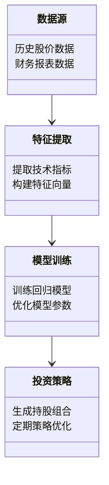
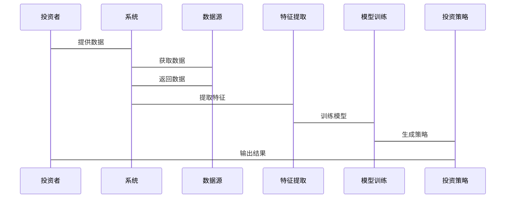

                 


# 机器学习优化长期持股策略

> 关键词：机器学习、投资策略、长期持股、算法优化、金融分析、技术实现

> 摘要：本文系统地探讨了机器学习在优化长期持股策略中的应用，从理论基础到实际操作，详细阐述了如何利用机器学习算法提升投资决策的科学性和高效性。通过背景分析、核心概念、算法原理、系统架构、项目实战等多维度展开，本文为读者提供了一套完整的基于机器学习的长期持股策略优化方案。

---

## 第一章：机器学习与长期持股策略背景

### 1.1 机器学习的核心概念

#### 1.1.1 机器学习的基本定义
机器学习是一种人工智能技术，通过数据和算法让计算机从经验中学习，从而实现对新数据的预测或分类。其核心在于训练模型，使其能够从数据中提取规律，并自动改进预测准确性。

#### 1.1.2 机器学习的核心原理
机器学习的三大核心要素是数据、算法和模型。数据是输入，算法是工具，模型是输出，能够通过训练数据学习到潜在的规律，并用于新数据的预测。

#### 1.1.3 机器学习在金融领域的应用
在金融领域，机器学习广泛应用于股票预测、风险评估、交易策略优化等方面。其强大的数据处理能力和自动化学习能力，为投资决策提供了新的可能性。

### 1.2 长期持股策略的背景

#### 1.2.1 长期投资的基本概念
长期投资是指投资者买入股票后长期持有，不因短期市场波动而频繁交易。其核心理念是通过长期的资本增值实现财富增长。

#### 1.2.2 长期持股策略的优势与挑战
优势：分散短期波动风险，降低交易成本，复利效应显著。  
挑战：市场波动、信息不对称、黑天鹅事件。

#### 1.2.3 传统投资策略的局限性
传统投资策略依赖经验和市场分析，存在主观性高、效率低、风险控制不足等问题。

### 1.3 机器学习优化长期持股策略的必要性

#### 1.3.1 机器学习在投资决策中的作用
机器学习能够处理海量数据，发现传统方法难以察觉的规律，从而提供更精准的投资建议。

#### 1.3.2 机器学习如何优化长期持股策略
通过分析历史数据，机器学习可以帮助投资者识别优质股票，优化持股组合，降低风险。

#### 1.3.3 机器学习优化策略的优势
提高决策效率、增强风险控制能力、实现个性化投资策略。

### 1.4 本书的结构安排

#### 1.4.1 各章节的内容概览
- 第二章：核心概念与联系
- 第三章：算法原理讲解
- 第四章：系统分析与架构设计方案
- 第五章：项目实战
- 第六章：最佳实践与小结

#### 1.4.2 学习本书的建议方法
从理论到实践，逐步深入，结合代码和案例进行学习。

#### 1.4.3 本书的核心目标与预期成果
帮助读者掌握机器学习在优化长期持股策略中的应用方法，提升投资决策的科学性和效率。

---

## 第二章：核心概念与联系

### 2.1 机器学习与投资策略的核心概念

#### 2.1.1 机器学习的核心原理
- 数据输入：特征和标签。
- 算法选择：监督学习、无监督学习、强化学习。
- 模型训练：优化目标函数，降低预测误差。

#### 2.1.2 投资策略的核心要素
- 股票选择：识别优质股票。
- 持股时间：长期持有策略。
- 风险控制：降低投资组合波动。

#### 2.1.3 两者结合的逻辑框架
- 用机器学习分析历史数据，预测股票走势。
- 优化持股组合，降低风险。

### 2.2 核心概念的原理分析

#### 2.2.1 机器学习的核心原理
- 数据预处理：清洗、特征提取。
- 模型训练：选择算法，调整参数。
- 模型评估：准确率、召回率、F1分数。

#### 2.2.2 投资策略的核心要素
- 市场分析：宏观经济指标、行业趋势。
- 股票筛选：基本面分析、技术分析。
- 风险管理：止损策略、分散投资。

### 2.3 核心概念的属性特征对比

| **属性**       | **机器学习**                     | **投资策略**                   |
|----------------|----------------------------------|-------------------------------|
| 输入           | 数据（特征和标签）               | 市场数据、公司基本面           |
| 输出           | 预测值（如股票价格预测）         | 投资决策（如买入、卖出）       |
| 核心任务       | 学习数据中的规律                 | 优化投资组合、降低风险         |
| 应用目标       | 提高预测准确性                   | 提高投资收益、降低风险         |

### 2.4 实体关系图


---

## 第三章：算法原理讲解

### 3.1 线性回归算法

#### 3.1.1 线性回归的原理
线性回归是一种简单的回归算法，假设特征与目标变量之间存在线性关系。

#### 3.1.2 线性回归的数学模型
$$ y = \beta_0 + \beta_1 x + \epsilon $$

#### 3.1.3 线性回归的实现步骤
1. 数据预处理：标准化特征。
2. 模型训练：最小二乘法求解系数。
3. 模型评估：计算R²值。

#### 3.1.4 线性回归的代码实现
```python
import numpy as np
from sklearn.linear_model import LinearRegression

# 示例数据
X = np.array([1, 2, 3, 4, 5]).reshape(-1, 1)
y = np.array([2, 4, 5, 4, 6])

# 模型训练
model = LinearRegression()
model.fit(X, y)

# 预测
print(model.predict(X))
```

### 3.2 支持向量机（SVM）算法

#### 3.2.1 SVM的原理
SVM通过构建超平面，将数据分为两类，适用于分类和回归问题。

#### 3.2.2 SVM的数学模型
$$ \text{目标函数：} \min_{w,b} \frac{1}{2}||w||^2 + C \sum_{i=1}^n \xi_i $$
$$ \text{约束条件：} y_i (w \cdot x_i + b) \geq 1 - \xi_i $$
$$ \xi_i \geq 0 $$

#### 3.2.3 SVM的实现步骤
1. 数据预处理：归一化特征。
2. 模型训练：选择核函数，调整参数。
3. 模型评估：计算准确率。

#### 3.2.4 SVM的代码实现
```python
from sklearn.svm import SVC

# 示例数据
X = np.array([[1, 2], [3, 4], [5, 6], [7, 8], [9, 10]])
y = np.array([0, 0, 1, 1, 1])

# 模型训练
model = SVC(kernel='linear')
model.fit(X, y)

# 预测
print(model.predict(X))
```

---

## 第四章：系统分析与架构设计方案

### 4.1 问题场景介绍

#### 4.1.1 问题背景
投资者希望通过机器学习优化长期持股策略，实现稳健的投资回报。

#### 4.1.2 问题描述
如何利用机器学习算法，优化股票选择和持股时间，实现长期投资收益的最大化。

#### 4.1.3 边界与外延
- 数据范围：历史股价、财务数据。
- 时间范围：长期持有，定期优化。

### 4.2 系统功能设计

#### 4.2.1 领域模型


#### 4.2.2 系统架构


#### 4.2.3 系统接口设计
- 数据接口：获取历史数据。
- 模型接口：接收特征向量，输出预测结果。

#### 4.2.4 系统交互


---

## 第五章：项目实战

### 5.1 环境配置

#### 5.1.1 安装依赖
```bash
pip install numpy scikit-learn matplotlib pandas
```

### 5.2 核心实现

#### 5.2.1 数据获取与预处理
```python
import pandas as pd
import numpy as np

# 获取数据
data = pd.read_csv('stock_data.csv')

# 数据清洗
data.dropna(inplace=True)
data = data.iloc[:, [0, 4]]  # 特征和目标变量
```

#### 5.2.2 特征工程
```python
from sklearn.preprocessing import StandardScaler

# 特征标准化
scaler = StandardScaler()
X_scaled = scaler.fit_transform(data.iloc[:, :-1])
y = data.iloc[:, -1]
```

#### 5.2.3 模型训练与评估
```python
from sklearn.linear_model import LinearRegression
from sklearn.metrics import mean_squared_error

# 模型训练
model = LinearRegression()
model.fit(X_scaled, y)

# 预测
y_pred = model.predict(X_scaled)
print(mean_squared_error(y, y_pred))
```

#### 5.2.4 持股策略生成
```python
# 根据模型预测结果生成持股列表
threshold = np.percentile(y_pred, 75)
hold_stocks = data[y_pred > threshold]
print(len(hold_stocks))
```

### 5.3 案例分析与结果解读

#### 5.3.1 数据来源与特征选择
- 数据来源：历史股价、财务数据。
- 特征选择：市盈率、市净率、ROE等。

#### 5.3.2 模型选择与训练
- 选择线性回归模型。
- 训练过程：最小二乘法优化。

#### 5.3.3 结果分析
- 预测准确率：评估模型性能。
- 持股组合：根据模型预测结果筛选股票。

### 5.4 项目小结

#### 5.4.1 核心成果
- 优化后的持股组合。
- 提高投资收益。

#### 5.4.2 实施步骤总结
从数据获取到模型训练，再到策略生成，详细总结每一步的操作。

---

## 第六章：最佳实践与小结

### 6.1 最佳实践

#### 6.1.1 数据质量的重要性
确保数据的完整性和准确性。

#### 6.1.2 模型选择的策略
根据问题类型选择合适的算法。

#### 6.1.3 持股组合的管理
定期优化和调整。

### 6.2 小结

#### 6.2.1 核心内容回顾
机器学习优化长期持股策略的理论与实践。

#### 6.2.2 学习要点总结
- 理解机器学习的基本原理。
- 掌握特征工程的方法。
- 学会模型选择和优化。

### 6.3 注意事项

#### 6.3.1 风险提示
- 市场波动风险。
- 模型过拟合风险。
- 数据偏差风险。

#### 6.3.2 技术注意事项
- 数据预处理的细节。
- 模型调参的重要性。
- 结果的可解释性。

### 6.4 拓展阅读

#### 6.4.1 推荐书籍
- 《机器学习实战》。
- 《Python机器学习》。

#### 6.4.2 相关论文
- 《机器学习在金融中的应用》。

#### 6.4.3 工具推荐
- Python的机器学习库（scikit-learn）。
- 数据可视化工具（Matplotlib）。

---

## 结语

通过本文的系统讲解，读者可以全面了解机器学习优化长期持股策略的方法和步骤。从理论到实践，从算法到系统，每一步都详细展开，帮助投资者利用机器学习技术提升投资决策的科学性和效率。

---

## 作者：AI天才研究院 & 禅与计算机程序设计艺术

---

