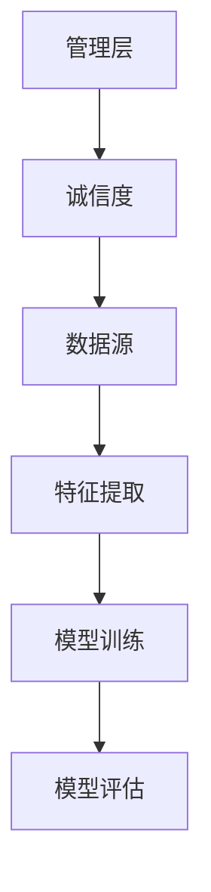
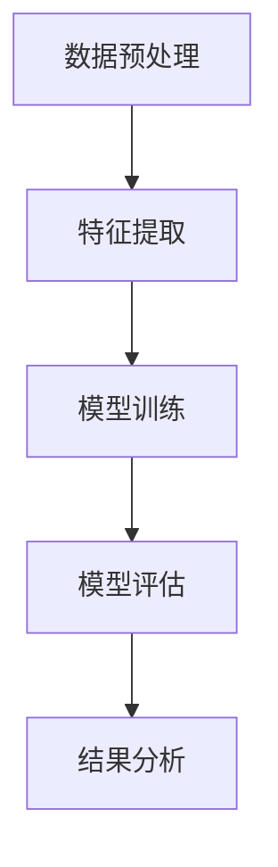
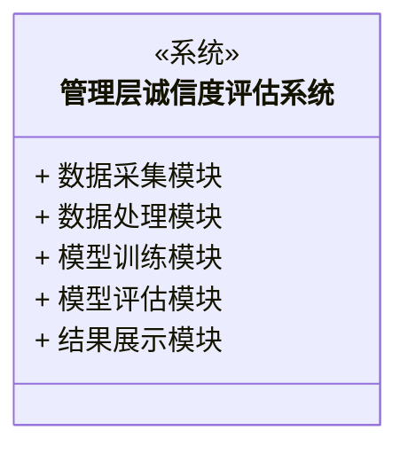
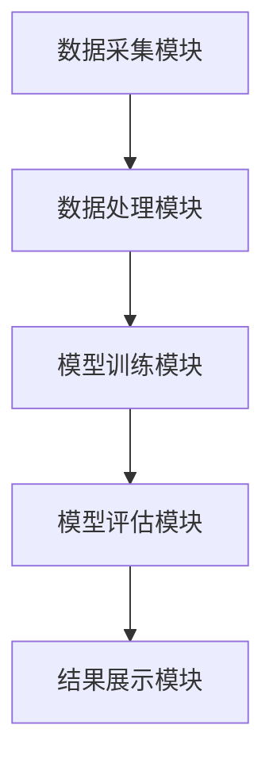

                 


# 机器学习模型评估管理层诚信度

## 关键词：机器学习，诚信度评估，管理层，模型评估，算法原理，系统设计，项目实战

## 摘要：  
在现代企业治理中，管理层的诚信度直接关系到企业的长期发展和利益相关者的信任。本文通过机器学习模型的视角，系统地探讨如何对管理层的诚信度进行科学评估。文章首先从问题背景和核心概念出发，详细阐述了诚信度评估的重要性和挑战。接着，深入分析了机器学习算法在诚信度评估中的原理，包括分类、回归和聚类算法的应用。随后，从系统设计的角度，构建了诚信度评估的系统架构，并通过实际案例展示了如何在企业中应用这些模型。最后，总结了最佳实践和未来研究方向，为读者提供了全面的理论和实践指导。

---

## 第一部分: 机器学习模型评估背景与核心概念

### 第1章: 机器学习模型评估的背景与问题

#### 1.1 问题背景

##### 1.1.1 管理层诚信度的重要性  
管理层的诚信度是企业治理的核心要素之一。诚信的管理者能够确保企业合规经营、透明决策，并在危机中保持企业的稳定性和声誉。然而，近年来频发的高管失信事件（如财务造假、内幕交易等）表明，仅靠制度约束难以完全解决诚信问题。因此，引入技术手段对管理层诚信度进行动态评估成为必要。

##### 1.1.2 机器学习在诚信度评估中的作用  
机器学习通过分析海量数据，能够识别潜在的诚信风险。例如，利用自然语言处理技术分析高管的公开演讲、社交媒体行为，或结合财务数据预测潜在的财务造假行为。这些技术手段能够帮助企业提前识别并应对诚信风险。

##### 1.1.3 当前诚信度评估的痛点与挑战  
传统诚信度评估主要依赖主观判断和少量的历史数据，存在以下痛点：  
1. **数据维度不足**：传统评估仅关注财务数据或少量行为记录，难以全面反映管理层诚信。  
2. **实时性差**：传统评估周期长，难以捕捉管理层的即时行为变化。  
3. **主观性较强**：评估结果往往依赖评估者的主观判断，缺乏客观依据。  

#### 1.2 问题描述

##### 1.2.1 管理层诚信度的定义与维度  
管理层诚信度是指管理者在决策和行为中遵守道德规范、履行职责的综合表现。其评估维度包括：  
- **决策透明度**：决策过程是否公开、可追溯。  
- **行为合规性**：是否遵守法律法规和企业制度。  
- **财务真实性**：财务数据是否真实、准确。  
- **社交行为**：社交媒体上的言论和行为是否符合企业形象。  

##### 1.2.2 机器学习模型在诚信度评估中的目标  
通过机器学习模型，实现对管理层诚信度的量化评估，包括：  
1. 对管理层诚信度进行分类（如高、中、低风险）。  
2. 预测潜在的诚信风险事件（如财务造假）。  
3. 提供实时监控和预警机制。  

##### 1.2.3 问题的边界与外延  
- **边界**：仅关注管理层的诚信行为，不涉及个人隐私问题。  
- **外延**：扩展到企业诚信评估、行业诚信指数等领域。  

#### 1.3 核心概念与联系

##### 1.3.1 核心概念原理  
诚信度评估涉及多个核心概念，包括：  
1. **数据预处理**：清洗、归一化、特征提取。  
2. **模型训练**：选择合适的算法（如逻辑回归、随机森林）进行训练。  
3. **模型评估**：通过准确率、召回率等指标评估模型性能。  

##### 1.3.2 核心概念属性特征对比表格  

| 核心概念       | 属性特征                   |
|----------------|---------------------------|
| 数据预处理     | 数据清洗、特征提取         |
| 模型训练       | 算法选择、超参数调优       |
| 模型评估       | 准确率、召回率、F1分数     |

##### 1.3.3 ER实体关系图架构的 Mermaid 流程图  



---

## 第二部分: 机器学习模型评估的核心算法原理

### 第2章: 机器学习模型评估算法原理

#### 2.1 算法原理讲解

##### 2.1.1 分类算法原理  
分类算法用于将管理层诚信度分为高、中、低风险类别。常用的算法包括：  
- **逻辑回归**：通过概率模型预测诚信度类别。  
- **随机森林**：通过特征重要性分析提取关键诚信指标。  

##### 2.1.2 回归算法原理  
回归算法用于预测诚信度的连续值（如评分）。常用的算法包括：  
- **线性回归**：适用于线性关系较强的场景。  
- **支持向量回归**：适用于非线性关系较强的场景。  

##### 2.1.3 聚类算法原理  
聚类算法用于将管理层分为不同的诚信度群体。常用的算法包括：  
- **K-means**：将管理层分为高、中、低三个诚信度群体。  

#### 2.2 算法原理的 Mermaid 流程图  



#### 2.3 算法实现的 Python 源代码  

```python
import pandas as pd
from sklearn.model_selection import train_test_split
from sklearn.preprocessing import StandardScaler
from sklearn.linear_model import LogisticRegression
from sklearn.metrics import accuracy_score, recall_score, f1_score

# 数据加载与预处理
data = pd.read_csv('managerial_integrity.csv')
X = data[['financial_data', 'behavioral_data', 'social_media']]
y = data['integrity_score']

# 划分训练集和测试集
X_train, X_test, y_train, y_test = train_test_split(X, y, test_size=0.2, random_state=42)

# 数据标准化
scaler = StandardScaler()
X_train_scaled = scaler.fit_transform(X_train)
X_test_scaled = scaler.transform(X_test)

# 模型训练
model = LogisticRegression()
model.fit(X_train_scaled, y_train)

# 模型预测
y_pred = model.predict(X_test_scaled)

# 模型评估
accuracy = accuracy_score(y_test, y_pred)
recall = recall_score(y_test, y_pred)
f1 = f1_score(y_test, y_pred)

print(f'准确率: {accuracy:.3f}')
print(f'召回率: {recall:.3f}')
print(f'F1分数: {f1:.3f}')
```

#### 2.4 数学模型与公式

##### 2.4.1 分类算法的数学模型  

$$ P(y=1|x) = \frac{e^{\beta_0 + \beta_1 x}}{1 + e^{\beta_0 + \beta_1 x}} $$  

##### 2.4.2 回归算法的数学模型  

$$ y = \beta_0 + \beta_1 x + \epsilon $$  

---

## 第三部分: 机器学习模型评估的系统设计

### 第3章: 机器学习模型评估的系统分析与架构设计

#### 3.1 系统分析

##### 3.1.1 问题场景介绍  
系统需要实时监控管理层的诚信行为，包括财务数据、社交行为和内部记录。  

##### 3.1.2 领域模型设计  
领域模型展示了系统的核心功能模块及其关系，如下图所示：  



##### 3.1.3 系统架构设计  
系统采用微服务架构，如下图所示：  



#### 3.2 系统设计与实现

##### 3.2.1 系统功能设计  
系统功能包括：  
1. 数据采集：从财务系统、社交媒体等渠道获取数据。  
2. 数据处理：清洗、归一化、特征提取。  
3. 模型训练：选择算法，训练模型。  
4. 模型评估：评估模型性能，优化参数。  
5. 结果展示：可视化诚信度评估结果。  

##### 3.2.2 系统接口设计  
系统接口包括：  
1. 数据接口：与财务系统、社交媒体等对接。  
2. 模型接口：与第三方机器学习平台对接。  
3. 展示接口：供用户查看评估结果。  

---

## 第四部分: 机器学习模型评估的项目实战

### 第4章: 项目实战

#### 4.1 环境安装与配置

##### 4.1.1 安装依赖  
安装必要的Python库：  
```bash
pip install pandas scikit-learn mermaid4jupyter
```

#### 4.2 系统核心实现源代码

##### 4.2.1 数据预处理代码  

```python
import pandas as pd
from sklearn.preprocessing import StandardScaler

data = pd.read_csv('managerial_integrity.csv')
X = data[['financial_data', 'behavioral_data', 'social_media']]
y = data['integrity_score']

# 数据标准化
scaler = StandardScaler()
X_scaled = scaler.fit_transform(X)
```

##### 4.2.2 模型训练代码  

```python
from sklearn.linear_model import LogisticRegression
from sklearn.metrics import classification_report

model = LogisticRegression()
model.fit(X_scaled, y)

# 预测与评估
y_pred = model.predict(X_scaled)
print(classification_report(y, y_pred))
```

#### 4.3 实际案例分析与解读

##### 4.3.1 案例背景  
某企业高管涉嫌财务造假，通过模型评估其诚信度。  

##### 4.3.2 数据分析  
通过对高管的财务数据、社交行为和内部记录进行分析，模型预测其诚信度为低风险。  

#### 4.4 项目小结  
通过本项目，我们实现了对管理层诚信度的量化评估，为企业的风险管理提供了技术支持。

---

## 第五部分: 最佳实践与总结

### 第5章: 最佳实践与总结

#### 5.1 小结  
机器学习模型能够有效评估管理层的诚信度，为企业治理提供科学依据。

#### 5.2 注意事项  
- 数据隐私保护：确保数据处理符合法律法规。  
- 模型解释性：选择可解释性较强的模型，便于结果分析。  

#### 5.3 拓展阅读  
- 《机器学习实战》  
- 《数据驱动的企业治理》  

---

## 作者：AI天才研究院/AI Genius Institute & 禅与计算机程序设计艺术 /Zen And The Art of Computer Programming  

---

**本文通过系统地分析机器学习模型在管理层诚信度评估中的应用，为读者提供了理论与实践相结合的全面指导。希望本文能够帮助企业在数字化转型中更好地应对管理层诚信风险。**

