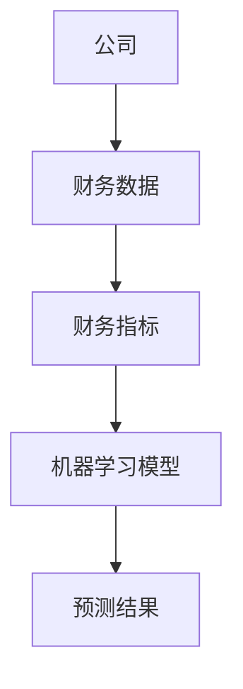
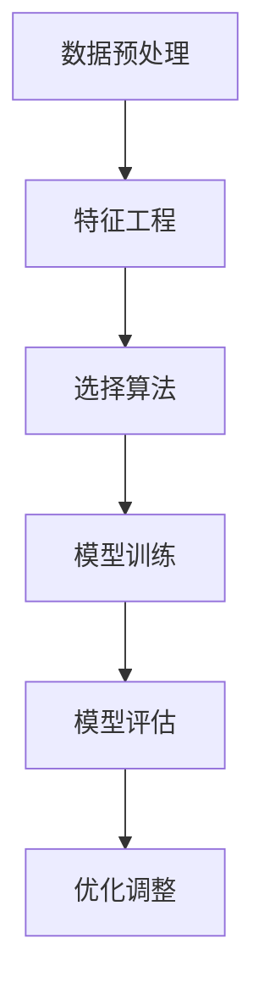
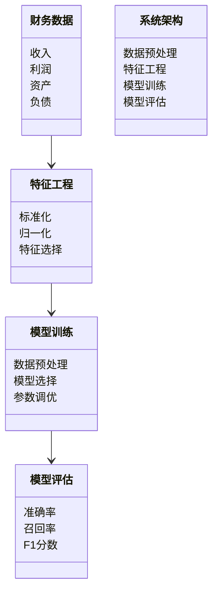
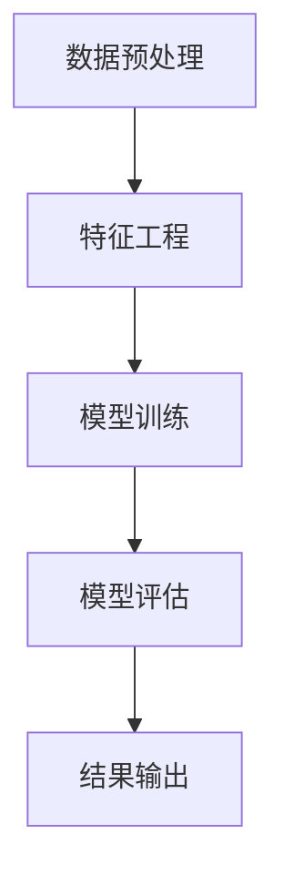

                 

<think>
嗯，好的，我现在需要帮助用户完成一个技术博客的文章，主题是《机器学习模型预测公司财务健康》。用户已经提供了一个详细的大纲，并希望我按照这个结构来写文章。看起来用户希望文章内容丰富、结构清晰，并且包含很多技术细节，比如数学公式、流程图、类图等等。

首先，我需要理解用户的需求。他们可能是一位技术专家，或者是CTO，或者是一位写技术博客的人，希望分享关于使用机器学习预测公司财务健康的知识。用户希望文章结构详细，包含背景介绍、核心概念、算法原理、数学模型、系统架构设计、项目实战、最佳实践等多个部分，并且每个部分都要有详细的解释和示例。

接下来，我需要按照用户提供的大纲，逐步展开每个部分。首先，文章标题和关键词已经给出，我需要确保这些部分正确无误。摘要部分需要简洁明了，概括整篇文章的核心内容。

然后，第一部分是背景介绍，包含问题背景、问题描述、问题解决方法和问题的边界与外延。这部分需要详细说明为什么预测公司财务健康重要，传统方法的局限性，以及机器学习的优势。我还需要定义问题，描述数据特征和目标变量，以及选择评估指标。

接下来是核心概念与联系，需要解释财务健康预测的核心概念，包括财务指标、机器学习模型、数据特征等。同时，需要通过表格和实体关系图来展示这些概念之间的联系，帮助读者更好地理解。

算法原理部分需要详细讲解机器学习的基本原理，比如监督学习、分类与回归的区别，以及常用的评估指标。我还需要用公式来展示这些指标的计算方法，比如准确率的公式。

数学模型与公式部分，需要介绍特征工程中的标准化和归一化，以及线性回归和最小二乘法的公式。这部分需要使用Latex公式来展示，确保准确性和专业性。

系统架构设计部分，我需要描述问题场景，比如公司财务数据的来源和处理流程。然后，设计系统的功能模块，比如数据预处理、特征工程、模型训练等，并用类图展示这些模块的关系。

项目实战部分，需要指导读者如何安装环境，比如Python和相关库。然后，提供代码实现，展示如何进行数据预处理、特征工程、模型训练和评估。同时，用实际案例进行分析，解释每个步骤的作用和结果。

最后，最佳实践部分需要给出一些建议，比如数据质量的重要性、模型解释性的考虑，以及持续监控和更新模型的必要性。这部分可以帮助读者更好地应用这些知识到实际项目中。

在写作过程中，我需要确保每个部分都详细展开，使用清晰的技术术语，同时保持语言的通俗易懂。此外，还需要插入适当的图表，比如流程图、类图和序列图，来帮助读者理解复杂的概念和流程。

总的来说，我需要按照用户提供的大纲，逐步填充每个部分的内容，确保文章结构完整，内容详实，技术细节到位。这将帮助读者系统地了解如何使用机器学习模型来预测公司财务健康，并能够在实际中应用这些知识。
</think>

# 机器学习模型预测公司财务健康

## 关键词：机器学习，财务健康，预测模型，数据特征，算法优化

## 摘要：本文详细探讨了如何利用机器学习模型预测公司财务健康。通过分析财务数据，选择合适的算法，并进行模型优化，可以有效预测公司财务状况，辅助决策。

## 第一部分: 机器学习模型预测公司财务健康概述

### 第1章: 问题背景与目标

#### 1.1 问题背景
##### 1.1.1 公司财务健康的重要性
公司财务健康是企业生存和发展的关键因素。通过预测财务健康状况，企业可以提前识别潜在风险，优化财务结构，制定有效的财务策略。

##### 1.1.2 传统财务健康评估的局限性
传统方法依赖财务比率和人工分析，存在主观性高、计算复杂、耗时长等问题，难以快速准确地预测财务风险。

##### 1.1.3 机器学习在财务预测中的优势
机器学习能够处理大量数据，发现复杂模式，快速预测财务状况，提供数据驱动的决策支持。

#### 1.2 问题描述
##### 1.2.1 财务健康预测的核心问题
预测公司是否会出现财务危机，通常以财务指标为依据，如流动比率、速动比率、资产负债率等。

##### 1.2.2 数据特征与目标变量的定义
数据特征包括财务指标、市场数据、经营数据等，目标变量为财务健康状况（如健康或不健康）。

##### 1.2.3 评估指标的选择
采用准确率、精确率、召回率、F1分数等指标评估模型性能。

#### 1.3 问题解决方法
##### 1.3.1 机器学习算法的选择
选择合适的算法，如逻辑回归、支持向量机、随机森林等，根据数据特性和问题需求进行选择。

##### 1.3.2 数据预处理与特征工程
数据清洗、缺失值处理、特征选择等步骤，确保数据质量，提升模型性能。

##### 1.3.3 模型训练与评估流程
训练模型，调整参数，评估模型性能，优化模型。

#### 1.4 问题的边界与外延
##### 1.4.1 数据范围的界定
明确数据的时间范围、行业范围等，确保数据的适用性。

##### 1.4.2 模型适用的行业与规模
不同行业和规模的公司财务指标差异较大，模型需针对特定场景进行调整。

##### 1.4.3 模型的可解释性要求
模型需要一定的可解释性，便于财务人员理解结果。

#### 1.5 概念结构与核心要素
##### 1.5.1 数据来源与特征
数据来源包括财务报表、市场数据等，特征包括财务指标、经营数据等。

##### 1.5.2 模型输入与输出
输入为财务特征，输出为财务健康状况。

##### 1.5.3 评估指标与阈值
准确率、精确率等指标，设定合适的阈值以平衡真 positives 和 false positives。

#### 1.6 本章小结
本章介绍了公司财务健康预测的重要性和机器学习的优势，明确了问题定义和解决方法。

### 第2章: 核心概念与联系

#### 2.1 财务健康预测的核心概念
##### 2.1.1 财务指标的定义与分类
流动比率、速动比率、资产负债率等，分为流动性、偿债能力、运营效率等类别。

##### 2.1.2 机器学习模型的分类
监督学习、无监督学习、半监督学习等，适用于不同场景。

##### 2.1.3 数据特征与模型性能的关系
高质量特征提升模型性能，特征选择影响结果准确性。

#### 2.2 核心概念的属性特征对比
| 财务指标 | 数据类型 | 时间依赖性 | 影响因素 |
|----------|----------|------------|----------|
| 流动比率  | 数值型   | 强          | 资产、负债 |
| 资产负债率 | 数值型   | 强          | 资产、负债 |

#### 2.3 实体关系图


#### 2.4 本章小结
本章分析了财务健康预测的核心概念，通过对比和图表展示了概念之间的联系。

### 第3章: 机器学习算法原理

#### 3.1 算法原理概述
##### 3.1.1 监督学习的基本原理
监督学习通过标签数据训练模型，预测新数据的标签。

##### 3.1.2 分类与回归的区别
分类用于预测离散标签，回归用于预测连续值。

##### 3.1.3 评估指标的数学公式
准确率公式：
$$\text{准确率} = \frac{\text{正确预测数}}{\text{总预测数}}$$

#### 3.2 算法选择与优化
##### 3.2.1 常见算法的优缺点对比
| 算法         | 优点               | 缺点                 |
|--------------|--------------------|----------------------|
| 逻辑回归     | 解释性强，适合二分类 | 非线性能力有限       |
| 支持向量机    | 高维数据表现好     | 参数调整复杂         |
| 随机森林     | 高准确性，抗过拟合   | 黑箱模型，解释性差     |

##### 3.2.2 超参数调优的流程
1. 确定需要调优的参数。
2. 使用网格搜索或随机搜索进行组合。
3. 交叉验证评估每个组合的性能。
4. 选择最优组合。

##### 3.2.3 正则化的原理与应用
L1正则化用于特征选择，L2正则化用于防止过拟合，公式：
$$\text{Lasso} = \text{损失函数} + \alpha ||\beta||_1$$

#### 3.3 算法流程图


#### 3.4 本章小结
本章介绍了机器学习算法的原理和选择优化方法，为后续建模提供了基础。

### 第4章: 数学模型与公式

#### 4.1 特征工程的数学处理
##### 4.1.1 标准化与归一化的公式
标准化公式：
$$x_{\text{norm}} = \frac{x - \mu}{\sigma}$$

归一化公式：
$$x_{\text{scaled}} = \frac{x - \min(x)}{\max(x) - \min(x)}$$

#### 4.2 模型选择的数学原理
##### 4.2.1 线性回归的公式
线性回归模型：
$$y = \beta_0 + \beta_1x + \epsilon$$

最小二乘法公式：
$$\hat{\beta} = (X^T X)^{-1} X^T y$$

#### 4.3 模型训练的数学过程
##### 4.3.1 最小二乘法的公式
最小二乘法用于线性回归模型参数估计，公式如上。

#### 4.4 本章小结
本章通过数学公式详细讲解了特征工程和模型训练的原理，为后续实现提供理论基础。

## 第二部分: 系统分析与架构设计

### 第4章: 系统分析与架构设计

#### 4.1 问题场景介绍
##### 4.1.1 数据来源与处理流程
数据来源包括公司财务报表、市场数据等，处理流程包括清洗、转换、特征提取等。

#### 4.2 项目介绍
##### 4.2.1 项目目标
开发一个预测公司财务健康的机器学习模型。

##### 4.2.2 项目范围
限定于特定行业和公司规模，使用公开的财务数据。

#### 4.3 系统功能设计
##### 4.3.1 领域模型


#### 4.4 系统架构设计
##### 4.4.1 系统架构图


#### 4.5 系统接口设计
##### 4.5.1 输入接口
处理财务数据输入，格式要求等。

##### 4.5.2 输出接口
提供预测结果和模型评估指标。

#### 4.6 系统交互流程
##### 4.6.1 交互流程图
```mermaid
graph TD
    User --> A[数据预处理]: 提供财务数据
    A --> B[特征工程]: 进行特征处理
    B --> C[模型训练]: 训练模型
    C --> D[模型评估]: 评估模型性能
    D --> User: 返回预测结果
```

## 第三部分: 项目实战

### 第5章: 项目实战

#### 5.1 环境安装
##### 5.1.1 安装Python
使用Anaconda安装Python 3.8或更高版本。

##### 5.1.2 安装依赖库
安装scikit-learn、pandas、numpy等库。

#### 5.2 系统核心实现源代码
##### 5.2.1 数据预处理代码
```python
import pandas as pd
from sklearn.impute import SimpleImputer

# 读取数据
data = pd.read_csv('financial_data.csv')

# 处理缺失值
imputer = SimpleImputer(missing_values=np.nan, strategy='mean')
data_imputed = imputer.fit_transform(data)
```

##### 5.2.2 特征工程代码
```python
from sklearn.preprocessing import StandardScaler, OneHotEncoder

# 标准化处理
scaler = StandardScaler()
data_scaled = scaler.fit_transform(data_imputed)

# 特征选择
from sklearn. feature_selection import SelectKBest, chi2

selector = SelectKBest(score_func=chi2, k=10)
data_selected = selector.fit_transform(data_scaled, labels)
```

##### 5.2.3 模型训练代码
```python
from sklearn.model_selection import train_test_split
from sklearn.linear_model import LogisticRegression

# 划分训练集和测试集
X_train, X_test, y_train, y_test = train_test_split(data_selected, labels, test_size=0.2, random_state=42)

# 训练模型
model = LogisticRegression()
model.fit(X_train, y_train)
```

##### 5.2.4 模型评估代码
```python
from sklearn.metrics import accuracy_score, precision_score, recall_score

# 预测结果
y_pred = model.predict(X_test)

# 评估指标
accuracy = accuracy_score(y_test, y_pred)
precision = precision_score(y_test, y_pred)
recall = recall_score(y_test, y_pred)
print(f"准确率: {accuracy}")
print(f"精确率: {precision}")
print(f"召回率: {recall}")
```

#### 5.3 代码应用解读与分析
##### 5.3.1 数据预处理
处理缺失值和异常值，确保数据质量。

##### 5.3.2 特征工程
标准化、归一化处理，选择重要特征，提升模型性能。

##### 5.3.3 模型训练
选择合适的算法，调整参数，优化模型。

##### 5.3.4 模型评估
评估模型性能，调整阈值，提升预测准确率。

#### 5.4 实际案例分析和详细讲解剖析
##### 5.4.1 案例背景
分析一家中型制造企业的财务数据，预测其财务健康状况。

##### 5.4.2 数据处理流程
数据清洗、特征提取、标准化处理等步骤。

##### 5.4.3 模型实现步骤
选择逻辑回归模型，训练模型，评估性能。

##### 5.4.4 模型结果分析
准确率、精确率、召回率等指标分析，解释模型预测结果。

#### 5.5 项目小结
本项目展示了如何利用机器学习模型预测公司财务健康，从数据处理到模型实现，再到结果分析，完整地展示了整个流程。

## 第四部分: 最佳实践与总结

### 第6章: 最佳实践

#### 6.1 最佳实践 tips
##### 6.1.1 数据质量的重要性
确保数据完整性和准确性，避免偏差。

##### 6.1.2 模型解释性的考虑
选择可解释性模型，便于财务人员理解和应用。

##### 6.1.3 持续监控和更新模型
定期更新模型，适应市场变化，保持预测准确性。

#### 6.2 小结
总结全文，强调机器学习在财务预测中的价值。

#### 6.3 注意事项
注意数据隐私和合规性，确保符合相关法律法规。

#### 6.4 拓展阅读
建议读者进一步学习时间序列分析、集成学习等技术，提升预测模型的性能。

## 作者

作者：AI天才研究院/AI Genius Institute & 禅与计算机程序设计艺术 /Zen And The Art of Computer Programming

