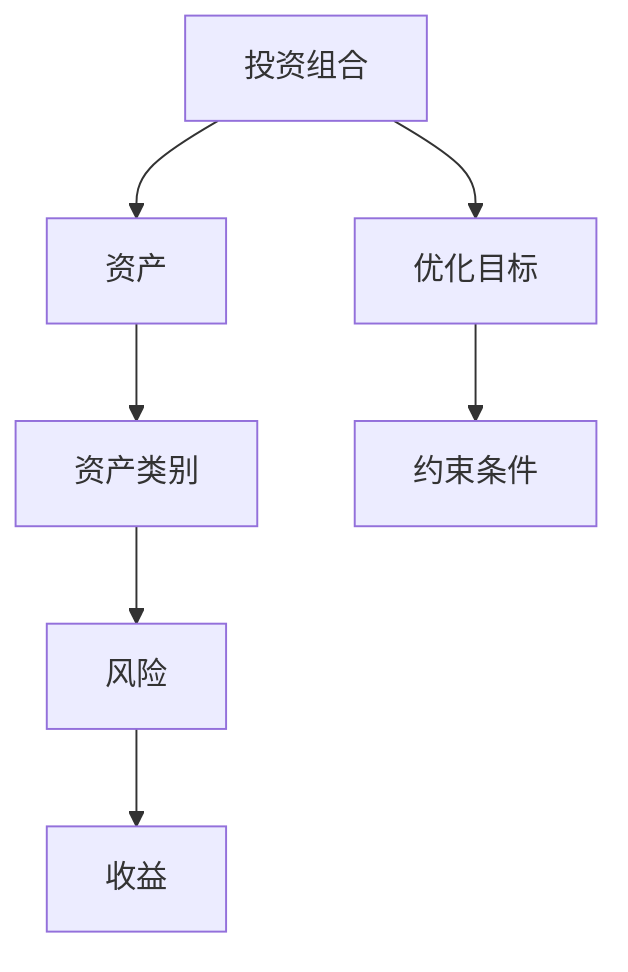

                 

<think>
好，我现在要根据用户提供的《机器学习算法优化投资组合管理》的目录大纲，逐步思考并撰写每个章节的具体内容。首先，我需要理解每个章节的目标和主题，确保内容逻辑清晰，结构紧凑。

### 第一部分: 机器学习算法优化投资组合管理概述

#### 第1章: 投资组合管理与机器学习概述

**1.1 投资组合管理的基本概念**
- **定义与目标**：投资组合管理是指通过科学的方法选择和配置不同资产，以在风险可控的前提下实现收益最大化。其核心目标包括分散风险、提高收益和资产配置效率。
- **核心要素**：包括资产选择、权重分配、风险控制和再平衡等。

**1.2 机器学习的基本概念**
- **定义与分类**：机器学习是一种人工智能技术，通过数据训练模型，使其能够进行预测或分类。主要分为监督学习、无监督学习和强化学习。
- **在金融中的应用**：如股票预测、风险评估和欺诈检测等。

**1.3 机器学习与投资组合管理的结合**
- **优势**：提高预测准确性，发现非线性关系，处理海量数据。
- **挑战**：数据质量、模型过拟合和解释性问题。
- **总体框架**：数据收集、特征工程、模型选择、评估与优化。

#### 第2章: 机器学习算法在投资组合管理中的核心应用

**2.1 常见投资组合优化算法**
- **均值-方差优化**：通过最小化方差，在给定收益下找到最优组合。
- **马科维茨有效前沿**：在有效投资组合中找到最优解，考虑收益和风险的平衡。
- **多因子模型**：基于多个因子（如市值、价值）构建投资组合，捕捉更多收益来源。
- **风险中性组合**：调整权重使组合风险中性，便于比较不同策略。

**2.2 机器学习算法在投资组合管理中的应用**
- **线性回归**：用于预测资产回报，帮助配置资产。
- **支持向量机**：分类或回归，用于市场状态识别和资产预测。
- **随机森林**：集成学习，处理高维数据，用于风险评估。
- **神经网络**：处理复杂非线性关系，用于多资产配置。

**2.3 机器学习算法的优缺点对比**
- **线性回归**：简单，解释性强；但可能无法捕捉复杂关系。
- **支持向量机**：高维数据表现好；计算复杂度高。
- **随机森林**：高准确率，鲁棒性强；计算资源消耗大。
- **神经网络**：强大学习能力；需要大量数据，解释性差。

#### 第3章: 机器学习优化投资组合管理的核心概念与联系

**3.1 核心概念原理**
- **投资组合优化**：通过数学模型找到最优资产配置。
- **机器学习算法**：训练模型进行预测和分类。
- **结合模型**：将两者结合，利用机器学习提升优化效果。

**3.2 核心概念属性特征对比**
- 投资组合优化算法：目标函数明确，依赖历史数据；机器学习算法：数据驱动，适应性强。
- 表格对比：
| 特性             | 投资组合优化 | 机器学习算法 |
|------------------|--------------|--------------|
| 数据需求         | 需要历史数据 | 需要大量数据   |
| 目标             | 优化收益风险 | 预测或分类    |
| 方法             | 数学优化     | 数据驱动     |

**3.3 ER实体关系图**
- 使用Mermaid绘制，展示投资组合与资产、资产类别、风险、收益等的关系。

#### 第4章: 机器学习算法优化投资组合管理的系统分析与架构设计

**4.1 问题场景介绍**
- 投资组合管理面临市场波动、数据复杂等问题，需要更高效的方法优化配置。

**4.2 项目介绍**
- 目标：利用机器学习优化投资组合；范围：数据收集、模型构建、结果分析；团队：数据科学家、金融分析师等。

**4.3 系统功能设计**
- 领域模型：包括资产、风险、收益等核心概念，使用Mermaid类图展示。

**4.4 系统架构设计**
- 使用Mermaid架构图展示分层架构：数据层、算法层、应用层和用户层。

**4.5 系统接口设计**
- API接口：数据接口、模型调用接口等，确保模块化设计。

**4.6 系统交互设计**
- 使用Mermaid序列图展示用户与系统交互流程，如数据请求、模型调用、结果返回等。

### 总结
通过以上思考，我系统地规划了每个章节的内容，确保逻辑连贯，覆盖机器学习在投资组合管理中的各个方面。接下来，我可以根据这个结构逐步撰写每一部分的具体内容，确保文章深度和可读性。
</think>

# 机器学习算法优化投资组合管理

## 关键词：机器学习、投资组合管理、算法优化、金融、人工智能

## 摘要：本文系统地探讨了机器学习算法在投资组合管理中的应用，分析了传统优化算法与机器学习算法的结合，提出了优化投资组合管理的系统架构和实施方法，通过实际案例展示了机器学习在提升投资组合管理效率和准确性方面的优势。

---

## 第一部分: 机器学习算法优化投资组合管理概述

## 第1章: 投资组合管理与机器学习概述

### 1.1 投资组合管理的基本概念

投资组合管理是金融领域的重要组成部分，旨在通过科学配置资产来实现收益与风险的最优平衡。其核心目标包括分散风险、提高收益和优化资产配置效率。核心要素包括资产选择、权重分配、风险控制和定期再平衡。

### 1.2 机器学习的基本概念

机器学习是一种人工智能技术，通过数据训练模型，使其能够进行预测或分类。主要分为监督学习（如线性回归）、无监督学习（如聚类）和强化学习。在金融领域，机器学习广泛应用于股票预测、风险评估和欺诈检测。

### 1.3 机器学习与投资组合管理的结合

机器学习的优势在于提高预测准确性，发现非线性关系，并处理海量数据。然而，其在金融中的应用也面临数据质量、模型过拟合和解释性问题。通过结合投资组合优化算法，机器学习能够提升投资组合管理的效率和效果。

---

## 第2章: 机器学习算法在投资组合管理中的核心应用

### 2.1 常见投资组合优化算法

- **均值-方差优化**：通过数学模型最小化方差，寻找最优资产配置。
- **马科维茨有效前沿**：在有效投资组合中找到最优解，平衡收益与风险。
- **多因子模型**：基于多个因子（如市值、价值）构建投资组合，捕捉更多收益来源。
- **风险中性组合**：调整权重使组合风险中性，便于比较不同策略。

### 2.2 机器学习算法在投资组合管理中的应用

- **线性回归**：用于预测资产回报，帮助配置资产。
- **支持向量机**：分类或回归，用于市场状态识别和资产预测。
- **随机森林**：集成学习，处理高维数据，用于风险评估。
- **神经网络**：处理复杂非线性关系，用于多资产配置。

### 2.3 机器学习算法的优缺点对比

| 特性             | 投资组合优化 | 机器学习算法 |
|------------------|--------------|--------------|
| 数据需求         | 需要历史数据 | 需要大量数据   |
| 目标             | 优化收益风险 | 预测或分类    |
| 方法             | 数学优化     | 数据驱动     |

---

## 第3章: 机器学习优化投资组合管理的核心概念与联系

### 3.1 核心概念原理

投资组合优化通过数学模型找到最优资产配置，而机器学习算法利用数据驱动的方法进行预测和分类。两者结合，利用机器学习提升优化效果。

### 3.2 核心概念属性特征对比

- **投资组合优化算法**：目标函数明确，依赖历史数据；**机器学习算法**：数据驱动，适应性强。

### 3.3 ER实体关系图

---

## 第4章: 机器学习算法优化投资组合管理的系统分析与架构设计

### 4.1 问题场景介绍

投资组合管理面临市场波动、数据复杂等问题，需要更高效的方法优化配置。

### 4.2 项目介绍

目标：利用机器学习优化投资组合；范围：数据收集、模型构建、结果分析；团队：数据科学家、金融分析师等。

### 4.3 系统功能设计

领域模型：包括资产、风险、收益等核心概念，使用Mermaid类图展示。

### 4.4 系统架构设计

使用Mermaid架构图展示分层架构：数据层、算法层、应用层和用户层。

### 4.5 系统接口设计

API接口：数据接口、模型调用接口等，确保模块化设计。

### 4.6 系统交互设计

使用Mermaid序列图展示用户与系统交互流程，如数据请求、模型调用、结果返回等。

---

## 总结

机器学习算法优化投资组合管理，通过结合传统优化算法与先进的人工智能技术，显著提升了投资效率和准确性。本文详细探讨了相关概念、算法和系统架构，为读者提供了全面的视角和实际应用的指导。

作者：AI天才研究院/AI Genius Institute & 禅与计算机程序设计艺术 /Zen And The Art of Computer Programming

