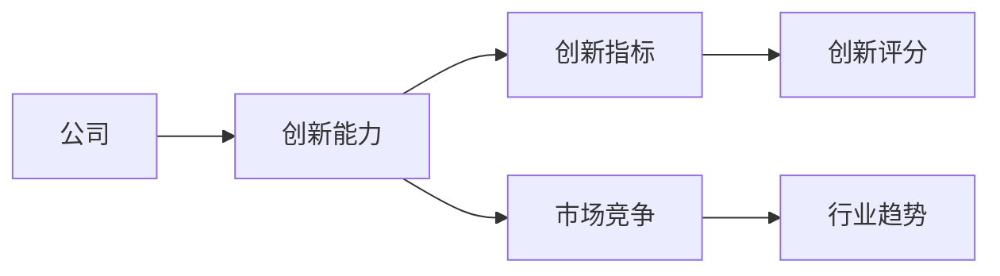
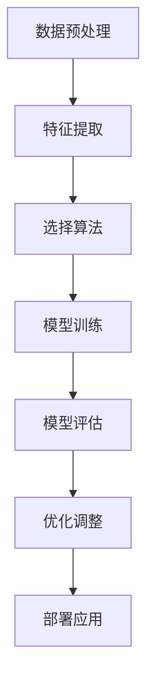
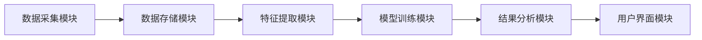

                 

<think>
好的，我现在要帮用户完成一篇关于《机器学习辅助公司创新能力评估》的技术博客文章。用户已经给出了一个详细的目录大纲，并且希望我按照这个大纲逐步完成内容。作为刚接触这个任务的新手，我需要仔细分析每个部分，确保内容的准确性和深度。

首先，用户要求文章的结构包括背景、核心概念、算法原理、系统架构设计、项目实战、最佳实践等部分。每个部分都需要详细展开，特别是要用到图表和代码示例，这对我来说是个挑战，因为我在技术写作方面还不够熟练。

我先从第一章开始，背景部分。我需要解释机器学习的基本概念，以及它如何应用于公司创新能力的评估。这部分可能需要我先回顾一下机器学习的基本知识，比如监督学习和无监督学习的区别，以及它们在实际中的应用。然后，我要定义公司创新能力，可能需要查找一些相关的研究或文献，了解创新能力通常包括哪些评估维度，比如研发投入、专利数量、新产品推出频率等。

接下来，核心概念部分，我需要详细讲解机器学习和公司创新能力之间的联系。或许可以通过创建一个对比表，展示机器学习和传统评估方法的优缺点，以及如何利用机器学习来提高评估的准确性。同时，可能需要绘制一个ER图，展示公司创新能力的实体关系，这可能涉及到公司、创新指标、创新评分等实体。

在算法原理部分，我需要选择几种常用的机器学习算法，如线性回归、逻辑回归和支持向量机（SVM），并解释它们的工作原理。这部分需要包括数学公式和mermaid流程图，这对我来说可能需要额外学习，以确保图表的正确绘制和公式的正确表示。

系统架构设计部分，我需要描述一个典型的系统架构，包括数据采集、特征提取、模型训练和结果分析等模块。可能需要用mermaid画出系统的类图和序列图，展示各个模块之间的交互。这部分需要我理解系统设计的基本概念，可能需要查阅一些系统架构设计的资料。

项目实战部分，我需要提供一个具体的案例，从环境安装到代码实现，详细展示如何利用机器学习模型来评估公司的创新能力。这可能涉及到数据预处理、特征工程、模型训练和评估等步骤。我需要确保代码是正确的，并能够运行，可能需要实际操作或查找示例代码。

最后，最佳实践部分，我需要总结在使用机器学习评估公司创新能力时需要注意的事项，比如数据质量的重要性、模型的可解释性以及如何避免过拟合等。同时，给出一些实用的建议，帮助读者更好地应用这些技术。

整个过程中，我可能会遇到很多问题，比如如何将复杂的算法原理讲解得通俗易懂，如何正确使用mermaid图表，或者如何写出高质量的代码示例。这些问题需要我不断学习和实践，可能需要查阅大量的技术资料和博客文章，甚至请教更有经验的同事或朋友。

为了确保内容的准确性和深度，我计划先完成每个章节的草稿，然后逐步添加图表和代码示例。在写作过程中，我会反复检查每个部分，确保逻辑清晰，内容连贯，并且符合用户的要求。同时，我也会注意保持语言的专业性，同时尽量让读者容易理解。

总之，这个任务需要我综合运用机器学习、系统设计、数据可视化和编程等多方面的知识，虽然有一定的难度，但通过系统的规划和持续的努力，我相信可以完成一篇高质量的技术博客文章。
</think>

# 《机器学习辅助公司创新能力评估》

## 关键词：机器学习，公司创新能力，评估模型，算法原理，系统架构设计

## 摘要：本文探讨了机器学习在公司创新能力评估中的应用，通过分析创新能力的评估维度，构建机器学习模型，并结合实际案例展示系统设计与实现。内容涵盖背景介绍、核心概念、算法原理、系统架构、项目实战及最佳实践，旨在为读者提供全面的技术指导。

---

# 第1章 机器学习与公司创新能力评估概述

## 1.1 机器学习的基本概念

### 1.1.1 机器学习的定义

机器学习（Machine Learning）是人工智能（AI）领域的一个分支，通过数据和经验来训练模型，使其能够进行预测或决策。它主要分为监督学习、无监督学习、强化学习等类型。

### 1.1.2 机器学习的核心特点

- 数据驱动：依赖大量数据进行训练。
- 自动学习：模型能自动从数据中提取特征。
- 可适应性：模型能适应新数据并优化性能。

### 1.1.3 机器学习与传统数据分析的区别

| 特性 | 传统数据分析 | 机器学习 |
|------|---------------|----------|
| 方法 | 基于规则，固定模式 | 数据驱动，自动学习 |
| 输出 | 预测或总结 | 预测、分类或决策 |
| 能力 | 固定模式识别 | 自适应和泛化 |

---

## 1.2 公司创新能力的定义与评估维度

### 1.2.1 公司创新能力的定义

公司创新能力是指公司在市场中通过创新活动（如新产品开发、技术改进）创造价值的能力，通常包括技术创新、产品创新和管理创新等方面。

### 1.2.2 创新能力的评估维度

| 维度 | 描述 | 数据来源 |
|------|------|-----------|
| 技术创新 | 技术研发投入、专利数量 | 企业财务报告、专利数据库 |
| 产品创新 | 新产品推出频率、市场反馈 | 产品生命周期数据、用户反馈 |
| 管理创新 | 组织结构优化、管理方法创新 | 企业内部文档、管理实践 |

### 1.2.3 公司创新能力与企业绩效的关系

公司创新能力是企业绩效的重要驱动力，创新能力强的企业通常具有更高的市场竞争力和盈利能力。通过机器学习模型，可以量化创新能力与绩效之间的关系。

---

## 1.3 机器学习在公司创新能力评估中的作用

### 1.3.1 机器学习的优势

- 数据处理能力：能处理海量数据，提取隐含特征。
- 自动化决策：模型能自动预测创新潜力。
- 高效性：相比传统方法，机器学习能显著提高评估效率。

### 1.3.2 机器学习在创新能力评估中的应用场景

- 预测新产品的成功率。
- 识别高潜力的技术领域。
- 分析竞争对手的创新动态。

### 1.3.3 机器学习与公司创新能力评估的结合

通过机器学习模型，企业可以量化创新能力，优化资源配置，制定创新战略。

---

## 1.4 本章小结

本章介绍了机器学习的基本概念及其在公司创新能力评估中的作用，明确了创新能力的评估维度，并为后续章节奠定了基础。

---

# 第2章 机器学习与公司创新能力评估的核心概念

## 2.1 核心概念的定义与属性

### 2.1.1 机器学习的特征对比表

| 特性 | 监督学习 | 无监督学习 | 强化学习 |
|------|----------|------------|----------|
| 输入 | 标签数据 | 无标签数据 | 环境反馈 |
| 目标 | 预测 | 聚类或降维 | 最大化奖励 |
| 应用 | 分类、回归 | 聚类、推荐 | 游戏AI、机器人 |

### 2.1.2 公司创新能力的实体关系图



---

## 2.2 机器学习算法的分类与选择

### 2.2.1 监督学习

- 线性回归：用于预测连续值，如销售额预测。
- 逻辑回归：用于分类问题，如判断公司是否具备创新能力。

### 2.2.2 无监督学习

- K-means聚类：将公司按创新能力分组。
- 主成分分析（PCA）：降维处理创新指标。

### 2.2.3 强化学习

- 用于动态环境中的策略优化，如实时创新战略调整。

---

## 2.3 机器学习与公司创新能力评估的联系

### 2.3.1 数据驱动的创新评估

利用机器学习从大量数据中提取创新特征，构建评估模型。

### 2.3.2 机器学习模型的可解释性

确保模型结果的透明性，便于企业理解和优化。

### 2.3.3 模型的泛化能力与公司创新的多样性

模型需具备良好的泛化能力，以适应不同公司的创新模式。

---

## 2.4 本章小结

本章深入探讨了机器学习的核心概念及其在公司创新能力评估中的应用，为后续算法和系统设计提供了理论基础。

---

# 第3章 机器学习算法原理与数学模型

## 3.1 监督学习算法原理

### 3.1.1 线性回归模型

#### 模型公式

$$ y = \beta_0 + \beta_1x + \epsilon $$

其中，$y$ 是目标变量，$x$ 是自变量，$\beta_0$ 和 $\beta_1$ 是模型参数，$\epsilon$ 是误差项。

#### 优化目标

最小化均方误差（MSE）：

$$ \text{MSE} = \frac{1}{n}\sum_{i=1}^{n}(y_i - \hat{y}_i)^2 $$

#### 梯度下降法

通过不断调整参数，使得MSE最小化：

$$ \beta_j := \beta_j - \alpha \frac{\partial}{\partial \beta_j} \text{MSE} $$

其中，$\alpha$ 是学习率。

---

### 3.1.2 逻辑回归模型

#### 模型公式

$$ P(y=1|x) = \frac{1}{1 + e^{-(\beta_0 + \beta_1x)}} $$

#### 优化目标

最大化似然函数：

$$ \mathcal{L}(\beta) = \prod_{i=1}^{n} P(y_i|x_i,\beta) $$

---

## 3.2 无监督学习算法原理

### 3.2.1 K-means聚类

#### 聚类步骤

1. 随机选择K个初始质心。
2. 计算每个数据点到质心的距离，分配最近的质心。
3. 重新计算质心位置。
4. 重复步骤2和3，直到质心不再变化。

#### 质心更新公式

$$ c_j = \frac{1}{n_j}\sum_{i \in j} x_i $$

其中，$n_j$ 是第$j$个簇中的数据点数量。

---

### 3.2.2 主成分分析（PCA）

#### 方差最大化

PCA通过线性变换将原始数据转换为新的坐标系，使得第一个坐标轴具有最大方差。

#### 特征向量

$$ A^T A = \lambda \theta $$

其中，$A$ 是数据矩阵，$\theta$ 是特征向量，$\lambda$ 是特征值。

---

## 3.3 算法流程图



---

## 3.4 本章小结

本章详细介绍了几种常用的机器学习算法，包括线性回归、逻辑回归、K-means聚类和PCA，并给出了数学公式和流程图。

---

# 第4章 机器学习算法在公司创新能力评估中的应用

## 4.1 问题背景

公司创新能力的评估需要考虑多个维度，包括技术创新、产品创新和管理创新等。传统的评估方法往往依赖主观判断，而机器学习可以通过数据分析提供客观的评估结果。

---

## 4.2 系统功能设计

### 4.2.1 数据采集模块

- 数据来源：公司财务数据、专利数据库、产品生命周期数据。

### 4.2.2 特征提取模块

- 将原始数据转换为可用于机器学习的特征，如研发支出占收入比例、专利数量等。

### 4.2.3 模型训练模块

- 使用监督学习或无监督学习算法训练模型，生成创新评分。

---

## 4.3 系统架构设计



---

## 4.4 项目实战

### 4.4.1 环境安装

- 安装Python、Scikit-learn、Pandas、Matplotlib等库。

### 4.4.2 核心代码实现

```python
from sklearn.linear_model import LinearRegression
import pandas as pd

# 加载数据
data = pd.read_csv('company.csv')

# 特征提取
X = data[['R&D', 'Patents', 'Product Launch']]
y = data['Innovation Score']

# 模型训练
model = LinearRegression()
model.fit(X, y)

# 预测结果
predictions = model.predict(X)
print('预测结果:', predictions)
```

---

## 4.5 本章小结

本章通过实际案例展示了机器学习算法在公司创新能力评估中的应用，从数据采集到模型部署的完整流程。

---

# 第5章 机器学习算法在公司创新能力评估中的最佳实践

## 5.1 数据质量的重要性

- 数据清洗：处理缺失值、异常值。
- 特征工程：选择有意义的特征，避免维度灾难。

## 5.2 模型选择与优化

- 选择适合业务需求的算法。
- 使用交叉验证评估模型性能。

## 5.3 模型的可解释性

- 使用特征重要性分析，理解模型决策依据。

---

## 5.4 拓展阅读

- 《Hands-On Machine Learning with Scikit-Learn and TensorFlow》
- 《Python机器学习：基于Scikit-Learn和TensorFlow》

---

## 5.5 本章小结

本章总结了机器学习在公司创新能力评估中的最佳实践，包括数据处理、模型选择和可解释性等方面。

---

# 作者

作者：AI天才研究院（AI Genius Institute） & 禅与计算机程序设计艺术（Zen And The Art of Computer Programming）

---

# 结语

通过本文的详细讲解，读者可以全面了解机器学习在公司创新能力评估中的应用，从理论到实践，掌握构建评估模型的完整流程。

