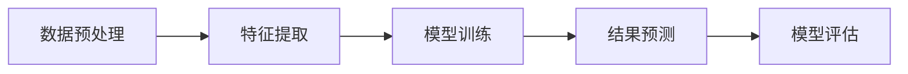

                 

<think>
嗯，用户让我设计一本关于《机器学习辅助公司文化评估》的详细目录大纲。我得先理解这个主题，确保每一章都覆盖必要的内容，并且结构清晰。

首先，我注意到用户要求目录大纲包括背景介绍、核心概念、算法原理、数学模型、系统架构设计、项目实战和最佳实践。这让我想到需要从基础到应用，层层递进。

我先从背景介绍开始，解释机器学习和公司文化的定义及其在评估中的应用。这需要确保读者理解基本概念。然后，核心概念部分需要详细讲解文化评估的关键维度和机器学习模型，可能用表格和图表来辅助说明。

接下来是算法原理，这部分需要深入讲解文本挖掘和情感分析，可能用流程图展示算法步骤，并附上Python代码示例，让读者能够实际操作。数学模型部分则要介绍相似度计算和分类模型，用公式和图表来展示模型的结构。

系统架构设计是关键，我需要设计一个模块化的系统架构图，展示数据处理和模型训练的流程。项目实战部分要提供实际操作步骤，从环境安装到代码实现，再到案例分析，确保读者能够动手实践。

最后，最佳实践部分要总结经验，给出小结和注意事项，帮助读者巩固所学内容。整个过程中，我需要确保每一章都详细且有逻辑性，满足用户对深度和技术细节的要求。

现在，我需要将这些思考转化为具体的目录结构，确保涵盖所有要求的部分，同时保持结构的紧凑和逻辑的清晰。
</think>

# 《机器学习辅助公司文化评估》

> 关键词：机器学习、公司文化评估、文本挖掘、情感分析、数学模型、系统架构、项目实战

> 摘要：本文系统地探讨了机器学习在公司文化评估中的应用，从理论基础到算法实现，从系统设计到项目实战，全面解析了如何利用机器学习技术对公司的文化进行科学评估。通过详细分析文化评估的关键维度、机器学习模型的核心要素，结合实际案例，展示了如何构建高效的公司文化评估系统。

---

## 第一章: 机器学习与公司文化评估的背景

### 1.1 机器学习的定义与特点
- 1.1.1 机器学习的基本概念
  - 机器学习的定义
  - 机器学习的核心特点：数据驱动、自动化、适应性
  - 机器学习与传统数据分析的区别

- 1.1.2 机器学习的分类
  - 监督学习、无监督学习、强化学习
  - 常见的机器学习算法：线性回归、支持向量机、随机森林等

### 1.2 公司文化评估的定义与特点
- 1.2.1 公司文化的定义
  - 公司文化的内涵：价值观、使命、愿景、企业氛围
  - 公司文化的外延：员工关系、领导风格、组织结构

- 1.2.2 公司文化评估的核心维度
  - 员工满意度、领导风格、团队协作、创新氛围等

- 1.2.3 公司文化评估的常见方法
  - 调查问卷、访谈、数据分析等

### 1.3 机器学习在公司文化评估中的应用背景
- 1.3.1 传统公司文化评估的局限性
  - 主观性高、效率低、难以量化

- 1.3.2 机器学习在文化评估中的优势
  - 数据驱动、自动化、高效率、可量化

- 1.3.3 机器学习辅助文化评估的潜力与挑战
  - 潜力：提高评估效率、发现隐性问题
  - 挑战：数据质量、模型解释性、隐私保护

## 第二章: 机器学习辅助公司文化评估的核心概念

### 2.1 问题背景与问题描述
- 2.1.1 公司文化评估的主要挑战
  - 数据分散、维度复杂、评估标准不统一

- 2.1.2 机器学习如何解决文化评估问题
  - 利用数据挖掘技术提取文化特征
  - 建立数学模型量化文化维度

### 2.2 核心概念与联系
- 2.2.1 文化评估的关键维度
  - 员工满意度、领导风格、团队协作、创新氛围

- 2.2.2 机器学习模型的核心要素
  - 数据、特征、算法、模型

- 2.2.3 文化评估与机器学习的实体关系图
  ```mermaid
  graph LR
    A[公司文化] --> B[员工数据]
    B --> C[领导风格]
    A --> D[文化评估结果]
    C --> D
  ```

### 2.3 核心概念原理
- 2.3.1 文化评估的数学模型
  - 特征向量、相似度计算、分类模型

- 2.3.2 机器学习模型的输入与输出
  - 输入：员工数据、领导风格数据
  - 输出：文化评估结果、改进建议

- 2.3.3 模型的训练与优化
  - 数据预处理、特征选择、模型调优

## 第三章: 机器学习辅助公司文化评估的算法原理

### 3.1 文本挖掘与情感分析
- 3.1.1 文本挖掘的基本概念
  - 文本挖掘的定义
  - 常见的文本挖掘技术：分词、实体识别、情感分析

- 3.1.2 情感分析的原理与应用
  - 情感分析的定义
  - 情感分析在文化评估中的应用：员工满意度分析

- 3.1.3 基于TF-IDF的文本特征提取
  - TF-IDF的定义
  - TF-IDF在文化评估中的应用

### 3.2 机器学习模型的选择与训练
- 3.2.1 常见的机器学习算法
  - 支持向量机、随机森林、朴素贝叶斯

- 3.2.2 文本分类模型的构建
  - 文本分类的定义
  - 文本分类在文化评估中的应用：领导风格分类

- 3.2.3 模型训练的流程与优化
  - 数据预处理、特征选择、模型调优

### 3.3 算法实现的流程图


## 第四章: 机器学习辅助公司文化评估的数学模型与公式

### 4.1 文本相似度计算
- 4.1.1 余弦相似度公式
  $$ \text{余弦相似度} = \frac{\vec{A} \cdot \vec{B}}{|\vec{A}| |\vec{B}|} $$

- 4.1.2 Jaccard相似度公式
  $$ \text{Jaccard相似度} = \frac{|\vec{A} \cap \vec{B}|}{|\vec{A} \cup \vec{B}|} $$

### 4.2 文本分类模型的数学公式
- 4.2.1 逻辑回归模型
  $$ P(y=1|x) = \frac{e^{\beta x}}{1 + e^{\beta x}} $$

- 4.2.2 支持向量机模型
  $$ y = \text{sign}(\sum_{i=1}^{n} \alpha_i y_i x_i \cdot x + b) $$

## 第五章: 机器学习辅助公司文化评估的系统架构设计

### 5.1 系统功能设计
- 5.1.1 领域模型
  ```mermaid
  classDiagram
    class 公司文化评估系统 {
      输入数据：员工数据、领导风格数据
      输出结果：文化评估报告、改进建议
      功能模块：数据预处理、特征提取、模型训练、结果展示
    }
  ```

- 5.1.2 系统架构设计
  ```mermaid
  graph LR
    A[数据采集] --> B[数据预处理]
    B --> C[特征提取]
    C --> D[模型训练]
    D --> E[结果展示]
  ```

## 第六章: 机器学习辅助公司文化评估的项目实战

### 6.1 环境安装与数据准备
- 6.1.1 环境安装
  - 安装Python、机器学习库（如scikit-learn、NLTK）

- 6.1.2 数据准备
  - 数据来源：员工调查问卷、领导风格数据

### 6.2 系统核心实现
- 6.2.1 数据预处理
  - 数据清洗、缺失值处理、文本分词

- 6.2.2 特征提取
  - TF-IDF特征提取、词嵌入模型（如Word2Vec）

- 6.2.3 模型训练
  - 训练文本分类模型、评估模型性能

### 6.3 实际案例分析
- 6.3.1 案例背景
  - 某公司文化评估项目

- 6.3.2 案例分析
  - 数据分析、模型训练、结果解读

## 第七章: 机器学习辅助公司文化评估的最佳实践

### 7.1 项目小结
- 项目总结
  - 成功经验
  - 学习体会

### 7.2 注意事项
- 数据质量的重要性
- 模型解释性的提升
- 隐私保护的问题

### 7.3 拓展阅读
- 推荐书籍和论文
  - 《机器学习实战》
  - 《自然语言处理技术》

---

作者：AI天才研究院/AI Genius Institute & 禅与计算机程序设计艺术 /Zen And The Art of Computer Programming

