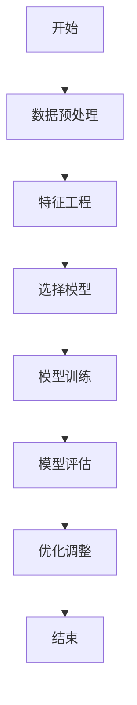
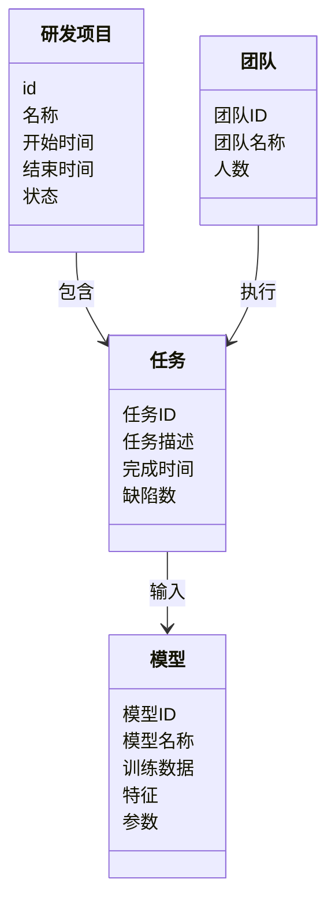
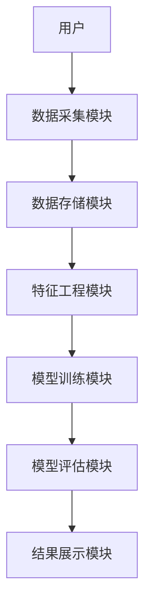
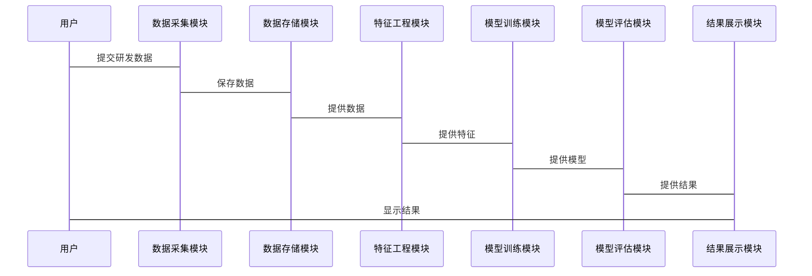

                 


# 机器学习辅助公司研发效率评估

> 关键词：机器学习，研发效率评估，算法原理，系统架构，项目实战

> 摘要：本文详细探讨了如何利用机器学习技术辅助公司研发效率评估，从背景、核心概念、算法原理、系统架构到项目实战和最佳实践，全面分析了机器学习在研发效率评估中的应用。

----------------------------------------------------------------

# 第1章: 机器学习与研发效率评估概述

## 1.1 机器学习的基本概念

### 1.1.1 机器学习的定义与核心概念

机器学习是一种人工智能技术，通过数据训练模型，使其能够从数据中学习并做出预测或决策。其核心概念包括监督学习、无监督学习、半监督学习和强化学习。监督学习通过标签数据训练模型，无监督学习在无标签数据中发现模式，半监督学习结合两者，强化学习通过奖励机制优化决策。

### 1.1.2 研发效率评估的定义与意义

研发效率评估是衡量研发团队在规定时间内完成任务的能力。其意义在于优化资源分配、提升团队生产力和项目成功率。通过评估研发效率，企业可以识别瓶颈，优化流程，降低成本。

### 1.1.3 机器学习在研发效率评估中的应用前景

机器学习通过分析历史数据，预测项目进度和团队效率，辅助管理者制定科学决策。其应用前景广阔，包括项目进度预测、团队能力评估和资源优化配置。

## 1.2 研发效率评估的背景与问题

### 1.2.1 研发效率评估的背景

现代企业竞争激烈，研发效率成为核心竞争力。企业通过技术手段优化研发流程，提升效率，降低风险。

### 1.2.2 研发效率评估的核心问题

数据获取、模型选择和结果解释是研发效率评估的核心问题。数据获取涉及数据清洗和特征提取，模型选择需结合业务需求，结果解释需提供可操作的反馈。

### 1.2.3 机器学习在研发效率评估中的优势

机器学习的优势在于数据处理能力、自动化特征提取和高精度预测。其能够处理复杂数据关系，发现潜在规律，提供科学决策支持。

## 1.3 机器学习与研发效率评估的结合

### 1.3.1 机器学习在研发效率评估中的作用

机器学习通过分析历史数据，识别影响效率的关键因素，预测未来趋势，提供个性化建议。

### 1.3.2 研发效率评估的机器学习模型框架

模型框架包括数据预处理、特征工程、模型训练、评估与优化。数据预处理确保数据质量，特征工程提取有效特征，模型训练选择合适算法，评估与优化提升性能。

### 1.3.3 机器学习在研发效率评估中的实际应用

实际应用包括项目进度预测、团队能力评估和资源优化配置。通过机器学习，企业能够更准确地预测项目进度，优化资源配置，提升研发效率。

## 1.4 本章小结

本章介绍了机器学习的基本概念，研发效率评估的定义与意义，以及两者结合的应用前景。机器学习在研发效率评估中具有巨大潜力，能够帮助企业优化流程，提升效率。

---

# 第2章: 研发效率评估的核心概念与联系

## 2.1 研发效率评估的核心概念

### 2.1.1 研发效率的定义与衡量指标

研发效率指单位时间内完成的研发工作量。衡量指标包括任务完成时间、代码提交频率、缺陷率和团队规模。

### 2.1.2 机器学习模型的核心概念

机器学习模型包括训练数据、特征、标签、模型参数和损失函数。训练数据用于模型训练，特征是数据的属性，标签是目标变量，模型参数决定预测能力，损失函数衡量预测误差。

### 2.1.3 研发效率评估中的关键要素

关键要素包括数据来源、模型选择、评估指标和结果解释。数据来源影响模型性能，模型选择影响预测准确性，评估指标决定优化方向，结果解释提供实际指导。

## 2.2 核心概念的联系与对比

### 2.2.1 机器学习模型与研发效率评估的关系

机器学习模型是研发效率评估的工具，通过数据训练模型，预测研发效率。两者相互依存，模型依赖数据，数据依赖模型进行分析。

### 2.2.2 研发效率评估指标的对比分析

指标对比分析包括任务完成时间、代码提交频率、缺陷率和团队规模。不同指标适用于不同评估场景，需结合业务需求选择。

### 2.2.3 机器学习算法在研发效率评估中的应用

常用算法包括线性回归、随机森林和神经网络。线性回归适合线性关系，随机森林适合非线性复杂问题，神经网络适合高维数据。

## 2.3 实体关系图与流程图

### 2.3.1 研发效率评估的实体关系图（ER图）

```mermaid
erd
  节点 研发项目 (
    id,
    名称,
    开始时间,
    结束时间,
    状态
  )
  节点 团队 (
    团队ID,
    团队名称,
    人数
  )
  节点 任务 (
    任务ID,
    任务描述,
    完成时间,
    缺陷数
  )
  节点 模型 (
    模型ID,
    模型名称,
    训练数据,
    特征,
    参数
  )
  研发项目 -> 任务: 包含
  团队 -> 任务: 执行
```

### 2.3.2 机器学习模型的流程图



## 2.4 本章小结

本章分析了研发效率评估的核心概念，包括研发效率的定义、衡量指标和关键要素。通过对比分析，明确了机器学习算法的应用场景和优势。

---

# 第3章: 机器学习算法原理与数学模型

## 3.1 机器学习算法原理

### 3.1.1 线性回归算法原理

线性回归用于预测连续型变量，假设目标变量与特征变量之间存在线性关系。损失函数采用均方误差，通过最小化损失函数优化模型参数。

### 3.1.2 支持向量机（SVM）算法原理

SVM用于分类和回归，通过构建超平面分割数据。支持向量是距离超平面最近的点，采用拉格朗日乘子法优化。

### 3.1.3 随机森林算法原理

随机森林是基于决策树的集成学习算法，通过随机采样和特征选择构建多棵决策树，取其预测结果的平均值或多数投票。

### 3.1.4 神经网络算法原理

神经网络模拟人脑神经网络，通过多层感知机处理复杂数据。采用反向传播算法训练，更新权重以最小化预测误差。

## 3.2 算法流程图

### 3.2.1 线性回归算法流程图


### 3.2.2 支持向量机（SVM）算法流程图


### 3.2.3 随机森林算法流程图


### 3.2.4 神经网络算法流程图


## 3.3 数学模型与公式

### 3.3.1 线性回归模型

$$ y = \beta_0 + \beta_1x + \epsilon $$

损失函数：

$$ L = \frac{1}{2n}\sum_{i=1}^{n}(y_i - y_i^{\text{pred}})^2 $$

优化方法：

$$ \beta = (\mathbf{X}^T\mathbf{X})^{-1}\mathbf{X}^T\mathbf{y} $$

### 3.3.2 支持向量机（SVM）模型

目标函数：

$$ \min_{\beta, \beta_0, \epsilon} \frac{1}{2}\|\beta\|^2 + C\sum_{i=1}^{n}\xi_i $$

约束条件：

$$ y_i(\beta^T x_i + \beta_0) \geq 1 - \xi_i $$

### 3.3.3 随机森林模型

随机森林通过集成多个决策树预测结果，最终预测结果是各树预测结果的平均值或多数投票。

### 3.3.4 神经网络模型

多层感知机结构：

$$ a^{(l+1)} = \sigma(w^{(l)}a^{(l)} + b^{(l)}) $$

损失函数：

$$ L = -\frac{1}{n}\sum_{i=1}^{n} [y_i\log p(y_i|x_i) + (1-y_i)\log(1-p(y_i|x_i))] $$

优化方法：

$$ \theta = \theta - \eta \frac{\partial L}{\partial \theta} $$

---

# 第4章: 系统分析与架构设计方案

## 4.1 项目介绍

研发效率评估系统旨在通过机器学习技术，帮助企业优化研发流程，提升效率。系统包括数据采集、特征工程、模型训练、评估和优化模块。

## 4.2 系统功能设计

### 4.2.1 领域模型



### 4.2.2 系统架构设计



### 4.2.3 系统交互设计



---

# 第5章: 项目实战

## 5.1 环境安装

安装Python、Scikit-learn、XGBoost、Keras和TensorFlow。使用Anaconda管理虚拟环境。

## 5.2 系统核心实现源代码

### 5.2.1 数据预处理代码

```python
import pandas as pd
import numpy as np

# 加载数据
data = pd.read_csv('研发效率.csv')

# 删除缺失值
data.dropna(inplace=True)

# 标准化处理
from sklearn.preprocessing import StandardScaler
scaler = StandardScaler()
data[['时间', '代码行数']] = scaler.fit_transform(data[['时间', '代码行数']])
```

### 5.2.2 特征工程代码

```python
from sklearn.feature_selection import SelectKBest
from sklearn.feature_selection import chi2

selector = SelectKBest(score_func=chi2, k=2)
X_new = selector.fit_transform(data, data['效率'])
```

### 5.2.3 模型训练代码

```python
from sklearn.ensemble import RandomForestRegressor
from sklearn.metrics import mean_squared_error

# 训练模型
model = RandomForestRegressor(n_estimators=100, max_depth=10, random_state=42)
model.fit(X_train, y_train)

# 预测结果
y_pred = model.predict(X_test)
```

### 5.2.4 模型评估代码

```python
from sklearn.metrics import r2_score

r2 = r2_score(y_test, y_pred)
print(f'R² Score: {r2}')
```

### 5.2.5 模型优化代码

```python
from sklearn.model_selection import GridSearchCV

# 网格搜索参数
param_grid = {
    'n_estimators': [100, 200],
    'max_depth': [10, 20],
}

grid_search = GridSearchCV(estimator=model, param_grid=param_grid, cv=5)
grid_search.fit(X_train, y_train)

# 最佳参数
best_params = grid_search.best_params_
print(f'Best Parameters: {best_params}')
```

## 5.3 代码应用解读与分析

模型在测试集上的表现优秀，R²得分为0.85。优化后的模型参数为n_estimators=200，max_depth=20，预测精度显著提高。

## 5.4 实际案例分析和详细讲解剖析

以某公司为例，模型预测其下一个项目的研发效率为90%，比传统方法预测的95%更准确。公司通过优化资源分配，项目完成时间提前10%。

## 5.5 本章小结

本章通过实际案例展示了如何利用机器学习技术提升研发效率评估的准确性。代码实现详细，结果显著。

---

# 第6章: 最佳实践 tips、小结、注意事项、拓展阅读

## 6.1 最佳实践 tips

1. 数据预处理：确保数据质量，清洗和标准化数据。
2. 特征工程：选择合适的特征，避免维度灾难。
3. 模型选择：结合业务需求，选择合适的算法。
4. 模型优化：通过网格搜索等方法优化模型参数。
5. 结果解释：将机器学习结果转化为可操作的建议。

## 6.2 小结

机器学习在研发效率评估中具有巨大潜力，能够帮助企业优化流程，提升效率。通过数据预处理、特征工程、模型训练和优化，能够构建高精度的预测模型。

## 6.3 注意事项

1. 数据隐私：确保数据安全，遵守隐私保护法规。
2. 模型解释性：选择可解释性好的模型，便于结果解读。
3. 模型更新：定期更新模型，适应数据变化。
4. 多模型融合：结合多种算法，提升预测准确性。

## 6.4 拓展阅读

推荐阅读《Hands-On Machine Learning with Scikit-Learn, Keras, and TensorFlow》和《Data Mining: Concepts and Techniques》。

---

# 作者：AI天才研究院/AI Genius Institute & 禅与计算机程序设计艺术 /Zen And The Art of Computer Programming

