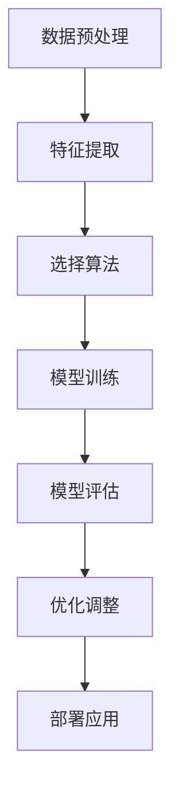
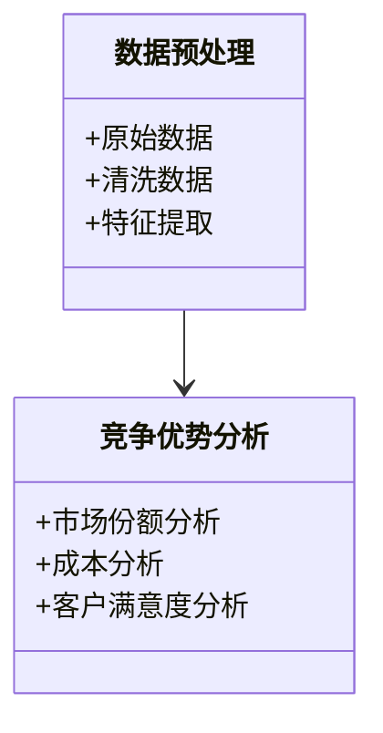
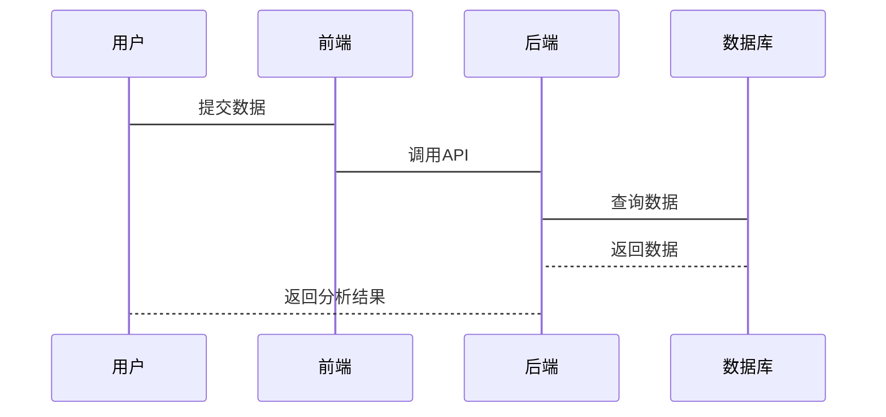

                 


# 机器学习辅助公司竞争优势分析

**关键词**：机器学习、竞争优势分析、数据驱动决策、商业分析、算法原理

**摘要**：  
随着数据科学和人工智能技术的快速发展，机器学习在公司竞争优势分析中的应用日益广泛。本文将从机器学习的基本概念出发，详细探讨其在竞争优势分析中的作用，结合实际案例分析，介绍如何通过机器学习算法和技术提升企业的竞争优势分析能力。文章内容涵盖背景介绍、核心概念、算法原理、系统架构设计、项目实战以及最佳实践，为读者提供全面的理论与实践指导。

---

## 第一部分: 机器学习辅助公司竞争优势分析基础

### 第1章: 机器学习与竞争优势分析概述

#### 1.1 机器学习的基本概念
##### 1.1.1 机器学习的定义与核心概念
机器学习是一种人工智能技术，通过数据训练模型，使其能够从数据中学习并做出预测或决策。核心概念包括：
- **监督学习**：基于标记数据，预测新的数据点（如分类和回归）。
- **无监督学习**：从无标记数据中发现模式（如聚类和降维）。
- **强化学习**：通过与环境互动，学习最优策略。

##### 1.1.2 机器学习的分类与特点
- **分类**：预测数据属于某一类别（如垃圾邮件分类）。
- **回归**：预测连续值（如房价预测）。
- **聚类**：将数据分成相似的组（如客户分群）。
- **特征工程**：从数据中提取有用的特征，提升模型性能。

##### 1.1.3 机器学习在商业分析中的应用
- 市场预测、客户行为分析、风险评估、供应链优化等。

#### 1.2 公司竞争优势分析的定义与方法
##### 1.2.1 竞争优势的定义与构成
竞争优势是企业在市场上胜过竞争对手的能力，包括成本优势、差异化战略、品牌影响力等。

##### 1.2.2 传统竞争优势分析方法
- 财务指标分析、市场份额分析、SWOT分析等。

##### 1.2.3 数据驱动的现代竞争优势分析
- 利用大数据和机器学习，从非结构化数据中提取洞察。

#### 1.3 机器学习在竞争优势分析中的作用
##### 1.3.1 数据驱动决策的优势
- 提高决策的准确性和效率。

##### 1.3.2 机器学习在竞争优势分析中的独特价值
- 自动化分析、实时监控、预测能力。

##### 1.3.3 机器学习辅助竞争优势分析的前景
- 提高企业竞争力，优化资源配置。

---

### 第2章: 机器学习辅助竞争优势分析的核心概念

#### 2.1 核心概念与原理
##### 2.1.1 数据特征与竞争优势识别
- 数据特征的选择直接影响模型的性能。

##### 2.1.2 机器学习模型的可解释性
- 解释模型决策过程，提升企业信任度。

##### 2.1.3 机器学习在竞争对手分析中的应用
- 通过对手数据预测其市场行为。

#### 2.2 核心概念对比分析
##### 2.2.1 数据特征与业务目标的对比
- 数据特征：销售额、市场份额；业务目标：提高市场份额。

##### 2.2.2 机器学习算法的优劣势对比
| 算法      | 优势                | 劣势                |
|-----------|---------------------|---------------------|
| 线性回归   | 简单，计算高效       | 仅适合线性关系       |
| 决策树     | 易解释，适合非线性   | 易过拟合             |
| 随机森林   | 抗过拟合，精度高      | 部分算法复杂         |

##### 2.2.3 竞争优势分析中的关键指标对比
| 指标       | 描述                 | 示例                 |
|------------|----------------------|----------------------|
| 市场份额     | 占据市场的比例       | 企业市场份额对比     |
| 成本优势     | 生产成本的比较       | 生产效率差异         |

#### 2.3 实体关系与流程图
##### 2.3.1 竞争优势分析的实体关系图（ER图）
```mermaid
erd
    顾客
    竞争对手
    市场数据
    模型
    竞争优势
    顾客 -> 关联 -> 市场数据
    竞争对手 -> 关联 -> 市场数据
    市场数据 -> 关联 -> 模型
    模型 -> 关联 -> 竞争优势
```

##### 2.3.2 机器学习模型的训练流程图


---

### 第3章: 机器学习算法原理

#### 3.1 线性回归
##### 3.1.1 算法原理
线性回归用于预测连续值，目标是最小化预测值与真实值的差的平方和。

##### 3.1.2 数学模型
$$ y = \beta_0 + \beta_1 x + \epsilon $$
$$ L = \frac{1}{2m}\sum_{i=1}^{m}(y_i - \hat{y_i})^2 $$

##### 3.1.3 Python实现示例
```python
import numpy as np
from sklearn.linear_model import LinearRegression

X = np.array([1, 2, 3, 4, 5]).reshape(-1, 1)
y = np.array([2, 4, 5, 4, 6])
model = LinearRegression()
model.fit(X, y)
print(model.predict(X))
```

#### 3.2 决策树
##### 3.2.1 算法原理
决策树通过特征分裂构建树状结构，用于分类和回归。

##### 3.2.2 数学模型
- 使用Gini指数或信息增益选择最优特征分裂。

##### 3.2.3 Python实现示例
```python
from sklearn.tree import DecisionTreeClassifier
X = [[1, 1], [1, 0], [0, 1], [0, 0]]
y = [1, 1, 0, 0]
model = DecisionTreeClassifier()
model.fit(X, y)
print(model.predict(X))
```

#### 3.3 随机森林
##### 3.3.1 算法原理
随机森林通过集成多个决策树，提升模型的准确性和鲁棒性。

##### 3.3.2 数学模型
$$ y = \text{多数投票}(\text{树预测结果}) $$

##### 3.3.3 Python实现示例
```python
from sklearn.ensemble import RandomForestClassifier
X = [[1, 2], [2, 3], [3, 4], [4, 5]]
y = [0, 1, 1, 2]
model = RandomForestClassifier(n_estimators=10)
model.fit(X, y)
print(model.predict(X))
```

---

## 第四部分: 系统分析与架构设计方案

### 第4章: 机器学习辅助竞争优势分析系统

#### 4.1 问题场景介绍
- 分析竞争对手的市场行为，识别市场趋势。

#### 4.2 项目介绍
- 开发一个竞争优势分析系统，集成机器学习模型。

#### 4.3 系统功能设计
##### 4.3.1 领域模型类图


#### 4.4 系统架构设计
##### 4.4.1 系统架构图
```mermaid
archi
    前端 --> 应用层
    应用层 --> 数据访问层
    数据访问层 --> 数据库
    数据访问层 --> 第三方API
```

#### 4.5 系统接口设计
##### 4.5.1 API接口设计
- RESTful API：提供数据上传、模型训练、结果查询接口。

#### 4.6 系统交互设计
##### 4.6.1 交互流程图


---

## 第五部分: 项目实战

### 第5章: 机器学习辅助竞争优势分析系统实现

#### 5.1 环境配置
- 安装Python、Scikit-learn、Pandas、Matplotlib。

#### 5.2 系统核心实现
##### 5.2.1 数据预处理
```python
import pandas as pd
data = pd.read_csv('market_data.csv')
data = data.dropna()
```

##### 5.2.2 特征提取
```python
from sklearn.preprocessing import OneHotEncoder
encoder = OneHotEncoder()
encoded_data = encoder.fit_transform(data[['category', 'region']])
```

##### 5.2.3 模型训练与评估
```python
from sklearn.model_selection import train_test_split
from sklearn.metrics import accuracy_score

X_train, X_test, y_train, y_test = train_test_split(encoded_data, data['target'], test_size=0.2)
model = RandomForestClassifier()
model.fit(X_train, y_train)
print(accuracy_score(model.predict(X_test), y_test))
```

#### 5.3 实际案例分析
- 分析电商行业的市场竞争，预测未来市场份额。

---

## 第六部分: 总结与展望

### 第6章: 总结与展望

#### 6.1 小结
- 机器学习为竞争优势分析提供了强大的工具，能够帮助企业在复杂市场中保持竞争力。

#### 6.2 注意事项
- 数据质量和模型解释性是实际应用中的关键问题。

#### 6.3 未来趋势
- 更多行业应用、模型可解释性提升、实时分析能力增强。

#### 6.4 拓展阅读
- 推荐学习《Hands-On Machine Learning with Scikit-Learn and TensorFlow》。

---

**作者：AI天才研究院/AI Genius Institute & 禅与计算机程序设计艺术 /Zen And The Art of Computer Programming**

---

希望这篇博客文章能为读者提供深入的机器学习与竞争优势分析的知识，帮助企业在数据驱动时代中占据优势。

