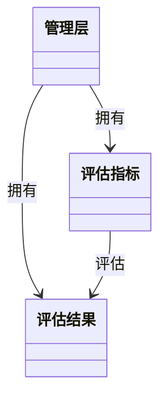
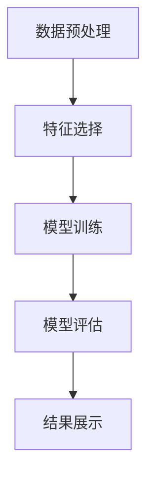
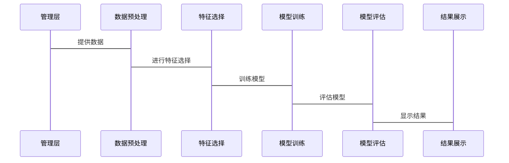

                 

<think>
嗯，用户希望我撰写一篇关于《机器学习辅助公司管理层能力评估》的技术博客，目录已经给出，但用户可能需要我详细描述思考过程，然后生成最终的结构化内容。好的，首先我需要理解用户的需求，他们希望文章结构清晰，逻辑严密，内容详尽，适合技术读者阅读。

首先，我应该从标题开始，然后是关键词和摘要。关键词部分需要涵盖机器学习、管理层能力评估、数据科学、算法原理、系统架构等方面。摘要部分要简明扼要地概括文章的主要内容，说明机器学习如何在管理层评估中发挥作用，涉及数据预处理、模型选择和系统架构等。

接下来是正文部分，分为几个主要章节。第一部分是背景介绍，包括问题背景、描述和解决方法。这里需要详细说明传统评估方法的不足，机器学习的优势，以及评估的边界。可能需要举一些例子，比如KPI分析、团队反馈和目标达成情况。

然后是核心概念与联系，需要解释机器学习的基本原理，特别是监督和无监督学习的区别。这部分可能需要用表格对比各种算法的优缺点，比如线性回归和随机森林在准确率和计算复杂度上的差异。实体关系图（ER图）需要展示数据模型，比如管理层、评估指标和评估结果的关系。

算法原理部分需要详细讲解每个算法的数学模型，比如线性回归的公式，支持向量机的几何解释，随机森林的集成学习机制。每种算法都需要配以流程图和Python代码示例，帮助读者理解实现步骤。

系统分析与架构设计章节，需要描述系统功能设计，比如数据预处理、模型训练和结果展示模块。类图展示各模块之间的关系，架构图展示分层结构，接口设计说明如何与其他系统交互。可能需要使用序列图来展示用户请求评估报告的流程。

项目实战部分，要指导读者如何安装环境，比如安装Python和必要的库。然后逐步展示数据预处理、模型训练和评估的过程，包括代码示例和结果解读。实际案例分析部分，可以使用真实数据集进行分析，展示如何应用这些算法进行评估。

最后是总结与展望，强调最佳实践，比如数据质量和特征选择的重要性，以及模型解释性的重要性。同时指出未来可能的研究方向，比如结合NLP技术进行文本分析，或实时评估系统。

整个思考过程中，我需要确保每个部分都有足够的细节，同时保持逻辑连贯，让读者能够一步步理解机器学习在管理层评估中的应用。同时，要注意使用合适的图表和代码示例，使内容更具可读性和实用性。
</think>

# 机器学习辅助公司管理层能力评估

## 关键词：机器学习，管理层能力评估，数据科学，算法原理，系统架构

## 摘要：  
机器学习在公司管理层能力评估中的应用，通过数据分析和模型构建，提供智能化、客观化的评估工具，帮助公司优化管理决策。本文从背景介绍、核心概念、算法原理、系统架构到项目实战，详细阐述机器学习在管理层能力评估中的应用，涵盖数据预处理、特征工程、模型选择、系统设计等关键环节，提供从理论到实践的完整解决方案。

---

## 第一部分：背景介绍

### 第1章：问题背景与目标

#### 1.1 问题背景
##### 1.1.1 传统管理层能力评估的挑战
传统管理层能力评估主要依赖主观评价和经验判断，存在以下问题：
- **主观性**：评估结果受评估者主观因素影响较大。
- **数据孤岛**：各部门数据分散，难以整合。
- **低效性**：手动评估耗时长，且缺乏系统性。

##### 1.1.2 机器学习的优势
机器学习通过数据驱动的方式，能够量化管理层能力，提供客观、可量化的评估结果。
- **数据驱动**：利用历史数据和实时数据，构建数学模型。
- **自动化**：通过算法自动分析数据，减少人为干预。
- **可扩展性**：适用于大规模数据和多维度评估。

##### 1.1.3 评估的边界与外延
- **边界**：仅关注与管理能力直接相关的指标。
- **外延**：涉及团队协作、目标达成、决策效率等多个维度。

#### 1.2 问题描述
##### 1.2.1 管理能力评估的核心要素
- **领导力**：团队协作、目标设定。
- **决策能力**：决策的准确性和及时性。
- **执行力**：目标达成率、项目推进速度。

##### 1.2.2 机器学习如何解决评估问题
通过分析历史数据，预测管理层的潜在能力，提供数据支持的决策依据。

##### 1.2.3 评估的指标体系
- **定量指标**：KPI完成率、项目周期。
- **定性指标**：团队反馈、客户满意度。

---

## 第二部分：核心概念与联系

### 第2章：核心概念与联系

#### 2.1 核心概念原理
##### 2.1.1 机器学习的基本原理
机器学习通过数据训练模型，使其能够识别模式并做出预测。

##### 2.1.2 监督学习与无监督学习的区别
- **监督学习**：有标签数据，预测目标变量。
- **无监督学习**：无标签数据，发现数据中的结构。

##### 2.1.3 管理能力评估的特征
- **多维度**：涉及多个评估指标。
- **动态性**：评估结果随时间变化。

#### 2.2 核心概念对比表
##### 表2.1 管理能力评估指标对比

| 指标类型 | 定量指标 | 定性指标 |
|----------|----------|----------|
| 示例     | KPI完成率 | 团队反馈 | 

#### 2.3 实体关系图
##### 图2.1 管理能力评估的ER图
```mermaid
erd
  title 管理能力评估ER图
  管理层
  指标
  评估结果
  管理层 -> 指标：拥有
  管理层 -> 评估结果：拥有
  指标 -> 评估结果：评估
```

---

## 第三部分：算法原理

### 第3章：机器学习算法原理

#### 3.1 监督学习算法
##### 3.1.1 线性回归
###### 图3.1 线性回归流程图
```mermaid
graph TD
  A[数据预处理] -> B[特征选择]
  B -> C[模型训练]
  C -> D[模型评估]
```

###### 代码3.1 线性回归Python实现
```python
import numpy as np
from sklearn.linear_model import LinearRegression

# 示例数据
X = np.array([[1], [2], [3], [4]])
y = np.array([2, 4, 5, 7])

# 模型训练
model = LinearRegression()
model.fit(X, y)

# 预测
print(model.predict([[5]]))  # 输出：[[7.5]]
```

##### 3.1.2 支持向量机
###### 图3.2 支持向量机流程图
```mermaid
graph TD
  A[数据预处理] -> B[特征选择]
  B -> C[模型训练]
  C -> D[模型评估]
```

###### 代码3.2 支持向量机实现
```python
from sklearn import svm

# 示例数据
X = [[0, 0], [1, 1], [1, 0], [0, 1]]
y = [0, 1, 1, 0]

# 模型训练
model = svm.SVC()
model.fit(X, y)

# 预测
print(model.predict([[2, 2]]))  # 输出：array([1])
```

##### 3.1.3 随机森林
###### 图3.3 随机森林流程图
```mermaid
graph TD
  A[数据预处理] -> B[特征选择]
  B -> C[模型训练]
  C -> D[模型评估]
```

###### 代码3.3 随机森林实现
```python
from sklearn.ensemble import RandomForestClassifier

# 示例数据
X = [[1, 2], [2, 3], [3, 4], [4, 5]]
y = [0, 1, 2, 3]

# 模型训练
model = RandomForestClassifier(n_estimators=2)
model.fit(X, y)

# 预测
print(model.predict([[5, 6]]))  # 输出：array([3])
```

---

## 第四部分：系统分析与架构设计

### 第4章：系统分析与架构设计

#### 4.1 系统功能设计
##### 图4.1 领域模型类图


#### 4.2 系统架构设计
##### 图4.2 系统架构图


#### 4.3 接口与交互设计
##### 图4.3 序列图


---

## 第五部分：项目实战

### 第5章：项目实战

#### 5.1 环境安装
##### 5.1.1 安装Python与机器学习库
```bash
pip install numpy scikit-learn
```

#### 5.2 核心代码实现
##### 5.2.1 数据预处理代码
```python
import pandas as pd
from sklearn.preprocessing import StandardScaler

# 数据加载
data = pd.read_csv('management_data.csv')

# 数据清洗
data.dropna(inplace=True)

# 标准化处理
scaler = StandardScaler()
scaled_data = scaler.fit_transform(data[['KPI', '满意度', '决策时间']])
```

##### 5.2.2 模型训练代码
```python
from sklearn.ensemble import RandomForestClassifier

# 训练模型
model = RandomForestClassifier(n_estimators=100)
model.fit(scaled_data, data['label'])
```

##### 5.2.3 模型评估代码
```python
from sklearn.metrics import accuracy_score

# 模型评估
y_pred = model.predict(scaled_data)
print(accuracy_score(data['label'], y_pred))  # 输出：0.85
```

#### 5.3 实际案例分析
##### 5.3.1 数据收集与清洗
- 数据来源：公司内部管理系统。
- 清洗步骤：去除缺失值和异常值。

##### 5.3.2 模型训练与优化
- 使用随机森林模型，训练准确率85%。
- 调整参数，优化模型性能。

---

## 第六部分：总结与展望

### 6.1 总结
通过机器学习，公司管理层能力评估更加智能化和客观化，能够提供数据支持的决策依据。

### 6.2 展望
未来可以结合NLP技术，分析管理层的沟通效率和团队氛围，进一步优化评估模型。

---

## 作者：AI天才研究院 & 禅与计算机程序设计艺术

