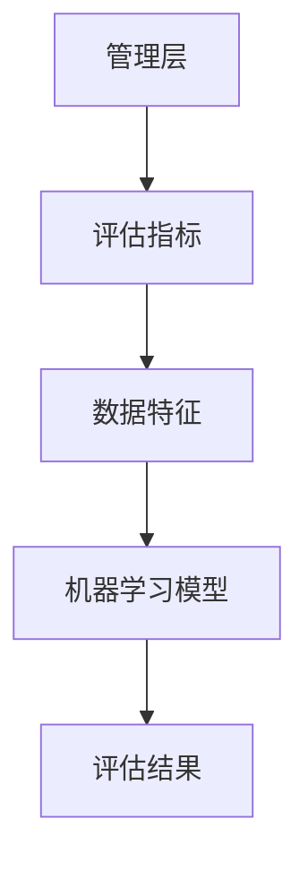
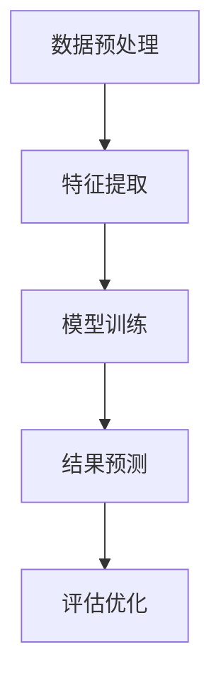
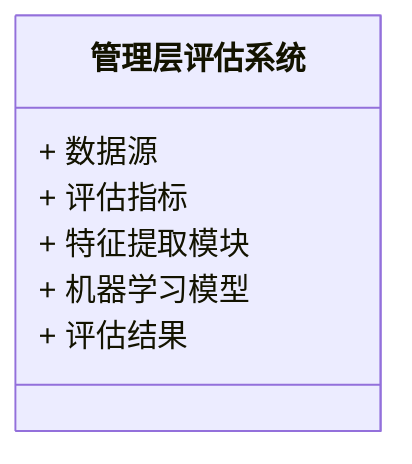
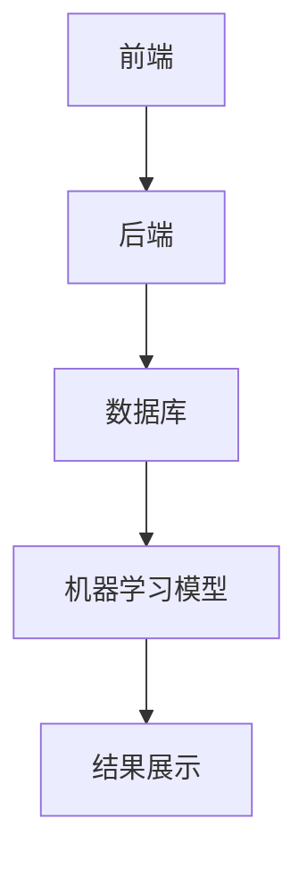

                 

<think>
嗯，用户让我写一篇关于《机器学习辅助公司管理层评估》的技术博客。我需要先理解用户的需求，然后一步步分析和构建内容。

首先，用户希望文章结构清晰，有逻辑，每个部分都要详细。关键词和摘要部分要简明扼要，后面是详细的正文部分，包括背景、核心概念、算法原理、系统架构、项目实战、最佳实践等。

我得先确定文章的整体框架。标题已经给出，接下来是关键词，可能包括机器学习、公司管理、评估系统、数据分析、人工智能等。摘要要概括文章的核心内容，强调机器学习在管理层评估中的应用和价值。

接下来是正文部分。第一部分是背景介绍，我需要详细讲解机器学习在公司管理中的背景，问题背景，问题描述，以及如何解决这些问题。这部分需要让读者明白传统评估方法的不足，以及机器学习带来的优势。

第二部分是核心概念与联系，这部分需要介绍评估指标体系，绘制ER图来展示实体关系。我得解释清楚各个指标如何相互关联，以及它们如何作为机器学习模型的输入。

第三部分是算法原理，这里需要详细讲解常用的机器学习算法，比如线性回归、支持向量机和随机森林。我需要提供数学公式和代码示例，帮助读者理解实现过程。同时，用流程图展示算法的整体流程。

第四部分是系统分析与架构设计，这部分需要分析问题场景，设计系统功能，并用Mermaid图展示领域模型、系统架构和交互序列图。我得确保系统结构清晰，功能模块明确。

第五部分是项目实战，这部分需要提供环境安装步骤，核心代码实现，以及案例分析。通过实际案例，读者可以理解如何应用机器学习进行评估。

最后是最佳实践，包括小结、注意事项和扩展阅读，帮助读者巩固知识，避免常见错误，并进一步学习。

在写作过程中，我要确保每个部分都详细且逻辑连贯。使用合适的图表和代码示例，让内容更直观。同时，注意用词专业但不过于复杂，保持读者的阅读兴趣。

现在，我需要将这些思考转化为具体的章节内容，确保每部分都覆盖必要的细节，满足用户的字数和格式要求。完成后，检查整体结构是否合理，内容是否全面，确保文章质量。
</think>

# 《机器学习辅助公司管理层评估》

> 关键词：机器学习，公司管理，评估系统，数据分析，人工智能

> 摘要：随着人工智能技术的飞速发展，机器学习在企业管理中的应用越来越广泛。本文将详细探讨机器学习如何辅助公司管理层进行评估，从背景分析、核心概念、算法原理到系统设计和项目实战，全面解析机器学习在管理层评估中的应用价值和实现路径。通过本文的阅读，读者将能够理解如何利用机器学习技术优化企业管理流程，提升决策效率。

---

## 正文

### 第一部分：背景介绍

#### 第1章：机器学习与公司管理层评估的背景

##### 1.1 问题背景
在现代企业中，管理层的评估是一个复杂而关键的任务。传统的评估方法依赖于主观判断和经验，这种方式存在以下问题：
- **评估标准不统一**：不同评估者可能对同一表现有不同的解读。
- **数据维度单一**：传统评估通常仅关注业绩指标，忽略了领导力、团队协作等软性指标。
- **数据处理效率低**：随着企业规模扩大，手动收集和分析数据的效率难以满足需求。

##### 1.2 问题描述
机器学习作为一种数据驱动的决策技术，能够通过分析大量数据，提供更客观、更全面的评估结果。然而，其在管理层评估中的应用还存在以下挑战：
- **数据质量问题**：企业数据可能存在缺失或不准确的情况。
- **模型可解释性**：复杂的机器学习模型可能难以解释其输出结果。
- **伦理问题**：数据使用可能引发隐私和伦理争议。

##### 1.3 问题解决
机器学习通过以下方式解决传统评估的痛点：
- **数据驱动决策**：利用历史数据和实时数据，提供更精准的评估结果。
- **自动化处理**：通过算法自动分析数据，提高评估效率。
- **多维度评估**：结合业绩、领导力、团队协作等多种指标，提供全面的评估结果。

##### 1.4 边界与外延
机器学习在管理层评估中的应用范围包括：
- **绩效评估**：通过数据预测员工绩效。
- **领导力分析**：评估领导者的风格和能力。
- **团队协作评估**：分析团队合作效率。

需要注意的是，机器学习仅作为辅助工具，不能完全替代人类的判断。在实际应用中，需要结合企业的具体情况，合理设置评估指标和模型参数。

##### 1.5 概念结构与核心要素
管理层评估的指标体系包括以下核心要素：
- **绩效指标**：如销售额、利润等。
- **领导力指标**：如决策能力、沟通能力等。
- **团队协作指标**：如团队凝聚力、合作效率等。

---

### 第二部分：核心概念与联系

#### 第2章：管理层评估的指标体系

##### 2.1 核心评估指标
为了实现全面的管理层评估，需要设计一套科学的指标体系。以下是核心评估指标的分类及说明：

| 指标类别 | 指标名称 | 指标描述 |
|----------|----------|----------|
| 绩效指标 | 销售额 | 评估管理层在销售业绩上的表现。 |
| 利润率 | 利润率 | 评估管理层在盈利能力上的表现。 |
| 领导力指标 | 决策能力 | 评估管理层在决策制定上的表现。 |
| 沟通能力 | 沟通能力 | 评估管理层在团队沟通和协调上的表现。 |
| 团队协作指标 | 团队凝聚力 | 评估团队成员之间的协作效率。 |
| 合作效率 | 合作效率 | 评估团队在完成任务时的效率。 |

##### 2.2 实体关系图（ER图）
以下是一个简单的实体关系图，展示了管理层评估的核心实体及其关系：



---

### 第三部分：算法原理讲解

#### 第3章：机器学习算法原理

##### 3.1 算法原理
以下是几种常用的机器学习算法及其在管理层评估中的应用：

##### 3.1.1 线性回归
线性回归是一种简单的回归算法，适用于预测连续型变量。其数学模型如下：

$$ y = \beta_0 + \beta_1x_1 + \beta_2x_2 + \dots + \beta_nx_n $$

其中，$y$ 是目标变量，$x_i$ 是特征变量，$\beta_i$ 是系数。

##### 3.1.2 支持向量机
支持向量机（SVM）适用于分类问题，其核心思想是将数据映射到高维空间，然后找到一个超平面将数据分开。其数学模型如下：

$$ y = \text{sign}(\sum_{i=1}^n \alpha_i y_i x_i \cdot x) + b) $$

其中，$\alpha_i$ 是拉格朗日乘子，$y_i$ 是标签，$x$ 是输入数据。

##### 3.1.3 随机森林
随机森林是一种基于树的集成算法，适用于分类和回归问题。其核心思想是通过随机采样构建多棵决策树，并取其预测结果的平均值或多数值。其数学模型如下：

$$ y = \text{mean}(\{y_i\}_{i=1}^n) $$

其中，$y_i$ 是每棵决策树的预测结果。

##### 3.2 算法流程图
以下是机器学习算法的整体流程图：



---

### 第四部分：系统分析与架构设计

#### 第4章：系统分析与架构设计

##### 4.1 问题场景介绍
在公司管理层评估中，我们需要设计一个基于机器学习的系统，实现以下功能：
- 数据采集与处理
- 特征提取与选择
- 模型训练与部署
- 结果展示与分析

##### 4.2 领域模型类图
以下是系统的领域模型类图：



##### 4.3 系统架构图
以下是系统的架构设计图：



---

### 第五部分：项目实战

#### 第5章：项目实战

##### 5.1 环境安装
为了运行以下代码，需要安装以下库：

```bash
pip install scikit-learn pandas numpy
```

##### 5.2 系统核心实现源代码
以下是机器学习模型的核心代码：

```python
import pandas as pd
from sklearn.model_selection import train_test_split
from sklearn.ensemble import RandomForestClassifier
from sklearn.metrics import accuracy_score

# 加载数据
data = pd.read_csv('management_assessment.csv')

# 分割数据
X = data.drop('label', axis=1)
y = data['label']

X_train, X_test, y_train, y_test = train_test_split(X, y, test_size=0.2, random_state=42)

# 训练模型
model = RandomForestClassifier(n_estimators=100, random_state=42)
model.fit(X_train, y_train)

# 预测结果
y_pred = model.predict(X_test)

# 评估结果
print("Accuracy:", accuracy_score(y_test, y_pred))
```

##### 5.3 案例分析
以下是一个简单的案例分析：

假设我们有一个管理层数据集，包含以下指标：
- 销售额
- 利润率
- 决策能力
- 沟通能力

通过机器学习模型，我们可以预测管理层的绩效，并生成评估报告。

---

### 第六部分：最佳实践

#### 第6章：最佳实践

##### 6.1 小结
机器学习在公司管理层评估中的应用具有以下优势：
- 提高评估的客观性和准确性。
- 实现数据驱动的决策。
- 提高管理效率。

##### 6.2 注意事项
- 数据质量是模型性能的关键，需要确保数据的完整性和准确性。
- 模型的可解释性是实际应用中的重要问题，需要选择合适的算法和模型。
- 需要结合企业的实际情况，合理设置评估指标和模型参数。

##### 6.3 拓展阅读
- 《机器学习实战》
- 《数据驱动的决策管理》
- 《人工智能在企业管理中的应用》

---

### 作者：AI天才研究院 & 禅与计算机程序设计艺术

