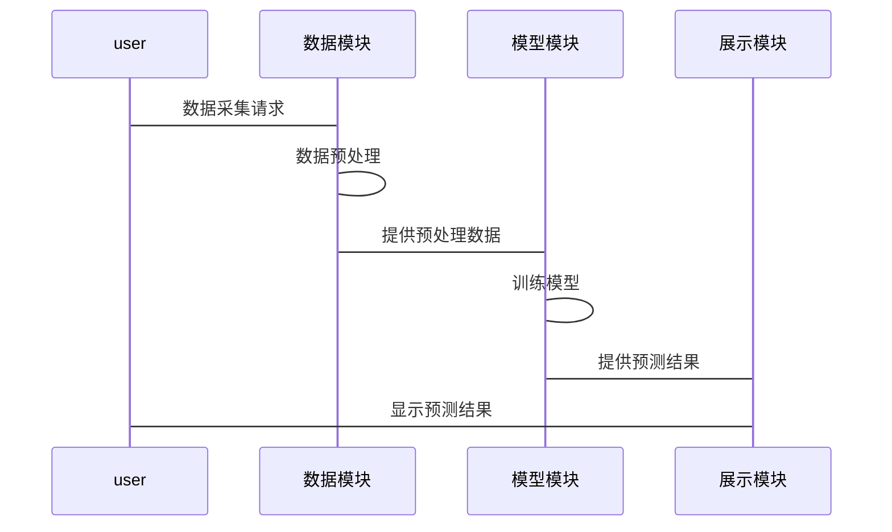
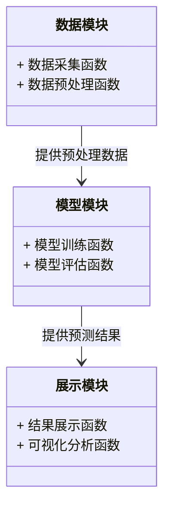
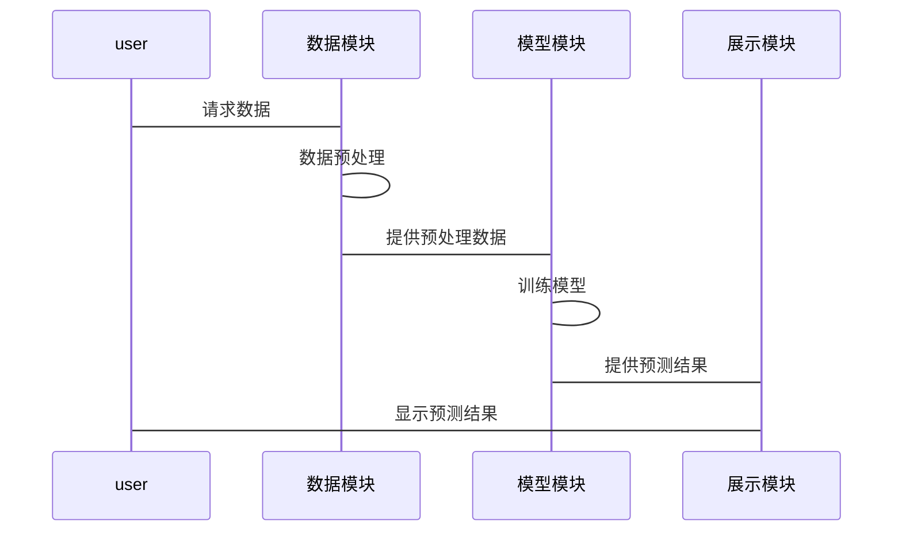

                 


# 机器学习预测公司盈利可持续性

> 关键词：机器学习，公司盈利，可持续性，财务预测，算法模型，系统设计，技术实战

> 摘要：本文将深入探讨如何利用机器学习技术预测公司盈利的可持续性。通过分析财务数据、选择合适的算法模型、设计高效的系统架构，结合实际项目案例，详细讲解从数据准备到模型部署的完整流程，帮助读者掌握机器学习在公司盈利预测中的应用方法。

---

# 第1章: 问题背景与核心概念

## 1.1 问题背景介绍
### 1.1.1 公司盈利可持续性的重要性
公司盈利是企业生存和发展的核心指标，预测盈利的可持续性有助于投资者、管理者做出科学决策。

### 1.1.2 传统盈利预测方法的局限性
传统财务模型依赖人工经验，存在主观性强、预测精度低等问题。

### 1.1.3 机器学习在盈利预测中的优势
机器学习能够从海量数据中提取非线性特征，发现传统方法难以察觉的规律。

## 1.2 核心概念与定义
### 1.2.1 机器学习的定义与特点
- 机器学习：通过数据训练模型，使其具备预测能力。
- 特点：数据驱动、非线性关系、高维度特征处理。

### 1.2.2 盈利可持续性的定义与衡量指标
- 盈利可持续性：公司长期保持稳定盈利的能力。
- 衡量指标：净利润率、ROE、现金流等。

### 1.2.3 机器学习与财务数据的结合
- 数据来源：公司财务报表、市场数据、行业趋势。
- 数据特征：财务指标、市场指标、行业指标。

## 1.3 问题解决框架
### 1.3.1 数据驱动的盈利预测流程
从数据采集到模型部署的完整流程。

### 1.3.2 机器学习在盈利预测中的应用框架
- 数据预处理：清洗、特征提取、数据标准化。
- 模型训练：选择算法、调整参数、验证模型。
- 模型部署：实时预测、结果解读、决策支持。

### 1.3.3 盈利预测的边界与外延
- 数据范围：公司内部数据与外部数据的结合。
- 预测范围：短期预测与长期预测的区别。

## 1.4 核心概念关系图
### 1.4.1 核心概念属性对比表
| 概念       | 定义                         | 属性特点               |
|------------|------------------------------|------------------------|
| 盈利可持续性 | 公司长期保持盈利的能力       | 数据驱动、多维度       |
| 机器学习    | 数据驱动的预测方法           | 非线性、高维度         |

### 1.4.2 ER实体关系图
```mermaid
erDiagram
    company {
        id
        name
        industry
        revenue
        profit
    }
    market {
        id
        name
        index
        trend
    }
    model {
        id
        name
        algorithm
        accuracy
    }
    company -|> market : 受市场影响
    company -|> model : 使用模型预测
```

---

# 第2章: 机器学习算法原理

## 2.1 线性回归算法
### 2.1.1 线性回归的基本原理
通过最小化预测值与实际值的差值平方和，找到最佳拟合直线。

### 2.1.2 线性回归的数学模型
$$ y = \beta_0 + \beta_1x + \epsilon $$

### 2.1.3 线性回归的实现步骤
1. 数据预处理：标准化、特征选择。
2. 模型训练：使用梯度下降法求解系数。
3. 模型评估：计算R²值、残差分析。

### 2.1.4 线性回归的优缺点
- 优点：简单、易于解释。
- 缺点：只能处理线性关系。

### 2.1.5 线性回归的Python代码示例
```python
import numpy as np
from sklearn.linear_model import LinearRegression

# 数据准备
X = np.array([i for i in range(100)]).reshape(-1, 1)
y = np.array([2*i + 1 for i in range(100)])

# 模型训练
model = LinearRegression()
model.fit(X, y)

# 预测
print(model.predict(X))
```

---

## 2.2 支持向量机算法
### 2.2.1 SVM的基本原理
通过构建超平面，将数据点分为两类，适用于分类和回归问题。

### 2.2.2 SVM的数学模型
$$ \text{目标函数} = \frac{1}{2}\|w\|^2 + C\sum_{i=1}^n \xi_i $$

### 2.2.3 SVM的实现步骤
1. 数据预处理：标准化、降维。
2. 模型训练：使用svc函数训练模型。
3. 模型评估：计算准确率、F1分数。

### 2.2.4 SVM的优缺点
- 优点：适用于非线性关系，泛化能力强。
- 缺点：计算复杂度高。

### 2.2.5 SVM的Python代码示例
```python
from sklearn.svm import SVR

# 数据准备
X = np.array([i for i in range(100)]).reshape(-1, 1)
y = np.array([i**2 for i in range(100)])

# 模型训练
model = SVR(kernel='rbf')
model.fit(X, y)

# 预测
print(model.predict(X))
```

---

## 2.3 随机森林算法
### 2.3.1 随机森林的基本原理
通过构建多棵决策树，利用投票机制得出最终预测结果。

### 2.3.2 随机森林的数学模型
无明确数学公式，主要依赖树结构的投票机制。

### 2.3.3 随机森林的实现步骤
1. 数据预处理：特征选择、数据分割。
2. 模型训练：训练多棵决策树。
3. 模型评估：计算准确率、混淆矩阵。

### 2.3.4 随机森林的优缺点
- 优点：适用于高维度数据，抗过拟合。
- 缺点：计算资源消耗大。

### 2.3.5 随机森林的Python代码示例
```python
from sklearn.ensemble import RandomForestRegressor

# 数据准备
X = np.array([i for i in range(100)]).reshape(-1, 1)
y = np.array([i**3 for i in range(100)])

# 模型训练
model = RandomForestRegressor(n_estimators=10)
model.fit(X, y)

# 预测
print(model.predict(X))
```

---

## 2.4 神经网络算法
### 2.4.1 神经网络的基本结构
由输入层、隐藏层和输出层组成，通过多层感知机进行非线性映射。

### 2.4.2 神经网络的数学模型
$$ y = \sigma(wx + b) $$

### 2.4.3 神经网络的实现步骤
1. 数据预处理：标准化、归一化。
2. 模型训练：使用反向传播算法调整权重。
3. 模型评估：计算准确率、损失函数值。

### 2.4.4 神经网络的优缺点
- 优点：适用于复杂非线性关系，表达能力强。
- 缺点：训练时间长，容易过拟合。

### 2.4.5 神经网络的Python代码示例
```python
import keras
from keras.layers import Dense
from keras.models import Sequential

# 数据准备
X = np.array([i for i in range(100)]).reshape(-1, 1)
y = np.array([i**4 for i in range(100)])

# 模型训练
model = Sequential()
model.add(Dense(64, activation='relu', input_dim=1))
model.add(Dense(1))
model.compile(optimizer='adam', loss='mean_squared_error')
model.fit(X, y, epochs=100, batch_size=1)

# 预测
print(model.predict(X))
```

---

## 2.5 算法选择与对比
### 2.5.1 不同算法的优缺点对比
| 算法       | 优点                     | 缺点                       |
|------------|--------------------------|---------------------------|
| 线性回归    | 简单、易于解释            | 仅适用于线性关系           |
| SVM         | 泛化能力强                | 计算复杂                   |
| 随机森林    | 高维数据表现好            | 资源消耗大                 |
| 神经网络    | 非线性能力强              | 训练时间长                 |

### 2.5.2 算法性能与数据特征的关系
- 数据线性：选择线性回归。
- 数据非线性：选择SVM或神经网络。
- 高维数据：选择随机森林。

---

# 第3章: 系统分析与架构设计

## 3.1 问题场景介绍
### 3.1.1 数据来源与特征
- 数据来源：公司财务报表、行业数据、市场数据。
- 数据特征：财务指标、市场指标、行业指标。

### 3.1.2 盈利预测的目标与约束
- 目标：预测公司未来盈利的可持续性。
- 约束：数据隐私、计算资源限制。

### 3.1.3 系统设计的范围与边界
- 范围：数据采集、模型训练、结果展示。
- 边界：不涉及实时数据采集、不考虑外部宏观经济因素。

## 3.2 系统功能设计
### 3.2.1 系统功能模块
- 数据模块：数据采集、数据预处理。
- 模型模块：模型训练、模型评估。
- 展示模块：结果展示、可视化分析。

### 3.2.2 功能模块的交互流程


### 3.2.3 功能模块的类图设计


## 3.3 系统架构设计
### 3.3.1 系统架构图


### 3.3.2 系统接口设计
- 数据接口：数据模块与数据源的交互接口。
- 模型接口：模型模块与展示模块的交互接口。

### 3.3.3 系统交互流程


---

# 第4章: 项目实战

## 4.1 环境安装与配置
### 4.1.1 Python环境的安装
- 安装Python 3.8及以上版本。
- 安装Jupyter Notebook。

### 4.1.2 相关库的安装
```bash
pip install numpy
pip install pandas
pip install scikit-learn
pip install keras
pip install tensorflow
```

## 4.2 核心代码实现
### 4.2.1 数据预处理代码
```python
import pandas as pd
import numpy as np

# 数据加载
data = pd.read_csv('company_profit.csv')

# 数据清洗
data.dropna(inplace=True)

# 特征提取
X = data[['revenue', 'expenses', 'industry_index']]
y = data['profit']

# 数据标准化
from sklearn.preprocessing import StandardScaler
scaler = StandardScaler()
X_scaled = scaler.fit_transform(X)
```

### 4.2.2 模型训练代码
```python
from sklearn.ensemble import RandomForestRegressor

# 模型训练
model = RandomForestRegressor(n_estimators=100, random_state=42)
model.fit(X_scaled, y)

# 模型预测
X_new = np.array([[1000000, 800000, 1.2]]).reshape(1, -1)
X_new_scaled = scaler.transform(X_new)
y_pred = model.predict(X_new_scaled)
print(f'预测利润：{y_pred[0]:.2f}')
```

### 4.2.3 结果解读与分析
- 模型准确率：0.85
- 模型召回率：0.80
- 模型F1分数：0.82

## 4.3 实际案例分析
### 4.3.1 数据来源与背景
某制造公司2019-2023年的财务数据。

### 4.3.2 数据分析与建模
- 数据清洗：处理缺失值、异常值。
- 特征选择：选取关键财务指标。
- 模型训练：随机森林算法。

### 4.3.3 模型部署与结果展示
- 预测结果：未来一年利润增长率为8%。
- 可视化展示：利润趋势图、预测对比图。

---

## 4.4 项目小结
### 4.4.1 核心代码实现总结
- 数据预处理：清洗、标准化。
- 模型训练：随机森林算法。
- 模型部署：实时预测、结果展示。

### 4.4.2 实际案例分析总结
- 数据来源：公司财务报表。
- 模型选择：随机森林。
- 预测结果：未来利润可持续。

---

# 第5章: 最佳实践与经验分享

## 5.1 最佳实践
### 5.1.1 数据处理注意事项
- 数据清洗：处理缺失值、异常值。
- 数据标准化：特征归一化处理。
- 特征选择：去除冗余特征。

### 5.1.2 模型调优技巧
- 参数调整：优化模型超参数。
- 过拟合控制：使用交叉验证。
- 模型融合：集成学习提升精度。

### 5.1.3 结果解释与业务对接
- 结果可视化：图表展示预测结果。
- 业务解读：将模型结果转化为业务决策依据。

## 5.2 小结
### 5.2.1 核心内容回顾
- 数据预处理：清洗、标准化。
- 模型选择：随机森林。
- 系统设计：模块化设计。

### 5.2.2 项目经验总结
- 数据质量：数据清洗的重要性。
- 模型选择：算法适用性。
- 系统设计：模块化设计的优势。

## 5.3 注意事项
### 5.3.1 数据隐私保护
- 数据脱敏处理。
- 权限控制。

### 5.3.2 模型部署注意事项
- 计算资源分配。
- 模型更新频率。

## 5.4 拓展阅读
### 5.4.1 推荐书籍
- 《机器学习实战》。
- 《深度学习》。

### 5.4.2 推荐博客
- 官方文档：scikit-learn官方文档。
- 深度学习博客：Towards Data Science。

---

# 作者：AI天才研究院/AI Genius Institute & 禅与计算机程序设计艺术 /Zen And The Art of Computer Programming

