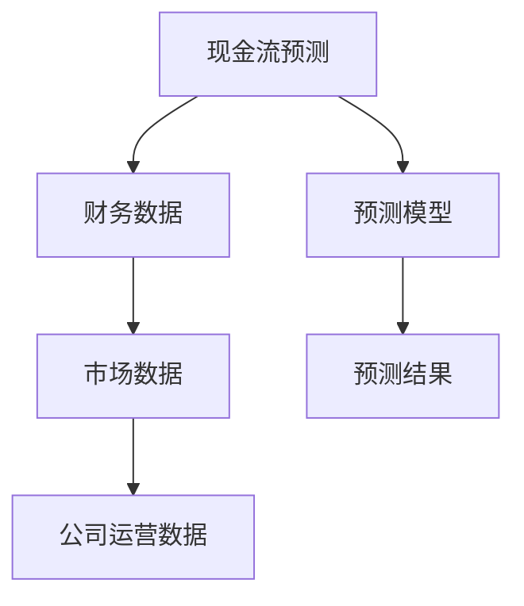
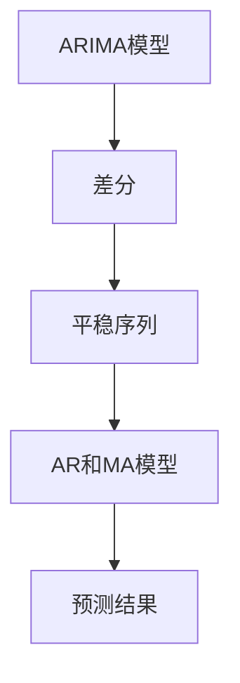
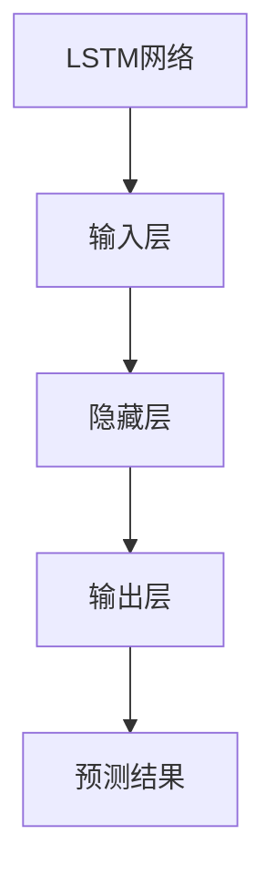
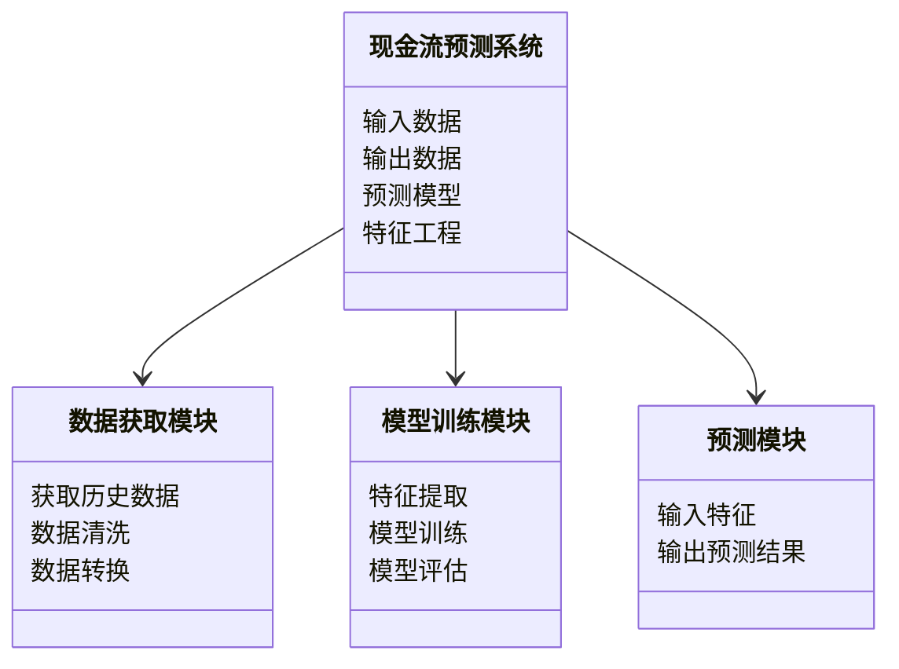
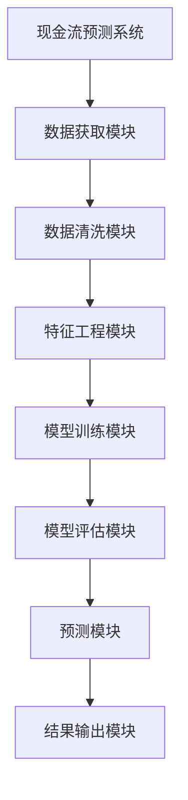
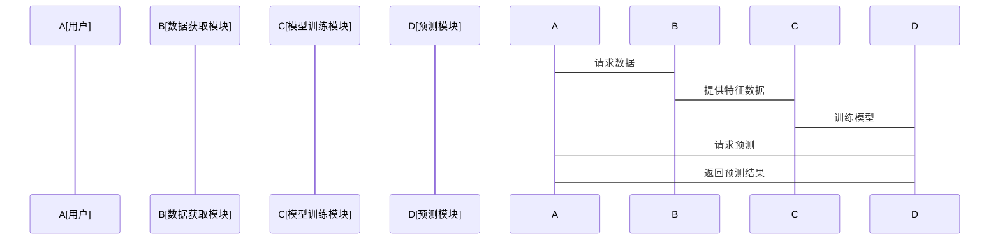

                 


# 机器学习预测公司自由现金流趋势

> 关键词：机器学习，自由现金流，时间序列预测，ARIMA，LSTM，特征工程

> 摘要：本文将探讨如何利用机器学习技术预测公司自由现金流的趋势。通过对现金流预测的背景、核心概念、算法原理、系统设计以及项目实战的详细分析，本文旨在为读者提供一个全面的技术视角，帮助他们在实际应用中有效利用机器学习模型进行现金流预测。我们将从基础概念出发，逐步深入，结合实际案例，详细解读机器学习在现金流预测中的应用。

---

# 第1章: 背景与核心概念

## 1.1 自由现金流预测的重要性

### 1.1.1 自由现金流的定义与作用
自由现金流（Free Cash Flow，FCF）是指公司在扣除所有支出后，能够自由分配的现金流量。它是衡量企业财务健康状况的重要指标，能够反映企业的盈利能力和抗风险能力。现金流预测能够帮助企业做出更合理的财务规划，优化资源配置，并为投资决策提供依据。

### 1.1.2 机器学习在金融预测中的应用价值
机器学习作为一种数据驱动的预测技术，能够在处理大规模、复杂金融数据时展现出强大的能力。通过分析历史财务数据、市场数据和公司运营数据，机器学习模型能够发现数据中的隐含模式，从而实现对未来的现金流预测。

### 1.1.3 企业现金流预测的挑战与机遇
现金流预测的挑战主要来自于数据的不完整性、市场的不确定性以及模型的局限性。然而，机器学习技术的引入为企业带来了新的机遇，尤其是在处理非线性关系和复杂特征时，机器学习模型能够展现出超越传统统计模型的优势。

---

## 1.2 机器学习预测现金流的核心问题

### 1.2.1 时间序列预测的特性
时间序列预测是现金流预测的核心问题之一。与横截面数据不同，时间序列数据具有自相关性、趋势性和平稳性等特性，这些特性需要在模型设计中予以充分考虑。

### 1.2.2 数据特征与预测目标的关系
现金流预测的目标是通过历史数据预测未来的现金流。数据特征包括财务指标、市场指标和公司运营指标。这些特征与预测目标之间的关系需要通过特征工程和模型训练来建立。

### 1.2.3 现金流预测的边界与外延
现金流预测的边界在于数据的可得性和模型的预测能力。外延则体现在对预测结果的解释和应用上，例如将预测结果用于投资决策或风险评估。

---

## 1.3 核心概念与联系

### 1.3.1 现金流预测的关键要素
现金流预测的关键要素包括时间序列数据、特征数据和预测模型。时间序列数据提供了历史现金流信息，特征数据提供了额外的预测信息，而预测模型则负责将这些信息转化为未来现金流的预测结果。

### 1.3.2 数据特征与模型的关系
数据特征是模型预测的基础。特征工程的目的是通过选择和构建有效的特征，提升模型的预测能力。模型的选择则需要根据数据特征和预测目标的特点进行优化。

### 1.3.3 机器学习算法的选择与优化
机器学习算法的选择需要考虑数据特征的类型、预测目标的特性以及模型的可解释性。优化则包括参数调优和模型评估。

---

# 第2章: 数据特征与模型关系分析

## 2.1 数据特征分析

### 2.1.1 财务指标特征
财务指标特征包括营业收入、净利润、经营活动现金流等。这些指标能够直接反映企业的财务状况。

### 2.1.2 市场指标特征
市场指标特征包括行业指数、市场波动率等。这些指标反映了宏观经济环境对企业的潜在影响。

### 2.1.3 公司运营特征
公司运营特征包括员工数量、研发投入等。这些指标反映了企业的运营能力和未来发展的潜力。

---

## 2.2 数据特征对比

### 2.2.1 特征属性对比表格
以下表格对比了财务指标、市场指标和公司运营指标的主要特征：

```mermaid
| 特征类型   | 特征名称       | 特征描述                     | 特征重要性 |
|------------|----------------|------------------------------|------------|
| 财务指标   | 营业收入       | 公司主要收入来源             | 高          |
| 市场指标   | 行业指数       | 行业整体表现                 | 中          |
| 运营特征   | 员工数量       | 公司人员规模                 | 低          |
```

---

## 2.3 实体关系图



---

# 第3章: 机器学习算法原理

## 3.1 时间序列预测算法

### 3.1.1 ARIMA算法

#### 3.1.1.1 ARIMA算法的流程图


#### 3.1.1.2 ARIMA算法的数学模型
ARIMA模型的数学公式如下：

$$ ARIMA(p, d, q) = y_t - \phi_1 y_{t-1} - \dots - \phi_p y_{t-p} = \theta_1 \epsilon_{t-1} + \dots + \theta_q \epsilon_{t-q} + \epsilon_t $$

其中：
- \( p \) 是自回归（AR）的阶数；
- \( d \) 是差分的阶数；
- \( q \) 是移动平均（MA）的阶数。

#### 3.1.1.3 ARIMA算法的Python实现
以下是一个简单的ARIMA算法实现示例：

```python
from statsmodels.tsa.arima_model import ARIMA
import numpy as np

# 生成模拟数据
data = np.random.randn(100)

# 拟合ARIMA模型
model = ARIMA(data, order=(1, 1, 1))
model_fit = model.fit()

# 预测未来1步
forecast = model_fit.forecast(steps=1)
print(forecast)
```

---

### 3.1.2 LSTM算法

#### 3.1.2.1 LSTM算法的流程图


#### 3.1.2.2 LSTM算法的数学模型
LSTM（长短期记忆网络）的数学公式如下：

$$
f_t = \sigma(W_f \cdot [h_{t-1}, x_t] + b_f)
$$

$$
i_t = \sigma(W_i \cdot [h_{t-1}, x_t] + b_i)
$$

$$
o_t = \sigma(W_o \cdot [h_{t-1}, x_t] + b_o)
$$

$$
g_t = \tanh(W_g \cdot [h_{t-1}, x_t] + b_g)
$$

$$
h_t = f_t \cdot c_{t-1} + i_t \cdot g_t
$$

$$
c_t = h_t
$$

其中：
- \( f_t \) 是遗忘门；
- \( i_t \) 是输入门；
- \( o_t \) 是输出门；
- \( g_t \) 是候选细胞状态；
- \( h_t \) 是隐藏状态；
- \( c_t \) 是细胞状态。

---

## 3.2 算法实现

### 3.2.1 ARIMA算法实现

#### 3.2.1.1 ARIMA算法实现的Python代码
以下是一个完整的ARIMA算法实现示例：

```python
from statsmodels.tsa.arima_model import ARIMA
import pandas as pd
import matplotlib.pyplot as plt

# 生成模拟数据
data = pd.Series([1, 2, 3, 4, 5, 6, 7, 8, 9, 10])

# 拟合ARIMA模型
model = ARIMA(data, order=(1, 1, 1))
model_fit = model.fit()

# 预测未来5步
forecast = model_fit.forecast(steps=5)
print("预测结果：", forecast)

# 绘制实际数据和预测数据
plt.plot(data, label='实际数据')
plt.plot(forecast[0], label='预测数据')
plt.legend()
plt.show()
```

### 3.2.2 LSTM算法实现

#### 3.2.2.1 LSTM算法实现的Python代码
以下是一个简单的LSTM算法实现示例：

```python
import numpy as np
from keras.models import Sequential
from keras.layers import LSTM, Dense

# 生成模拟数据
X = np.random.randn(10, 1, 5)
y = np.random.randn(10, 1)

# 定义LSTM模型
model = Sequential()
model.add(LSTM(5, input_shape=(1, 5)))
model.add(Dense(1))
model.compile(loss='mean_squared_error', optimizer='adam')

# 训练模型
model.fit(X, y, epochs=100, batch_size=1)

# 预测结果
test_input = np.random.randn(1, 1, 5)
test_output = model.predict(test_input)
print("预测结果：", test_output)
```

---

# 第4章: 系统分析与架构设计

## 4.1 系统功能设计

### 4.1.1 领域模型


## 4.2 系统架构设计

### 4.2.1 系统架构图


---

## 4.3 系统接口设计

### 4.3.1 接口设计
- 数据输入接口：接收历史现金流数据、财务指标、市场指标和公司运营指标。
- 模型训练接口：接收特征数据，训练预测模型。
- 预测接口：接收当前特征数据，输出预测结果。

### 4.3.2 接口交互图


---

## 4.4 系统交互设计

### 4.4.1 交互流程
1. 用户请求数据。
2. 数据获取模块接收请求，提供特征数据。
3. 模型训练模块接收特征数据，训练预测模型。
4. 用户请求预测。
5. 预测模块接收请求，返回预测结果。

---

# 第5章: 项目实战

## 5.1 环境安装

### 5.1.1 安装Python环境
```bash
python --version
pip install numpy pandas matplotlib scikit-learn keras
```

### 5.1.2 安装机器学习库
```bash
pip install statsmodels
pip install tensorflow
```

---

## 5.2 系统核心实现

### 5.2.1 数据获取与清洗
```python
import pandas as pd

# 获取数据
data = pd.read_csv('cash_flow.csv')

# 数据清洗
data.dropna(inplace=True)
data = data[~data.isin([np.nan, np.inf, -np.inf]).any(axis=1)]
```

---

### 5.2.2 特征工程
```python
from sklearn.preprocessing import StandardScaler

# 标准化处理
scaler = StandardScaler()
features = scaler.fit_transform(features)
```

---

### 5.2.3 模型训练
```python
from keras.models import Sequential
from keras.layers import LSTM, Dense

# 定义LSTM模型
model = Sequential()
model.add(LSTM(5, input_shape=(1, 5)))
model.add(Dense(1))
model.compile(loss='mean_squared_error', optimizer='adam')

# 训练模型
model.fit(X_train, y_train, epochs=100, batch_size=1)
```

---

## 5.3 结果分析与优化

### 5.3.1 模型评估
```python
from sklearn.metrics import mean_squared_error

# 预测结果
y_pred = model.predict(X_test)

# 计算均方误差
mse = mean_squared_error(y_test, y_pred)
print("均方误差：", mse)
```

---

### 5.3.2 模型优化
```python
from keras.wrappers.scikit_learn import KerasRegressor
from sklearn.model_selection import GridSearchCV

# 定义超参数搜索空间
param_grid = {
    'epochs': [50, 100],
    'batch_size': [1, 10],
    'units': [5, 10]
}

# 超参数搜索
grid_search = GridSearchCV(estimator=KerasRegressor(model), param_grid=param_grid, cv=5)
grid_search.fit(X_train, y_train)
```

---

## 5.4 项目小结

### 5.4.1 项目总结
现金流预测是一个复杂但具有重要价值的问题。通过机器学习技术，我们可以有效预测公司的自由现金流趋势，为企业决策提供支持。

### 5.4.2 实践中的注意事项
- 数据的完整性和质量直接影响预测结果。
- 模型的选择和优化需要结合实际业务需求。
- 预测结果需要结合业务背景进行解释和应用。

---

# 第6章: 最佳实践与小结

## 6.1 最佳实践

### 6.1.1 数据处理
- 数据清洗和标准化是预测模型的前提。
- 需要注意数据的时间序列特性。

### 6.1.2 模型选择
- 根据数据特征和预测目标选择合适的模型。
- 需要关注模型的可解释性和泛化能力。

---

## 6.2 小结

### 6.2.1 关键技术总结
- 时间序列预测的核心算法：ARIMA和LSTM。
- 特征工程的重要性：数据特征直接影响预测结果。
- 模型优化的关键点：超参数搜索和模型评估。

### 6.2.2 未来展望
随着机器学习技术的不断发展，现金流预测的精度和效率将不断提升。未来的研究方向包括更复杂的时间序列模型、多模态数据融合以及实时预测系统。

---

# 作者：AI天才研究院/AI Genius Institute & 禅与计算机程序设计艺术 /Zen And The Art of Computer Programming

---

以上是文章的完整目录和内容框架，具体实施时可根据实际数据和需求进一步完善。

