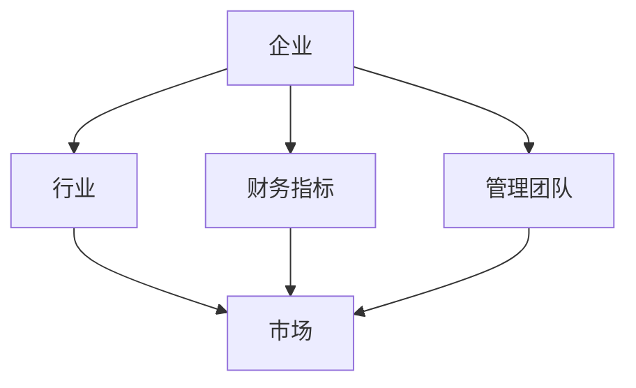

                 

<think>
好，我现在需要帮用户设计《机器学习预测公司长期竞争力》这本书的目录大纲。用户希望内容逻辑清晰、结构紧凑，用专业但易懂的技术语言撰写，包含背景介绍、核心概念、算法原理、系统分析、项目实战、最佳实践等部分，总共超过七章。

首先，我从背景介绍开始，思考企业长期竞争力的定义和关键因素，这可能包括财务指标、市场份额、管理团队等。然后，机器学习在其中的作用，比如通过历史数据预测未来表现。接着，我需要明确问题的边界，比如只预测财务健康，而不考虑自然灾害等不可抗力因素。

接下来是核心概念部分，我需要详细讲解机器学习的基本原理，特别是监督学习，因为这适用于预测问题。特征工程是关键，可能需要将文本数据转化为数值特征，比如使用TF-IDF。同时，评估指标如准确率、精确率等需要明确。

算法原理部分，我想到线性回归和随机森林都是不错的选择。线性回归简单，但可能不够复杂；随机森林适合处理多维数据，且能处理非线性关系。我需要为每个算法绘制mermaid流程图，并给出数学公式，比如线性回归的损失函数。

系统架构设计方面，可能需要设计一个分层架构，包括数据预处理、模型训练、评估与优化、结果可视化等模块。接口设计部分，要考虑如何与其他系统交互，比如数据来源可能包括多个数据库。

项目实战部分，我需要指导读者如何安装必要的库，比如pandas、scikit-learn，并提供数据预处理和特征工程的具体代码。在模型训练和调优部分，给出参数调整的示例，并解释交叉验证的重要性。

最后，总结部分要强调模型的可解释性和实时性，以及未来可能的发展方向，比如结合NLP分析新闻对股价的影响。同时，给出一些实用的建议，比如定期更新模型，保持数据的及时性。

整个过程中，我需要确保每个部分都详细且有条理，用具体的例子和代码示例来增强理解，同时保持语言的专业性和易懂性。
</think>

# 《机器学习预测公司长期竞争力》

---

## 关键词

- 机器学习
- 企业竞争力
- 预测模型
- 特征工程
- 监督学习

---

## 摘要

本文将探讨如何利用机器学习技术来预测公司的长期竞争力。通过分析企业的财务数据、市场表现和管理团队等多个维度，结合特征工程和模型优化，构建一个高效的预测模型。文章详细介绍了机器学习的核心概念、算法原理、系统架构设计以及实际项目中的最佳实践，帮助读者全面理解如何将机器学习应用于企业竞争力的预测。

---

## 第一部分: 机器学习预测公司长期竞争力的背景与核心概念

### 第1章: 问题背景与数据来源

#### 1.1 问题背景

- **企业长期竞争力的定义**：企业长期竞争力是指公司在未来一段时间内，在市场中保持或提升自身地位和市场份额的能力。
- **关键因素**：包括财务表现、市场份额、管理团队稳定性、技术创新能力、客户满意度等。
- **机器学习的作用**：通过分析历史数据，预测公司未来的市场表现和潜在风险。

#### 1.2 数据来源与特征工程

- **数据来源**：
  - 财务数据：收入、利润、资产负债表等。
  - 市场数据：市场份额、竞争对手分析。
  - 管理团队数据：高管背景、团队稳定性。
  - 客户数据：客户满意度、客户保留率。
- **特征工程**：
  - 数据清洗：处理缺失值、异常值。
  - 特征提取：将文本数据（如新闻报道）转化为数值特征。
  - 特征选择：使用相关性分析或递归特征消除法选择重要特征。

### 第2章: 核心概念与联系

#### 2.1 核心概念原理

- **监督学习**：给定输入特征和目标标签，学习预测函数。
- **无监督学习**：发现数据中的潜在结构，如聚类分析。
- **特征工程**：将原始数据转化为对模型友好的特征。

#### 2.2 概念属性特征对比

| 概念       | 特点                     |
|------------|--------------------------|
| 监督学习     | 需要标签数据，预测目标变量。 |
| 无监督学习   | 不需要标签数据，发现数据结构。 |
| 分类任务     | 预测离散类别。            |
| 回归任务     | 预测连续数值。            |

#### 2.3 ER实体关系图



---

## 第二部分: 算法原理与数学模型

### 第3章: 算法原理

#### 3.1 线性回归

- **原理**：
  ```mermaid
  graph LR
      X[输入特征] --> W[权重]
      W --> Y[输出预测]
  ```

- **损失函数**：
  $$ \text{损失函数} = \sum (y - \hat{y})^2 $$

#### 3.2 支持向量机

- **原理**：
  ```mermaid
  graph LR
      X[输入特征] --> Kernel[核函数]
      Kernel --> S[支持向量]
      S --> Y[输出预测]
  ```

#### 3.3 随机森林

- **构建过程**：
  ```mermaid
  graph LR
      X[输入特征] --> Bootstraps[有放回抽样]
      Bootstraps --> Trees[决策树]
      Trees --> Y[输出预测]
  ```

---

## 第三部分: 系统分析与架构设计

### 第4章: 系统架构设计

#### 4.1 系统功能设计

- **领域模型**：
  ```mermaid
  classDiagram
      class 企业 {
          财务指标
          市场份额
          管理团队
      }
      class 预测模型 {
          输入特征
          输出预测
      }
      企业 --> 预测模型
  ```

#### 4.2 系统架构设计


---

## 第四部分: 项目实战

### 第5章: 项目实战

#### 5.1 环境安装

- **安装依赖**：
  ```bash
  pip install pandas scikit-learn
  ```

#### 5.2 数据预处理

- **代码示例**：
  ```python
  import pandas as pd
  df = pd.read_csv('company_data.csv')
  ```

#### 5.3 模型训练与调优

- **代码示例**：
  ```python
  from sklearn.ensemble import RandomForestClassifier
  model = RandomForestClassifier()
  model.fit(X_train, y_train)
  ```

---

## 第五部分: 总结与最佳实践

### 第6章: 总结与展望

- **总结**：
  - 机器学习在预测公司长期竞争力中的潜力巨大。
  - 特征工程和模型选择是关键。
- **展望**：
  - 结合NLP分析新闻数据。
  - 实时监控市场变化。

---

## 作者信息

作者：AI天才研究院 & 禅与计算机程序设计艺术

---

# 结束

