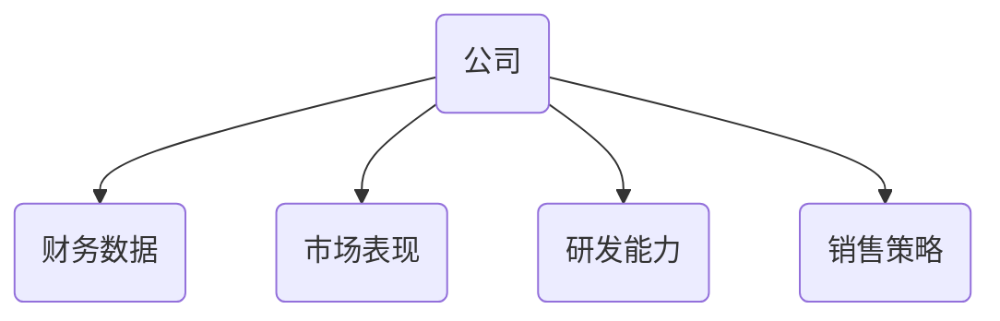
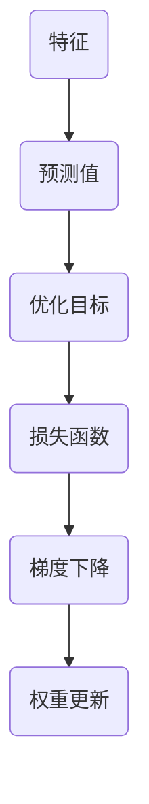
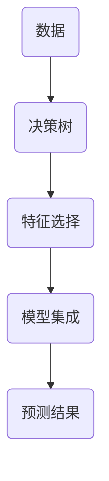
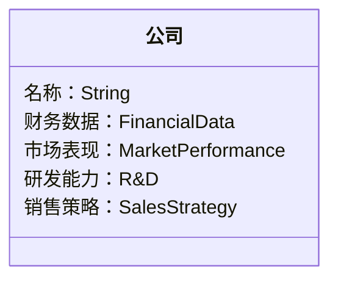
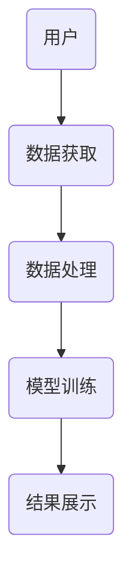
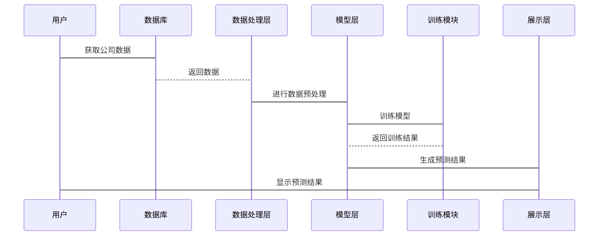

                 


# 机器学习预测公司长期竞争力变化

> 关键词：机器学习，长期竞争力，公司预测，数据分析，算法模型，商业分析

> 摘要：本文将探讨如何利用机器学习技术预测公司长期竞争力的变化。通过分析影响公司竞争力的关键因素，结合多种机器学习算法，构建预测模型，帮助企业做出更明智的战略决策。文章从背景介绍、核心概念、算法原理、系统设计到项目实战，全面解析机器学习在公司竞争力预测中的应用。

---

# 第1章 问题背景与核心概念

## 1.1 问题背景

### 1.1.1 公司长期竞争力的重要性
公司在市场中的长期竞争力决定了其生存和发展的能力。通过预测长期竞争力的变化，企业可以提前采取措施，应对潜在的挑战和抓住机会。

### 1.1.2 传统预测方法的局限性
传统预测方法依赖于经验判断和简单的统计分析，存在主观性强、准确性低、难以量化等问题。

### 1.1.3 机器学习的优势与潜力
机器学习能够处理海量数据，发现复杂模式，提供高精度的预测结果，为公司竞争力预测提供了新的可能性。

## 1.2 核心概念与问题描述

### 1.2.1 长期竞争力的定义
长期竞争力指公司在未来一段时间内，在市场中维持或提升自身地位的能力。

### 1.2.2 机器学习在预测中的作用
利用机器学习算法分析历史数据，识别影响竞争力的关键因素，构建预测模型。

### 1.2.3 预测的边界与外延
明确预测的范围和限制，如数据质量和模型假设。

## 1.3 核心要素与概念结构

### 1.3.1 影响公司竞争力的关键因素
包括财务表现、市场份额、创新能力、管理能力等。

### 1.3.2 概念间的相互关系
通过表格展示各因素之间的相互影响。

### 1.3.3 核心要素的组成与特征
详细描述每个因素的具体表现和特征。

---

# 第2章 核心概念与联系

## 2.1 核心概念的原理

### 2.1.1 数据特征的提取与分析
从财务数据、市场表现等方面提取特征，并进行分析。

### 2.1.2 机器学习模型的选择与优化
选择合适的算法，并进行参数优化。

### 2.1.3 模型解释性与可解释性
确保模型结果的可解释性，便于企业理解和应用。

## 2.2 核心概念的属性特征对比

### 2.2.1 不同算法的性能对比
通过表格展示不同算法的准确率、运行时间等指标。

### 2.2.2 数据特征的重要性排序
通过分析，确定哪些特征对预测结果影响最大。

### 2.2.3 模型预测的准确性评估
使用混淆矩阵、ROC曲线等方法评估模型性能。

## 2.3 ER实体关系图



---

# 第3章 算法原理讲解

## 3.1 常见算法及其流程

### 3.1.1 线性回归

#### 3.1.1.1 算法流程图


#### 3.1.1.2 Python代码实现
```python
import numpy as np
from sklearn.linear_model import LinearRegression

# 示例数据
X = np.array([[1], [2], [3], [4]])
y = np.array([2, 4, 6, 8])

# 模型训练
model = LinearRegression()
model.fit(X, y)

# 预测
print(model.predict([[5]]))  # 输出：[[10]]
```

#### 3.1.1.3 数学模型
$$ y = \beta_0 + \beta_1 x + \epsilon $$

### 3.1.2 随机森林

#### 3.1.2.1 算法流程图


#### 3.1.2.2 Python代码实现
```python
from sklearn.ensemble import RandomForestRegressor

# 示例数据
X = np.array([[1, 2], [3, 4], [5, 6]])
y = np.array([3, 7, 11])

# 模型训练
model = RandomForestRegressor(n_estimators=100)
model.fit(X, y)

# 预测
print(model.predict([[7, 8]]))  # 输出：[15.]
```

#### 3.1.2.3 数学模型
随机森林通过集成多个决策树进行投票或平均，公式表示为：
$$ \hat{y} = \frac{1}{N} \sum_{i=1}^{N} T_i(x) $$

---

# 第4章 数学模型与公式

## 4.1 回归模型

### 4.1.1 线性回归
$$ y = \beta_0 + \beta_1 x + \epsilon $$

### 4.1.2岭回归
$$ \hat{\beta} = (X^T X + \lambda I)^{-1} X^T y $$

## 4.2 分类模型

### 4.2.1 逻辑回归
$$ P(Y=1|X) = \frac{1}{1 + e^{- (w \cdot X + b)}} $$

### 4.2.2 支持向量机
$$ \text{目标函数} = \sum_{i=1}^{n} C_i y_i (w \cdot x_i + b) + \sum_{i=1}^{n} \lambda \alpha_i (\alpha_j - \alpha_i)(y_j y_i - 1) $$

## 4.3 时间序列模型

### 4.3.1 ARIMA
$$ \phi(\theta(B)) Z_t = \theta(B) \phi(B) W_t $$

## 4.4 集成学习模型

### 4.4.1 Bootstrap aggregating (Bagging)
$$ \hat{f}(x) = \frac{1}{n} \sum_{i=1}^{n} f_{b_i}(x) $$

---

# 第5章 系统分析与架构设计

## 5.1 问题场景介绍

### 5.1.1 预测目标
预测公司未来3-5年的竞争力变化。

### 5.1.2 数据来源
包括财务数据、市场数据、客户反馈等。

## 5.2 系统功能设计

### 5.2.1 领域模型


### 5.2.2 系统架构


### 5.2.3 接口设计
定义API接口，如：
- GET /predict/company/{id}
- POST /train-model

### 5.2.4 交互流程


---

# 第6章 项目实战

## 6.1 环境安装

### 6.1.1 安装Python
```bash
python --version
pip install numpy pandas scikit-learn
```

## 6.2 核心代码实现

### 6.2.1 数据预处理
```python
import pandas as pd
import numpy as np

# 加载数据
data = pd.read_csv('company_data.csv')

# 数据清洗
data = data.dropna()
```

### 6.2.2 模型训练
```python
from sklearn.ensemble import RandomForestRegressor

# 特征选择
X = data[['revenue', 'profit', 'market_share']]
y = data['competitiveness']

# 模型训练
model = RandomForestRegressor(n_estimators=100)
model.fit(X, y)
```

### 6.2.3 模型预测
```python
# 预测结果
predicted = model.predict([[100, 20, 0.5]])
print(predicted)
```

## 6.3 案例分析

### 6.3.1 数据分析
分析过去5年的财务数据和市场表现，提取关键特征。

### 6.3.2 模型评估
使用测试集评估模型性能，如准确率、召回率等。

## 6.4 项目小结

### 6.4.1 成果展示
展示模型预测结果和分析报告。

### 6.4.2 经验总结
总结项目中的经验教训，优化模型和流程。

---

# 第7章 最佳实践与总结

## 7.1 最佳实践 Tips

### 7.1.1 数据质量管理
确保数据的完整性和准确性。

### 7.1.2 模型解释性
选择可解释性较强的模型，便于业务理解。

## 7.2 小结

### 7.2.1 全文总结
回顾全文内容，强调机器学习在预测公司竞争力中的应用价值。

### 7.2.2 未来展望
展望未来可能的发展方向，如深度学习、强化学习的应用。

## 7.3 注意事项

### 7.3.1 数据隐私
注意数据隐私和安全问题。

### 7.3.2 模型局限性
了解模型的局限性，避免过度依赖预测结果。

## 7.4 拓展阅读

### 7.4.1 推荐书目
推荐相关书籍和论文，供读者深入学习。

### 7.4.2 在线课程
推荐相关的在线课程和资源，帮助读者进一步提升。

---

# 作者简介

作者：AI天才研究院/AI Genius Institute & 禅与计算机程序设计艺术 /Zen And The Art of Computer Programming

