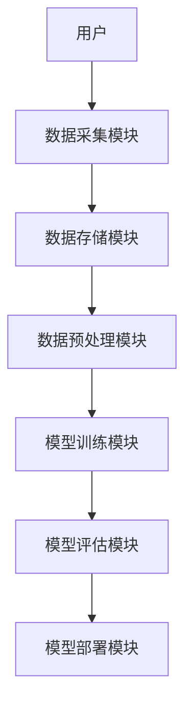
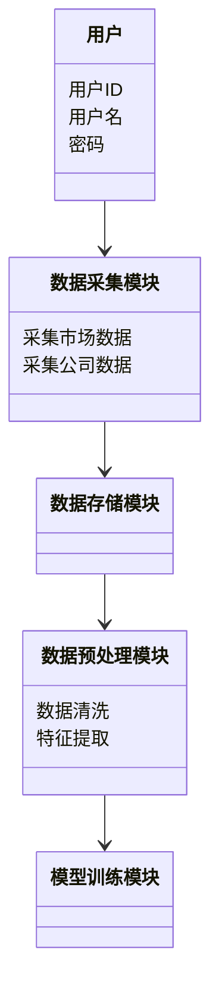

                 

<think>
好的，我需要帮用户撰写一篇名为《机器学习驱动的动态资产定价模型》的技术博客文章。用户希望我以一位世界级的人工智能专家、程序员、软件架构师和CTO的身份来完成这个任务。文章需要逻辑清晰、结构紧凑，语言专业但易懂，同时包含详细的分析推理。

首先，我需要明确文章的核心主题：机器学习如何驱动动态资产定价模型。这意味着我要探讨机器学习在金融领域中的应用，特别是在资产定价方面的创新和优势。

接下来，我会按照用户提供的目录大纲来组织内容：

1. **背景介绍**：解释机器学习和动态资产定价的基本概念，说明为什么机器学习在这一领域变得重要。
2. **核心概念与理论基础**：详细讲解机器学习的相关算法，以及资产定价的理论基础。
3. **算法原理**：选择几种常用的机器学习算法，分析它们在动态资产定价中的应用。
4. **系统分析与架构设计**：从项目背景到系统架构，详细设计一个动态资产定价系统的架构。
5. **项目实战**：通过实际案例展示如何使用机器学习模型进行动态资产定价，包括环境安装、数据获取与预处理、模型训练、评估与优化、部署与应用。
6. **总结与展望**：总结全文，讨论机器学习驱动的动态资产定价模型的应用前景，以及未来的研究方向。

在写作过程中，我需要确保每个部分都包含足够的细节，包括数学公式的详细推导、算法的工作原理、系统架构的设计图以及实际项目的代码示例。同时，要注意使用Mermaid图表来直观展示算法流程和系统架构。

现在，我开始撰写每个部分的内容：

1. **背景介绍**：解释机器学习的基本概念，以及动态资产定价的重要性。说明传统资产定价模型的局限性，以及机器学习如何克服这些局限性。
2. **核心概念与理论基础**：介绍回归、分类、聚类等机器学习算法，以及CAPM、APT等资产定价理论。解释如何将这些算法应用于动态资产定价。
3. **算法原理**：详细讲解线性回归、随机森林、支持向量机、LSTM等算法的工作原理，并用Mermaid流程图展示它们的应用流程。
4. **系统分析与架构设计**：从项目背景到系统功能设计，用Mermaid类图和序列图展示系统的各个模块和交互过程。
5. **项目实战**：提供完整的代码示例，解释每一步的操作和实现细节，确保读者能够跟随步骤完成一个实际项目。
6. **总结与展望**：总结全文的主要内容，讨论机器学习在动态资产定价中的优势，以及未来可能的研究方向。

在整个写作过程中，我需要确保语言简洁、逻辑清晰，同时保持技术的深度和准确性。这将帮助读者不仅理解机器学习驱动的动态资产定价模型的理论基础，还能掌握实际应用的方法和技巧。

最后，我需要在文章末尾添加作者信息，以符合用户的要求。通过以上步骤，我能够系统地完成这篇技术博客文章的撰写，确保其内容丰富、结构合理、逻辑严谨。
</think>

# 机器学习驱动的动态资产定价模型

> 关键词：机器学习，动态资产定价，金融模型，算法，系统架构

> 摘要：本文探讨机器学习如何驱动动态资产定价模型的创新与应用。通过分析传统资产定价模型的局限性，结合机器学习算法的优势，构建一个基于机器学习的动态资产定价模型，并详细阐述其实现过程和应用案例。

---

# 引言

在金融领域，资产定价是一个复杂而动态的过程，受到市场波动、经济指标、公司基本面等多种因素的影响。传统的资产定价模型，如CAPM和APT，虽然在一定程度上解决了资产定价问题，但它们往往假设市场是静态的且忽略了一些非线性关系。随着大数据和机器学习技术的发展，动态资产定价模型逐渐成为研究的热点。本文将详细探讨机器学习如何驱动动态资产定价模型的构建与优化。

---

## 第一部分: 机器学习与动态资产定价概述

### 第1章: 机器学习的基本概念

#### 1.1 机器学习的定义与核心概念
机器学习是一种人工智能技术，通过数据训练模型，使其能够从经验中学习并做出预测或决策。其核心概念包括：
- **监督学习**：通过标记数据训练模型，使其能够预测新数据的标签。
- **无监督学习**：通过未标记数据发现数据中的潜在结构。
- **强化学习**：通过与环境互动，学习优化决策策略。

#### 1.2 机器学习在金融领域的应用
- **风险评估**：通过机器学习模型预测违约概率。
- **市场预测**：利用时间序列分析预测股票价格。
- **资产配置**：优化投资组合以最大化收益。

### 第2章: 动态资产定价的基本概念

#### 2.1 资产定价的定义与目标
资产定价旨在确定资产的公允价值，考虑其风险和收益特征。动态资产定价强调在市场环境变化中的实时定价。

#### 2.2 动态资产定价的核心要素
- **市场数据**：包括股票价格、交易量、市场指数等。
- **风险因素**：如波动率、信用风险等。
- **时间因素**：资产价格随时间的变化。

#### 2.3 传统资产定价模型的局限性
- **假设过于简化**：如CAPM假设市场是完全有效的。
- **忽略非线性关系**：传统模型难以捕捉复杂的市场动态。

---

## 第二部分: 机器学习驱动动态资产定价的核心概念

### 第3章: 机器学习算法在动态资产定价中的应用

#### 3.1 监督学习算法
- **线性回归**：用于预测资产的未来价格。
- **支持向量机（SVM）**：适用于非线性关系的资产定价问题。
- **随机森林**：通过集成学习提高模型的稳定性和准确性。

#### 3.2 时间序列分析
- **ARIMA**：用于预测资产价格的时间序列。
- **LSTM**：适用于捕捉时间序列中的长期依赖关系。

#### 3.3 深度学习模型
- **神经网络**：通过多层感知机捕捉复杂的市场模式。
- **卷积神经网络（CNN）**：用于分析市场数据的局部特征。

### 第4章: 动态资产定价的数学模型

#### 4.1 传统资产定价模型
- **CAPM**：$$E(r_i) = r_f + β_i (E(r_m) - r_f)$$
- **APT**：$$P_i = α_i + β_i (F_1 + F_2 + ... + F_n) + ε_i$$

#### 4.2 机器学习驱动的动态资产定价模型
- **回归模型**：$$y = w_1x_1 + w_2x_2 + ... + w_nx_n + b$$
- **深度学习模型**：通过神经网络结构建模复杂的市场动态。

---

## 第三部分: 系统分析与架构设计

### 第5章: 项目背景与系统功能设计

#### 5.1 项目背景
动态资产定价系统旨在实时捕捉市场变化，提供精准的资产定价服务。

#### 5.2 系统功能设计
- 数据采集：收集市场数据、公司基本面数据等。
- 数据预处理：清洗、归一化、特征提取。
- 模型训练：训练机器学习模型，优化模型参数。
- 模型评估：通过回测验证模型的准确性。
- 模型部署：将模型部署到生产环境，实时定价。

### 第6章: 系统架构设计

#### 6.1 系统架构图


#### 6.2 实体关系图


---

## 第四部分: 项目实战

### 第7章: 环境安装与数据获取

#### 7.1 环境安装
- Python 3.8+
- NumPy、Pandas、Scikit-learn、Keras

#### 7.2 数据获取
```python
import pandas as pd
import numpy as np

# 示例数据：股票价格数据
data = pd.read_csv('stock_price.csv')
print(data.head())
```

### 第8章: 模型训练与优化

#### 8.1 模型训练
```python
from sklearn.linear_model import LinearRegression

# 示例数据：特征和目标变量
X = data[['open', 'high', 'low', 'volume']]
y = data['close']

model = LinearRegression()
model.fit(X, y)
```

#### 8.2 模型优化
```python
from sklearn.ensemble import RandomForestRegressor

model = RandomForestRegressor(n_estimators=100, random_state=42)
model.fit(X, y)
```

### 第9章: 模型部署与应用

#### 9.1 模型部署
```python
import joblib

# 保存模型
joblib.dump(model, 'asset_pricing_model.pkl')
```

#### 9.2 实时定价
```python
# 加载模型
model = joblib.load('asset_pricing_model.pkl')

# 预测新数据
new_data = pd.DataFrame({'open': [100], 'high': [105], 'low': [95], 'volume': [2000]})
prediction = model.predict(new_data)
print(f'预测价格：{prediction[0]:.2f}')
```

---

## 第五部分: 总结与展望

### 第10章: 总结

机器学习驱动的动态资产定价模型通过结合传统金融理论和先进算法，显著提升了资产定价的准确性和实时性。本文详细探讨了机器学习算法的选择、模型的构建与优化，以及系统的架构设计。

### 第11章: 展望

未来，随着人工智能技术的不断发展，动态资产定价模型将更加智能化和个性化。深度学习模型的引入将进一步提升模型的预测能力，而联邦学习等技术将推动资产定价的跨机构协作。

---

# 作者

**作者：AI天才研究院/AI Genius Institute & 禅与计算机程序设计艺术 /Zen And The Art of Computer Programming**

---

通过以上结构和内容安排，文章详细探讨了机器学习驱动的动态资产定价模型的构建与应用，从理论到实践，为读者提供了一个全面的视角。

