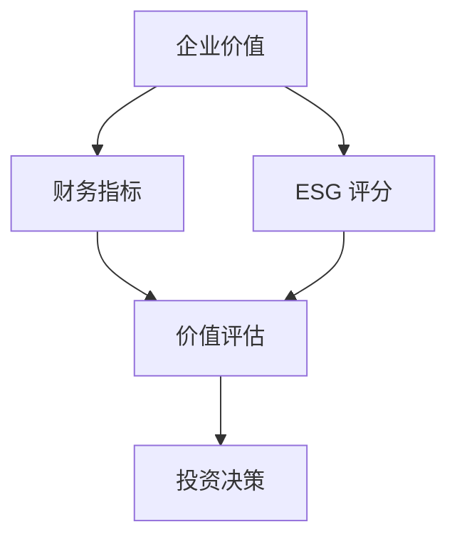
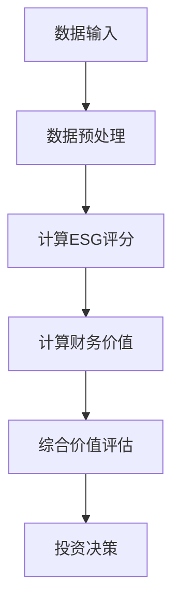
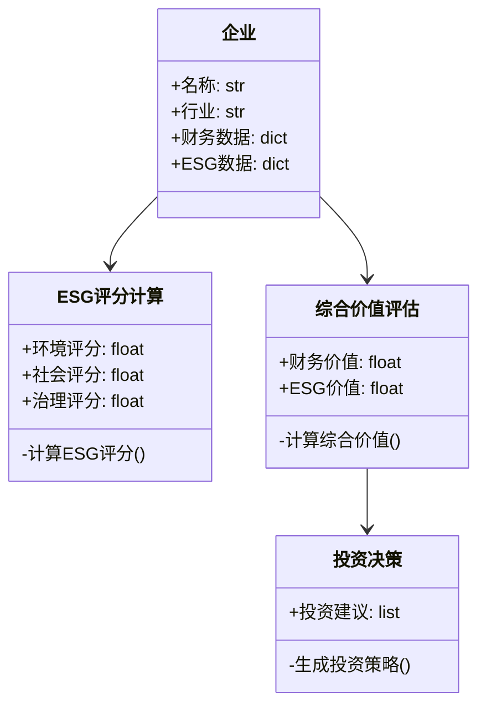
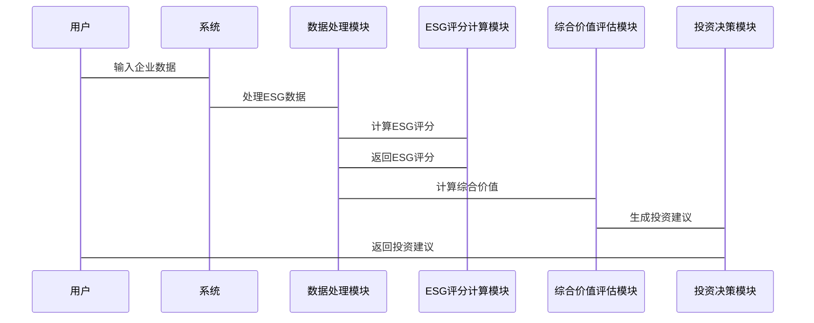

                 

<think>
嗯，我现在需要帮用户设计一个详细的目录大纲，主题是杰里米·格兰瑟姆的ESG价值投资整合。首先，我得理解用户的需求。他想要一个结构清晰、内容详尽的专业技术博客文章，涵盖从基础到高级的内容，并且要符合特定的格式要求。

首先，我得确定文章的核心主题：ESG和价值投资的整合。杰里米·格兰瑟姆是价值投资的代表人物，而ESG近年来在投资领域越来越重要。将两者结合，可能会涉及到如何在价值投资中引入ESG因素，以更全面地评估企业价值。

接下来，我需要考虑用户的需求。用户希望文章分为几个主要部分，包括引言、核心概念、算法与系统架构、项目实战等。每个部分都需要详细的子章节，涵盖背景介绍、数学模型、系统设计、实战案例等。

在引言部分，我应该先介绍ESG和价值投资的基本概念，说明整合的必要性。然后，详细解释整合的核心概念，比如系统模型、数学公式等。这部分需要包含具体的例子和图表，比如Mermaid流程图，来帮助读者理解。

接下来是算法部分，需要详细阐述如何量化ESG因素，构建评估模型。这部分可能需要数学公式和Python代码，展示具体的实现步骤。同时，系统架构部分需要设计一个框架，包括数据收集、分析、评分等模块，并用Mermaid图展示流程。

项目实战部分，我需要选择一个具体的案例，比如科技行业，展示如何应用这些方法进行分析。这部分要详细描述步骤，包括数据收集、预处理、模型构建等，并展示实际结果和小结。

最后，我需要确保整个目录结构符合用户的格式要求，使用吸引人的章节标题，确保逻辑清晰，内容完整。同时，遵守字数要求，控制在10000到12000字之间。

总结一下，我的步骤是：先理解需求，确定主题和结构，然后逐步填充每个部分的内容，确保符合格式和内容要求，最后进行整体检查，确保所有要点都涵盖在内。
</think>

# 杰里米·格兰瑟姆的ESG价值投资整合

> 关键词：ESG投资、价值投资、杰里米·格兰瑟姆、投资整合、可持续发展

> 摘要：本文将探讨杰里米·格兰瑟姆的ESG价值投资整合，分析其核心概念、算法原理、系统架构以及实际应用。通过详细阐述ESG与价值投资的整合逻辑，结合数学模型和系统设计，展示如何将ESG因素纳入投资决策，以实现长期稳健的投资回报。文章还通过具体案例分析，展示如何在实际投资中应用这些方法。

---

# 第一部分: 引言

## #1 章: ESG 价值投资整合的背景与重要性

### 1.1 ESG 的定义与内涵
#### 1.1.1 环境（Environmental）的定义与影响
环境因素包括企业对环境保护的措施，如碳排放、资源消耗、绿色能源使用等。这些因素不仅影响企业的运营成本，还可能对企业的声誉和长期可持续发展产生重大影响。

#### 1.1.2 社会责任（Social）的核心要素
社会责任涉及企业对员工、客户、社区以及供应链中各利益相关方的关怀。包括员工福利、劳动条件、公平对待、产品安全等方面。社会责任良好的企业通常更容易获得社会认可和客户信任。

#### 1.1.3 治理（Governance）的关键原则
治理结构是企业管理和决策的框架，包括董事会结构、高管薪酬、股东权益、内部控制等方面。良好的治理结构能够提高企业的透明度和决策效率，降低企业风险。

### 1.2 价值投资的核心理念
#### 1.2.1 价值投资的基本概念
价值投资是一种投资策略，强调以低于内在价值的价格购买优质资产。杰里米·格兰瑟姆作为价值投资的代表人物，提出“价格是敌人，价值是朋友”的理念。

#### 1.2.2 格兰瑟姆投资体系的特点
格兰瑟姆的投资体系注重安全边际、低市盈率、低市净率等指标，强调在市场恐慌时寻找被低估的投资标的。

#### 1.2.3 ESG 在价值投资中的整合逻辑
随着社会对可持续发展的关注增加，单纯关注财务指标的传统价值投资已无法满足现代投资者的需求。将ESG因素纳入价值投资体系，能够更全面地评估企业的长期价值。

### 1.3 ESG 与价值投资整合的必要性
#### 1.3.1 传统价值投资的局限性
传统价值投资主要关注财务指标，忽视了企业对环境、社会和治理方面的责任。这种单一的评估方式可能忽略企业的长期风险和机会。

#### 1.3.2 ESG 因素对投资决策的影响
ESG因素能够揭示企业的潜在风险和机会。例如，高碳排放企业可能面临政策风险，而社会责任良好的企业可能更容易获得客户和员工支持。

#### 1.3.3 综合评估体系的构建意义
通过整合ESG和价值投资，投资者可以更全面地评估企业的长期价值，降低投资风险，同时实现可持续发展目标。

---

## #2 章: ESG 价值投资整合的核心概念与联系

### 2.1 ESG 价值投资整合的系统模型
#### 2.1.1 系统模型的构成要素
ESG价值投资整合系统模型包括以下几个核心要素：
1. **财务指标**：市盈率、市净率、股息率等。
2. **ESG评分**：环境、社会、治理三个维度的评分。
3. **综合价值评估**：基于财务和ESG指标的综合评估。

#### 2.1.2 各要素之间的关系与影响
- 财务指标反映企业的盈利能力。
- ESG评分反映企业的社会责任和治理结构。
- 综合价值评估是两者的结合，旨在找到具有长期竞争优势的企业。

### 2.2 ESG 与价值投资的核心联系
#### 2.2.1 ESG 因素对企业价值的影响
ESG因素通过影响企业的风险、成本和声誉，进而影响企业的财务表现和市场估值。

#### 2.2.2 价值投资中的风险与收益平衡
通过整合ESG因素，投资者可以在追求收益的同时，降低投资风险，实现可持续投资目标。

#### 2.2.3 ESG 评级对企业估值的作用
ESG评级高的企业通常具有更高的市场估值，因为它们更可能获得投资者的信任和长期支持。

### 2.3 ESG 价值投资整合的数学模型
#### 2.3.1 基本公式与变量定义
$$ \text{企业价值} = f(\text{财务指标}, \text{ESG 评分}) $$

#### 2.3.2 模型的构建与优化
$$ \text{最终价值} = \alpha \times \text{财务价值} + \beta \times \text{ESG 价值} $$

其中：
- $\alpha$ 和 $\beta$ 是权重系数，反映财务和ESG因素的重要性。
- $\text{财务价值}$ 是基于传统财务指标计算的价值。
- $\text{ESG价值}$ 是基于ESG评分计算的价值。

### 2.4 ESG 价值投资整合的 Mermaid 流程图



---

# 第二部分: ESG 价值投资整合的算法与系统架构

## #3 章: ESG 价值投资整合的算法原理

### 3.1 ESG 评分的计算方法
#### 3.1.1 数据收集与预处理
- 数据来源：企业公开披露的ESG相关数据、第三方评级机构数据。
- 数据清洗：处理缺失值、异常值，标准化数据格式。

#### 3.1.2 评分指标的权重分配
- 环境、社会、治理三个维度的权重可以根据行业特点和投资目标进行调整。

#### 3.1.3 评分计算
使用加权平均法计算企业的综合ESG评分：
$$ \text{ESG评分} = \sum_{i=1}^{3} w_i \times s_i $$
其中：
- $w_i$ 是第 $i$ 个维度的权重。
- $s_i$ 是第 $i$ 个维度的评分。

### 3.2 综合价值评估模型
#### 3.2.1 模型构建
综合价值评估模型将财务指标和ESG评分结合，计算企业的综合价值：
$$ \text{综合价值} = \alpha \times \text{财务价值} + \beta \times \text{ESG价值} $$

#### 3.2.2 模型优化
通过历史数据回测，调整 $\alpha$ 和 $\beta$ 的权重，以最大化投资收益。

### 3.3 算法的 Mermaid 流程图



### 3.4 算法的 Python 实现

```python
import pandas as pd

def calculate_esg_score(data, weights):
    # data: 包含ESG相关数据的DataFrame
    # weights: 环境、社会、治理三个维度的权重
    esg_scores = []
    for _, row in data.iterrows():
        env = row['环境评分']
        social = row['社会评分']
        governance = row['治理评分']
        score = weights[0] * env + weights[1] * social + weights[2] * governance
        esg_scores.append(score)
    return esg_scores

def calculate_composite_value(data, esg_scores, alpha, beta):
    composite_values = []
    for i in range(len(data)):
        financial_value = data.iloc[i]['财务价值']
        composite_value = alpha * financial_value + beta * esg_scores[i]
        composite_values.append(composite_value)
    return composite_values

# 示例数据
data = pd.DataFrame({
    '环境评分': [0.8, 0.7, 0.9],
    '社会评分': [0.6, 0.8, 0.7],
    '治理评分': [0.7, 0.6, 0.8],
    '财务价值': [100, 120, 90]
})

weights = [0.4, 0.3, 0.3]
alpha = 0.6
beta = 0.4

esg_scores = calculate_esg_score(data, weights)
composite_values = calculate_composite_value(data, esg_scores, alpha, beta)

print("综合价值:", composite_values)
```

---

## #4 章: 系统架构与设计

### 4.1 系统功能设计
#### 4.1.1 领域模型（Mermaid 类图）



### 4.2 系统架构设计（Mermaid 架构图）


### 4.3 系统接口设计
- 输入接口：企业数据输入（财务数据和ESG数据）。
- 输出接口：综合价值评估结果、投资建议。

### 4.4 系统交互（Mermaid 序列图）



---

## #5 章: 项目实战

### 5.1 环境安装与配置
- 安装Python和必要的库（pandas、numpy、scikit-learn）。
- 安装Mermaid工具支持图表绘制。

### 5.2 核心实现代码
```python
import pandas as pd

def main():
    # 示例数据
    data = pd.DataFrame({
        '名称': ['公司A', '公司B', '公司C'],
        '行业': ['科技', '金融', '制造'],
        '环境评分': [0.8, 0.6, 0.9],
        '社会评分': [0.7, 0.8, 0.6],
        '治理评分': [0.6, 0.7, 0.8],
        '财务价值': [150, 180, 120]
    })

    # 权重和参数设置
    weights = [0.4, 0.3, 0.3]
    alpha = 0.6
    beta = 0.4

    # 计算ESG评分
    def calculate_esg_score(row):
        return weights[0] * row['环境评分'] + weights[1] * row['社会评分'] + weights[2] * row['治理评分']

    data['ESG评分'] = data.apply(calculate_esg_score, axis=1)

    # 计算综合价值
    data['综合价值'] = alpha * data['财务价值'] + beta * data['ESG评分']

    # 显示结果
    print(data[['名称', '行业', '财务价值', 'ESG评分', '综合价值']])

if __name__ == "__main__":
    main()
```

### 5.3 实际案例分析
以科技行业为例，分析三家企业在整合ESG因素后的综合价值评估结果。

---

## #6 章: 最佳实践与总结

### 6.1 最佳实践
- 定期更新ESG数据，确保评估结果的准确性。
- 根据市场变化调整权重系数，优化模型表现。
- 结合行业特点，灵活调整ESG评分权重。

### 6.2 小结
通过将ESG因素纳入价值投资体系，投资者可以更全面地评估企业的长期价值，降低投资风险，实现可持续投资目标。

### 6.3 注意事项
- 数据来源的可靠性直接影响评估结果，需选择权威的数据源。
- 模型的权重系数需要根据具体情况进行调整，避免一刀切。
- 定期回顾和优化模型，确保其适应市场变化。

### 6.4 拓展阅读
- 格兰瑟姆的经典著作《The New Value Investing》。
- 国际权威ESG评级机构的报告（如MSCI、Sustainalytics）。

---

作者：AI天才研究院/AI Genius Institute & 禅与计算机程序设计艺术 /Zen And The Art of Computer Programming

