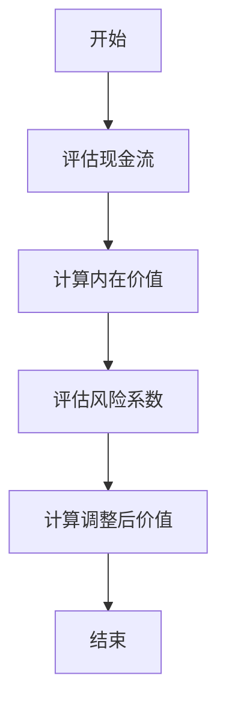
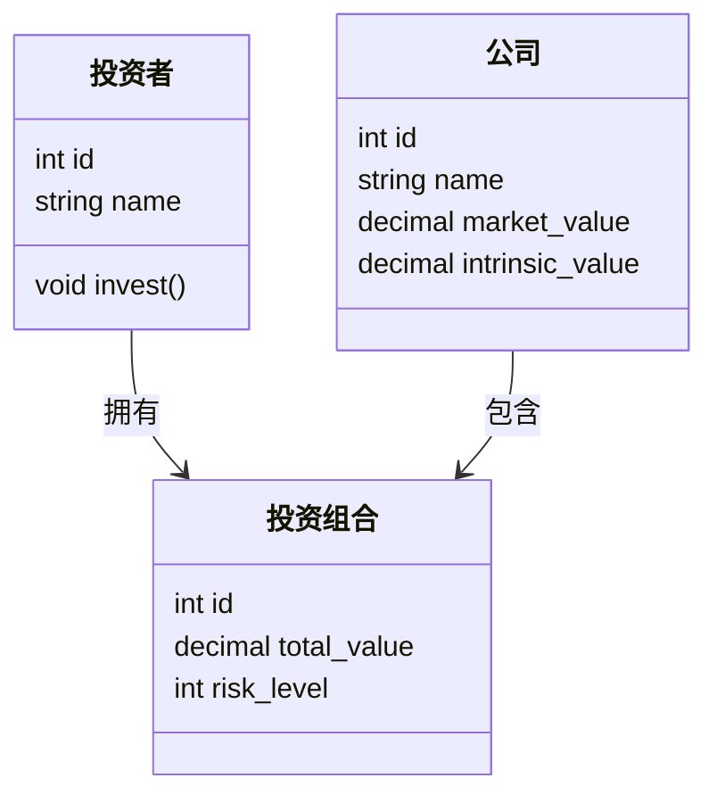
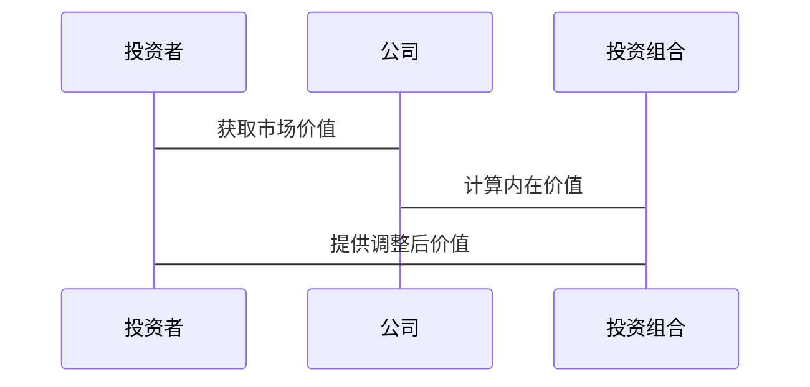

                 

<think>
好，我现在需要帮用户撰写一篇关于杰里米·格兰瑟姆的价值投资新定义的技术博客文章。用户要求文章结构清晰，逻辑严密，涵盖背景、核心概念、算法、数学模型、系统架构、实战应用和最佳实践等多个部分，并且每个部分都有详细的分析和示例。

首先，我会从背景介绍开始，解释价值投资的起源，从格雷厄姆到巴菲特，再到杰里米·格兰瑟姆的贡献。这部分需要让读者了解价值投资的基本概念和其演变过程。

接下来，我会详细阐述价值投资新定义的核心概念，比较传统价值投资和新定义的差异，并通过表格和实体关系图来说明新定义的要素和结构。

然后，我会讲解投资决策的数学模型，包括内在价值的计算公式和风险调整的算法，使用mermaid流程图和Python代码来展示具体实现。这部分需要确保数学公式准确，并用实例帮助读者理解。

接下来是系统架构设计，我会介绍如何构建一个基于新定义的投资系统，包括功能模块、架构图和接口设计，使用mermaid图来展示系统的结构和交互过程。

在实战应用部分，我会指导读者如何搭建环境，实现核心代码，并通过实际案例分析来展示新定义的应用效果。

最后，我会总结最佳实践，包括投资策略建议、注意事项和进一步阅读的推荐，帮助读者更好地理解和应用价值投资的新定义。

整个过程中，我需要确保每个部分都详细具体，使用专业的技术语言，同时保持逻辑清晰和结构紧凑。这将帮助读者系统地理解杰里米·格兰瑟姆的价值投资新定义，并能够在实际中应用这些概念。
</think>

# 杰里米·格兰瑟姆的价值投资新定义

## 关键词：价值投资，杰里米·格兰瑟姆，投资策略，数学模型，系统架构

## 摘要：本文详细探讨了杰里米·格兰瑟姆对价值投资的新定义，分析其核心概念、算法原理、数学模型及系统架构，并结合实际案例进行深入分析，为投资者提供新的视角和方法。

---

## 第1章: 价值投资的演变与新定义

### 1.1 价值投资的起源与发展

#### 1.1.1 格雷厄姆与巴菲特的价值投资理念
- 格雷厄姆：提出“价值投资”概念，强调安全边际和内在价值。
- 巴菲特：继承并发展格雷厄姆的理念，注重长期价值和企业护城河。

#### 1.1.2 现代价值投资的发展与挑战
- 现代市场环境变化：信息透明化、市场波动加剧。
- 传统价值投资的局限性：难以应对复杂市场和新兴企业。

#### 1.1.3 杰里米·格兰瑟姆的学术背景与贡献
- 格兰瑟姆：著名投资专家，提出价值投资的新定义，结合现代金融理论和数据分析。

### 1.2 价值投资新定义的核心概念

#### 1.2.1 传统价值投资的定义与特征
- 定义：以低于内在价值的价格买入优质企业。
- 特征：注重长期价值，强调安全边际。

#### 1.2.2 格兰瑟姆对价值投资的创新
- 引入现代数据分析：使用量化方法评估企业价值。
- 结合市场环境：动态调整投资策略。

#### 1.2.3 新定义的边界与外延
- 边界：明确价值评估的范围和条件。
- 外延：扩展到更多行业和市场环境。

### 1.3 价值投资新定义的结构与要素

#### 1.3.1 核心概念的构成
- 内在价值：企业未来现金流的现值。
- 市场价值：当前市场价格。
- 安全边际：买入价格低于内在价值。

#### 1.3.2 核心要素的特征对比
| 特征 | 内在价值 | 市场价值 | 安全边际 |
|------|----------|----------|----------|
| 计算方式 | 现金流折现 | 市场供需决定 | 买入价与内在价值差额 |
| 变化频率 | 缓慢变化 | 易变 | 短期波动 |

#### 1.3.3 实体关系图（ER图）

```mermaid
erDiagram
    customer[C投资者] {
        +int id
        +string name
    }
    company[公司] {
        +int id
        +string name
        +decimal market_value
        +decimal intrinsic_value
    }
    investment[投资] {
        +int id
        +decimal value
        +int safety_margin
    }
    customer --> investment: 进行投资
    company --> investment: 被投资
```

---

## 第2章: 投资决策的数学模型

### 2.1 投资价值的评估模型

#### 2.1.1 内在价值的计算公式
- 内在价值公式：
  $$ \text{内在价值} = \sum_{t=1}^{\infty} \frac{\text{现金流}_t}{(1 + r)^t} $$
  其中，$r$ 是折现率。

#### 2.1.2 市场价值与内在价值的关系
- 当市场价值 < 内在价值时，投资机会出现。

#### 2.1.3 数学模型的验证与优化
- 使用历史数据验证模型准确性。
- 通过参数调整优化模型。

### 2.2 风险调整的算法原理

#### 2.2.1 风险评估的数学公式
- 风险调整后的价值：
  $$ \text{调整后价值} = \text{内在价值} \times (1 - \text{风险系数}) $$

#### 2.2.2 风险调整的流程图



#### 2.2.3 代码实现与案例分析

```python
def calculate_intrinsic_value(cash_flows, discount_rate):
    intrinsic_value = 0
    for t in range(len(cash_flows)):
        intrinsic_value += cash_flows[t] / (1 + discount_rate) ** t
    return intrinsic_value

# 示例
cash_flows = [100, 150, 200]
discount_rate = 0.1
iv = calculate_intrinsic_value(cash_flows, discount_rate)
print(f"内在价值：{iv}")
```

---

## 第3章: 投资组合优化的系统架构

### 3.1 投资组合优化的系统功能设计

#### 3.1.1 领域模型的类图设计



#### 3.1.2 功能模块的划分与交互



### 3.2 系统架构的实现方案

#### 3.2.1 系统架构图


#### 3.2.2 接口设计与交互流程

- 输入：市场数据、财务指标。
- 输出：优化后的投资组合。

---

## 第4章: 价值投资新定义的实战应用

### 4.1 环境搭建与数据准备

#### 4.1.1 投资分析工具的安装
- 安装Python、Pandas、NumPy等工具。

#### 4.1.2 数据源的选择与获取
- 使用Yahoo Finance获取市场数据。

#### 4.1.3 数据清洗与预处理
- 去除缺失值，处理异常值。

### 4.2 核心代码实现

#### 4.2.1 内在价值评估的Python代码

```python
import pandas as pd
import numpy as np

def calculate_intrinsic_value(cash_flows, discount_rate):
    return np.npv(discount_rate, cash_flows)

# 示例数据
cash_flows = pd.Series([100, 150, 200])
discount_rate = 0.1
iv = calculate_intrinsic_value(cash_flows, discount_rate)
print(f"内在价值：{iv}")
```

### 4.3 实际案例分析

#### 4.3.1 案例分析
- 公司A：市场价值为100，内在价值为120，安全边际为20%。

#### 4.3.2 投资决策
- 投资者以96元买入，低于内在价值，具有安全边际。

---

## 第5章: 最佳实践与小结

### 5.1 投资策略建议
- 定期评估投资组合。
- 灵活调整策略应对市场变化。

### 5.2 注意事项
- 风险管理：控制投资风险。
- 数据质量：确保数据准确可靠。

### 5.3 拓展阅读
- 《价值 investing》：深入理解价值投资理论。
- 数学建模：学习更多投资模型。

---

## 作者：AI天才研究院 & 禅与计算机程序设计艺术

