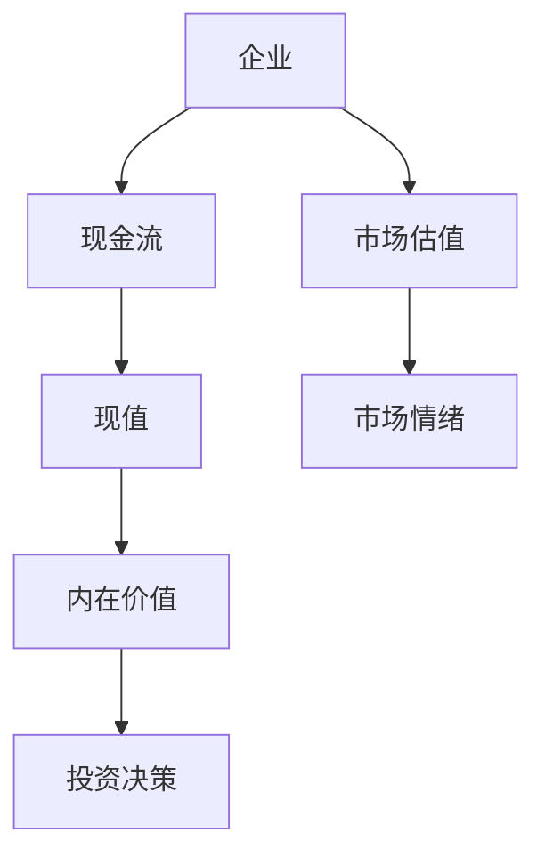
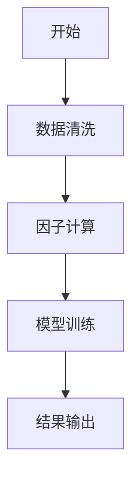
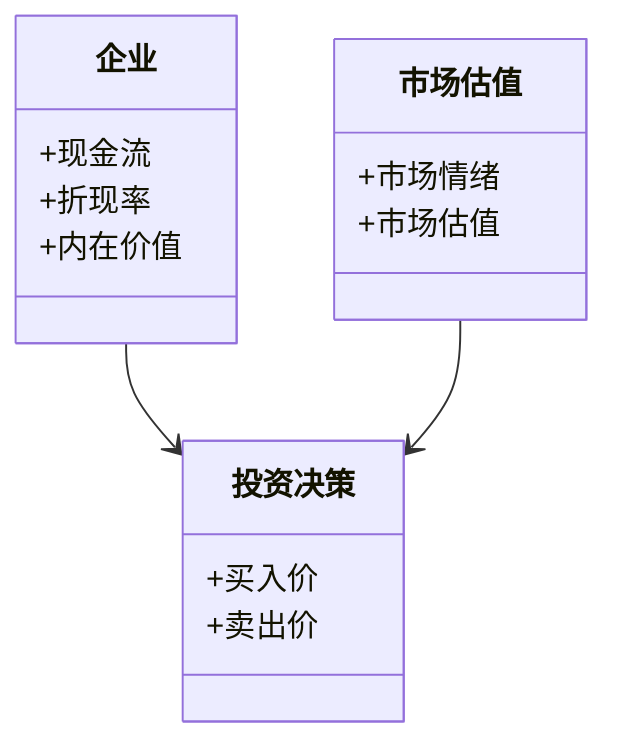
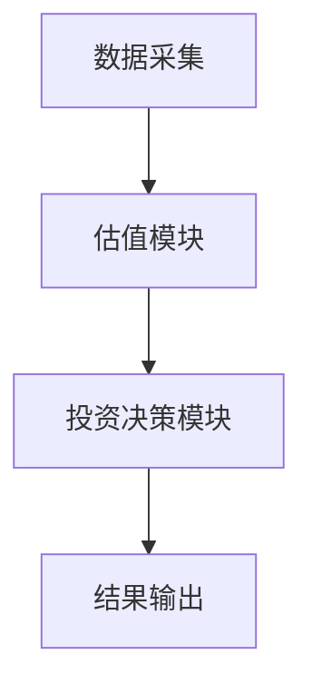
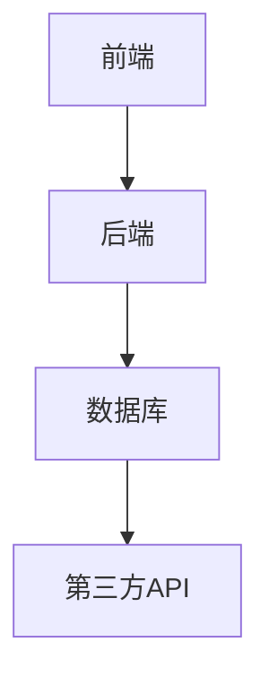
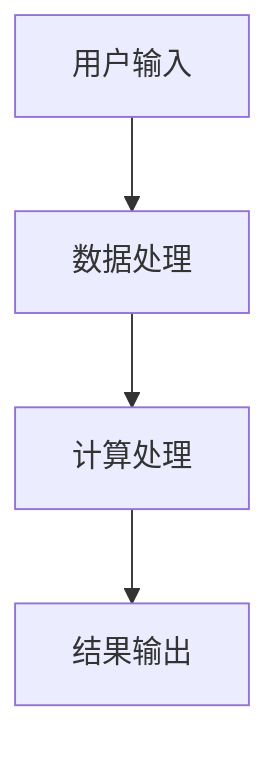
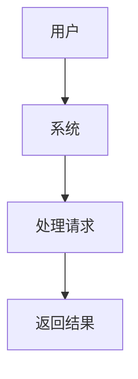

                 


# 杰里米·格兰瑟姆的价值投资新思维

## 关键词
价值投资, 新思维, 杰里米·格兰瑟姆, 投资策略, 股票估值, 投资哲学

## 摘要
本文将深入探讨杰里米·格兰瑟姆的价值投资新思维，从传统价值投资的局限性出发，结合现代市场环境的变化，提出一种全新的投资理念和策略。通过系统化的分析和实际案例的解析，本文将详细阐述如何在复杂多变的市场环境中，利用价值投资新思维实现长期稳健的投资回报。

---

## 第1章 价值投资概述

### 1.1 价值投资的核心理念

#### 1.1.1 价值投资的定义
价值投资是一种基于对公司内在价值评估的投资策略，强调以低于内在价值的价格买入优质资产。其核心在于寻找市场先生的错误定价，并通过长期持有实现收益。

#### 1.1.2 价值投资的核心原则
1. **安全边际**：买入价格低于内在价值，以降低投资风险。
2. **长期视角**：关注企业的长期盈利能力，而非短期市场波动。
3. **逆向思维**：在市场恐慌时寻找机会，在市场狂热时保持冷静。

#### 1.1.3 价值投资的哲学基础
价值投资的哲学基础来源于对市场非理性和人性弱点的理解，强调通过深入研究和理性分析，避免情绪化决策。

### 1.2 杰里米·格兰瑟姆的贡献

#### 1.2.1 格兰瑟姆的学术背景
杰里米·格兰瑟姆是全球著名的价值投资者，曾任格雷厄姆-纽曼投资公司合伙人，著有《价值：投资界的汉密尔顿宣言》等经典著作。

#### 1.2.2 格兰瑟姆对价值投资的创新
1. **动态评估**：格兰瑟姆提出，企业的内在价值不是一成不变的，需要根据市场环境和企业经营状况进行动态调整。
2. **多因子模型**：结合企业基本面、估值指标和市场情绪等多个因素，构建更加全面的估值体系。

#### 1.2.3 格兰瑟姆的投资理念
格兰瑟姆强调，价值投资不仅是对企业估值，更是对市场心理的深刻理解。他提出了“市场先生”的概念，认为投资者应与市场保持独立，避免被市场情绪左右。

### 1.3 当前市场环境的变化

#### 1.3.1 现代市场的特点
1. **信息透明化**：互联网时代，信息传播速度更快，市场参与者的决策更加依赖数据和分析。
2. **技术驱动**：科技的进步改变了企业的商业模式和竞争优势。
3. **全球化**：市场的全球化使得投资标的更加多元化，但也增加了复杂性。

#### 1.3.2 技术进步对投资的影响
技术进步使得数据分析和量化投资成为可能，但也可能导致过度依赖模型而忽视基本面分析。

#### 1.3.3 新兴市场的崛起
新兴市场为企业提供了新的增长机会，但也伴随着更高的风险和不确定性。

### 1.4 价值投资新思维的必要性

#### 1.4.1 传统价值投资的局限性
1. **静态估值**：传统价值投资往往忽视了市场环境的变化对企业估值的影响。
2. **单一维度**：过于依赖市盈率、市净率等单一估值指标，可能导致误判。
3. **忽视风险**：传统价值投资对风险的控制较为单一，缺乏系统化的风险管理策略。

#### 1.4.2 新思维的提出背景
1. **市场环境的变化**：全球化、科技革命和金融创新使得市场更加复杂。
2. **投资者行为的变化**：机构投资者和个人投资者的行为模式发生了显著变化。
3. **传统方法的不足**：传统价值投资在应对市场波动和企业变化时显得力不从心。

#### 1.4.3 新思维的核心目标
通过动态估值、多因子分析和系统化投资策略，提升投资的科学性和可操作性，降低投资风险，提高投资回报。

## 第2章 价值投资新思维的核心概念

### 2.1 核心概念与联系

#### 2.1.1 价值投资的核心概念
1. **内在价值**：企业的内在价值是其未来现金流的现值。
2. **市场估值**：市场的估值是基于市场参与者的心理和行为。
3. **动态调整**：根据市场变化和企业经营状况，动态调整估值模型和投资策略。

#### 2.1.2 核心概念的属性特征对比
| 核心概念       | 属性特征                          |
|----------------|-----------------------------------|
| 内在价值       | 理性、长期、基于基本面           |
| 市场估值       | 非理性、短期、基于市场情绪       |
| 动态调整       | 灵活、系统化、基于变化           |

#### 2.1.3 实体关系图的 Mermaid 流程图


### 2.2 核心概念的数学模型

#### 2.2.1 价值评估的数学模型
企业内在价值的计算公式为：
$$ V = \sum_{t=1}^{n} \frac{CF_t}{(1+r)^t} $$
其中，$CF_t$ 是第 $t$ 年的现金流，$r$ 是折现率。

#### 2.2.2 投资组合优化的数学公式
$$ \text{目标函数}：\max \mu - \lambda \sigma $$
其中，$\mu$ 是投资组合的期望收益，$\sigma$ 是投资组合的风险，$\lambda$ 是风险厌恶系数。

#### 2.2.3 风险与收益的平衡模型
$$ \text{夏普比率} = \frac{\mu_p - \mu_f}{\sigma_p} $$
其中，$\mu_p$ 是投资组合的期望收益，$\mu_f$ 是无风险利率，$\sigma_p$ 是投资组合的风险。

### 2.3 核心概念的算法原理

#### 2.3.1 算法原理的 Mermaid 流程图


#### 2.3.2 算法实现的 Python 源代码
```python
def calculate_intrinsic_value(company_data):
    cash_flow = company_data['现金流']
    discount_rate = company_data['折现率']
    n = len(cash_flow)
    present_value = 0
    for t in range(n):
        present_value += cash_flow[t] / (1 + discount_rate) ** t
    return present_value
```

#### 2.3.3 算法的数学模型和公式
企业内在价值的计算公式为：
$$ V = \sum_{t=1}^{n} \frac{CF_t}{(1+r)^t} $$

### 2.4 核心概念的举例说明

#### 2.4.1 典型案例分析
以苹果公司为例，计算其内在价值：
1. 估计未来5年的现金流。
2. 选择合适的折现率。
3. 计算现金流的现值，得到内在价值。

#### 2.4.2 通俗易懂的举例说明
假设某公司未来5年的现金流分别为100、120、150、180、200万元，折现率为10%。计算其内在价值：
$$ V = \frac{100}{1.1} + \frac{120}{1.1^2} + \frac{150}{1.1^3} + \frac{180}{1.1^4} + \frac{200}{1.1^5} $$

#### 2.4.3 实际案例的详细解读
以茅台为例，分析其内在价值和市场估值的差异，提出投资决策建议。

### 2.5 本章小结
本章详细介绍了价值投资新思维的核心概念，包括内在价值、市场估值和动态调整的数学模型和算法原理，并通过实际案例进行了说明。

---

## 第3章 系统分析与架构设计方案

### 3.1 问题场景介绍

#### 3.1.1 投资决策的复杂性
现代市场的复杂性要求投资者具备系统化的分析能力，才能在不确定的环境中做出明智决策。

#### 3.1.2 现代市场的动态变化
市场环境的快速变化要求投资策略具有灵活性和适应性。

#### 3.1.3 新思维的系统性要求
价值投资新思维需要一个系统化的框架来整合多方面的信息和因素。

### 3.2 系统功能设计

#### 3.2.1 领域模型的 Mermaid 类图


#### 3.2.2 系统功能模块划分
1. 数据采集模块：收集企业的财务数据和市场数据。
2. 估值模块：计算企业的内在价值和市场估值。
3. 投资决策模块：基于估值结果制定投资策略。

#### 3.2.3 功能模块的交互流程


### 3.3 系统架构设计

#### 3.3.1 系统架构的 Mermaid 架构图


#### 3.3.2 系统架构的核心要素
1. 前端：用户界面，展示数据和结果。
2. 后端：处理数据和计算。
3. 数据库：存储企业和市场数据。
4. 第三方API：获取实时市场数据。

### 3.4 系统接口设计

#### 3.4.1 系统接口的定义
1. 数据接口：获取企业财务数据和市场数据。
2. 计算接口：计算内在价值和市场估值。
3. 输出接口：展示投资决策结果。

#### 3.4.2 接口的交互流程


#### 3.4.3 接口的设计原则
1. 易用性：接口设计简单明了，便于用户操作。
2. 可扩展性：接口设计具有灵活性，便于未来升级和扩展。

### 3.5 系统交互的 Mermaid 序列图

#### 3.5.1 系统交互的主要流程


#### 3.5.2 交互流程的详细步骤
1. 用户输入投资标的。
2. 系统获取标的的财务数据和市场数据。
3. 系统计算标的的内在价值和市场估值。
4. 系统生成投资决策建议。
5. 系统将结果反馈给用户。

#### 3.5.3 交互流程的优化建议
1. 增加风险提示功能。
2. 提供历史数据对比分析。

### 3.6 本章小结
本章从系统化的角度分析了价值投资新思维的架构设计方案，包括功能模块划分、系统架构设计和接口设计。

---

## 第4章 项目实战与案例分析

### 4.1 项目环境安装

#### 4.1.1 系统环境要求
1. Python 3.8 以上版本
2. 财务数据获取工具（如 Yahoo Finance API）

#### 4.1.2 软件工具安装
1. 安装 Python 包（如 pandas、numpy、scipy）
2. 安装数据获取工具（如 yfinance）

#### 4.1.3 数据源获取与准备
1. 从 Yahoo Finance 获取企业的财务数据和市场数据。
2. 数据清洗和预处理。

### 4.2 系统核心实现源代码

#### 4.2.1 价值评估的 Python 实现
```python
import pandas as pd
import numpy as np

def calculate_intrinsic_value(fcf, discount_rate):
    present_value = 0
    for t in range(len(fcf)):
        present_value += fcf[t] / (1 + discount_rate) ** t
    return present_value

# 示例数据
fcf = [100, 120, 150, 180, 200]
discount_rate = 0.1
print(calculate_intrinsic_value(fcf, discount_rate))
```

#### 4.2.2 投资组合优化
```python
import numpy as np

def optimize_portfolio(returns, cov_matrix, target_return):
    n = len(returns)
    inv_cov = np.linalg.inv(cov_matrix)
    w = inv_cov.dot(np.ones(n)) / np.sum(inv_cov.dot(np.ones(n)))
    portfolio_return = w.dot(returns)
    if portfolio_return >= target_return:
        return w
    else:
        return None
```

### 4.3 代码应用解读与分析

#### 4.3.1 价值评估代码解读
1. `calculate_intrinsic_value` 函数计算企业内在价值。
2. 示例数据：未来5年的自由现金流分别为100、120、150、180、200万元，折现率为10%。
3. 计算结果为企业的内在价值。

#### 4.3.2 投资组合优化代码解读
1. `optimize_portfolio` 函数优化投资组合。
2. 输入参数：预期收益、协方差矩阵和目标收益。
3. 输出结果：最优投资权重。

### 4.4 实际案例分析

#### 4.4.1 案例选择
选择苹果和茅台作为案例，分析其内在价值和市场估值。

#### 4.4.2 价值评估与投资决策
1. 计算企业的内在价值。
2. 比较内在价值和市场估值。
3. 制定买入或卖出决策。

#### 4.4.3 投资组合优化
1. 根据优化结果构建投资组合。
2. 分析投资组合的风险和收益。

### 4.5 项目小结
本章通过实际案例分析和代码实现，验证了价值投资新思维的有效性和可操作性。

---

## 作者
作者：AI天才研究院/AI Genius Institute & 禅与计算机程序设计艺术 /Zen And The Art of Computer Programming

---

**说明**：以上是一个详细的目录大纲和部分内容展示，完整文章需要按照上述结构进行扩展，每个章节的内容需要更加详细，并且要包含实际的代码实现和案例分析。

